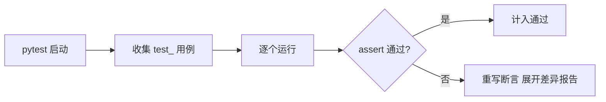

# 测试与调试入门：从 print 到 pytest

> 代码写完不等于完成——「它对不对」需要一个可以反复执行的证明。这一篇讲 Python 的验证三件套：**断言（assert）表达预期、pytest 组织测试、调试器定位问题**，并解释为什么「print 调试」是起点但不能是终点。

## 一句话摘要

测试的机制基础是**断言**（`assert 条件`——条件为假抛 AssertionError），工程化载体是 **pytest**（`test_` 函数自动发现 + `assert` 直接当断言 + fixture 管理前置条件），调试的进阶路径是 **print → logging → 断点调试器**（REPL 内 `breakpoint()` 一行进入 pdb）。纪律一句话：**改一次代码跑一次测试——测试是「证明它对」的机器，不是写完代码后的补救仪式**。

## 🎯 本文核心

**核心机制一句话**：assert 是「预期写进代码」的原语（条件为假抛 AssertionError），pytest 靠命名约定发现用例、靠重写 assert 字节码生成差异报告。

**机制链**：收集 test_* → 逐个运行 → assert 失败时字节码重写展开左右值 → 差异报告。测试与调试在开发架构里是「代码正确性的上下游质检口」：断言是契约、fixture 是前置供应链、调试器是现场取证——三者构成从「证明对」到「定位错」的完整模块边界。



## 典型使用场景

```python
# 被测函数
def fizzbuzz(n: int) -> str:
    if n % 15 == 0: return "FizzBuzz"
    if n % 3 == 0:  return "Fizz"
    if n % 5 == 0:  return "Buzz"
    return str(n)

# test_fizzbuzz.py —— pytest 按 test_ 前缀自动发现
def test_普通数字():
    assert fizzbuzz(2) == "2"

def test_三的倍数():
    assert fizzbuzz(9) == "Fizz"

import pytest
def test_零输入():
    with pytest.raises(ZeroDivisionError):   # 断言「应该抛异常」
        fizzbuzz(0)
```

```bash
pip install pytest && pytest -v        # 逐条列出通过/失败
pytest --lf                            # 只重跑上次失败的（快速迭代）
```

## 机制：assert 与 pytest 的工作方式

**assert 的机制**：`assert cond, msg` ≈ `if not cond: raise AssertionError(msg)`——它是「把预期写进代码」的原语。**重大陷阱**：`python -O` 优化模式会**移除全部 assert**——所以 assert 只能做内部不变式与测试断言，**生产逻辑校验（参数检查）必须用显式 if + raise**（篇 12 的异常）。这是 assert 第一大坑。

**pytest 的机制**：按文件名/函数名约定（`test_*.py` / `test_*`）自动发现用例；断言失败时**重写 assert 字节码**生成差异报告（`assert a == b` 会展示两个值的具体内容——这是 pytest 优于 unittest 的体验王牌）；**fixture**（`@pytest.fixture`）把「测试前置条件」（临时文件/测试数据库/构造对象）声明成可注入的依赖，用例之间互不污染。

```python
import pytest

@pytest.fixture
def sample_account():
    return {"owner": "test", "balance": 100}    # 每个用例拿到全新实例

def test_withdraw_ok(sample_account):
    sample_account["balance"] -= 30
    assert sample_account["balance"] == 70
```

## 调试的演进：三级火箭（演进视角）

1. **print**：最快，但「加语句—跑—删语句」循环不可积累，容易漏删进版本库；
2. **logging**：分级可开关（篇 14），线上可留痕——从「调试语句」升级为「可管理输出」；
3. **断点调试**：`breakpoint()`（3.7+ 内建，一行进入 pdb）或 IDE 断点——**在程序运行现场查看/修改变量、单步执行**。为什么它值得学：print 只能看到「你想到要看的」，断点让你看到「现场的一切」。核心 pdb 命令就五个：`n`（下一行）`s`（步入）`c`（继续）`p 表达式`（打印）`q`（退出）。

## 与其他语言的区别（跨语言视角）

Java 的 JUnit 与 pytest 同构（注解 vs 约定命名的差异）；Go 反主流地把「测试」放进语言工具链（`go test` + 表驱动测试）；JS 的 Jest 靠 Babel 插件实现 assert 报告增强——**「测试框架 = 发现约定 + 断言增强 + 前置管理」三件套**是全行业共同结构，学会 pytest 换语言只剩语法。


## 常见误区

- ❌ 「生产代码用 assert 校验参数」——`-O` 模式下全部蒸发；用 `if not x: raise ValueError(...)`；
- ❌ 「测试依赖执行顺序」——每个用例必须独立可跑（fixture 造前置，不共享可变状态）；
- ❌ 「追求覆盖率 100%」——覆盖率是下限指标不是目标；**测试「行为」而不是「实现细节」**（重构后不该重写测试）；
- ❌ 「debug print 提交进仓库」——用 logging 或断点，print 语句是调试的临时脚手架，不是交付物。

## 代价与边界

写测试有时间成本——**投入优先级：核心业务逻辑 > 边界条件 > 简单胶水代码**；脚本与原型可轻测试，进了主流程的代码必须有测试护栏。测试也有维护成本：过细的测试（mock 一切）会在重构时全线飘红——「测行为不测实现」是控制维护成本的总纲。

调试手段的演变：print（临时）→ logging（可管理）→ 断点调试器（现场取证）——三级演进与测试框架从 unittest 到 pytest 的换代同向：工具都在向「少写样板、多给现场信息」演进。

## 上手机会（今天就能试）

```bash
mkdir demo && cd demo
cat > calc.py <<'EOF'
def add(a, b): return a + b
EOF
cat > test_calc.py <<'EOF'
from calc import add
def test_add(): assert add(2, 3) == 5
EOF
pip install pytest && pytest -v
```

## 💡 实战提示

- 生产参数校验禁用 assert——`python -O` 会移除全部 assert；用 if + raise（链回篇 12）。
- `pytest --lf` 只重跑上次失败的用例——快速迭代时省一半时间。

## 你们可能会问

**测试为什么要求互相独立？**
共享可变状态会让结果依赖执行顺序——fixture 每用例造全新前置，顺序无关才可信。

**断点调试比 print 强在哪？**
print 只能看到你想到要看的；断点让程序停在现场，一切变量随时可查可改。

## 自测三问

1. assert 为什么不能做生产参数校验？（-O 模式移除 assert）
2. pytest 的三个机制支柱？（约定发现 / assert 字节码重写报差异 / fixture 前置注入）
3. 调试三级火箭的顺序？（print → logging → 断点调试器）

## 5W 速记卡

| 问题 | 答案 |
|---|---|
| What | assert 断言 + pytest 测试 + 断点调试 |
| Why 测试 | 「对」需要可反复执行的证明 |
| 生产校验 | if + raise，不用 assert |
| fixture | 声明式前置条件，用例独立 |
| 投入策略 | 核心逻辑优先，测行为不测实现 |

## 开放问题

- AI 辅助写代码的时代，「测试」会不会从验证工具升级为人机协作的规格说明（测试先行的回归）？

**核心带走**：assert 断言 + pytest 三机制（发现/断言增强/fixture）+ 调试三级火箭。失效点——生产用 assert、测试共享状态、print 进仓库。金句：**测试是「它对」的可执行证明——写完代码再补的叫仪式，边写边测的才叫工程。**

**决策**：何时写测试——进了主流程的代码（核心逻辑优先）；何时不写——一次性脚本与原型。取舍：测试的维护成本要求「测行为不测实现」，否则重构即大规模红灯。

## 📌 数据与事实声明

- assert 的 -O 移除、pytest 发现约定与 fixture 机制、breakpoint()（PEP 553）为公开文档与规范。

## 📚 参考资料

- pytest 官方文档（Get Started 30 分钟入门）
- Python 官方文档：pdb 调试器
