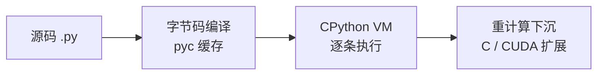
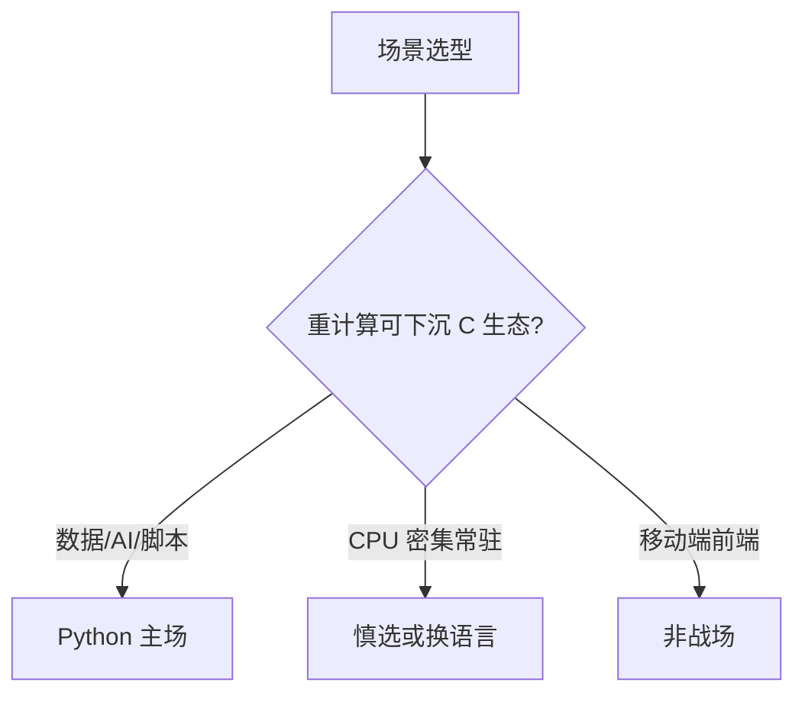

# Python 是什么与为什么学它

> 学一门语言前先回答「它为什么长这样」。Python 的所有特点——慢、可读、胶水、生态强——都源自同一个设计决策：**把人的时间看得比机器的时间贵**。理解这一点，后面 14 篇的语法细节全都有了根。

## 一句话摘要

Python 是一门**解释执行、动态类型、强制缩进**的高级语言：代码由解释器逐句执行（不预先编译成机器码），变量不需要声明类型，代码块用缩进而非花括号划分。它为「人的开发效率」而生，代价是执行速度让位——但通过 C 扩展与生态组合（NumPy/PyTorch 底层都是 C），它在数据科学与 AI 工程领域成为了事实标准。

## 🎯 本文核心

**核心机制一句话**：Python = 源码编译字节码 + CPython 虚拟机逐条执行——整套架构服务于「人的时间比机器时间贵」这一设计判断。

**机制链**：源码 → 字节码编译 → VM 解释执行 → 重计算下沉 C 扩展。这条链也定义了它在系统架构中的上下游位置：Python 层做编排与胶合，性能敏感模块边界之外交给 C/CUDA 世界。



## 典型使用场景

- **数据科学与 AI**：NumPy/Pandas/PyTorch 生态——Python 是胶水层，重计算下沉到 C/CUDA（机制：解释器只编排，不亲自算）
- **自动化脚本**：运维、爬虫、办公自动化——「几分钟写完」的场景是 Python 的主场
- **Web 后端**：Django/FastAPI——中小流量服务的快速交付
- **教学与原型**：语法接近伪代码，验证想法的成本最低

## 与其他语言的区别（跨语言视角）

| 维度 | Python | Java | JavaScript |
|---|---|---|---|
| 类型 | 动态（运行时才查） | 静态（编译期查） | 动态 |
| 执行 | 解释（字节码 + VM） | 编译成字节码跑 JVM | 解释 + JIT |
| 强制缩进 | ✅（语法的一部分） | ❌（约定） | ❌ |
| 主战场 | 数据/AI/脚本 | 企业后端 | 前端 |

**为什么动态类型是双刃剑**：好处是灵活——一个函数天然接受任何「长得很对」的对象（鸭子类型，篇 11 展开）；代价是错误推迟到运行时才暴露，所以大型 Python 项目普遍补类型注解（mypy，演进方向：动态语言静态化是行业共同趋势，TypeScript 之于 JS 同理）。

## 机制为什么这样设计：三个根源

1. **解释执行**：代码先编译成字节码（.pyc），由 CPython 虚拟机逐条执行。为什么慢还要这样——跨平台免编译、交互式 REPL 可用、开发迭代快；快的需求交给 C 扩展（这就是「胶水语言」称号的由来：粘合高性能组件）。
2. **强制缩进**：缩进就是语法。为什么这样设计——代码写一遍、读十遍，把「格式」从风格之争变成结构本身，全世界的 Python 代码长一个样（跨公司协作的可读性红利）。
3. ** batteries included**：标准库大而全（json/正则/http/单元测试开箱即用）——设计哲学「内置电池」让小任务不需要装任何东西。



## 常见误区

- ❌「Python 慢所以不能用于生产」——错在把语言速度等同于系统速度：主流 AI 框架的计算在 C/CUDA 层，Python 只是编排；Web 服务瓶颈通常在数据库与网络，不在语言。
- ❌「Python 2 和 Python 3 差不多」——Python 3 是不兼容的换代（字符串默认 Unicode 等），2020 年已停止维护 Python 2，所有新代码从 3.10+ 学起。
- ❌「解释执行 = 没有编译」——CPython 会先编译成字节码再执行，.pyc 缓存就是证据；「解释型语言」说的是**没有提前到部署前的机器码编译**，不是完全没有编译步骤。

## 代价与边界

- 全局解释器锁（GIL）限制多线程并行度（特性层 GIL 篇展开）；
- 动态类型在十万行级项目上维护成本上升，需要类型注解 + mypy 补偿；
- 移动端/前端不是它的战场——选语言先看生态所在的主场。

## 上手机会（今天就能试）

```bash
python3 --version        # 确认 3.10+
python3                  # 进入 REPL，输入 print("hello") 回车
exit()                   # 退出
```

## 💡 实战提示

- 读代码前先跑 `import this`——Zen of Python 的 19 条是后续每篇机制的哲学根。
- 判断场景适合度：先问「重计算能否下沉 C/CUDA 生态」，能则是主场。

## 你们可能会问

**Python 为什么叫胶水语言？**
解释器擅长编排不擅长计算——NumPy/PyTorch 把计算下沉 C/CUDA，Python 负责粘合组件与流程。

**解释执行是说没有编译吗？**
不是——字节码编译每时每刻都在发生（pyc 缓存为证）；「解释型」指没有部署前的机器码编译。

## 自测三问

1. 「Python 慢」的准确表述是什么？（解释执行慢，但重计算可下沉 C 扩展——语言速度 ≠ 系统速度）
2. 为什么说 Python 是胶水语言？（编排 C/CUDA 高性能组件，解释器负责胶合）
3. 强制缩进带来了什么跨团队收益？（全行业格式统一，可读性不靠自觉）

## 5W 速记卡

| 问题 | 答案 |
|---|---|
| What | 解释执行、动态类型、强制缩进的胶水语言 |
| Why 用 | 开发效率优先：数据/AI/脚本的生态主场 |
| When 不用 | 移动端前端；极致 CPU 密集的常驻服务 |
| How 跑 | 源码 → 字节码 → CPython VM（REPL 交互可用） |
| 边界 | GIL 限制线程并行；大项目需类型注解补偿 |

## 开放问题

- PEP 703 free-threading（去 GIL）正式落地后，「Python 慢」的行业叙事会被改写多少？持续跟踪。

**核心带走**：解释执行 + 动态强类型 + 强制缩进，一切为人的效率服务；失效边界——CPU 密集常驻服务与移动端不是它的战场。金句：**语言的速度不是系统的速度——架构位置决定 Python 慢不慢。**

## 📌 数据与事实声明

- Python 2 EOL 2020-01 为公开事实；「AI 生态第一语言」为行业共识认知；性能对比为量级认知，具体负载差异显著。

## 📚 参考资料

- Python 官方文档：Tutorial 与 FAQ（设计哲学：The Zen of Python，`import this` 亲自看）
- 《流畅的 Python》第 1 章——Pythonic 的数据模型总览
