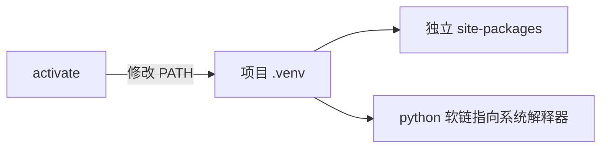
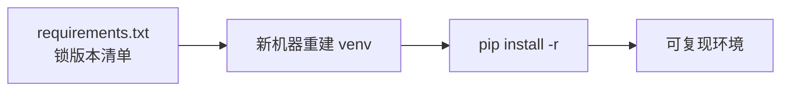

# 安装与第一次运行：REPL、脚本与虚拟环境

> 「环境问题」是 Python 新手流失的第一大关——为什么同一个包在你电脑上装不上？为什么装的包互相冲突？这一篇把解释器、REPL、pip、虚拟环境一次讲透，讲机制而不是给命令清单。

## 一句话摘要

Python 程序的运行需要三件东西各司其职：**解释器**（python3，执行代码的程序本体）、**REPL**（交互式解释循环，输入一行立即执行一行）、**虚拟环境**（venv，每个项目独立的包安装目录）。虚拟环境解决的问题是真实且高频的：**全局装包必然导致项目间依赖版本冲突**——机制上它就是一个「把 pip 的安装目标指向项目内目录」的目录隔离手段。

## 🎯 本文核心

**核心机制一句话**：venv 虚拟环境 = 独立 site-packages 目录 + PATH 重定向——包隔离靠目录，不靠任何魔法。

**机制链**：python3 解释器 → 字节码 pyc 缓存 → 执行；pip 的安装目标由激活的 venv 决定。理解「激活只是改 PATH」，就划清了 Python 运行时架构的模块边界：全局解释器、项目包目录、依赖清单三层各管各的。



## 典型使用场景与区别

- 本机试语法 → REPL（即时反馈）；
- 跑项目 → venv + `python3 main.py`；
- 与其他工具的区别：venv 管**包隔离**、pyenv 管**解释器版本**、poetry/uv 管**依赖解析与锁文件**——三者常一起用但职责不重叠。

## 机制：解释器与字节码

`python3 hello.py` 时发生了什么：源码 → **编译成字节码**（生成 `__pycache__/hello.cpython-312.pyc` 缓存）→ CPython 虚拟机逐条执行字节码。为什么有 pyc 缓存——第二次运行跳过编译步骤（解释器启动更快）；为什么导入的模块才有 pyc 而主脚本没有——主脚本每次重新编译（它可能随时改，缓存收益低）。

```python
# hello.py
print("hello, python")
# 运行: python3 hello.py
# REPL: 敲 python3 直接进入交互模式，适合试语法、查文档（help(len)）
```

## 虚拟环境：为什么必须有，机制是什么

**问题场景**：项目 A 要 requests 2.28，项目 B 要 2.31——都装到全局，后者覆盖前者，项目 A 炸了。

**venv 的机制**：`python3 -m venv .venv` 创建一个目录，里面有一个**指向系统解释器的软链** + 独立的 `site-packages`（包安装目录）+ 独立的 pip。激活（`source .venv/bin/activate`）的本质只是**改 PATH 环境变量**——让 `python` 和 `pip` 命令先找到项目内的版本。所以「激活」没有魔法：不激活也可以直接用 `.venv/bin/pip install xxx`。

```bash
python3 -m venv .venv          # 创建虚拟环境
source .venv/bin/activate      # 激活（Windows: .venv\Scripts\activate）
pip install requests           # 装进 .venv，不碰全局
pip freeze > requirements.txt  # 导出依赖清单
deactivate                     # 退出
```

**演进视角**：venv + requirements.txt 是基础形态；工程界在演进到更快的 uv、以及 poetry/conda 等一体化工具（依赖解析 + 锁文件），但它们管理的东西没变——**解释器版本 + 包清单 + 隔离目录**三件套。先懂 venv，工具怎么换都不慌。

## 与其他语言的区别（跨语言视角）

- Java：Maven/Gradle 全局仓库 + 项目锁文件——依赖隔离靠「声明文件」而非「目录隔离」，思路相反但目标相同；
- Node.js：node_modules 就是 venv 的思想（每个项目一个包目录），Python 的 venv 与它最像；
- 为什么会分化出两种思路——解释型语言的包常含二进制扩展（pip 要编译/下载 wheel），目录隔离顺带解决了「二进制版本」问题。



## 常见误区

- ❌ 「不激活虚拟环境就不能用」——激活只是改 PATH，直接 `.venv/bin/python` 等价可用；
- ❌ 「requirements.txt 里的版本就是精确版本」——`pip freeze` 生成的才是 `==` 精确锁版本，手写的 `>=` 是范围声明； reproduced 环境要锁版本（这是可复现构建的通用纪律）；
- ❌ 「用 sudo pip 装到全局」——污染系统 Python（macOS 的系统工具依赖它），从来不要这样做；
- ❌ 「conda 和 pip 混装没问题」——两套包管理器互不知晓，混用是依赖地狱的经典入口；一个项目认定一套。

## 代价与边界

- venv 只隔离包，不隔离解释器版本（要多版本解释器用 pyenv/uv 管理）；
- 目录不可移植（路径写死了软链）——换机器重建 + requirements.txt 重装才是正确迁移方式。

包管理工具二十年的演变（easy_install → pip → poetry/uv）本质都在解决同一件事：依赖的确定性。

## 上手机会（今天就能试）

```bash
mkdir demo && cd demo
python3 -m venv .venv && source .venv/bin/activate
pip install cowsay && python3 -c "import cowsay; cowsay.cow('venv works')"
pip freeze    # 看到 cowsay 及其依赖
```

## 💡 实战提示

- 不激活也能用：`.venv/bin/pip install xxx` 与激活后等价——理解机制后命令行自由度大增。
- 换机器迁移环境 = 导出 requirements.txt + 重建 venv，不要拷贝 .venv 目录（软链路径失效）。

## 你们可能会问

**venv 和 conda 冲突吗？**
两套包管理器互不知晓，混装是依赖地狱入口——一个项目认定一套工具链。

**为什么主脚本没有 pyc 缓存？**
主脚本随时可能改、缓存收益低；被导入的模块才有 pyc。

## 自测三问

1. venv 激活时到底发生了什么？（改 PATH，让 python/pip 指向项目内目录）
2. pyc 是什么，为什么会有它？（字节码缓存，跳过重复编译）
3. 全局装包的问题在哪？（跨项目版本冲突；污染系统解释器）

## 5W 速记卡

| 问题 | 答案 |
|---|---|
| What | 解释器/REPL/venv 三件套 |
| Why venv | 目录级隔离包，杜绝跨项目版本冲突 |
| How 跑 | python3 脚本.py（批）/ REPL（试）/ venv 内 pip（装） |
| 迁移 | requirements.txt 锁版本 + 重建环境 |
| 边界 | venv 不隔离解释器版本（用 pyenv/uv） |

## 开放问题

- uv 等新一代工具把依赖解析速度提升数量级后，requirements.txt 会不会被锁文件格式全面取代？

**核心带走**：解释器/REPL/venv 三件套，venv 的本质是目录隔离 + PATH 重定向；失效边界——venv 不隔离解释器版本（多版本用 pyenv/uv）。金句：**包管理的一切问题，都是「这份代码到底依赖谁」的问题。**

**决策**：何时用——任何新项目第一步就建 venv（什么场景都适用）；何时不用——一次性一行命令（`python3 -c`）无需环境。取舍：venv 的目录隔离换来「换机器必须重建」的代价，这是隔离的对称成本。架构上 venv 是项目依赖的边界层：全局解释器、项目包、锁文件三层上下游分明。

## 📌 数据与事实声明

- pyc 缓存机制、venv 实现（PATH + 软链）基于 CPython 公开文档；uv/poetry 为社区演进趋势的行业认知。

## 📚 参考资料

- Python 官方文档：venv 与 pip 用户指南
- 《Python Packaging User Guide》——工具选型对照表
