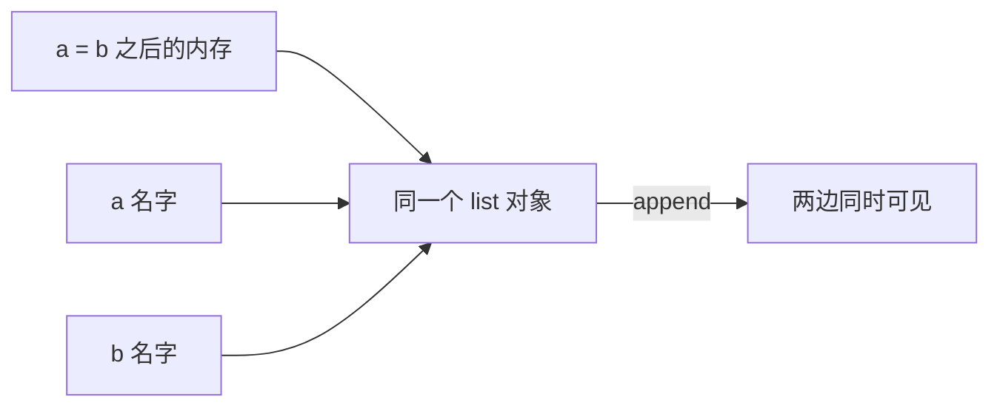
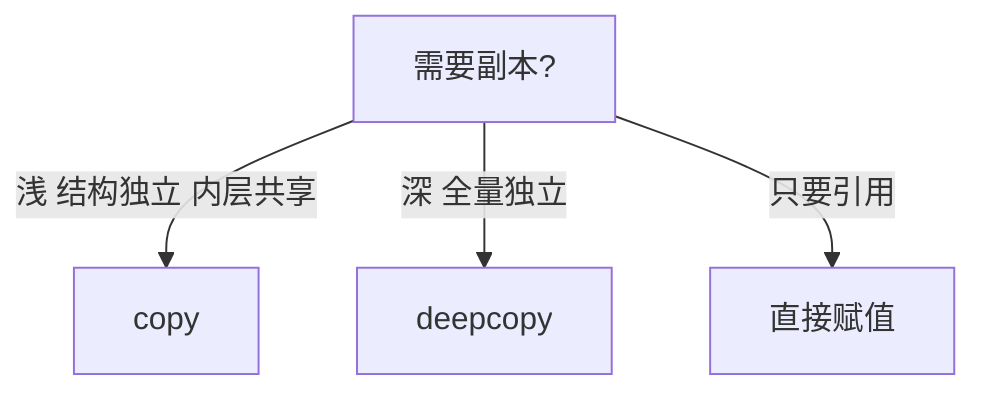

# 变量与基本类型：名字是标签，不是盒子

> 「变量是盒子」这个比喻在 Python 里是错的，而且是会产出 bug 的错。Python 的变量是**贴在对象上的标签**——理解「名字绑定对象」这一个机制，默认参数陷阱、变量别名、函数传参这些经典坑全都有了统一的解释。

## 一句话摘要

Python 是**动态类型 + 强类型**：变量不声明类型（名字随时可绑定任何对象），但类型本身不隐式乱转（`"1" + 1` 直接报错）。赋值语句 `a = 10` 的机制是「在对象 10 上贴标签 a」——赋值从不拷贝数据，只是让名字指向对象。这个「名字 = 对象引用」的模型是 Python 一切数据行为的底层。

## 🎯 本文核心

**核心机制一句话**：变量是贴在对象上的标签——赋值从不拷贝数据，只建立名字到对象的引用。

**机制链**：赋值 = 绑定 → 引用共享（可变对象连带变化）→ 可变/不可变分野 → 浅/深拷贝。这条链是 Python 数据架构的总纲：函数传参、默认参数陷阱、别名 bug 全在上下游同一条引用链上。



## 典型使用场景

```python
x = 10            # int 对象 10，标签 x
y = x             # y 也指向同一个 10（没有拷贝！）
x = 20            # x 改指向新对象 20，y 仍是 10
s = "hello"       # str 不可变
flag = True       # bool
n = None          # NoneType，表示「没有值」的唯一单例
```

## 机制：一切皆对象，名字只是引用

Python 里**数字、字符串、函数、类全是对象**，变量只是「对象的名字」。三个推论值得单独记：

1. **身份 vs 值**：`a is b` 查身份（同一个对象吗），`a == b` 查值（相等吗）。小整数缓存池（-5~256 的 int 预建单例）让 `a is b` 偶尔「意外为真」——**比较值永远用 ==，is 只用于 None 判断**（`x is None` 是惯例）。
2. **可变 vs 不可变**：int/str/tuple 不可变（改 = 新建对象换标签），list/dict/set 可变（原地改，所有引用同时可见）。`b = a`（a 是 list）后改 b，a 跟着变——因为它们是**同一个对象的两个标签**。要独立副本用 `a.copy()` 或 `copy.deepcopy()`（嵌套结构必须深拷贝）。
3. **函数传参 = 传标签**：Python 是「传对象引用」——函数内修改可变参数，调用方看得见；给参数重新赋值（换标签），调用方看不见。

```python
def append_to(item, target=[]):   # 经典陷阱！
    target.append(item)
    return target
append_to(1)   # [1]
append_to(2)   # [1, 2]——默认列表只创建一次，两次调用共享！
# 正解: def append_to(item, target=None): target = [] if target is None else target
```

**为什么默认参数会共享**——默认值在函数定义时求值一次，绑定到函数对象上（不是每次调用重新创建）。这个「定义时求值」机制同样解释了闭包晚绑定（篇 9 展开）。

## 与其他语言的区别（跨语言视角）

- Java：基本类型是值语义（拷贝），对象是引用语义——Python **全部是引用语义**，没有值类型的例外；
- 「强类型」的对比：JS 的 `"1" + 1 = "11"`（隐式转换），Python 直接 TypeError——**动态但不混乱**，隐式转换被刻意砍掉是设计取舍。



## 常见误区

- ❌ 「a = b 复制了数据」——只复制了引用；可变对象的「复制」要显式 copy/deepcopy；
- ❌ 「is 用来比较相等」——is 比身份，小整数池让它「偶尔碰巧对」，是埋雷不是技巧；
- ❌ 「可变对象做默认参数很方便」——就是上面 append_to 的坑，默认参数永远用 None 哨兵；
- ❌ 「Python 变量要先声明类型再赋值」——名字与类型解耦，类型跟对象走不跟名字走（`x = 1; x = "s"` 合法，但别这么写，类型注解可让检查器帮你管）。

## 代价与边界

引用模型的代价：**别名带来的意外共享**是 Python bug 的第一大类（改了副本原对象也变了）——纪律是「拿到可变对象先想：这是共享还是独占？共享就要 copy」。动态类型的代价：拼错变量名运行时才炸——类型注解 + mypy 是工程化补偿。

从 Python 2 到 3，引用模型从未变过——但类型注解的演进让「名字的形状」第一次可以静态声明，这是动态语言二十年最重要的演变。 别名共享问题在大型架构里会被放大：一个被多处引用的 list，任何一处原地修改都是跨模块的隐式上下游影响——所以工程规范里「传出去的容器给副本」是硬边界。

## 上手机会（今天就能试）

```python
a = [1, 2, 3]
b = a
b.append(4)
print(a)                  # [1, 2, 3, 4] —— 亲眼看到共享
c = a.copy(); c.append(5)
print(a, c)               # a 不变，c 独立
print("1" + 1)            # TypeError —— 亲眼看强类型
```

## 💡 实战提示

- 拿到可变对象先问「共享还是独占」——共享要 copy，这个习惯能消灭一大类 bug。
- 默认参数永远写 None 哨兵：`def f(x=None): x = x or []`——机制在定义时求值，写 [] 就是埋雷。

## 你们可能会问

**is 和 == 什么时候结果不同？**
值相等但不是同一对象时——== 比值、is 比身份；小整数缓存池让 is 偶尔碰巧对，是雷不是技巧。

**函数传参是传值还是传引用？**
传对象引用：改可变参数内容调用方可见，给参数重新赋值（换标签）调用方不可见。

## 自测三问

1. `a = b` 拷贝了什么？（对象的引用/标签，不是数据）
2. 可变默认参数陷阱的机制根因？（默认值在定义时求值一次并绑定到函数对象）
3. is 和 == 各比什么？（身份 vs 值；is 只用于 None 判断）

## 5W 速记卡

| 问题 | 答案 |
|---|---|
| What | 名字绑定对象的引用模型；动态 + 强类型 |
| Why 慢变量 | 没有声明，赋值即绑定 |
| 陷阱 | 可变默认参数 / 别名共享 / is 误用 |
| How 拷贝 | copy() 浅、deepcopy() 深（嵌套必深） |
| 补偿 | 类型注解 + mypy 管大项目的动态性 |

## 开放问题

- 类型注解 + mypy 在大型 Python 项目全面普及后，「动态类型」的心智负担还剩多少？

**核心带走**：名字 = 对象引用；可变共享是第一 bug 来源，深浅拷贝是解药。失效点——is 误用、可变默认参数、以为赋值即拷贝。金句：**赋值是贴标签不是装盒子——Python 数据 bug 的一半源于把标签当成了盒子。**

**决策**：何时用可变对象——数据确实需要原地变化；何时不用——跨函数/跨模块共享的数据优先不可变（tuple/str），取舍是牺牲便利换安全。架构层面，可变性的模块边界就是「谁有写权限」：默认谁都不写，需要写再显式放开。

## 📌 数据与事实声明

- 小整数缓存 [-5, 256]、默认参数定义时求值为 CPython 公开实现行为；与 Java/JS 的对比为语言规范层面的公开事实。

## 📚 参考资料

- 《流畅的 Python》第 8 章「变量引用与可变性」——本篇主题的最佳深读
- Python 官方文档 Data Model 章节
