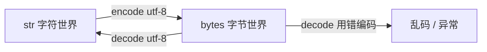
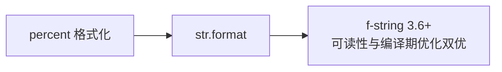

# 字符串与编码：不可变序列与 Unicode 的真相

> 「UnicodeDecodeError」是每个 Python 人的成人礼。乱码不是玄学——它是「字节」与「字符」两个世界混淆的必然结果。这一篇把 str/bytes 的机制、编码解码的方向、以及字符串为什么不可变一次讲清。

## 一句话摘要

Python 3 的 `str` 是 **Unicode 字符的不可变序列**（内存里按定长码位存「字符」），`bytes` 是**原始字节的不可变序列**（网络/磁盘上的真实形态）。两者的转换有唯一方向约定：**编码 encode = 字符 → 字节，解码 decode = 字节 → 字符**——乱码与报错 100% 是「拿错误的编码去解码字节」造成的。

## 🎯 本文核心

**核心机制一句话**：str 是 Unicode 字符的不可变序列、bytes 是字节序列——encode 是出（字符到字节）、decode 是进（字节到字符），方向永不可混。

**机制链**：字符（码位）→ encode → 字节（UTF-8 变长）→ decode → 字符。乱码 100% 是方向或编码名错了——把这条链当作文本子系统的架构图，文件的读写就在这条链的上下游。



## 典型使用场景

```python
s = "中文ABC"
s[0]            # '中'——索引按字符，不按字节
len(s)          # 5——字符数（bytes 下会是 9）
b = s.encode("utf-8")   # 字符 → 字节：b'\xe4\xb8\xad\xe6\x96\x87ABC'
b.decode("utf-8")       # 字节 → 字符：'中文ABC'
f"{s=} 上场"            # f-string：3.6+ 的字符串格式化首选
```

**f-string 为什么成为事实标准**（演进视角）：`%` 格式化 → `str.format()` → f-string 三代演进，f-string 把表达式直接内嵌 `{}`，可读性与性能（编译期优化）双赢——新代码一律 f-string，老代码见到前两代要认识。

## 机制：为什么字符串必须不可变

str 的不可变是三层设计共同要求的：

1. **哈希安全**：str 是 dict 的键（篇 6），键必须不可变，否则哈希表定位失效；
2. **共享优化**：不可变让解释器可以安全地共享/驻留（intern）相同字符串，省内存；
3. **并发简单**：没有「字符串被另一个线程改了一半」的问题。

**代价**：拼接循环 `s += x` 每次 创建新对象，O(n²)——大批量拼接用 `''.join(list)`（一次性分配）或 io.StringIO。这是「不可变的数据结构用函数式手法组装」的经典换法。

## 编码：字节世界的通关规则

**UTF-8 是变长编码**：ASCII 部分每字符 1 字节，中文 3 字节——这解释了两件事：`len(bytes) ≠ len(str)`；以及为什么「英文程序」常常几十年碰不到乱码，一碰中文就炸。历史演进：ASCII（英文时代）→ GBK/GB2312（中文本地编码）→ Unicode + UTF-8（统一码位 + 通用编码）——**Unicode 给每个字符发身份证（码位），UTF-8 决定身份证怎么写进字节**。Python 3 的历史性决策就是「str 默认 Unicode」，Python 2 的万恶之源正是 bytes/str 混用。

**解谜规则**：拿到 bytes 时必须知道（或探测）它的编码才能 decode；用 utf-8 去解 gbk 的字节 → UnicodeDecodeError 或乱码。`open(file, encoding="utf-8")` **永远显式传 encoding**——默认编码随平台变化（Windows 历史 GBK），是跨平台乱码的第一来源。

## 与其他语言的区别（跨语言视角）

Java 的 char 从「一个字符」演进到被 emoji（代理对）教育；JS 的字符串是 UTF-16 码元序列（`length` 数的是码元不是字符）——Python 3 的 str 按「字符」计数是三者中最接近人类直觉的，代价是内部存储策略更复杂（紧凑 ASCII 快车道与宽字符格式自适应）。



## 常见误区

- ❌ 「乱码是数据坏了」——数据通常是好的，只是用了错误编码解码；方向记牢：decode 是进（字节→字符），encode 是出；
- ❌ 「str 和 bytes 可以直接拼接」——TypeError 是设计好的护栏，逼你想清楚当前在字符世界还是字节世界；
- ❌ 「open() 不传 encoding 没出过事」——没出事只说明在本平台；跨平台必炸，永远显式写；
- ❌ 「切片会拷贝大内存所以不敢用」——Python 切片确实产生新对象，但对短字符串无感；真有性能敏感的重复切片场景，先 profile 再优化。

## 代价与边界

不可变 + 每次操作产生新对象，使 Python 的字符串处理天然慢于 C——文本密集型超大规模处理走 pandas/正则编译复用/专用解析器。emoji 与组合字符（grapheme）让「一个字符」的定义都变复杂——len 数的是码位不是人眼字符，极端场景需要专门的 grapheme 库。

编码问题本质是系统边界的架构问题：磁盘/网络永远是字节（bytes），程序内部永远是字符（str）——decode 在入口、encode 在出口，模块边界处各转换一次。

## 上手机会（今天就能试）

```python
s = "中文"
b = s.encode("utf-8")
print(len(s), len(b))          # 2 6 —— 字符 vs 字节
print(b.decode("gbk", errors="replace"))  # 亲眼制造一次乱码
name, n = "world", 42
print(f"hello {name}, {n * 2}")
```

## 💡 实战提示

- open() 永远显式写 encoding='utf-8'——默认编码随平台变，是跨平台乱码第一来源。
- 批量拼接用 ''.join(list)——不可变字符串的 += 循环是 O(n²)，一次 join 是 O(n)。

## 你们可能会问

**len 为什么对中文结果不一样？**
str 的 len 数字符、bytes 的 len 数字节——UTF-8 中文每字 3 字节，两个世界计量单位不同。

**encode 和 decode 记反了怎么办？**
记方向：编码是「翻译成字节带出门」，解码是「把字节翻译回来进门」。

## 自测三问

1. encode 和 decode 各自的方向？（字符→字节 / 字节→字符）
2. 为什么 str 必须不可变？（dict 键的哈希安全、共享驻留、并发简单）
3. 循环拼接为什么慢、正确姿势是什么？（O(n²) 新建对象；join 一次组装）

## 5W 速记卡

| 问题 | 答案 |
|---|---|
| What | str = Unicode 字符不可变序列；bytes = 字节不可变序列 |
| Why 不可变 | 哈希键安全 + 驻留共享 + 并发简单 |
| 编码口诀 | encode 出（→字节）、decode 进（→字符）、open 永远显式 encoding |
| 拼接 | ''.join(list)，不用 += 循环 |
| 边界 | len 数码位不数人眼字符（emoji 场景注意） |

## 开放问题

- emoji 与组合字符让人眼字符 ≠ 码位——字符串的「字符」定义会不会随 Unicode 演进继续复杂化？

**核心带走**：str/bytes 两个世界、encode/decode 单向桥；不可变换哈希安全与共享。失效点——不传 encoding、+= 拼接、混拼 str 与 bytes。金句：**乱码不是数据坏了，是有人拿错的字典翻译了它。**

**决策**：何时用 f-string——一切新代码的默认；何时不用——格式模板需要复用/翻译时用 format 映射。取舍：f-string 立即求值不可延迟，模板场景必须让位。

## 📌 数据与事实声明

- UTF-8 变长规则（中文 3 字节）、Unicode 码位与编码的分层为公开标准；CPython 字符串内部格式（PEP 393）为公开文档。

## 📚 参考资料

- Python 官方文档：Unicode HOWTO——编码问题的一站式权威
- PEP 393——柔性字符串表示（内部机制）
- 《流畅的 Python》第 4 章「文本与字节序列」
