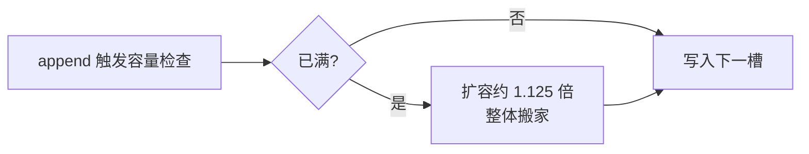
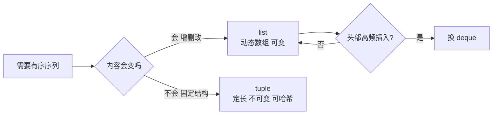
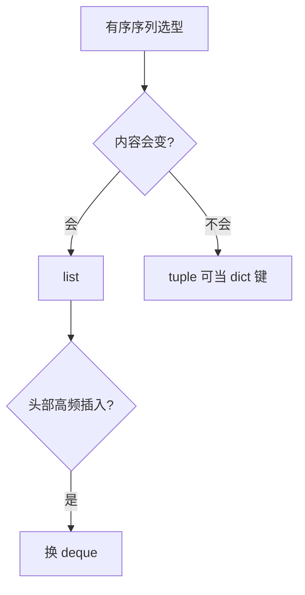

# 列表与元组：一对孪生容器的设计分工

> list 和 tuple 长得一模一样（都是有序序列），为什么 Python 要有两个？这不是历史包袱，是「可变」与「不可变」的刻意分工——选错容器的代价从数据被意外修改到 dict 键失效，这一篇把选型标准和底层机制一次讲清。

## 一句话摘要

**list 是可变有序容器**（原地增删改，动态数组实现），**tuple 是不可变有序容器**（定死内容，可哈希）。分工原则：**内容会变的用 list，内容固定的用 tuple**——tuple 的不可变性让它能当 dict 键、能被多处安全共享，list 的可变性让它成为日常数据装配的主力。

## 🎯 本文核心

**核心机制一句话**：list 是连续引用数组 + 超额扩容（索引 O(1)、头插 O(n)），tuple 是不可变定长记录（可哈希）。

**机制链**：append → 容量检查 → 扩容搬家（均摊 O(1)）；索引访问走连续偏移。这套动态数组的架构与 Java ArrayList/Go slice 同构——容器选型要顺着机制而非语法：上下游数据流水线用 list 装配，固定结构记录（坐标、键）用 tuple 守住模块边界。



## 典型使用场景

```python
scores = [90, 85, 77]         # list：成绩会追加、会修改
point = (39.9, 116.4)         # tuple：坐标天然固定
first, rest = scores[0], scores[1:]   # 切片
xs = [x * 2 for x in scores if x > 80]  # 列表推导：过滤 + 映射一行搞定
packed = [scores, point]      # 容器可嵌套
```

**列表推导为什么是 Pythonic 的标志**——它不只是语法糖：CPython 对推导式有专门的字节码优化（不需要每轮 load append 方法），比等价 for 循环 + append 更快；且「声明式」表达「从什么变换出什么」，读代码的人不用在脑中模拟循环。

## 机制：底层是动态数组

list 的实现是**连续引用数组 + 过载分配**：它存的是对象的引用（不是对象本体——链回篇 3 的引用模型），容量不足时按约 1.125 倍超额扩容。三个推论：

1. **索引访问 O(1)**（连续内存直接偏移），**头部插入 O(n)**（全体搬家）——头部高频插入用 `collections.deque`（双向链表，两端 O(1)）；
2. **扩容均摊 O(1)**——超额分配让 N 次append 的总搬家成本摊薄，这不是 list 独有（Go/Java 的 slice/ArrayList 同构，跨语言通用机制）；
3. **tuple 定长**：没有扩容逻辑，内存更紧凑，且**可哈希**——`{(1, 2): "点"}` 合法，`{[1, 2]: "x"}` 直接 TypeError（为什么——dict 键的定位依赖哈希稳定，可变对象做键等于让门牌号自己漂移）。



## 与其他语言的区别（跨语言视角）

Java 的 ArrayList vs 数组、JS 的数组 vs Object.freeze——**「可变容器 + 不可变变体」是全行业的共同需求**；Python 的特别之处是把 tuple 用到了语言机制深处：多变量解包 `a, b = b, a`、函数多返回值 `return x, y`（实际返回 tuple）、字典键——tuple 不是「小的 list」，是**数据的固定结构单位**。



## 常见误区

- ❌ 「tuple 就是只读 list，随便替换」——语义不同：list 表达「同质元素的集合」，tuple 表达「固定结构的记录」（每个位置有含义：`(姓名, 年龄, 城市)`）——位置语义是惯例但深入人心；
- ❌ 「`(1)` 是单元素元组」——是 int 1！单元素元组必须写 `(1,)`——逗号才是元组的标志，括号只是分组；
- ❌ 「切片深拷贝了嵌套结构」——`lst[:]` 只拷贝外层（浅拷贝），嵌套 list 仍共享（链回篇 3 deepcopy）；
- ❌ 「在遍历 list 时删除元素没问题」——边遍历边改会跳元素（内部索引位移），正解：遍历副本或列表推导重建。

## 代价与边界

list 的可变是双刃剑：引用共享导致的「一处改处处变」（篇 3 机制）在 list 上最常发作——**函数返回内部 list 前先想是否该给副本**。tuple 换来的安全也有限制：不可变指「槽位指向不变」，槽里若装着 list（`(1, [2, 3])`），内层照样可变——不可变只到第一层。

从早期把 tuple 当「小 list」，到模式匹配（3.10）把它当结构化记录解构——tuple 的定位在语言演进中不断被抬高。 动态数组用超额分配换取均摊 O(1)——空间换时间的经典权衡，与多数语言的容器设计殊途同归。

## 上手机会（今天就能试）

```python
data = [(3, "c"), (1, "a"), (2, "b")]
data.sort(key=lambda p: p[0])     # 按元组第一个元素排序
d = {(1, 2): "A"}                 # tuple 当 dict 键
evens = [n for n in range(20) if n % 2 == 0]
print(evens[:5], data)
```

## 💡 实战提示

- 遍历列表时不要增删元素（索引位移跳元素）——推导式重建是 Pythonic 正解。
- 单元素元组必须 `(1,)`——逗号才是元组的标志，括号只是装饰。

## 你们可能会问

**为什么 tuple 能当 dict 键而 list 不行？**
键的定位依赖哈希稳定；tuple 不可变哈希恒定，list 可变则门牌号漂移。

**切片 [:] 是深拷贝吗？**
浅拷贝——外层新列表、内层对象仍共享；嵌套结构要 copy.deepcopy。

## 自测三问

1. list 头部插入为什么慢、换什么？（动态数组全体搬家 O(n)；deque）
2. 单元素元组怎么写？为什么？（`(1,)`；逗号才是元组标志）
3. tuple 为什么能当 dict 键？（不可变 → 哈希稳定）

## 5W 速记卡

| 问题 | 答案 |
|---|---|
| What | list 可变动态数组；tuple 不可变定长记录 |
| Why 两个 | 可变装配与固定结构的分工 |
| 选型 | 会变 list，固定 tuple；头部插入 deque |
| 推导式 | 声明式 + 字节码优化，Pythonic 标志 |
| 陷阱 | (1) 不是元组；浅拷贝；遍历中修改 |

## 开放问题

- 模式匹配（3.10 match）强化了 tuple 的「记录」语义后，dataclass 与 tuple 的使用分界会怎么演化？

**核心带走**：list 可变装配 / tuple 固定记录；扩容均摊 O(1)、头插 O(n) 换 deque。失效点——(1) 当元组、遍历中修改、浅拷贝误当深拷贝。金句：**选容器就是选机制——可变是能力也是风险。**

**决策**：何时用 list——元素会增删改、语义是同质集合；何时用 tuple——结构固定、语义是记录、要做 dict 键。取舍：tuple 放弃灵活性换来哈希能力与共享安全。

## 📌 数据与事实声明

- list 扩容系数（约 1.125）与推导式字节码优化为 CPython 公开实现细节；deque 场景建议为公开文档共识。

## 📚 参考资料

- Python 官方文档：序列类型与 collections
- 《流畅的 Python》第 2 章（序列构成的数组）——list/tuple/str 的机制全景
