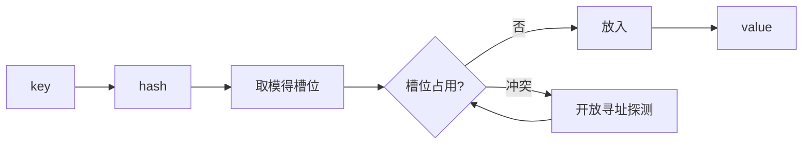
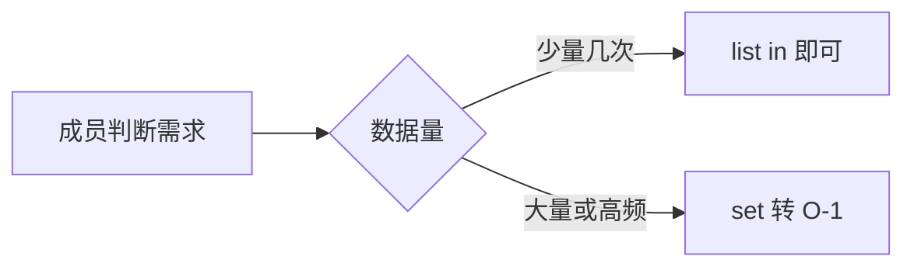

# 字典与集合：哈希表的 Python 形态

> dict 是 Python 的「地基级」数据结构——不只是常用，而是**语言本身建在它上面**：模块命名空间、类属性、对象实例属性全是 dict。「为什么 Python 的 dict 有序」「为什么键必须可哈希」，答案都在哈希表的实现里。

## 一句话摘要

**dict 是键到值的哈希映射**（平均 O(1) 增删查），**set 是只有键没有值的哈希集合**（去重与成员判断 O(1)）——两者共用同一套哈希表机制。dict 键必须可哈希（不可变类型），3.7 起插入顺序有语言级保证（演进：从实现细节到正式承诺，行业语义从此可依赖）。

## 🎯 本文核心

**核心机制一句话**：dict/set = 哈希表——hash 取模定槽位、开放寻址解冲突、装载因子超限触发扩容重排，平均 O(1)。

**机制链**：hash(key) → 槽位 → 探测 → 存储；扩容 = 全体 rehash（摊还后单次 O(1)）。dict 不只是容器，它是 Python 对象模型的架构地基——实例属性、模块命名空间全建在 dict 上下游之间，理解 dict 就摸到了语言的模块边界。

```mermaid
graph TD
    A[插入触发装载因子 2/3] --> B[扩容新表]
    B --> C[全体键 rehash 重排]
    C --> D[均摊 O(1) 但单次偶发卡顿]
```

## 典型使用场景

```python
price = {"apple": 5, "banana": 3}
price["cherry"] = 8                 # 增
price.get("pear", 0)                # 查（键不存在给默认值，不抛 KeyError）
for k, v in price.items():          # 遍历（顺序 = 插入顺序）
    print(k, v)
tags = {"red", "fruit"}
"red" in tags                       # 成员判断 O(1)，比 list 快数量级
uniq = set([1, 2, 2, 3])            # {1, 2, 3} 去重
```

## 机制：哈希表怎么放键值对

`d[key]` 的执行链：`hash(key)` 算哈希值 → 按表大小取模得槽位 → 槽位被占则按**开放寻址**探测下一槽 → 定位后比对键相等 → 返回值。三个推论（机制穿透）：

1. **键为什么必须不可变**——键的哈希值决定槽位，键若可变（哈希漂移），存进去就再也找不到（链回篇 5 tuple 可哈希的原因）；
2. **为什么 O(1) 是「平均」**——冲突与扩容是常数项：装载因子超阈值（2/3）触发**扩容重排**（rehash 全体搬家，摊还后单次仍 O(1)，但单次大 dict 插入会偶发卡顿）；
3. **为什么 3.7 前无序、之后有序**——早期实现纯哈希槽位（顺序由哈希值决定）；演进到**紧凑 dict**（键值数组 + 稀疏索引表分离）后插入顺序自然保留，3.6 是实现红利、3.7 转正为语言承诺——「实现细节升格为规范」是语言演进的经典路径。



## 与其他语言的区别（跨语言视角）

Java HashMap（链表+红黑树解决冲突）、JS 的对象/Map、Go 的 map——哈希表是全行业地基，差异在冲突策略与有序性承诺。Python 独有的点是**语言自身运行在 dict 上**：`module.attr`、`obj.attr` 的查找背后就是命名空间 dict——理解 dict 就是理解 Python 对象模型的入口（特性层属性查找链展开）。



## 常见误区

- ❌ 「遍历 dict 时删除键没问题」——RuntimeError（遍历中改变大小）；正解：遍历 `list(d.keys())` 快照或推导式重建；
- ❌ 「`d[key]` 查不到返回 None」——抛 KeyError；不确定存在用 `.get(key, 默认)` 或 `setdefault`；
- ❌ 「set 里放 list」——TypeError，list 不可哈希；去重嵌套结构先转 tuple；
- ❌ 「dict 适合放十亿级数据」——哈希表有装载因子与指针开销，内存换速度；超大规模 KV 是 Redis/ RocksDB 的战场。

## 代价与边界

哈希表的本质代价是**内存换时间**（稀疏表 + 每条目指针开销）与**无范围查询**（找「键在 100-200 之间」哈希表无能为力——有序需求用 `sorted(d.items())` 或换平衡树结构）。set 去重的前提是元素可哈希——不可变是入场券。

哈希表用稀疏表与指针开销（内存）换 O(1) 查找（时间）——这个权衡没有免费版，set 更是「纯花钱买判断速度」。

## 上手机会（今天就能试）

```python
text = "the quick the lazy the dog"
wc = {}
for w in text.split():
    wc[w] = wc.get(w, 0) + 1
print(wc)                       # 词频统计：dict 的最小完整用例
print({w: c for w, c in wc.items() if c > 1})   # 推导式过滤
```

## 💡 实战提示

- `in` 高频判断的容器从 list 换 set——O(n) 到 O(1) 是数量级优化，一行改动。
- 遍历 dict 要删键：遍历 `list(d.keys())` 快照或推导式重建，直接删会 RuntimeError。

## 你们可能会问

**dict 3.7 前后为什么从无序变有序？**
紧凑实现（键值数组+稀疏索引）天然保插入序——实现细节升格为 3.7 语言承诺。

**键可以是 list 吗？**
不可——list 可变则哈希漂移，定位失效；必须可哈希（不可变）类型。

## 自测三问

1. dict 键的要求与原因？（可哈希/不可变；哈希决定槽位）
2. dict 何时从无序变有序？（紧凑实现 + 3.7 语言承诺）
3. 成员判断为什么用 set 不用 list？（O(1) vs O(n)，数量级差异）

## 5W 速记卡

| 问题 | 答案 |
|---|---|
| What | dict 键值哈希映射；set 哈希集合 |
| Why O(1) | 哈希定位，摊还扩容 |
| 键要求 | 不可变（tuple/str/int 可，list 不可） |
| 顺序 | 3.7+ 保插入序 |
| 边界 | 内存换时间；无范围查询 |

## 开放问题

- 哈希表的「内存换时间」在超大规模 KV 场景的极限在哪？LSM/RocksDB 类结构接管的边界值得量化。

**核心带走**：哈希表三步（hash/槽位/探测）+ 扩容重排；键必须不可变。失效点——遍历中删键、不可哈希键、大表实时范围查询。金句：**dict 的 O(1) 是内存买来的——哈希表的一切设计都在给「查找」提速。**

**决策**：何时用 dict——键值映射与缓存；何时用 set——只关心「在不在」；何时都不用——需要范围查询时换有序结构（取舍：哈希表天然放弃顺序遍历的有序性）。

## 📌 数据与事实声明

- 开放寻址、紧凑 dict（PEP 468/相关设计文档）、3.7 有序承诺为公开文档与语言规范；装载因子 2/3 为 CPython 公开实现参数。

## 📚 参考资料

- Python 官方文档：Mapping 与 Set Types；PEP 372（有序字典的历史）
- 《流畅的 Python》第 3 章——dict/set 的机制深读
