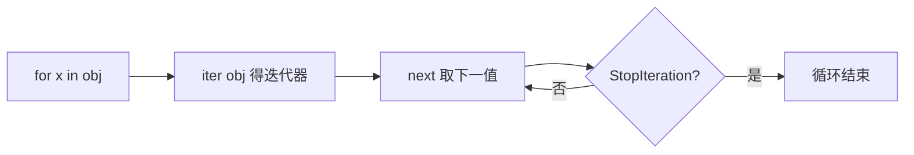
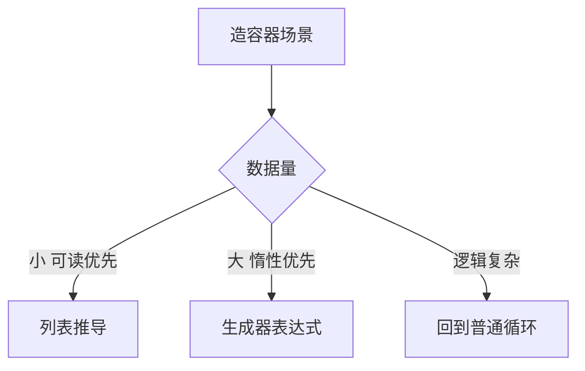

# 控制流与推导式：程序的骨架与 Python 的表达力

> if/for/while 是所有语言的公共骨架，Python 的特色在于两处独门设计：**缩进即结构**（没有花括号和分号的余地）与**推导式**（把「造容器」压缩成一行声明）。这一篇讲清语法之外的机制：迭代是怎么发生的、循环的 else 是什么、推导式该在什么时候停手。

## 一句话摘要

Python 控制流的两个记忆锚点：**for 循环是「迭代协议」的语法**（对任何可迭代对象逐个取元素，不是 C 式下标循环），以及**表达式化**（推导式、三元表达式让「造值」可以用表达式而非语句完成）。多出来的一支 `while/for ... else` 是 Python 独有：循环**没有被 break 打断**时执行——「找找看」场景的优雅收尾。

## 🎯 本文核心

**核心机制一句话**：for 是迭代协议的语法——`iter()` 取迭代器、反复 `next()`、StopIteration 收尾；推导式是「造容器」的表达式化。

**机制链**：for x in obj → `iter(obj)` → 循环 `next()` → StopIteration。协议是抽象的架构边界：文件、字典、生成器在迭代这条链上是平等公民——for 不关心上下游类型，只认协议（篇 10 的鸭子类型在这里预演）。



## 典型使用场景

```python
# if / 三元 / match（3.10+）
level = "VIP" if points > 100 else "普通"
match command:                          # 结构化分支（演进：3.10 新增）
    case ("go", direction): print("向", direction)
    case _: print("未知命令")

# for 迭代 + enumerate/zip
for i, name in enumerate(["a", "b"], start=1):  # 带序号迭代
    print(i, name)
for q, a in zip(questions, answers):            # 并行迭代
    print(q, a)

# while...else：没有被 break 打断才走 else
for u in users:
    if u.id == target: print("找到"); break
else:
    print("不存在")                    # 「找完没有」的标准 Pythonic 写法

# 推导式
squares = {n: n * n for n in range(5)}          # 字典推导
```

## 机制：for 到底在做什么

`for x in obj` 的执行机制：解释器调用 `iter(obj)` 拿迭代器，反复 `next()` 取值直到 StopIteration——**迭代协议是语言的底层约定**（篇 11 的魔法方法 `__iter__/__next__` 是它的手写形态）。这解释了为什么 Python 的 for 能直接遍历文件（逐行）、字典（逐键）、生成器（逐值）——**只要对象遵守协议，for 一视同仁**（鸭子类型的前奏，跨类型统一抽象）。

推导式的机制同源：`[x*2 for x in xs]` 编译成一段独立的小函数反复执行（有自己的作用域——推导式变量不泄漏到外层，3.x 修复的历史坑），配合短路求值的过滤条件，比 map/filter 链更贴近阅读直觉。

## 与其他语言的区别（跨语言视角）

C 的 for 是「计数器三段式」，Java 增强for向迭代协议靠拢，Python 直接以迭代协议为唯一 for——**演进方向高度一致：从下标思维走向对象思维**。match 表达式则是对 switch 的换代（结构解构 + 模式守卫），设计参照了函数式语言的模式匹配——静态语言与动态语言在表达力上互相渗透的行业趋势。



## 常见误区

- ❌ 「`range(1, 5)` 包含 5」——左闭右开，含头不含尾（与切片一致，同一套约定贯穿 Python）；
- ❌ 「for 循环里改被迭代的列表没问题」——迭代器按位置推进，修改引发跳元素（篇 5 陷阱的同源）；需要改就推导式重建；
- ❌ 「推导式套三层显技术」——嵌套超过一层的推导式可读性崩塌；**复杂逻辑回到普通循环**，表达力是为读的人服务的；
- ❌ 「while True + 手动 break 很丑所以到处用 for-else」——else 分支只在「自然跑完」时执行，理解反了会出逻辑 bug；不确定就拆函数。

## 代价与边界

推导式的内存代价：列表推导一次性物化全部结果（百万级数据吃内存）——**大数据量换生成器表达式** `(x*2 for x in xs)`（惰性产出，特性层生成器篇展开）。match 是 3.10+ 特性，老运行环境不可用——写库代码前先确认目标 Python 版本。

从 C 式下标循环到迭代协议 for，是三十年语言演进的共同方向——Python 走得最彻底：下标循环在 Pythonic 代码里几乎绝迹。 迭代协议是遍历子系统的架构总线：for、解包、推导式全部坐在 iter/next 这条上下游链上。 推导式一次性物化的便利，代价是内存与数据量成正比——大数据换生成器表达式就是这笔取舍的退款通道。

## 上手机会（今天就能试）

```python
data = ["apple", "fig", "banana"]
lens = {w: len(w) for w in data}
print(lens)
found = False
for w in data:
    if len(w) == 3:
        print("长度为3:", w); found = True; break
else:
    if not found: print("没有长度为3的词")   # 感受 for-else
```

## 💡 实战提示

- enumerate(xs, start=1) 替代手动计数器；zip 并行遍历两个序列——这两个内建是 for 循环的日常搭档。
- 推导式嵌套超过一层就改回普通循环——表达力是为读的人服务的。

## 你们可能会问

**range(1, 5) 包含 5 吗？**
不含——左闭右开，与切片同一套含头不含尾约定，贯穿 Python 全语言。

**while-else 和 for-else 的 else 何时执行？**
循环自然结束（未被 break 打断）时——「找找看」场景的标准收尾。

## 自测三问

1. Python 的 for 底层是什么机制？（iter/next 迭代协议，非下标循环）
2. for-else 的 else 何时执行？（循环未被 break 打断、自然结束时）
3. 列表推导的内存边界与替代？（一次性物化；大数据换生成器表达式）

## 5W 速记卡

| 问题 | 答案 |
|---|---|
| What | if/match 分支 + 迭代协议 for + 推导式表达式 |
| Why 迭代协议 | 统一遍历文件/dict/生成器——协议即抽象 |
| 常用工具 | enumerate 带序号、zip 并行、sorted 排序 |
| else 分支 | 未 break 才执行（查找收尾） |
| 边界 | 推导式一层为限；大数据用生成器 |

## 开放问题

- match 模式匹配（3.10+）会不会逐步取代 if-elif 长链，成为复杂分支的默认形态？

**核心带走**：for = 迭代协议；推导式 = 表达式化造容器（大数据换生成器表达式）。失效点——遍历中改容器、range 边界记反、推导式过深。金句：**for 循环的不挑食，是协议给的权利——对象只要会迭代，语言就带它玩。**

**决策**：何时用推导式——造新容器的简单映射过滤；何时用普通循环——有副作用、多步逻辑、嵌套超一层。怎么选的标尺只有一个：读的人三秒能不能懂。

## 📌 数据与事实声明

- 迭代协议（iter/next）、match 语句（PEP 634，3.10+）为公开语言规范；推导式独立作用域为 3.x 公开语义。

## 📚 参考资料

- Python 官方教程：More Control Flow Tools
- PEP 634——结构化模式匹配
