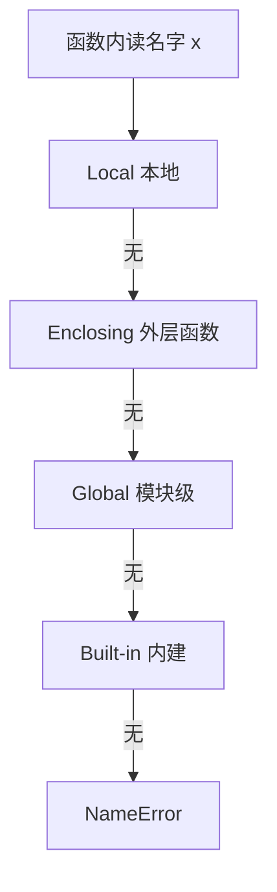
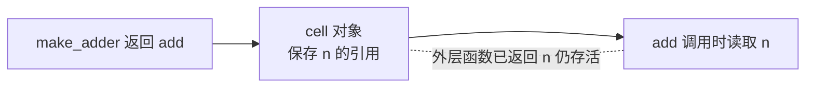

# 函数与作用域：LEGB 规则与一等公民

> Python 函数的两个关键词：**一等公民**（函数和数字一样可以传来传去）与 **LEGB**（变量查找的四层顺序）。前者是装饰器、回调、函数式风格的地基；后者解释了 90% 的「变量为什么是这个值」的疑惑。

## 一句话摘要

Python 函数是**对象**（可赋值、可传参、可返回——「一等公民」），变量查找遵循 **LEGB** 顺序：Local（函数内）→ Enclosing（外层函数）→ Global（模块级）→ Built-in（内建）。默认参数陷阱（篇 3 埋的伏笔）、闭包、`global/nonlocal` 关键字的存在，全部由「函数是对象 + 作用域是静态 determined 的」这两个机制推导出来。

## 🎯 本文核心

**核心机制一句话**：函数是一等对象（可传可返可存），变量查找走 LEGB（Local→Enclosing→Global→Built-in），赋值语句把名字登记为本地。

**机制链**：读名字 → LEGB 逐层找；写名字 → 本地声明（逃逸需 global/nonlocal）。这条链是函数架构的总规则：默认参数陷阱、闭包晚绑定、UnboundLocalError 全在一条上下游链上——掌握了它，作用域问题就有了统一的模块边界。



## 典型使用场景

```python
def power(base, exp=2):          # 位置参数 + 默认参数
    """计算 base 的 exp 次方"""   # docstring
    return base ** exp

def report(*args, **kwargs):     # 可变位置包 / 可变关键字包
    print(args, kwargs)
report(1, 2, name="py")          # (1, 2) {'name': 'py'}

power(exp=3, base=2)             # 关键字参数（顺序无关，可读性利器）

counter = 0
def inc():
    global counter               # 要改全局必须声明（读不需要）
    counter += 1
```

## 机制：LEGB 与「定义时绑定」

**LEGB 查找顺序**：函数里读一个名字，解释器按 Local → Enclosing → Global → Built-in 逐层找，找到即停。两个关键推论：

1. **global/nonlocal 为什么存在**——赋值语句会把名字**声明成本地**（机制上：编译函数时，函数体内被赋值的名字全部登记为局部变量）。所以「只读」外层变量不需要声明，「写」才需要 global（全局）/nonlocal（外层函数）——`counter += 1` 没有声明会 UnboundLocalError（先读后写，但 counter 被登记为本地所以读不到）。**这是 Python 作用域最大的坑，没有之一**。
2. **默认参数与闭包都是「定义时」绑定**——默认值在 def 时求值一次（篇 3 的 append_to 陷阱）；闭包捕获的是外层**变量**而非值（循环变量晚绑定：`[lambda: i for i in range(3)]` 三个 lambda 全返回 2——它们共享同一个 i，调用时才取值；正解 `lambda i=i: i` 默认参数固化）。

```python
def make_adder(n):               # 工厂：函数返回函数
    def add(x):
        return x + n             # n 是 Enclosing，闭包捕获
    return add
add5 = make_adder(5)
add5(3)                          # 8——n 的生命周期被闭包续住了
```

**闭包机制**：内层函数记住的是**外层作用域的引用**（cell 对象），外层函数返回后其局部变量不销毁——装饰器（特性层专题）的整个大厦建立在这一条上。

## 一等公民：函数作为数据的三个用法

```python
ops = {"add": lambda a, b: a + b, "mul": lambda a, b: a * b}
ops["add"](2, 3)                 # ① 函数入容器（分发表模式）

sorted(users, key=lambda u: u["age"])   # ② 函数作参数（策略注入）

def logged(fn):
    def wrapper(*a, **kw):
        print("调用", fn.__name__)
        return fn(*a, **kw)
    return wrapper               # ③ 函数返回函数（装饰器雏形）
```

「函数是对象」让**策略、回调、分发、装饰**成为语言原生能力——Java 用接口 + 匿名类绕的路，Python 用函数直接走（演进视角：JS/Go/K8s 配置等全面拥抱「函数即数据」，这是行业三十年的共同方向）。



## 与其他语言的区别（跨语言视角）

- 与 Java 的区别：Java 的函数只能依附类（方法），策略要靠接口 + 匿名类/lambda 对象——Python 函数本身就是对象，一等公民不需要任何包装；
- 与 JS 的区别：两者都有闭包与函数作用域，但 JS 有 var 提升与 this 动态绑定两大坑，Python 的 LEGB 是静态确定、没有 this——作用域心智负担更小；
- 与 C 的区别：C 没有嵌套函数与闭包（函数指针不带环境），Python 的闭包把「代码 + 环境」整体捕获——这是函数式风格在 C 世界需要手工模拟的东西。

## 常见误区

- ❌ 「在函数里给全局变量赋值会直接生效」——需要 global 声明，否则 UnboundLocalError 或静默创建局部名；
- ❌ 「lambda 能写多行逻辑」——不能（单表达式限定）；复杂逻辑用 def，lambda 只做一行策略；
- ❌ 「`*args` 是元组、`**kwargs` 是字典，可以随便命名」——约定俗成的名字不是语法强制，但改名字会让读者困惑（惯例即规范）；
- ❌ 「闭包里改外层变量直接赋值就行」——赋值触发本地声明，必须 nonlocal（读不需要、写需要，与 global 同款规则）。

## 代价与边界

函数对象的代价：闭包把外层变量「续命」，意外持有大对象会内存泄漏（特性层 GC 篇展开）；动态作用域自由的代价是**工具难静态分析**——类型注解（`def f(x: int) -> str`）是给 IDE 与检查器补回静态信息的工程补偿。

函数从「语句块」演变为「一等对象」，是 Python 受函数式语言影响最重要的演进——装饰器生态全部由此而来。

## 上手机会（今天就能试）

```python
def make_counter():
    count = 0
    def step():
        nonlocal count          # 试着删掉这行，看报错
        count += 1
        return count
    return step
c = make_counter()
print(c(), c(), c())            # 1 2 3 —— 闭包记住状态
```

## 💡 实战提示

- 循环里建 lambda 全返回同一个值的坑：`lambda i=i: i` 用默认参数在定义时固化——理解晚绑定才能治它。
- 函数内「只读」外层变量不用声明；「写」才需要 global/nonlocal——读写不对称是语言机制不是 bug。

## 你们可能会问

**UnboundLocalError 为什么会出现？**
函数体内有赋值的名字被预先登记为本地——`x += 1` 先读后写，读时本地还没有值。

**闭包为什么能记住外层变量？**
内层函数通过 cell 对象持有外层变量的引用，外层返回后变量不销毁。

## 自测三问

1. LEGB 是什么顺序？（Local → Enclosing → Global → Built-in）
2. 函数内写外层变量为什么报 UnboundLocalError？（赋值触发本地名登记，读时本地无值）
3. 循环里的 lambda 全返回最后一个值的机制？（闭包捕获变量引用、调用时才求值——晚绑定）

## 5W 速记卡

| 问题 | 答案 |
|---|---|
| What | 函数是一等对象；作用域 LEGB 静态确定 |
| Why 一等公民 | 策略/回调/装饰器/分发表的原生地基 |
| 写外层 | global（模块）/ nonlocal（外层函数） |
| 绑定时机 | 默认参数与闭包都定义时绑定（晚绑定陷阱） |
| 补偿 | 类型注解给动态性补静态检查 |

## 开放问题

- 类型注解普及后，「*args/**kwargs 的动态签名」在大型代码库里会不会逐渐退居框架层？

**核心带走**：一等函数 + LEGB + 定义时绑定三件套。失效点——写外层忘声明、闭包晚绑定、可变默认参数。金句：**Python 的作用域是静态画好的地图——LEGB 就是查地图的顺序。**

**决策**：何时用闭包——需要携带状态的轻量工厂（装饰器/计数器）；何时用类——状态多、行为多。取舍：闭包轻但难调试（状态藏在 cell 里），类重但结构清楚。

## 📌 数据与事实声明

- LEGB、默认参数定义时求值、闭包 cell 机制为 CPython 公开语义（语言参考的 Naming and Binding 章节）；跨语言演进描述为公开事实。

## 📚 参考资料

- Python 官方文档：Naming and Binding / 函数定义
- 《流畅的 Python》第 5、7 章——一等函数与闭包装饰器的正源
