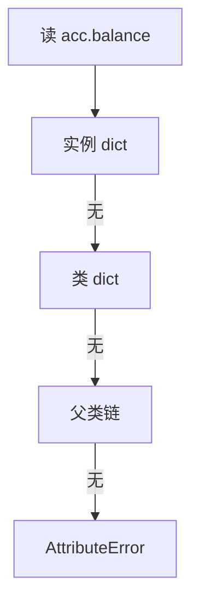
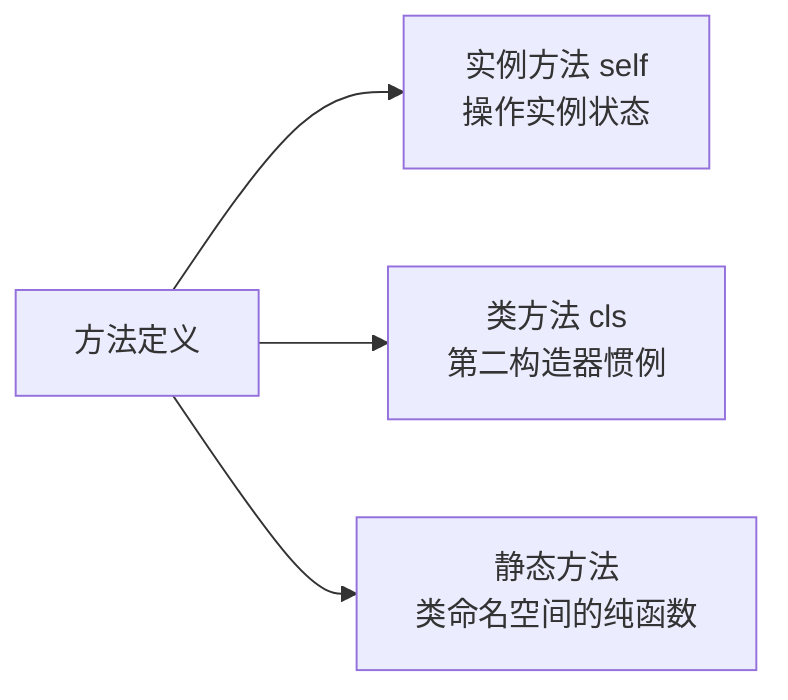

# 类与对象：属性、方法与继承的正确打开方式

> Python 的面向对象没有接口、没有访问修饰符、没有「必须先定义类」——它把 OOP 削到最薄，再把力量藏在协议里（篇 10）。这一篇讲类的日常写法：`__init__`、实例属性 vs 类属性、四种方法类型、继承与组合的选型。

## 一句话摘要

Python 类是**对象的模板 + 命名空间的集合**：`__init__` 负责初始化（不是「构造」，实例已在 `__new__` 创建），实例属性存对象自己的 dict、类属性全实例共享，方法分实例方法/类方法/静态方法三种。继承单线为主、组合优先；**没有 private**——`_name` 与 `__name` 只是约定与改写，Python 的信任文化是「我们都是成年人」。

## 🎯 本文核心

**核心机制一句话**：类是对象模板 + 命名空间——属性查找顺序「实例 dict → 类 dict → 父类链」，实例赋值只是新建属性遮蔽类属性。

**机制链**：`__new__` 创建实例 → `__init__` 初始化 → 属性读写走查找链。这条链划清了面向对象代码的模块边界：类属性放共享常量、实例属性放个体状态、方法分三种收参——上下游职责清楚，继承树的复杂度才有纪律。



## 典型使用场景

```python
class Account:
    bank = "PyBank"                       # 类属性：全实例共享

    def __init__(self, owner, balance=0): # 初始化（self = 实例自己）
        self.owner = owner                # 实例属性：各归各
        self.balance = balance

    def deposit(self, amount):            # 实例方法
        self.balance += amount
        return self.balance

    @classmethod
    def from_config(cls, cfg):            # 类方法：alternative constructor 惯例
        return cls(cfg["owner"], cfg.get("balance", 0))

    @staticmethod
    def validate(amount):                 # 静态方法：与类相关的纯函数
        return amount > 0

acc = Account("Alice")
acc.deposit(100)
Account.from_config({"owner": "Bob"})
```

## 机制：属性查找与三种方法

**实例属性 vs 类属性**：`acc.balance` 的查找顺序是**实例 dict → 类 dict → 父类链**——所以类属性适合「全体共享的常量/配置」，一旦通过实例赋值（`acc.bank = "X"`）就是**新建实例属性遮住类属性**，不会改到类。这个「遮蔽」机制是新手 bug 高发区：**可变的类属性（`tasks = []`）被实例 append 会全体共享**——和篇 3 的共享机制同源。

**三种方法的分工**：实例方法收 `self`（操作实例状态）；类方法收 `cls`（操作类，惯例用作**第二构造器**——从 dict/字符串等异构来源造实例）；静态方法两者都不收（只是命名空间里的普通函数）。**为什么类方法常做第二构造器**——`from_config` 这类入口让「从什么构造」的语义显式化，比在 `__init__` 里塞多种参数形态干净。

**继承**：`class VIP(Account)` 复用并扩展，`super().__init__()` 调父类初始化。**组合优先**的历史经验（Go 语言干脆砍掉继承、行业三十年从「继承万岁」到「组合优于继承」的演进）：继承是「是一个」，组合是「有一个」——拿不准时选组合，继承树一旦长歪，重构成本指数级。

## 与其他语言的区别（跨语言视角）

没有 interface（用抽象基类 abc 或直接鸭子类型，篇 10）；没有 private/protected 关键字（`_x` 约定内部使用、`__x` 触发名称改写成 `_类名__x`——防意外覆盖不是防访问）；没有 abstract 的强制——**Python 的 OOP 是「约定 + 协议」而不是「编译器强制」**，灵活性与纪律性的取舍与整个语言哲学一致。



## 常见误区

- ❌ 「`__init__` 是构造函数」——实例由 `__new__` 创建，`__init__` 只做初始化（不可变类型定制时才需要碰 `__new__`）；
- ❌ 「类属性列表当实例集合用」——全体实例共享同一个 list（遮蔽机制 + 可变共享双坑叠加）；
- ❌ 「`__x` 是私有」——只是名称改写，`obj._Account__x` 照样能摸到；内部实现用 `_x` 约定即可；
- ❌ 「继承层级越深越优雅」——三层以上继承树基本必然失控；优先组合 + 协议（鸭子类型）；
- ❌ 「@staticmethod 和模块级函数没区别」——确实语义接近；静态方法的价值是把「逻辑上属于类」的函数放进类命名空间，是组织选择。

## 代价与边界

动态属性（实例可以随便加属性）是灵活与混乱的分界线——**用 `__slots__` 限定属性集**（省内存 + 防拼错属性静默通过）是大型项目的常见加固；数据为主的对象不必手写样板，`dataclass`（3.7+，演进：自动生成 `__init__/__repr__/__eq__`）是现代首选。

OOP 风潮的演变：从九十年代「继承万岁」到当代「组合优于继承」写进各语言官方建议——Python 的鸭子类型恰好站在演变终点的那一侧。 属性查找链（实例→类→父类）就是对象模型的架构图：类属性是全局区、实例属性是局部区——模块边界即状态归属边界。 动态属性的自由 vs __slots__ 的纪律——前者灵活后者省内存防拼错，大型项目选后者的代价几乎可以忽略。

## 上手机会（今天就能试）

```python
from dataclasses import dataclass

@dataclass
class Point:
    x: float
    y: float

    def dist(self):
        return (self.x ** 2 + self.y ** 2) ** 0.5

p = Point(3, 4)
print(p, p.dist())       # Point(x=3, y=4) 5.0 —— dataclass 白送的 repr
```

## 💡 实战提示

- 可变类属性（tasks = []）会被全体实例共享——共享配置用类属性，个体状态一律 `__init__` 里建。
- 数据类直接用 @dataclass——`__init__/__repr__/__eq__` 自动生成，样板代码归零。

## 你们可能会问

**__init__ 是构造函数吗？**
不是——实例由 __new__ 创建，__init__ 只做初始化；定制不可变类型时才需要碰 __new__。

**__x 双下划线是私有吗？**
只是名称改写成 _类名__x，防意外覆盖不防访问——Python 的私有是约定文化。

## 自测三问

1. `acc.bank = "X"` 改的是类属性吗？（不是，新建实例属性遮蔽类属性）
2. 三种方法各自收什么参数？（self / cls / 无——分工：实例状态/类操作/纯函数）
3. 继承 vs 组合怎么选？（是一个用继承，有一个用组合，拿不准选组合）

## 5W 速记卡

| 问题 | 答案 |
|---|---|
| What | 类 = 模板 + 命名空间；属性查实例→类→父类 |
| Why 类方法 | 第二构造器惯例（from_xxx） |
| 继承纪律 | 组合优先；继承是「是一个」 |
| 私有 | 只有约定：_x 内部 / __x 名称改写 |
| 现代化 | dataclass 消灭数据类样板 |

## 开放问题

- 组合优于继承的共识已定，但 ABC 与 Protocol（结构化接口）在大型项目里会如何分工演化？

**核心带走**：属性查找三段链 + 三种方法分工 + 组合优先。失效点——可变类属性共享、把 __init__ 当构造、继承树过深。金句：**Python 的面向对象薄在语法、厚在协议——继承能不写就不写。**

**决策**：何时用继承——真「是一个」且要多态；何时用组合——「有一个」或仅仅是复用。怎么选的推荐：默认组合，继承需要评审——这是代价最小的默认值。

## 📌 数据与事实声明

- 属性查找链、名称改写（`_类名__x`）、`__new__/__init__` 分工为 Python 语言参考公开语义；dataclass（PEP 557，3.7+）为公开规范。

## 📚 参考资料

- Python 官方教程：Classes
- 《流畅的 Python》第 9、11 章——对象引用与接口：从协议到 ABC
