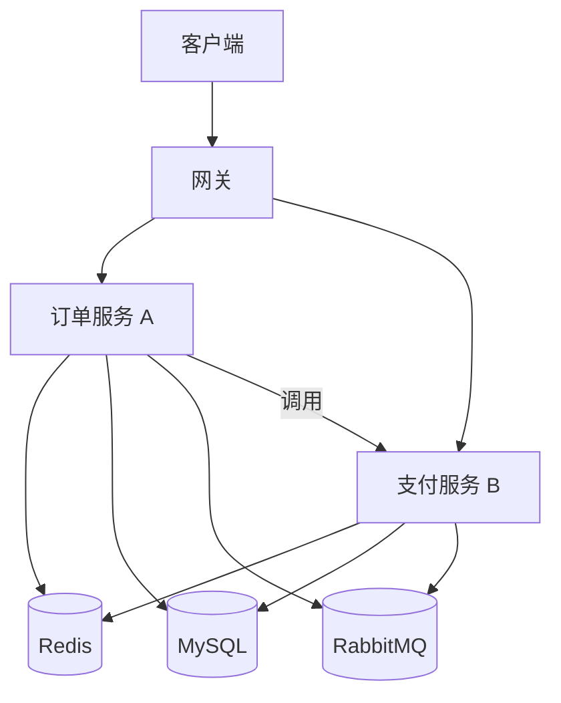

# Python 企业级微服务 Demo

## 一句话摘要

从 A 服务（订单）到 B 服务（支付）：框架 + 中间件 + 服务治理的完整企业级 Demo。

## 架构全景



## 服务 A：订单服务

### 框架
- FastAPI：异步 Web 框架
- SQLAlchemy：ORM
- Redis：缓存

### 核心逻辑
1. 接收订单请求
2. 校验库存（Redis）
3. 创建订单（MySQL）
4. 发送消息（RabbitMQ）

## 服务 B：支付服务

### 框架
- FastAPI：异步 Web 框架
- SQLAlchemy：ORM
- Redis：缓存

### 核心逻辑
1. 监听消息队列
2. 创建支付单
3. 调用支付网关
4. 更新订单状态

## 服务治理

### 服务发现
- Nacos：服务注册与发现

### 负载均衡
- 客户端负载均衡

### 熔断降级
- 自定义熔断器

### 限流
- 令牌桶限流

## 中间件集成

| 中间件 | 用途 | 集成方式 |
|---|---|---|
| Redis | 缓存/分布式锁 | redis-py |
| MySQL | 数据库 | SQLAlchemy |
| RabbitMQ | 消息队列 | pika |
| Nacos | 服务发现 | nacos-sdk |

## 部署

### Docker
```dockerfile
FROM python:3.11-slim
WORKDIR /app
COPY requirements.txt .
RUN pip install -r requirements.txt
COPY . .
CMD ["gunicorn", "app:app", "-w", "4"]
```

### K8s
```yaml
apiVersion: apps/v1
kind: Deployment
spec:
  replicas: 3
```

## 踩坑记录

1. **服务发现失败**：Nacos 未启动
2. **熔断误判**：阈值设置不当
3. **消息丢失**：没有确认机制
4. **数据库连接**：连接池配置不当

## 量级考量

| 量级 | 架构 |
|---|---|
| < 100 QPS | 单机 |
| 100-1000 QPS | 2-3 实例 |
| > 1000 QPS | K8s + 自动伸缩 |

## 📌 数据与事实声明

- Demo 基于企业级 Python 实践
- 踩坑来自生产环境经验
