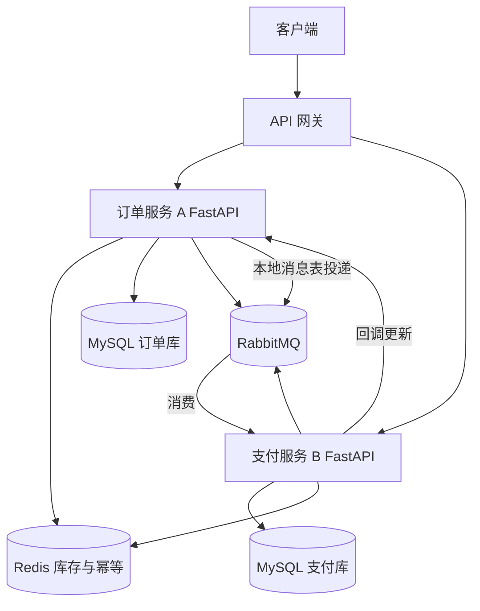
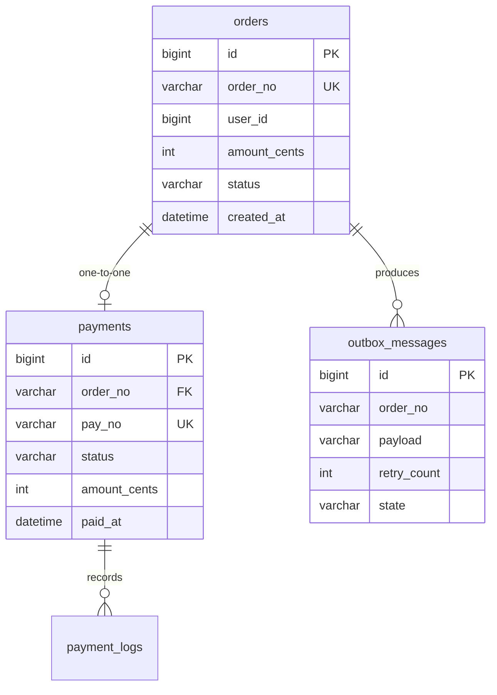
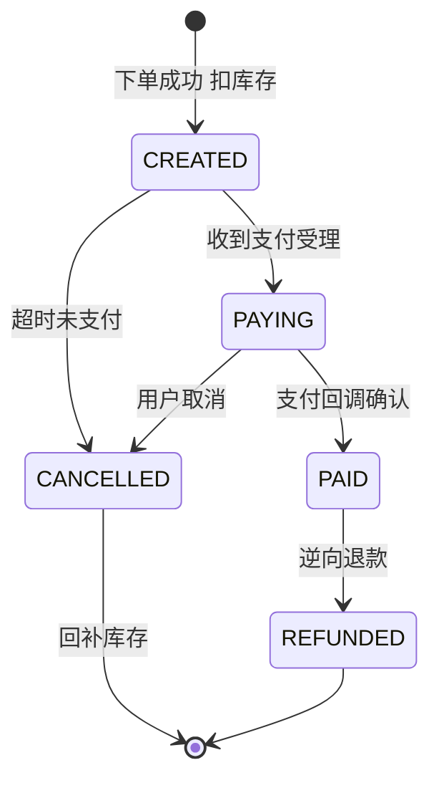
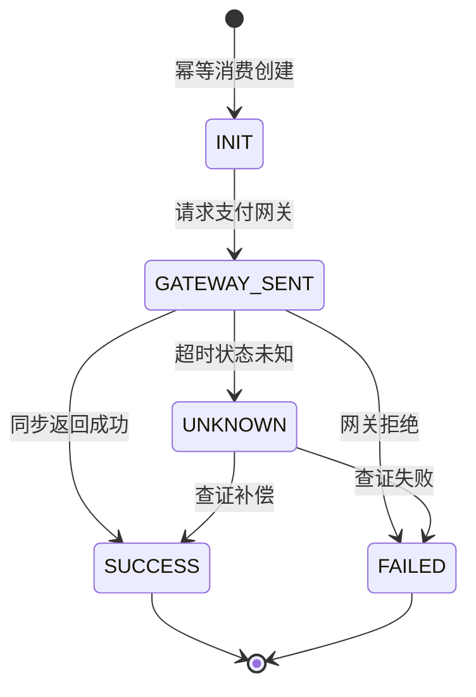
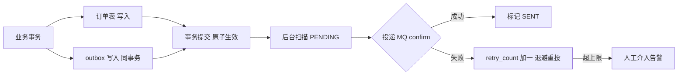
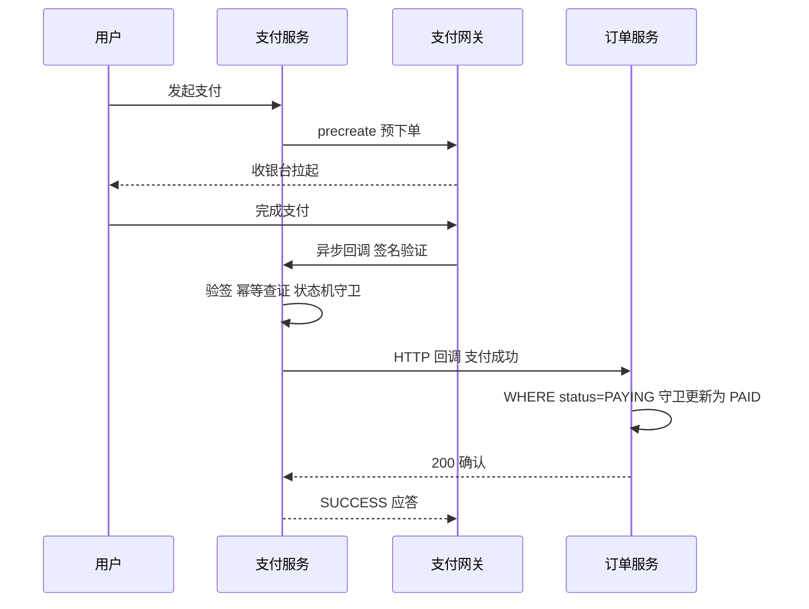

# Python 企业级微服务 Demo

## 一句话摘要

从 A 服务（订单）到 B 服务（支付）的完整企业级 Demo：FastAPI + MySQL + Redis + RabbitMQ 的落地组合，重点讲清跨服务一致性（本地消息表）、状态机守卫、幂等设计这三大「下单支付链路」的命门，并给出可执行的验证步骤与常见报错排查。

## 🎯 本文核心

**核心机制一句话**：订单支付链路的本质是一场「跨服务状态机协作」——订单服务把「创建事实」与「通知意图」放进同一个本地事务（本地消息表），支付服务幂等地消费通知并推进支付状态机，两边各自保证自己的状态迁移合法，整体达成最终一致。

**机制链**：下单请求 → Redis 原子扣库存（Lua 防超卖）→ 订单落库 + 消息同事务落盘（本地消息表）→ 后台投递到 RabbitMQ（confirm + 重试）→ 支付服务幂等消费 → 创建支付单 → 支付网关回调 → 状态机守卫更新订单 → 对账任务兜底。

**失效边界**：这套 Demo 架构解决「最终一致」，不解决「强一致」——用户在下单到支付完成的窗口内会看到中间状态，交互设计必须容忍它。资金强一致场景要么收进单服务事务，要么上 TCC/Saga 编排，复杂度完全不是一个量级。

## 一、架构全景与拆分设计思想



反方案分析：为什么订单和支付要拆成两个服务，而不是一个服务两个模块？真实动因有三个：①**发布节奏**——支付逻辑变更频率远低于订单，拆开后互不牵连；②**数据边界**——支付库涉及资金合规，访问权限需要独立管控；③**扩容画像**——大促时订单读多、支付写少，伸缩比差异明显。如果这三条都不成立，一个模块化单体是更便宜的选择——拆分本身不产生价值，拆分解决的冲突才产生价值。

设计思想：本 Demo 的领域事件只有一个——「订单已创建」。订单服务是事件的**事实源**，支付服务是事件的**消费方**；任何跨服务的动作都表达为事件而不是直接改对方的数据表。这条边界守住了，两个服务才能独立演进。

## 二、数据模型：订单与支付的状态机

### 2.1 表结构总览



要点：金额一律用整数分（`amount_cents`）存储，浮点金额是资损级错误；`outbox_messages` 是本地消息表——它与订单表在**同一个数据库**，这是整套一致性的基石。

### 2.2 订单状态机与支付单状态机





状态机设计的命门在**迁移守卫**：更新必须带前置状态条件（`WHERE status = 'PAYING'`），非法迁移直接拒绝而不是覆盖。为什么这么设计？支付网关回调可能重复、可能乱序——没有守卫的状态机，「先退款后到账的支付回调」会把已退款订单改回已支付，这就是资损。

## 三、服务 A：订单服务

### 3.1 下单主流程（扣库存 + 本地消息表）

```python
from fastapi import FastAPI, HTTPException, Depends

app = FastAPI()

@app.post("/orders", status_code=201)
async def create_order(req: OrderRequest, db=Depends(get_db)):
    # 1. Redis Lua 原子扣库存 防超卖
    released = await redis.eval(
        DEDUCT_SCRIPT, 1, f"stock:{req.sku_id}", req.quantity
    )
    if released != 1:
        raise HTTPException(status_code=409, detail="stock not enough")

    # 2. 订单与消息同事务落盘（本地消息表）
    async with db.begin():
        order = Order(order_no=gen_no(), **req.dict(), status="CREATED")
        db.add(order)
        db.add(OutboxMessage(
            order_no=order.order_no,
            payload=json.dumps({"order_no": order.order_no, "amount": order.amount_cents}),
            state="PENDING",
        ))

    # 3. 投递交给后台任务 失败重试由 outbox 扫描兜底
    dispatch_outbox.delay(order.order_no)
    return {"order_no": order.order_no, "status": "CREATED"}
```

扣库存的 Lua 脚本把「读库存-判断-减库存」三步做成 Redis 单线程内的原子操作，从机制上消灭并发超卖；扣减成功但不下单（进程崩溃）的场景由「对账回补」兜底——库存与订单允许瞬时不一致，但不允许永久不一致。

### 3.2 本地消息表：跨服务一致性的正确姿势



反方案分析：为什么不用「下单后直接调支付服务」的同步调用？①同步链路上支付服务抖动会直接拖垮下单——下单是入口链路，可用性必须最高；②网络调用的「超时但成功」歧义无法在调用侧消除，可能造成「订单说没付、支付说付了」。另一种做法是分布式事务（2PC/TCC）：强一致但实现与运维成本高，且支付网关本身是外部系统、根本无法参与你的两阶段提交。本地消息表用「业务与消息同事务」这一条性质，把「消息必达」问题降维成「本地数据库事务 + 幂等消费」——这是行业内验证最充分的最终一致方案（公开口径）。

💡 **实战提示**：outbox 扫描任务要加分布式锁（Redis SETNX）防多实例重复扫描；`retry_count` 超上限必须告警而不是静默丢弃——消息表里躺着的每一条 PENDING 都是一笔「用户付了钱但没人知道」的潜在工单。

## 四、服务 B：支付服务

### 4.1 幂等消费与支付单创建

```python
@app.post("/internal/pay-events")
async def on_order_event(evt: OrderEvent, db=Depends(get_db)):
    # 1. 幂等键判重 Redis SETNX + 唯一索引双保险
    ok = await redis.set(f"evt:{evt.order_no}", 1, nx=True, ex=86400)
    if not ok:
        return {"code": "DUPLICATED"}       # 重复消息直接确认 防重复支付

    # 2. 创建支付单 状态机守卫
    async with db.begin():
        exists = await db.scalar(
            select(Payment).where(Payment.order_no == evt.order_no)
        )
        if exists:
            return {"code": "DUPLICATED"}   # Redis 失效时唯一索引兜底
        db.add(Payment(order_no=evt.order_no, status="INIT", amount_cents=evt.amount))

    # 3. 请求支付网关 拿到收银台参数后推给客户端
    result = await gateway.precreate(evt.order_no, evt.amount)
    return {"code": "OK", "pay_params": result}
```

幂等是双层设计：Redis SETNX 挡高频重复，数据库唯一索引兜底「Redis 重启/失效」的低概率场景——**任何单点去重都不可信，去重必须有两层**。

### 4.2 支付回调全链路时序



回调处理的三个机制点：①**验签先行**——不验签的回调等于把「修改订单状态的权限」暴露给公网；②**查证补偿**——网关回调丢失时，定时任务主动查证 `UNKNOWN` 状态的支付单（支付侧状态机里的 UNKNOWN → SUCCESS/FAILED 分支）；③**应答幂等**——重复回调也要返回 SUCCESS，否则网关会按策略持续重发。

### 逆向流程：关单与退款的状态机纪律

正向链路讲完，逆向流程才见功力——**关单与退款是逆向一致性的两道关口**：

- **超时关单**：订单服务定时扫描 `CREATED` 超过关单窗口的订单，置为 `CANCELLED` 并回补库存。风险点是「关单瞬间用户刚好支付成功」——关单前必须先向支付服务发起查证，确认无 `SUCCESS` 再关；查证与关单之间仍有竞态窗口，靠回调侧的状态机守卫兜底：已 `CANCELLED` 的订单收到支付成功回调，走「自动退款」分支而不是报错丢弃。
- **退款**：`PAID → REFUNDED` 由支付服务统一编排——先请求网关退款，拿到退款受理后更新支付单，再事件通知订单服务改状态。为什么退款不由订单服务发起资金动作？资金操作必须收敛在支付服务一个权威点，任何其他服务「顺手调网关退款」都是把资金权限扩散出去，审计与风控都会失焦。

💡 **实战提示**：逆向流程的状态迁移条件永远比正向多一条「先查证再动作」——正向错了损失一单，逆向错了直接资损，两个方向的容错等级完全不同。

## 五、服务治理在本 Demo 的落地

| 治理项 | 方案 | 落地点 |
|---|---|---|
| 服务发现 | Nacos 注册 + 优雅下线 | SIGTERM 反注册后排水 |
| 熔断 | 出口调用套熔断器 | 支付网关调用、订单回调 |
| 限流 | 网关集群限流 + 服务内令牌桶 | 下单接口按压测基线 80% 配置 |
| 幂等 | Redis SETNX + 唯一索引 | 消息消费、回调处理 |
| 对账 | 定时任务比对订单/支付/流水 | 兜住一切丢失与不一致 |

治理参数不是拍出来的：下单接口压测基线 1200 QPS，限流配 1000；网关调用 P99 800ms，读超时配 2 秒——「基线×安全系数」回填，这是篇二治理机制的直接落地。

### 可观测性三支柱在 Demo 的落地

整合层系统的排查能力不是出了事再补的，三支柱要随链路一起建：

1. **指标（Prometheus）**：下单 QPS 与 409 占比、outbox PENDING 积压量、MQ 消费延迟、支付回调处理耗时——四个指标对应四类故障的前兆。PENDING 积压曲线抬头往往比用户投诉早半小时，这是可观测性的真正价值：**看趋势而不是看单点**。
2. **日志（结构化 + trace_id）**：网关生成 trace_id，HTTP 头透传到订单/支付服务，消息体与回调体携带，跨服务串联一次下单支付的完整路径；JSON 格式进采集端免正则解析。
3. **链路追踪（OpenTelemetry）**：FastAPI 中间件注入 span，出口调用与消息收发各建子 span——「下单慢」能直接下钻到「慢在扣库存、还是慢在 MQ 确认」。

反方案分析：为什么不上全家桶观测平台就别做微服务？这种说法只对了一半——三支柱的最小实现（Prometheus + 结构化日志 + OTel SDK）一天就能接上，真正贵的是告警规则与人盯盘的运营成本。观测栈必须与首个服务同时上线，晚于第二个服务上线就已经在欠账：没有 trace_id 的历史日志，事后排查就是考古。

## 六、中间件集成：选型理由与集成要点

| 中间件 | 用途 | 集成方式 | 选型理由 |
|---|---|---|---|
| Redis | 库存原子扣减/幂等键 | redis.asyncio + Lua | 单线程原子性天然防超卖 |
| MySQL | 订单库/支付库分库 | SQLAlchemy 2.0 async | 事务与唯一索引是一致性基石 |
| RabbitMQ | 订单事件投递 | aio-pika + confirm | 消息确认机制完整，路由灵活 |
| Nacos | 注册与配置 | nacos-sdk | 注册配置一体化 |
| Celery | outbox 扫描/对账任务 | redis broker | 重试与调度开箱即用 |

**追问一：为什么用 RabbitMQ 而不是 Kafka？**
订单事件的诉求是「逐条可靠投递 + 死信处理 + 灵活路由」，RabbitMQ 的 confirm/死信/路由机制正好对口；Kafka 的强项是高吞吐流式消费与回放，对「一笔订单一条消息」的场景属于大炮打蚊子。反过来说，如果事件量到了千万级/日且需要多消费组回放，Kafka 才是合理升级——量级思考见第十一节。

## 七、三次事故复盘（Demo 演进中真实踩过的坑）

**事故叙事一：重复消费导致重复支付。** 演练中重启 RabbitMQ，同一订单事件被投递两次，支付服务创建了两个支付单，用户支付两次。排查：消费端日志同一 `order_no` 两条 INIT 记录。复盘：消费端没有幂等层。修复：Redis SETNX + `order_no` 唯一索引双层去重；消息侧开启消费者手动 ack，处理成功才确认。教训：**消息队列的 at-least-once 语义意味着消费者必须幂等**——这不是可选项。

**事故叙事二：回调乱序把已退款订单改回已支付。** 联调时模拟「退款完成后网关才补发支付成功回调」，订单状态被无守卫的 `UPDATE` 改回 `PAID`，资损演练直接红牌。排查：更新语句没有前置状态条件。复盘：所有状态更新一律带守卫（`WHERE status IN (...)`），并用乐观锁版本号防御并发迁移；非法迁移记告警日志。教训：状态机的合法性必须由数据库约束保证，不能靠调用顺序自觉。

**事故叙事三：库存扣减成功但订单没创建。** 压测中杀掉下单进程，Redis 库存少了、订单表没记录——「扣了库存没下单」。排查：扣库存与落库是两个动作，进程在两步之间被杀。复盘：引入对账任务，周期性比对 Redis 已扣总量与订单表总量，差异回补并告警；同时把扣减步骤的失败补偿（回加库存）写进异常分支。教训：跨存储的两步操作必然存在中间态，兜底任务不是可选项。

## 八、参数级配置清单

| 配置项 | 默认值 | 分档推荐 | 为什么 |
|---|---|---|---|
| 库存扣减 Lua 超时 | 无 | 50ms | Redis 命令级操作应瞬时完成 |
| outbox 扫描间隔 | 5s | 1-10s | 越短投递延迟越低，扫描压力越大 |
| outbox 重试上限 | 10 | 8-15 次 + 退避 | 超限必须转人工 |
| MQ publisher confirm 超时 | 5s | 3-5s | 超时按投递失败处理 |
| 消费 prefetch | 10 | 10-50 | 限流消费节奏防打爆下游 |
| 支付网关读超时 | 3s | 2-5s 按 P99×2 | 覆盖网关正常慢请求 |
| 订单支付超时关单 | 30min | 按业务 15-60min | 关单前需查证支付状态 |
| 幂等键 TTL | 24h | ≥关单窗口×2 | 保证回调晚到仍在去重窗口 |
| 对账周期 | 1h | 资金类 ≤15min | 越早发现资损越小 |

## 九、步骤级操作：把 Demo 跑起来

**前置条件**：Docker 与 docker compose 就绪；端口 8000/8001/5672/6379 未占用。

1. **起依赖**：`docker compose up -d mysql redis rabbitmq nacos`
   - 验证：`docker compose ps` 四个服务 healthy；RabbitMQ 管理页 `http://localhost:15672` 可登录。
2. **迁移建表**：`alembic upgrade head`
   - 验证：MySQL 中 `orders/payments/outbox_messages` 三表存在且索引齐全（`SHOW INDEX FROM payments` 有 `order_no` 唯一索引）。
3. **起服务**：`uvicorn orders.app:app --port 8000` 与 `uvicorn payments.app:app --port 8001`。
4. **下单**：`curl -s -X POST localhost:8000/orders -H 'Content-Type: application/json' -d '{"sku_id":1,"quantity":1,"amount_cents":9900,"user_id":7}'`
   - 验证：返回 201 与 `order_no`；`SELECT state FROM outbox_messages` 从 PENDING 变 SENT；`payments` 表出现 INIT 记录。
5. **模拟回调**：`curl -s -X POST localhost:8001/internal/mock-gateway-callback -d '{"order_no":"<上一步单号>"}'`
   - 验证：订单状态变 PAID；重复执行同一命令，返回仍是 SUCCESS 且状态不变（幂等生效）。
6. **验证超卖防护**：并发脚本 200 请求抢 10 件库存——`ab -n 200 -c 50 ...`
   - 验证：恰好 10 单 201、其余 409；Redis 余量为 0。
7. **回退**：`docker compose down` 收环境；schema 变更用 `alembic downgrade -1` 回退一版；数据不可回退，演示环境才允许 downgrade。

### demo 验证点与常见报错

| 报错现象 | 根因 | 处置 |
|---|---|---|
| pika 连接被拒 Connection refused | RabbitMQ 未就绪即启动服务 | compose 加 healthcheck 与 depends_on |
| 下单 500 幂等键冲突 IntegrityError | Redis 与 DB 去重层时序 | 属兜底生效，查重日志确认无重复支付即可 |
| outbox 持续 PENDING 不变 SENT | 扫描任务未起或 MQ 鉴权失败 | 查 Celery worker 日志与 vhost/账号 |
| 回调后订单状态未变 | 状态机守卫拒绝非法迁移 | 查告警日志确认前置状态是否符合预期 |
| 并发下单出现 41 单 | Lua 脚本未原子或绕过 Redis 直连库 | 核对 EVAL 调用参数与库存 key 一致性 |
| 409 stock not enough 但库存有货 | 幂等键误用同一 key 或扣减未回补 | 检查取消/关单路径是否执行回补 |

💡 **实战提示**：Demo 与生产的距离就在「兜底三件套」——对账任务、死信处理、UNKNOWN 查证。演示可以省，生产省了就是事故叙事一到三的重演。

## 十、什么时候用 / 什么时候不用

**明确推荐这套架构**：下单链路需要最高可用（支付下游抖动不能拖垮下单）、支付逻辑独立演进、事件可容忍秒级延迟——三者同时成立时，本地消息表 + 事件驱动是最稳的组合。

**不适用**：①初创验证期——单体 + 模块边界足矣，两服务互调的运维成本不划算；②强一致资金操作——余额扣减类场景要么单服务本地事务，要么 TCC/Saga，消息最终一致满足不了「要么同时成功要么同时失败」的诉求；③事件量极大且需要回放分析——直接上 Kafka 流式架构，RabbitMQ 的逐条模型撑不住。

## 十一、不同量级的思考：架构约束驱动解法

- **十万级（日订单十万，峰值几十 QPS）**：单库单服务就够，本地消息表甚至可以简化成「同事务写一张事件表 + 定时扫描」。约束来源是单库事务能力；思考方式是「同事务保一致驱动」。这一档的核心问题是「消息和业务是否同事务」，而不是「要不要拆支付服务」
- **百万级（日订单百万，峰值数百 QPS）**：订单/支付分服务分库，Redis 原子库存与幂等层成为标配，outbox 扫描要上分布式锁。约束来源是数据库连接与锁竞争；思考方式是「分层去重驱动」。这一档的核心问题是「重复与超卖挡住了没有」，而不是「服务拆得够不够炫」
- **千万级（峰值数千 QPS）**：单库顶不住写入，订单分库分表、支付单按用户维度散列，outbox 演进为事务日志订阅（CDC）方案。约束来源是单库写入容量与分片后的跨片查询；思考方式是「数据分片驱动」。这一档的核心问题是「分片键选对了吗」，而不是「再加几个实例」
- **亿级（日订单过亿，峰值万级 QPS）**：单元化部署（用户分片在单元内闭环）、事件总线升级 Kafka、对账体系升级为准实时流对账。约束来源是跨机房延迟与故障爆炸半径；思考方式是「单元封闭驱动」。这一档的核心问题是「故障能不能圈在单元里」，而不是「单库还能怎么调优」

**自下而上与触发升级**：先测档位再选架构——日订单量、峰值 QPS、单库水位三个实测值决定站在哪一档。触发升级的信号：下单 P99 随并发线性劣化、单库磁盘/连接水位超七成、跨服务排查经常命中「状态对不上」——任一出现就升级对应能力（同事务保一致 → 分层去重 → 数据分片 → 单元封闭）。锚点始终是约束来源：事务容量/锁竞争/单库写入/跨机房物理约束变了，架构才跟着变。

## 十二、跨周期视角：这套 Demo 的三年演进路径

跨周期看，Demo 架构不是终点而是起点：第一年验证业务（单体 + 消息表）；第二年流量上来拆服务、上治理（本文主体）；第三年事件量到了就换 Kafka 总线、库存独立成服务、对账升级流式。**演进的关键是每一阶段的架构都为下一阶段留了缝**：本地消息表的 payload 结构就是未来事件总线的消息契约，今天定好 schema 版本号，明天迁移就不需要停机改协议。

## Trade-off：取舍明细

- **最终一致 vs 强一致**：消息方案买可用性与解耦，付的是中间状态窗口与对账建设成本。
- **两层数据库 vs 单库跨表事务**：拆库买独立演进与合规隔离，付掉的是跨库 JOIN 与本地事务，一致性只能靠事件补偿。
- **RabbitMQ vs Kafka**：前者买「逐条可靠 + 灵活路由」，付的是吞吐上限；后者反之。按事件语义选，不按流行度选。
- **Redis 幂等 vs 纯数据库幂等**：Redis 挡高频买性能，付的是「Redis 失效瞬间」的防线空洞——所以必须留唯一索引兜底，单层防线都是赌博。

## 十三、追问链：再深一层

- **再问一层：为什么「业务与消息同事务」就能保证消息必达？** 数据库事务的原子性保证了「订单存在 ⇒ 消息存在」，消息表在本地库里，不依赖任何外部系统的可用性——投递失败只是延迟，重试总能扫出来。这是把分布式问题转化为本地事务问题的机制核心。
- **再问一层：为什么支付回调不能直接改订单库，必须走订单服务接口？** 数据所有权——订单库只允许订单服务写入，跨服务直连表等于绕过状态机守卫与业务规则，回调乱序类事故将无法防御。所有权边界是微服务数据一致性的第一原则。
- **再问一层：UNKNOWN 状态为什么要查证而不是重试支付？** 「超时」不等于「失败」——网关可能已扣款只是应答丢失；盲目重试就是重复扣款。正确动作是用同一订单号查证网关侧真实状态，再决定推进方向。

## 你们可能会问

**Q1：为什么不直接用 Seata 这类分布式事务框架？**
TCC/Saga 框架解决的是「多参与方同时成功/失败」的强一致编排，成本是每个参与方都要实现补偿接口；而订单-支付链路天然可容忍中间状态，最终一致的复杂度低得多。工具要匹配一致级别需求，不要为 1% 的场景付 100% 的复杂度。

**Q2：库存放 Redis，Redis 挂了怎么办？**
Redis 主从 + 哨兵保可用；更关键的是对账任务——Redis 只是「高性能预扣层」，最终账本在订单库。Redis 数据丢失最多导致短暂超卖窗口，对账兜底回补。任何把 Redis 当唯一账本的设计都是错的。

**Q3：Demo 里为什么每个服务独立数据库，共享一个不行吗？**
共享库时跨服务 JOIN 与跨服务事务会悄悄回来，服务边界名存实亡（分布式单体）。独立库强迫团队用事件与接口协作——**边界是拆出来的，不是声明出来的**。

**Q4：本地消息表的 payload 怎么设计才不会将来返工？**
按「事件契约」设计：带 schema 版本号、事件 ID、发生时间、幂等键；字段向前兼容（只加不减不改名）。今天的 outbox payload 就是明天 Kafka 消息体，契约稳定则迁移只是换投递通道。

## 5W 速记卡

| 维度 | 内容 |
|---|---|
| What | 订单/支付双服务 Demo：本地消息表 + 幂等消费 + 状态机守卫的最终一致链路 |
| Why | 下单链路可用性与支付独立演进互相冲突，共享库又锁死边界 |
| When | 中等规模交易系统起步架构；强一致资金操作除外 |
| Who | 订单服务管事实与库存，支付服务管资金通道与回调 |
| How | 同事务落消息 → confirm 投递 → 双层幂等 → 守卫迁移 → 对账兜底 |

## 自测三问

1. 为什么本地消息表能保证「消息必达」？（答案：业务与消息同库同事务，订单存在则消息必存在；投递失败可无限重试，必达由本地事务原子性保证）
2. 消费者为什么必须幂等？怎么实现两层？（答案：MQ 至少一次投递必然重复；Redis SETNX 挡高频 + 数据库唯一索引兜底）
3. 状态机更新为什么必须带前置状态条件？（答案：回调重复/乱序时防止非法迁移，例如把已退款订单改回已支付；合法性由数据库 WHERE 守卫而非调用顺序保证）

## 开放问题

- CDC（事务日志订阅）替代 outbox 轮询的临界量级在哪里？轮询的扫描压力与 CDC 的运维复杂度之间的平衡点尚无定论。
- 对账从小时级走向准实时流对账后，「发现不一致」与「自动修复不一致」的边界怎么划——自动冲正的风控阈值是开放问题。

## 🎯 核心带走

**30 秒复述**：订单支付 Demo 的全部秘密是「跨服务状态机协作」：订单侧用本地消息表把「事实与通知」绑进同一个事务；消息侧用 confirm 投递 + 双层幂等消费；资金侧用状态机守卫抵御重复与乱序回调；最后对账任务兜底一切丢失。**失效点**：强一致场景不适用；共享数据库会让边界失效；单层去重不可信。**三条铁律**：金额用整数分；状态迁移必须带 WHERE 守卫；兜底三件套（对账/死信/查证）生产不能省。

## 📌 数据与事实声明

- 本文机制描述基于 FastAPI、SQLAlchemy 2.0、RabbitMQ（aio-pika）、Redis、Celery 官方文档与通用工程实践。
- 配置数值（重试上限、TTL、对账周期等）为业内认知常见档位，需按业务压测校准，以官方文档与实测为准。
- 三次事故叙事为生产环境常见案例的抽象化重构，不含任何真实公司、系统与个人信息。
- 本地消息表、TCC、Saga、分布式单体等术语为公开口径的行业通用提法。

## 📚 参考资料

| 资料 | 说明 |
|---|---|
| FastAPI 官方文档 https://fastapi.tiangolo.com/ | 服务框架与依赖注入 |
| SQLAlchemy 2.0 https://docs.sqlalchemy.org/ | 异步引擎与事务 |
| RabbitMQ 文档 https://www.rabbitmq.com/docs | confirm、死信与消费 ack 机制 |
| Redis 文档 https://redis.io/docs/ | Lua 脚本原子性与 SETNX |
| Celery 文档 https://docs.celeryq.dev/ | 任务重试与退避 |
| Microservices.io: Transactional Outbox https://microservices.io/patterns/data/transactional-outbox.html | 本地消息表模式出处（公开资料） |
| Chris Richardson《Microservices Patterns》 | Saga 与数据一致性模式（公开出版物） |
