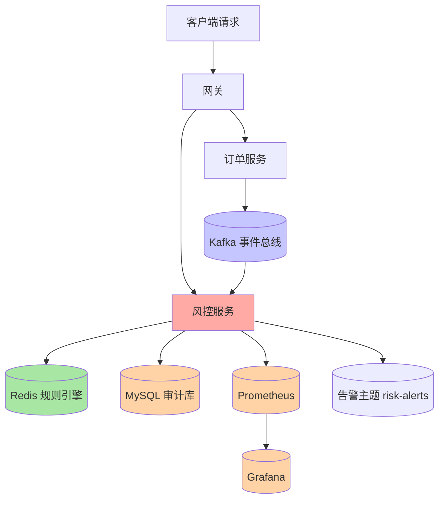
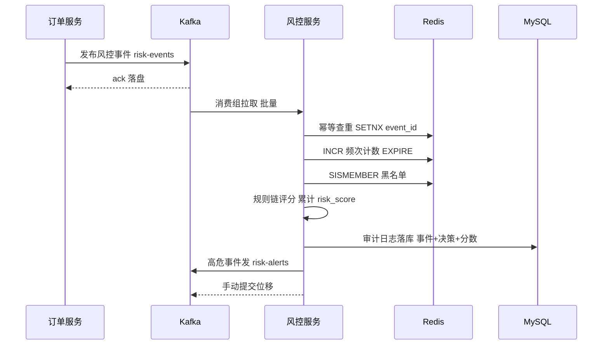
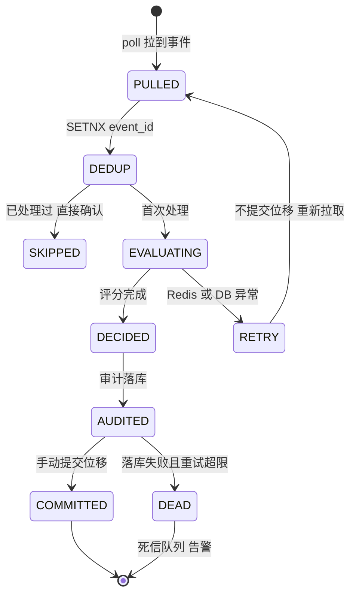
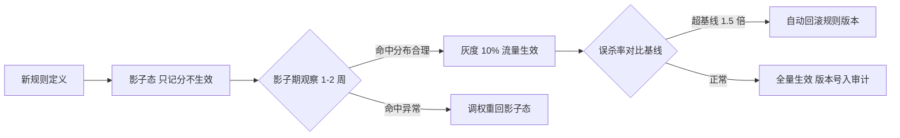
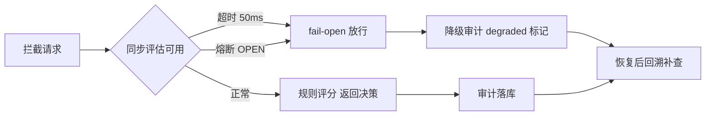

# Python 风控微服务 Demo

## 一句话摘要

从 Kafka 实时风控事件 → Redis 规则引擎评分 → MySQL 审计落库 → Prometheus/Grafana 监控：一条完整的企业级风控微服务链路，重点讲清「决策快慢分离」「规则引擎设计」「消费幂等与误判治理」三个风控系统的命门，并给出可执行的验证步骤与常见报错。

## 🎯 本文核心

**核心机制一句话**：实时风控的本质是「用内存级状态（Redis 计数/标签）对事件流（Kafka）做毫秒级规则评分」，架构上把「快决策」与「慢处理」分离——拦截决策走内存毫秒级完成，审计/通知/模型计算全部异步化，保证风控永不拖慢交易主链路。

**机制链**：订单服务发风控事件 → Kafka 解耦削峰 → 风控服务消费（幂等去重）→ Redis 规则引擎逐条评分（单笔阈值/频次计数/黑名单标签）→ 累计分数决策（放行/拒绝/人工审核）→ MySQL 审计日志落库 → 高危事件进告警主题 → Prometheus 指标 + Grafana 面板观测误杀率与延迟。

**失效边界**：这套规则引擎解决「可枚举的确定性风险」（频次/阈值/名单），不解决「隐蔽的变体风险」（养号团伙、行为仿冒）——后者需要特征工程与模型，规则只是风控体系的第一层而非全部。

## 一、架构全景



数据流是**异步事件驱动**：订单服务只负责「发事件」就返回，风控服务消费事件做评估。设计思想是「决策快慢分离」：需要**同步给出结论**的接口（下单前拦截）走独立的同步评估端点，而链路上的事件审计走异步消费——两条路径共用同一套规则引擎，但绝不互相阻塞。为什么这么设计？把风控逻辑内联进交易链路，风控抖一次交易抖一次，故障半径失控；事件化之后，风控服务整体宕机，交易照常进行（配合降级策略），损失的只是「这期间的审计与拦截」。

## 二、数据流全链路时序



时序里藏着风控链路的四个可靠性锚点：幂等查重（Kafka 至少一次投递的必然重复）、频次计数（带 TTL 的滑动行为画像）、手动提交位移（处理完才确认，防丢）、审计先行（任何决策必须留下证据链——风控拒了一笔交易，事后必须能回答「为什么」）。

## 三、服务 A：订单服务（事件生产端）

### 3.1 核心代码：发事件即返回

```python
import json, time
from fastapi import FastAPI
from kafka import KafkaProducer

app = FastAPI()

producer = KafkaProducer(
    bootstrap_servers=["kafka:9092"],
    value_serializer=lambda v: json.dumps(v).encode("utf-8"),
    acks="all",                   # 等全部 ISR 副本确认
    retries=3,
)

@app.post("/order")
async def create_order(order: OrderRequest):
    order_id = await db.insert_order(order)
    # 发事件不等待风控结果 交易主链路不被风控拖慢
    producer.send("risk-events", key=str(order.user_id).encode(), value={
        "event_id": f"{order_id}",       # 幂等键 消费端去重
        "user_id": order.user_id,
        "amount": order.amount_cents,
        "ts": time.time(),
    })
    return {"order_id": order_id, "status": "accepted"}
```

机制要点：`key=user_id` 让同一用户的事件落进同一分区——分区是 Kafka 并行与**顺序性**的最小单元，同一用户的频次计数要有序统计，key 路由是前提。`acks=all` 用一点延迟换「broker 端不丢」。

事件契约还有一条容易欠账的纪律：**schema 版本化**。事件体里带 `schema_version` 字段，新增字段只加不改不删——风控服务升级期间新旧两种事件并存（发布窗口内订单服务已新版、风控服务还旧版），消费端按版本号走兼容分支。没有版本号的事件契约，每次加字段都是一次全链路停机式升级，这在事件驱动架构里是最贵的返工。

## 四、服务 B：风控服务（核心）

### 4.1 Redis 规则引擎

```python
import json, time
import redis.asyncio as aioredis
from kafka import KafkaConsumer

r = aioredis.Redis(host="redis", port=6379, db=1, decode_responses=True)

RULE_WEIGHTS = {
    "amount_threshold": 30,     # 单笔超阈值
    "frequency_exceed": 40,     # 窗口内频次超限
    "risk_user_hit": 30,        # 黑名单命中
}
REJECT_SCORE = 60
REVIEW_SCORE = 40

async def evaluate(event: dict) -> dict:
    user_id, amount = event["user_id"], event["amount"]
    score = 0
    hits = []

    # 规则 1: 单笔金额阈值
    if amount > 100_00:          # 单位: 分
        score += RULE_WEIGHTS["amount_threshold"]
        hits.append("amount_threshold")

    # 规则 2: 10 分钟滑动窗口交易频次
    key = f"user:{user_id}:tx:10m"
    count = await r.incr(key)
    await r.expire(key, 600)
    if count > 5:
        score += RULE_WEIGHTS["frequency_exceed"]
        hits.append("frequency_exceed")

    # 规则 3: 风险用户名单
    if await r.sismember("risk_users", str(user_id)):
        score += RULE_WEIGHTS["risk_user_hit"]
        hits.append("risk_user_hit")

    decision = ("reject" if score >= REJECT_SCORE
                else "review" if score >= REVIEW_SCORE
                else "approve")
    return {"decision": decision, "score": score, "hits": hits}
```

规则引擎的设计思想有三条：①**规则与权重配置化**——权重表独立于代码，调阈值不改代码不发版；②**命中可解释**——`hits` 数组记录每条命中的规则，拒绝理由可追溯，这是审计合规的硬要求；③**规则链短路与否是性能旋钮**——命中即拒绝（短路）最快，但拿不到完整画像；全量评分信息最全。本 Demo 全量评分，因为审计价值高于毫秒差异。

### 4.2 消费主循环：幂等 + 手动位移 + 重试



```python
consumer = KafkaConsumer(
    "risk-events",
    bootstrap_servers=["kafka:9092"],
    group_id="risk-group",
    enable_auto_commit=False,          # 关键: 处理完才手动提交
)

async def consume_loop():
    while True:
        batches = consumer.poll(timeout_ms=500)
        for tp, records in batches.items():
            for msg in records:
                event = json.loads(msg.value)
                # 幂等: SETNX 成功才处理 防再平衡重复投递
                fresh = await r.set(f"evt:{event['event_id']}", 1, nx=True, ex=86400)
                if not fresh:
                    continue
                result = await evaluate(event)
                await save_audit(event, result)     # MySQL 审计
                if result["decision"] == "reject":
                    alert_producer.send("risk-alerts", value=msg.value)
            consumer.commit()                        # 批处理完才提交位移
```

**追问一：为什么频次计数用 `INCR + EXPIRE` 而不是窗口聚合表？**
固定窗口计数有两个已知误差（窗口边界的双倍计入），但在风控场景它是「够用的精度」：一次 INCR 是 O(1) 内存操作，百万用户级频次画像全部塞进内存；换成精确滑动窗口（ZSET 按时间戳淘汰）内存与延迟都上一个台阶。真相是：**风控规则要在「精度」与「毫秒级延迟」之间反复权衡，不是越精确越好**——需要精确窗口时只对高危用户升级到 ZSET 实现，分级而非一刀切。

**追问二：消费滞后了，风控还拦得住吗？**
异步事件风控的固有边界是「事后拦截」——事件消费完之前，风险交易已经发生。所以这套链路天然定位是「审计 + 事后管控 + 高频行为画像」；「下单前的实时拦截」必须走同步评估端点（复用同一个 `evaluate()`，HTTP 同步调用 + 熔断降级放行）。同步与异步两条链路共用规则引擎、各自选位——这正是「决策快慢分离」的完整含义。

### 4.3 同步评估端点：拦截路径的落地

```python
@app.post("/evaluate-sync")
async def evaluate_sync(event: RiskEvent):
    try:
        result = await asyncio.wait_for(evaluate(event.dict()), timeout=0.05)
        return {"code": "OK", **result}
    except (asyncio.TimeoutError, CircuitOpenError):
        # fail-open: 降级放行 但必须留下降级审计标记
        await save_audit(event.dict(), {"decision": "degraded_open", "score": -1})
        return {"code": "DEGRADED", "decision": "approve"}
```

拦截路径的三条纪律：①**超时预算 50ms 以内**（业内认知档位）——拦截发生在交易主链路上，风控多等一毫秒，下单 P99 就涨一毫秒；②**降级也审计**——fail-open 放行的每笔交易都带 `degraded_open` 标记，恢复后可回溯补查，降级不等于放弃记录；③**熔断器挂在评估内部**而不是整个端点上——Redis 慢和规则慢是两种故障，分开熔断才能精准降级。

## 五、监控：指标设计与高基数陷阱

```python
from prometheus_client import Counter, Histogram, Gauge

RISK_EVALS = Counter("risk_evals_total", "Risk evaluations", ["decision"])
RISK_LATENCY = Histogram("risk_latency_seconds", "Evaluate latency",
                         buckets=(.001, .005, .01, .025, .05, .1, .25, .5))
KAFKA_LAG = Gauge("risk_kafka_lag", "Consumer group lag")

async def monitored_evaluate(event: dict) -> dict:
    with RISK_LATENCY.time():
        result = await evaluate(event)
        RISK_EVALS.labels(decision=result["decision"]).inc()
        return result
```

指标设计的命门在 **label 基数**：`decision` 三个取值没问题；如果把 `user_id` 放进 label，百万用户就是百万条时间序列——Prometheus 内存打爆、查询超时，这是监控体系的经典事故源。用户维度的问题去日志里查（trace_id 关联），指标只留低基数维度。

Grafana 面板必备四块：评估延迟 P99（Histogram 分位）、决策分布（approve/review/reject 占比）、消费滞后（lag 曲线）、误杀率（人工复核翻案数 / reject 总数）。**误杀率是风控的核心业务指标**——拦错一个好客户的代价（流失 + 客诉）往往高于放过一个坏客户。

**追问三：规则阈值为什么不能拍脑袋上线？**
阈值定 100 分还是 60 分，直接影响误杀率与漏放率的平衡。正确姿势是**影子模式**：新规则先「只记录不生效」跑一到两周，拿真实流量看命中分布与翻案率，再灰度生效——直接上线等于拿生产用户做实验。

影子模式的完整发布流程：





## 六、三次事故复盘

**事故叙事一：消费组再平衡引发重复消费，频次计数翻倍误拦。** 线上扩容消费者实例触发再平衡，未提交位移的分区被重新投递，同一用户事件计了两次，「10 分钟 5 笔」的规则被 3 笔真实交易误触发拒绝。排查：审计表同一 `event_id` 双记录，时间差等于再平衡窗口。复盘：消费端补幂等层（SETNX event_id），位移改手动提交。教训：**Kafka 的至少一次语义下，重复是常态不是异常，幂等必须内建**。

**事故叙事二：高基数 label 打爆 Prometheus。** 某次改动把 `user_id` 加进了 Counter label，两小时后 Prometheus OOM 重启，监控全站黑窗。排查：时间序列数量曲线在改动点垂直跳升。复盘：指标 label 白名单化（code review 检查表加一项），用户维度排查走日志与临时查询。教训：指标系统对「维度爆炸」毫无防御，防御责任在写指标的人。

**事故叙事三：规则上线无灰度，误杀率一夜翻五倍。** 新增「跨设备登录 + 大额」组合规则，阈值拍脑袋定了低分，上线当晚拒绝率从 2% 跳到 11%（示例数据，业内认知量级），客服工单爆单。排查：审计表按规则聚合命中量，新规则命中占比异常。复盘：建立影子模式机制，新规则先观察后生效；误杀率纳入发布检查项，超基线自动回滚规则版本。教训：**规则即发布，发布必须有回滚与灰度**——把规则变更当代码发布管理。

## 七、数据存储选型与服务治理

| 存储 | 用途 | 选型理由 | 反方案对照 |
|---|---|---|---|
| Redis | 规则引擎状态（计数/名单/幂等） | 内存级读写，毫秒评分的前提 | 关系库存规则：多一跳 SQL，延迟不可接受 |
| MySQL | 订单 + 审计日志 | 事务与可查询，审计要按单号/用户检索 | 只写日志文件：不可结构化回查 |
| Kafka | 事件总线 | 削峰 + 分区并行 + 多消费组复用 | RabbitMQ：吞吐与回放能力弱一档 |

治理矩阵：

| 治理项 | 方案 | 风控特化说明 |
|---|---|---|
| 服务发现 | Nacos | 同订单支付 Demo |
| 熔断 | 出口调用套熔断器 | **风控熔断必须选 fail-open**：审计库挂了放行交易，不能因风控故障停交易 |
| 限流 | 令牌桶 | 同步评估端点按压测基线配置 |
| 幂等 | SETNX event_id + TTL | 至少一次投递的对价 |
| 监控 | Prometheus + Grafana | 误杀率是一级指标 |

fail-open 还是 fail-close 是风控系统的战略判断：交易可用性优先的风控（电商下单）选 fail-open——风控是「保险丝不是总闸」；监管强合规场景（支付反洗钱）必须 fail-close——宁可拒不可漏。这个选择没有技术答案，是业务性质决定的架构红线，必须在设计文档里显式写下。

## 八、参数级配置清单

| 配置项 | 默认值 | 分档推荐 | 为什么 |
|---|---|---|---|
| Kafka enable_auto_commit | true | false（手动） | 处理完才提交，防丢事件 |
| max.poll.records | 500 | 100-500 | 批量过大会拉高单批处理延迟 |
| 幂等键 TTL | 24h | ≥重复投递可能窗口 | 覆盖再平衡与重试周期 |
| 频次计数窗口 | 600s | 按业务 5-60min | 窗口越长画像越厚，内存越多 |
| Redis 计数 key 过期 | 随窗口 | 窗口×1.2 | 防边界残留累积 |
| 单笔金额阈值 | 业务定 | 影子模式校准 | 拍脑袋阈值是误杀之源 |
| 拒绝分数线 | 60 | 基于分数分布定 | 看影子期分数直方图再切 |
| 审计表分区周期 | 无 | 按月分区 | 审计表只增不减，分区是生命周期管理 |
| 审计归档保留 | 永久 | 热 3 月 + 冷归档 | 合规要求与存储成本的平衡 |
| Grafana 误杀率告警阈值 | 无 | 基线×1.5 | 翻案率跳升即规则异常 |

## 九、步骤级操作：把 Demo 跑起来

**前置条件**：Docker 与 docker compose 就绪；Python 3.10+；端口 9092/6379/3306/3000 未占用。

1. **起依赖**：`docker compose up -d kafka redis mysql prometheus grafana`
   - 验证：`docker compose ps` 全部 healthy；Grafana `http://localhost:3000` 可登录。
2. **建表**：`alembic upgrade head`（审计表 `risk_audit_logs` 存在且按月分区）。
3. **造名单**：`redis-cli SADD risk_users 10086`
   - 验证：`redis-cli SISMEMBER risk_users 10086` 返回 1。
4. **起服务**：订单服务 `uvicorn orders.app:app --port 8000`；风控消费端 `python -m risk.consumer`。
5. **下单触发**：`curl -s -X POST localhost:8000/order -H 'Content-Type: application/json' -d '{"user_id":10086,"amount_cents":20000,"quantity":1}'`
   - 验证：`redis-cli GET user:10086:tx:10m` 计数递增；`SELECT decision, score, hits FROM risk_audit_logs ORDER BY id DESC LIMIT 1` 可见 `reject` 与命中规则数组。
6. **验证幂等**：用 kafka 脚本向 `risk-events` 重发同一 `event_id`。
   - 验证：审计表不出现第二条记录（SETNX 挡下）。
7. **看板验证**：Grafana 面板出现 `risk_evals_total{decision="reject"}` 增长与延迟分位曲线。
8. **回退**：规则权重表从配置中心回滚上一版本；消费端回退上一发布版本；Redis 计数脏数据按 `user:*:tx:*` 模式清理（演示环境可直接重置）。

### demo 验证点与常见报错

| 报错现象 | 根因 | 处置 |
|---|---|---|
| 消费端无输出无报错 | topic 不存在或 group 已消费完 | 用控制台消费者从头验证数据在不在 |
| NoBrokersAvailable | kafka 未就绪即启动 | compose healthcheck + depends_on，启动加重试 |
| 计数远大于真实下单数 | 重复投递未去重（幂等缺失） | 检查 SETNX 逻辑与 event_id 生成唯一性 |
| 审计表无记录但 Redis 有计数 | save_audit 抛错被吞 | 异常必须记日志并告警，禁止裸 except |
| Prometheus 目标 down | /metrics 端口未暴露 | 检查 prometheus_client 启动端口与抓取配置 |
| Grafana 无数据 | label 拼写不一致 | 对比指标名与查询语句逐字符核对 |

💡 **实战提示**：Demo 阶段就把「审计先行」立为铁律——每条评估结果都带事件原文、命中规则、分数与决策入 MySQL。风控系统的公信力建立在「每个决定都能回放」上，审计缺失的风控等于裸奔。

## 十、与订单支付 Demo 的对比：两种事件架构的对照

| 维度 | 订单支付 Demo | 风控 Demo |
|---|---|---|
| 数据流 | 同步请求链路 + 事件补偿 | 异步事件流 + 同步评估旁路 |
| 中间件 | RabbitMQ（逐条可靠投递） | Kafka（分区并行 + 回放） |
| 状态管理 | 状态机守卫（订单/支付单） | 内存画像（计数/名单/幂等键） |
| 一致性要求 | 资金最终一致，不可丢 | 允许降级放行，审计不可丢 |
| 监控重点 | 消息积压、状态不一致 | 误杀率、评估延迟、消费滞后 |
| 降级策略 | 熔断 + 兜底响应 | fail-open 放行 + 审计补记 |

**反方案分析：为什么风控不用订单支付 Demo 的 RabbitMQ 方案？** 风控事件有三个特质：量大（每笔交易一条）、允许回放（规则升级后重放历史事件验证）、需要多消费组（实时引擎/离线模型/归档各消费一份）——这三点正是 Kafka 分区日志模型的主场，RabbitMQ 的队列模型消费即删除，回放与多组订阅都别扭。反过来，订单支付的消息是「一笔一笔必须可靠投递的业务单据」，逐条 confirm 与死信更对口。**消息中间件按语义选型，不按热度选型。**

## 十一、不同量级的思考：架构约束驱动解法

- **十万级（日事件十万，峰值几十 QPS）**：单实例消费 + Redis 单点 + 审计直写 MySQL 就是最优解，规则引擎跑在应用内存里。约束来源是单机内存与单消费者吞吐；思考方式是「规则先行驱动」——先把规则与审计闭环跑通。这一档的核心问题是「规则与审计闭环了吗」，而不是「架构够不够流式」
- **百万级（日事件百万，峰值数百 QPS）**：Kafka 分区扩容 + 消费者组并行 + Redis 主从，同步评估端点独立部署。约束来源是分区并行度与 Redis 单点容量；思考方式是「并行分片驱动」——分区数决定消费并行上限，key 路由决定画像分片。这一档的核心问题是「分片键与分区数匹配吗」，而不是「消费实例再加几个」
- **千万级（峰值数千 QPS）**：规则分层（毫秒级内存规则 + 秒级准实时聚合 + 离线模型异步修正）、审计写入改批量管道、特征计算外移到流处理引擎。约束来源是规则数量膨胀后的评估耗时与审计写盘吞吐；思考方式是「快慢分层驱动」。这一档的核心问题是「评估耗时还在毫秒级吗」，而不是「规则还能再加几条」
- **亿级（日事件过亿，峰值万级 QPS）**：实时特征平台（特征预计算 + 内存服务化）、单元化部署（按用户分片闭环）、多活容灾、模型与规则混合决策引擎。约束来源是跨机房延迟与特征状态的容量规模；思考方式是「特征服务化驱动」——把「事件来了才算」变成「特征常备、来了就查」。这一档的核心问题是「特征是查出来的还是算出来的」，而不是「Kafka 再扩多少分区」

**自下而上与触发升级**：先测档位再选架构——日事件量、峰值 QPS、消费滞后、评估延迟 P99 四个实测值决定站在哪一档。触发升级的信号：消费滞后常态化为正、规则评估延迟逼近 10ms、单规则引擎内存超半——任一出现就升级（规则先行 → 并行分片 → 快慢分层 → 特征服务化）。锚点始终是约束来源：内存容量/分区并行/评估耗时/跨机房物理约束变了，架构才跟着变。

## 十二、跨周期视角：风控体系的三段演进

跨周期看，规则引擎不是终点而是起点：第一阶段「规则风控」（本 Demo）解决可枚举风险；第二阶段「规则 + 模型」用机器学习补变体识别（公开口径的行业普遍路径）；第三阶段「实时特征平台」把特征计算与决策服务解耦，规则与模型共用特征层。**每一阶段的产出都是下一阶段的输入**：本 Demo 的审计日志就是未来模型的训练样本——审计 schema 里把特征快照（当时的计数/标签值）一起存下来，未来训练模型就不用从日志里考古。

## 什么时候用 / 什么时候不用

**明确推荐这套链路**：交易后审计与行为画像（频次/名单类规则）、需要事件回放与多消费组、误杀可容忍但漏报审计必须有——三个特征同时满足时，Kafka + Redis 规则引擎是标准答案。

**不适用**：①下单前毫秒级强拦截是唯一诉求——直接做同步规则服务，事件链路是画蛇添足；②监管强合规必须 fail-close 的场景——本 Demo 的 fail-open 降级前提不成立，架构要重排；③风险形态以复杂行为模式为主、规则枚举不动——直接上模型平台，规则只做兜底。

## Trade-off：取舍明细

- **fail-open vs fail-close**：可用性优先还是合规优先，无技术解，业务红线决定，必须显式决策。
- **内存计数精度 vs 延迟**：固定窗口买毫秒级，付的是边界误差；高危场景升级精确窗口，分级处理。
- **规则短路 vs 全量评分**：短路买延迟，付的是画像完整性与可解释性；审计型场景选全量。
- **Kafka vs RabbitMQ**：回放与吞吐 vs 逐条可靠与路由灵活，按事件语义选。
- **规则 vs 模型**：规则可解释可热更但枚举有限；模型泛化强但黑盒且依赖样本积累——成熟的体系两者共存，规则兜底、模型增效。

## 你们可能会问

**Q1：规则热更新怎么做？**
权重与阈值放配置中心（Nacos），服务监听变更热加载；规则版本号写进审计记录，出问题一键回滚上一版本。核心纪律：**规则变更 = 发布行为**，要有灰度、观察期与回滚预案，见事故叙事三。

**Q2：误杀的客户怎么救？**
两级机制：决策里留 `review` 中间态（低分拒绝进人工复核而非直接拒绝）；复核翻案后把样本回流（「这类特征组合不该拦」），作为阈值校准与未来模型样本。误杀处理链路是风控系统的自我纠错机制，没有它规则只会越调越死。

**Q3：Redis 挂了风控怎么办？**
按 fail-open 红线降级：评估请求短超时（如 50ms）+ 熔断，超时即放行并补记「降级评估」审计标记。注意幂等键也依赖 Redis——降级期间用「审计库唯一索引」兜底去重，宁可重复评估不可重复资损。

**Q4：审计表按月分区具体怎么做？**
MySQL 原生 RANGE 分区按月切，查询带时间条件走分区裁剪；过期分区 `DROP PARTITION` 秒级完成（对比 DELETE 千万行的小时级），归档任务把到期分区搬到冷存储。审计表的生命周期管理必须在建表日设计，事后改造是大工程。

**Q5：一次评估要查多次 Redis，延迟会不会叠加？**
会——规则越多往返越多，所以千万级档位（量级思考节）的解法是规则合并取数：一次 pipeline 把计数/名单批量取回，内存里跑评分逻辑；进一步把热点画像做成本地缓存 + 失效订阅。优化原则与所有存储调用一致：先砍往返次数，再压单次耗时。

## 5W 速记卡

| 维度 | 内容 |
|---|---|
| What | Kafka 事件流 + Redis 规则引擎 + 审计落库 + 指标监控的实时风控链路 |
| Why | 风控逻辑内联交易链路会互相拖垮，事件化实现快慢分离 |
| When | 交易后审计/行为画像/名单频次类风险；强拦截与强合规另有架构 |
| Who | 订单服务管事件生产，风控服务管评分审计，复核团队管误杀翻案 |
| How | 事件 key 路由 → 幂等消费 → 规则评分 → 审计先行 → 影子上规则 |

## 自测三问

1. 为什么消费端必须幂等？（答案：Kafka 至少一次投递 + 再平衡重复投递是常态；SETNX event_id 去重，重复评估会放大频次计数造成误拦）
2. 风控熔断为什么必须 fail-open？（答案：风控是保险丝不是总闸，审计库故障不能停交易；强合规场景反向选择 fail-close——这是业务红线不是技术偏好）
3. 新规则为什么要影子模式？（答案：阈值影响误杀率与漏放率，拍脑袋上线等于拿生产用户做实验；影子期拿真实流量看命中分布，校准后再灰度生效）

## 开放问题

- 规则引擎与模型引擎的决策权边界怎么划——模型分占决策权重多少，翻案责任算谁的，行业尚无定论。
- 审计数据「合规保留期」与「存储成本」的矛盾随量级放大，冷热分层自动化到什么程度算够，值得持续观察。

## 🎯 核心带走

**30 秒复述**：风控 Demo 的骨架是「快慢分离的事件化风控」：订单服务发事件即返回，Kafka 分区并行投递，风控服务幂等消费后在 Redis 上跑毫秒级规则评分（阈值/频次/名单三件套），审计先行落 MySQL，误杀率与滞后进 Grafana。**失效点**：规则引擎枚举不了变体风险；消费滞后决定它是事后审计而非实时拦截；fail-open 红线搞反就是事故。**三条铁律**：审计先行（每个决定可回放）；幂等内建（重复是常态）；规则即发布（灰度 + 回滚）。

## 📌 数据与事实声明

- 本文机制描述基于 Kafka（kafka-python）、redis-py、prometheus_client、MySQL 官方文档与通用风控工程实践。
- 配置数值（窗口 10 分钟、分数线 60、延迟分桶等）为业内认知常见档位，须按业务数据校准，以官方文档与实测为准。
- 三次事故叙事为生产环境常见案例的抽象化重构，不含任何真实公司、系统与个人信息。
- fail-open/fail-close、影子模式、消费组再平衡等术语为公开口径的行业通用提法。

## 📚 参考资料

| 资料 | 说明 |
|---|---|
| Apache Kafka 文档 https://kafka.apache.org/documentation/ | 分区模型、消费组与位移提交 |
| kafka-python https://kafka-python.readthedocs.io/ | Consumer/Producer 参数机制 |
| redis-py https://redis-py.readthedocs.io/ | 异步客户端与 INCR/SETNX 原子操作 |
| prometheus_client https://github.com/prometheus/client_python | 指标类型与 label 基数实践 |
| Grafana 文档 https://grafana.com/docs/ | 面板与告警配置 |
| MySQL 分区文档 https://dev.mysql.com/doc/refman/8.0/en/partitioning.html | RANGE 分区与分区裁剪 |
| Microservices.io 事件模式 https://microservices.io/ | 事件驱动架构模式（公开资料） |
