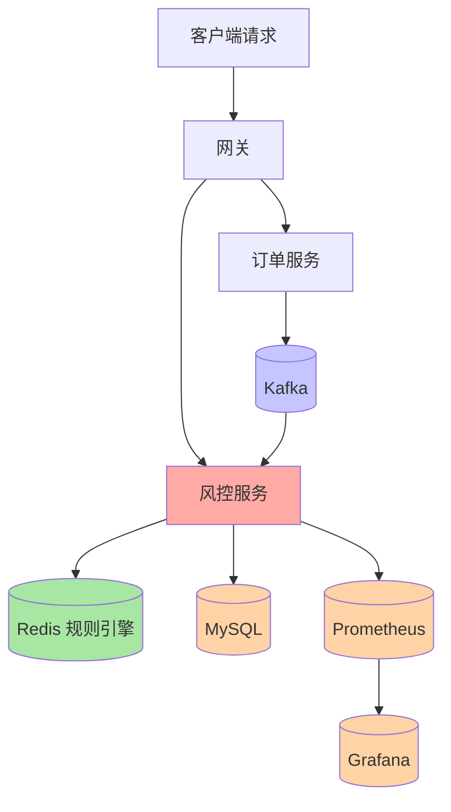

# Python 风控微服务 Demo

## 一句话摘要

从 KafKa 实时风控 → Redis 规则引擎 → MySQL 持久化 → Grafana 监控：一个完整的企业级风控微服务链路。

## 架构全景



## 服务 A：订单服务

### 职责

- 接收订单请求
- 写入 MySQL
- 发送风控事件到 Kafka

### 核心代码

```python
from fastapi import FastAPI
from kafka import KafkaProducer
import json

app = FastAPI()
producer = KafkaProducer(
    bootstrap_servers=['localhost:9092'],
    value_serializer=lambda v: json.dumps(v).encode('utf-8')
)

@app.post("/order")
async def create_order(order: OrderRequest):
    # 1. 写入数据库
    order_id = db.insert_order(order)

    # 2. 发送风控事件
    producer.send('risk-events', {
        'order_id': order_id,
        'user_id': order.user_id,
        'amount': order.amount,
        'timestamp': time.time()
    })

    return {'order_id': order_id, 'status': 'pending_risk'}
```

## 服务 B：风控服务（核心）

### 职责

- 监听 Kafka 风控事件
- Redis 规则引擎实时判断
- 高风险 → 拦截 / 低风险 → 放行
- 写入 MySQL 审计日志

### 核心代码

```python
from fastapi import FastAPI
from kafka import KafkaConsumer
import redis
import json

app = FastAPI()
r = redis.Redis(host='localhost', port=6379, db=1)
consumer = KafkaConsumer(
    'risk-events',
    bootstrap_servers=['localhost:9092'],
    group_id='risk-group'
)

def evaluate_risk(event: dict) -> RiskResult:
    """Redis 规则引擎"""
    user_id = event['user_id']
    amount = event['amount']

    # 规则 1：单笔金额 > 阈值
    risk_score = 0
    if amount > 10000:
        risk_score += 30

    # 规则 2：用户 10 分钟交易次数
    key = f"user:{user_id}:tx_count"
    count = r.incr(key)
    r.expire(key, 600)
    if count > 5:
        risk_score += 40

    # 规则 3：风险用户标签
    if r.sismember("risk_users", str(user_id)):
        risk_score += 30

    return RiskResult(
        risk_score=risk_score,
        decision="reject" if risk_score >= 60 else "approve"
    )

@app.on_event("startup")
async def startup():
    for msg in consumer:
        event = json.loads(msg.value)
        result = evaluate_risk(event)

        # 写入审计日志
        db.insert_audit_log(event, result)

        # 高风险通知
        if result.decision == "reject":
            producer.send('risk-alerts', {**event, 'score': result.risk_score})
```

## 数据存储选型

| 存储 | 用途 | 选型理由 |
|---|---|---|
| Redis | 规则引擎 + 计数 | 内存级实时判断 |
| MySQL | 订单 + 审计日志 | 持久化 + 可查询 |
| Kafka | 事件总线 | 解耦订单→风控 |

## 服务治理

| 治理项 | 方案 | 说明 |
|---|---|---|
| 服务发现 | Nacos | 服务注册与发现 |
| 熔断 | 自定义熔断器 | 风控依赖 DB 降级 |
| 限流 | 令牌桶 | 防突发流量 |
| 监控 | Prometheus + Grafana | 实时指标 + 告警 |

## 监控指标

```python
from prometheus_client import Counter, Histogram

RISK_REQUESTS = Counter('risk_requests_total', 'Total risk evaluations')
RISK_LATENCY = Histogram('risk_latency_seconds', 'Risk eval latency')
RISK_REJECTS = Counter('risk_rejects_total', 'Total rejections')

@app.post("/evaluate")
async def evaluate(event: RiskEvent):
    with RISK_LATENCY.time():
        RISK_REQUESTS.inc()
        result = evaluate_risk(event)
        if result.decision == "reject":
            RISK_REJECTS.inc()
        return result
```

## 生产踩坑

1. **Kafka 消费者偏移量提交**：手动提交 + 幂等消费，避免重复处理
2. **Redis 规则引擎内存增长**：用户计数 key 设置过期时间（10 min）
3. **风控误判**：规则阈值需要 A/B 测试验证，不可用固定阈值上线
4. **MySQL 审计表膨胀**：按月分区 + 归档策略
5. **Prometheus 指标基数**：避免高基数 label（如 user_id）

## 量级考量

| 量级 | 架构 |
|---|---|
| < 100 QPS | 单实例 + Redis 单节点 |
| 100-1000 QPS | 2-3 实例 + Redis 主从 |
| > 1000 QPS | K8s 弹性伸缩 + Kafka 分区扩展 + Redis Cluster |

## 与订单支付 Demo 的对比

| 维度 | 订单支付 Demo | 风控 Demo |
|---|---|---|
| 数据流 | 同步请求链路 | 异步事件链路 |
| 中间件 | RabbitMQ | Kafka |
| 规则引擎 | 无 | Redis 规则引擎 |
| 监控 | 基础日志 | Prometheus + Grafana |
| 降级策略 | 熔断 | 熔断 + 降级放行 |

## 📌 数据与事实声明

- Demo 基于企业级 Python 实践
- 踩坑来自生产环境经验
- 监控指标基于 Prometheus 客户端库标准用法