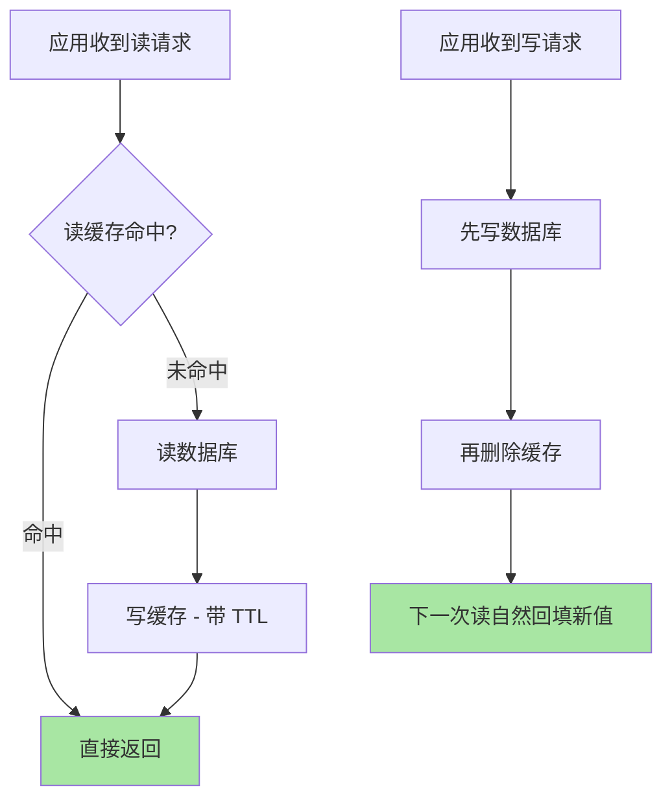
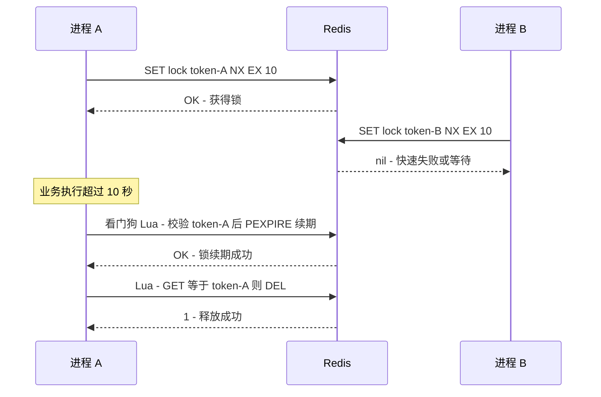
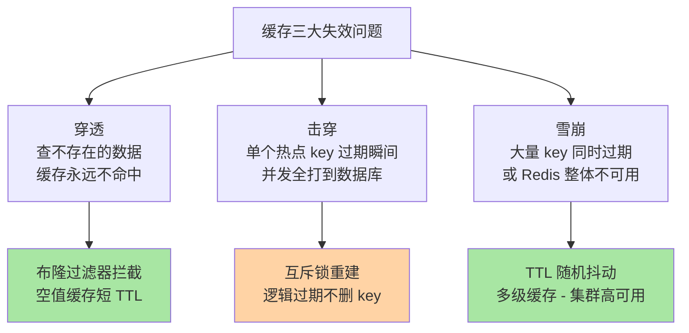

# Python 连接 Redis：缓存与分布式锁

> 入门篇讲过「怎么连上 Redis」，本篇从 Python 视角把两条最核心的链路挖到机制层：**缓存（Cache-Aside 及其一致性边界）**与**分布式锁（原子性与续期语义）**——生产事故的高频案发地都在这两条链路的细节里。GIL 之下 redis-py 怎么并发、连接池为什么是纪律而非选项、Lua 脚本为什么是原子性的最后防线，是 Python 侧与 Java 侧差异最大的地方。

## 一句话摘要

Python 操作 Redis 的正确姿势 = **redis-py 连接池 + Cache-Aside 缓存模式 + SET NX EX 单命令分布式锁 + Lua 脚本兜底原子性**。缓存的核心矛盾是一致性窗口（删缓存还是更新缓存、先写谁后删谁），锁的核心矛盾是原子性（加锁/解锁/续期三步各有竞态）——两件事的解法都收敛到一句话：**把多步操作压成单命令或 Lua 原子块，把 Redis 单线程模型变成你的护城河，而不是踩进「Python 多线程 + 非原子命令」的竞态陷阱**。

## 🎯 本文核心

**核心一句话：Python 集成 Redis 的全部难点，是「redis-py 客户端语义」与「Redis 单线程原子性边界」的对齐——连接池管的是 GIL 下的并发借用纪律，Cache-Aside 管的是一致性窗口的取舍，分布式锁管的是「SET NX EX + 唯一 token + Lua 释放 + 看门狗续期」四件套，任何一步退化为「两步命令」都会把单线程的原子护城河变成竞态事故现场。**

机制链（全文挂这条链上）：连接池与 GIL → 命令执行的源码关键路径 → Cache-Aside 与一致性窗口 → 分布式锁四件套 → 穿透/击穿/雪崩三问题 → 量级演进与选型边界。

## 5W 速记卡

| 维度 | 一句话 |
|---|---|
| What | redis-py 连接池 + Cache-Aside 缓存 + SET NX EX/Lua 分布式锁 |
| Why | 缓存挡读压力、锁挡并发写冲突，两者都依赖 Redis 单线程原子性 |
| When | 读多写少的数据上缓存；跨进程互斥上分布式锁；纯单进程用 threading 锁就够 |
| Where | Python 应用与 Redis 之间的连接池、Lua 脚本、Cluster 客户端三层 |
| How | 单命令原子化 + 唯一 token + TTL 抖动 + 布隆过滤器 + 看门狗续期 |

## 一、连接池：GIL 之下的并发借用纪律

Python 的 redis-py 客户端是线程安全的——但线程安全不是白来的，它建立在**连接池**之上：每个线程执行命令前从池里借一条独占连接，用完归还。GIL 保证了同一时刻只有一个线程在执行 Python 字节码，但网络 I/O 会释放 GIL，所以「借连接 → 发命令 → 收响应 → 还连接」这个序列必须是原子的（对单条连接而言）——redis-py 用连接对象内部的锁做到了这一点。

业内惯例（生产中）是连接池参数全配齐，而不是用默认值裸跑：

```python
import redis

pool = redis.ConnectionPool(
    host="localhost", port=6379, db=0,
    max_connections=200,          # 池上限，参照「线程数 x 峰值并发命令数」估算
    socket_timeout=2,             # 读写超时：没有它一条慢命令就能挂住一个线程
    socket_connect_timeout=1,     # 建连超时：Redis 抖动时快速失败
    health_check_interval=30,     # 每 30 秒空闲后复用前先 PING 探活
    decode_responses=True,        # 返回 str 而不是 bytes，省掉到处 decode
    retry_on_timeout=True,
)
r = redis.Redis(connection_pool=pool)
```

三个参数各管一种生产事故：`socket_timeout` 缺失 → Redis 抖动时线程池被慢命令占满、整个应用雪崩；`health_check_interval` 缺失 → 服务端 `timeout` 断开空闲连接后，客户端拿到的是死连接，报 `ConnectionError`；`max_connections` 低于并发需求 → 抛 `MaxConnectionsError`（池耗尽），它是连接「用完不还」的直接信号。

为什么不选「每次操作都 `redis.Redis(host=...)` 新建连接」？——新建 TCP 连接要三次握手 + AUTH + SELECT，单次毫秒级开销（业内认知），在每秒上万次命令的路径上，建连开销会反超命令本身；而且 Redis 的最大连接数有限（`maxclients` 默认 10000，公开口径），每次新建等于把客户端的泄漏风险直接传导给服务端。

### 源码/关键路径：一条命令的完整旅程

`r.get("key")` 在 redis-py 内部的关键路径（v5.x 源码）：

```text
Redis.get()
  -> Redis.execute_command()          # 组装命令参数
  -> ConnectionPool.get_connection()  # 借连接：池有空闲则复用，否则新建（受 max_connections 约束）
  -> Connection.send_command()        # 序列化成 RESP 协议写入 socket
  -> Connection.read_response()       # 读响应并解析；遇到 ConnectionError 按策略重连重试
  -> ConnectionPool.release()         # 归还连接（finally 语义，异常也归还）
```

两个值得记住的源码细节：**一是归还发生在 `finally`**，所以正常用法下连接不会漏还——漏还几乎都发生在「自己直接操作 `pool.get_connection()` 却忘了 release」的非常规用法里；**二是 redis-py 的 Pipeline 默认也是池化的**，`pipeline()` 作为上下文管理器退出时自动 reset 并归还，事务版 `pipeline(transaction=True)` 会在执行时包一层 MULTI/EXEC——但注意 MULTI/EXEC 只保证「命令连续执行不被插队」，不保证「执行中途失败自动回滚」，Redis 没有 rollback 语义，这是它与关系型数据库的本质区别。

### 追问链：原子性到底由谁保证？

**追问一：SET NX EX 为什么必须一条命令？** 老写法是 `SETNX key` 成功后再 `EXPIRE key 10`——两条命令之间客户端可能崩溃，锁就变成无过期时间的死锁。`SET key token NX EX 10` 在服务端一次判定完成「不存在才设置 + 带过期」，把竞态窗口压缩为零。

**再深一层：Lua 脚本为什么是原子的？** Redis 事件循环是单线程的，一条 Lua 脚本在服务端作为一个整体执行，期间不会插入其他客户端的命令——所以「判断 token 是我的，然后删除」这类多步逻辑放进 Lua，就等价于单条原子命令。Python 侧用 `r.eval(script, 1, lock_key, token)` 提交，脚本本身用 `EVALSHA` 缓存执行更省带宽。

**打破砂锅问到底：单线程为什么还能扛住万级 QPS？**（公开口径：单实例 10 万级 QPS 是业内认知）——因为 Redis 的瓶颈通常在网络 I/O 与内存操作，不在 CPU；单线程消灭了锁竞争与上下文切换，把复杂度从「并发控制」转移到了「每条命令必须快」。这也解释了为什么 KEYS、HGETALL 大 key 会拖垮整个实例：它们慢的不是自己，而是把所有客户端的命令都堵在了后面。

## 二、Cache-Aside：一致性窗口的取舍

Cache-Aside（旁路缓存）的读写路径，Python 应用是缓存与数据库之间的协调者：



标准答案「先写数据库，再删缓存」背后是两步取舍。**第一问：为什么不选「更新缓存」而选「删除缓存」？**——更新缓存存在两个问题：一是并发写时两个写请求的缓存更新顺序可能与数据库提交顺序相反（写 A 到 DB、写 B 到 DB、B 先更缓存、A 后更缓存 → 缓存里是 A 的旧值），二是「写了但没人读」的数据白白占内存。删除是惰性回填：让下一次读来决定要不要进缓存，把一致性问题转化为「一次未命中的代价」。

**第二问：先删缓存再写数据库行不行？**——不行，它把不一致窗口放到最大：删完缓存到数据库提交之间，任何读请求都会把旧值回填进缓存，且这个旧值会一直活到 TTL 过期。「先写 DB 再删缓存」的坏情况只有一个极窄的窗口（读请求在未命中后、写缓存前，恰好插进一个并发写），概率低但不是零——这就是**延时双删**的由来：写库 → 删缓存 → 延迟几百毫秒再删一次，把极端并发下被回填的脏值清掉。延迟时长按「业务读路径耗时」估，通常数百毫秒级，用延迟任务/消息队列实现而不是 `time.sleep` 占住工作线程。

TTL 的两个纪律：**所有 key 必须带 TTL**——没有过期时间的缓存等于把一致性完全押在「每次写都记得删缓存」上，而删缓存逻辑漏一个入口（旁路更新、批量任务直改 DB）就会出现永久脏值；**同批 key 的 TTL 加随机抖动**——`ttl = base + random.randint(0, 300)`，否则同批预热的数据会同时过期，为雪崩埋雷。

## 三、分布式锁：SET NX EX 只是第一行

redis-py 提供的 Lock 类把锁的正确语义封装好了，但参数含义必须吃透：

```python
lock = r.lock(
    "order:lock:123",
    timeout=10,            # 锁自动过期时间：持有者崩溃后的自动释放兜底
    blocking=True,         # 抢不到锁时是否阻塞等待
    blocking_timeout=5,    # 最多等 5 秒，超时返回 False（没有它 = 无限等待 = 线程堆积）
    sleep=0.1,             # 自检间隔
    thread_local=True,     # token 存线程局部，保证谁加锁谁解锁
)
if lock.acquire():
    try:
        do_business()
    finally:
        lock.release()     # 内部是 Lua：token 匹配才删
```

**锁的原子性三件套**：加锁用 `SET key token NX EX`（token 必须唯一，redis-py 用 UUID）；释放必须走 Lua 的「比较 token 再删」，不能直接 `DELETE`；业务超时要有**续期**（看门狗）。

### 事故复盘：一次「删错锁」的排查记录

某次生产环境中，订单服务偶发「同一订单被处理两次」。排查路径：先查幂等日志，发现两个不同机器的进程在同一秒都认为自己持有锁；再查锁的释放日志，发现进程 A 的锁过期后，进程 B 加锁成功，随后 A 执行完业务调用 `r.delete(lock_key)` 把 B 的锁删了——之后进程 C 又加锁成功，形成 A/B/C 三个进程同时进临界区的连锁。复盘结论：释放锁没有校验持有者 token，`DELETE` 变成了「删别人的锁」。修复动作：释放统一换成 Lua 比较删除，同时给临界区业务加上执行耗时监控。这个案例的教训可以浓缩成一句：**锁的正确性 = 原子性 + 持有者标识 + 生命周期管理，三者缺一，锁只是「大概率的互斥」**。

另一类高频事故是**锁过期但业务没跑完**：临界区里有慢 RPC，10 秒锁超时先到，锁自动释放，第二个进程进入临界区。解法是续期看门狗——持有锁的线程内起一个定时任务，每 `timeout/3` 检查业务是否还在执行，在则用 Lua「校验 token 后 PEXPIRE 续期」。redis-py 的 Lock 提供 `lock.extend(additional_time)` 方法做续期原语，看门狗的调度逻辑要自己写（或评估 `python-redis-lock` 这类带自动续期的封装）。追问：为什么不直接把 timeout 设到 10 分钟？——因为持有者真崩溃时，所有人都要陪等 10 分钟，锁的可用性崩塌；timeout 的本质是「故障检测时间」，按「业务 P99 耗时的若干倍」定，而不是拍脑袋放大。

**用 Lua 释放锁的完整写法**（理解原理建议手写一遍）：

```python
RELEASE_LUA = """
if redis.call('GET', KEYS[1]) == ARGV[1] then
    return redis.call('DEL', KEYS[1])
else
    return 0
end
"""
result = r.eval(RELEASE_LUA, 1, "order:lock:123", my_token)
```

### 反方案分析：Redlock 为什么不选、什么时候才选

**为什么不选「上来就用 Redlock」？** Redlock 向 N 个独立 Redis 实例依次加锁、多数派成功才算持有，目的是抗单点故障。代价账单：N 次网络往返让加锁延迟翻 N 倍；时钟漂移与进程暂停（GC 停顿、VM 迁移）仍可能让「锁已过期但客户端不知道」，业内对 Redlock 的安全性争议是公开讨论（公开报道）；而绝大多数业务锁的场景（防重复下单、防并发任务重复跑）用「单实例锁 + 唯一 token + 看门狗续期 + 下游幂等」已经足够——**正确性由幂等兜底，锁只负责降低冲突概率**。什么时候才选 Redlock：互斥错误代价极大、又没有条件上 ZooKeeper/etcd 这类强一致协调服务、且能接受加锁延迟时。

**为什么不选「数据库锁/应用内锁」替代？** 单进程内 `threading.Lock` 只管本进程，多实例部署立即失效；数据库乐观锁（版本号）能保证正确性但冲突时全部回滚重试，热点行上代价高——两者与 Redis 锁不是替代关系而是分层关系：进程内锁管线程互斥，数据库约束（唯一索引）管最终一致性兜底，Redis 锁管跨进程冲突的快速失败。



### 设计思想：单线程哲学与客户端义务

Redis 的设计哲学是「快而简单」：单线程事件循环消灭服务端并发控制，把原子性的责任前移到「命令设计」——每个命令天生原子，复杂原子性靠 Lua 组合。这套设计思想的另一面是：**服务端不做任何客户端的保姆**——不校验锁的持有者、不帮你合并网络往返、不替你处理竞态。所以 Python 客户端（以及使用它的应用架构）必须自己补上三件服务端故意不做的事：唯一 token 标识持有者、Lua 脚本组合多步原子逻辑、看门狗管理生命周期。理解了这个分工，就理解了为什么「redis-py 用法错误」的爆炸半径是全局的：上下游所有依赖这把锁或这个缓存的服务，都会被一条慢命令、一把删错的锁连坐。

## 四、穿透、击穿、雪崩：三个问题一张图

三种缓存失效场景的机制与对策各不相同，混为一谈是排查时的常见弯路：



- **穿透**：请求的 key 在数据库里也不存在，缓存永远无法回填。对策是布隆过滤器（`redisbloom` 模块或 Redis 位图自实现）前置拦截「一定不存在」的请求，配合空值缓存（把「查无此数据」也缓存住，TTL 给短，比如 60 秒）。
- **击穿**：热点 key 过期瞬间的并发回源。对策是互斥重建——回源前先抢一把 `SET NX EX` 锁，抢到的去查库回填，没抢到的自旋短等后重读缓存；或用「逻辑过期」：key 永不过期，值里带过期时间，读到过期值时异步重建、请求先返回旧值。
- **雪崩**：大批 key 同时过期或 Redis 实例宕机，流量整体砸向数据库。前者用 TTL 随机抖动化解，后者靠部署层高可用（主从 + 哨兵，本系列下一篇展开）与应用侧降级（限流 + 读库熔断）兜底。

💡 **实战提示：Pipeline 不是事务**。`pipeline()` 把多条命令打包成一次网络往返，吞吐提升一个量级（业内认知），但没有原子性也没有事务语义——需要「要么都执行要么都不执行」时用 `pipeline(transaction=True)`（MULTI/EXEC），需要「判断后再写」的原子逻辑时用 Lua。三种手段的强度依次递增，代价也递增。

💡 **实战提示：大 key 是 Python 侧最常见的隐雷**。把整个列表/字典 JSON 序列化后塞进一个 String key，读写都是全量传输，序列化还占着 GIL——单 key 几 MB 就足以造成毫秒到十毫秒级的尾延迟（业内认知）。拆分字段、用 Hash 分桶、控制单 key 在 KB 量级，是接入评审的固定检查项。

💡 **实战提示：Cluster 模式下多 key 命令受同槽限制**。`MGET`/Pipeline 跨槽会报 `CROSSSLOT` 错误；redis-py 的 `RedisCluster` 客户端会自动按 slot 拆分 Pipeline，但事务（MULTI/EXEC）仍要求同槽——用 hash tag（`{user123}:profile` 与 `{user123}:orders` 强制同槽）可以解决，但 hash tag 会打破 key 的均匀分布，属于用分布均匀性换原子性，要按业务权衡。

## 五、什么时候用 / 什么时候不用

**什么时候用缓存**：读多写少（读写比高）、允许短暂不一致（秒级窗口可接受）、数据可重建（缓存丢了能从数据库回源）。命中率高（公开口径：命中率 90% 以上才算有效缓存）且数据库已成为瓶颈时，缓存是性价比最高的一档。

**什么时候不用 / 先别用**：强一致读（账户余额扣减后的立查立显——这类读直接走数据库，或用「写后短 TTL 的旁路缓存 + 延时双删」精确控制）；写多读少（缓存频繁失效反而添乱）；数据量极小（数据库本身够快，加缓存是引入新的故障面）。**明确推荐**：新业务接入缓存先做三件事——给所有 key 定 TTL 规范、定 key 命名规范（`业务:对象:ID`）、把「删缓存」收敛到统一的写入口，再谈命中率优化。

**什么时候用分布式锁 / 什么时候不用**：跨进程互斥且冲突代价是「重复执行」（重复扣款、重复发消息）→ Redis 锁 + 幂等兜底；冲突代价是「数据错乱」（库存超卖）→ 数据库乐观锁/`SELECT FOR UPDATE` 更可靠，Redis 锁只做提速；单进程内 → `threading.Lock` 就够，别为了「分布式」三个字引入网络组件。

## 六、Trade-off：每一步都在付出什么

| 选择 | 得到 | 付出 | 适用判断 |
|---|---|---|---|
| 删缓存而非更新缓存 | 一致性窗口小、无并发乱序 | 下次读多一次回源 | 默认选择 |
| 延时双删 | 抹掉极端并发回填的脏值 | 延迟任务基建 + 二次删除开销 | 读写并发高的热点数据 |
| 锁带 TTL | 持有者崩溃自动释放 | 业务超时会失去锁 | 必选，配合看门狗 |
| 看门狗续期 | 长业务不丢锁 | 额外线程 + 复杂度 | 临界区有慢 RPC 时 |
| Pipeline | 网络往返合并、吞吐高 | 无原子性 | 批量读写 |
| Lua 脚本 | 服务端原子执行 | 脚本调试难、长脚本阻塞其他客户端 | 多步原子逻辑 |
| 单实例锁 | 简单、延迟低 | Redis 单点时锁失效 | 配合哨兵 + 幂等兜底 |
| Redlock | 抗多实例部分故障 | 延迟翻倍 + 争议安全模型 | 高代价互斥且无更强协调服务 |

贯穿全篇的权衡主线：**性能（少一次往返、少一把锁）与正确性（原子、幂等、一致）之间的每一寸让渡都要有意识**——Redis 把原子性做成了「单线程 + 单命令」的简单模型，Python 侧的义务是别用客户端的多步操作把这个模型打碎。

## 七、不同量级的思考：架构约束驱动解法

- **十万级（日请求十万量级）**：约束来源是单实例容量与命中率，思考方式是监控驱动——这一档的核心问题是「命中率与慢命令有没有被观测」，而不是「要不要上集群」。单实例 + 主从 + 连接池调优足够；关键动作是慢日志（`SLOWLOG GET`）与大 key 巡检常态化，命中率低于九成先查回源路径而不是加机器。
- **百万级（日请求百万量级）**：约束来源是热点 key 与网络往返放大，思考方式是缓存分级驱动——这一档的核心问题是「热点数据的回源风暴能不能被互斥重建挡住」，而不是「把 TTL 调大就行」。Pipeline 批量化、本地缓存（如 `cachetools`）做一级、Redis 做二级，击穿互斥锁成为标配。
- **千万级及以上**：约束来源是单实例的内存与网络上限，思考方式是分片驱动——这一档的核心问题是「数据怎么切槽、跨槽操作怎么改写」，而不是「再加一根内存条」。Cluster 分片 + hash tag 评估 + 按业务拆实例（缓存与锁分家），应用侧要做的是把多 key 事务改造成单 key 或 Lua 原子块。
- **自下而上的演进触发器**：命中率持续高于九成但 RT 没降 → 查网络与大 key；单实例内存水位过半 → 预研分片；锁冲突率上升 → 先查临界区是否太大再考虑锁分段。每一档都是上一档的正确动作变成瓶颈后触发升级——跳级引入的是当前用不上的复杂度。回到亿级：这一档的核心问题是「缓存与锁要不要拆成两套架构」，而不是「参数还能不能再调」——缓存分片讲容量，锁服务讲可用性，两者对资源的需求方向相反，混部架构在亿级流量下会互相拖累。

## 你们可能会问

**Q1：redis-py 是同步客户端，异步应用（FastAPI/asyncio）怎么办？**
用 `redis.asyncio`（redis-py 4.2+ 内置）——API 与同步版一致但返回 awaitable，底层走 asyncio 传输。纪律与同步版相同：连接池 + 超时 + 探活一样要配。切忌在事件循环里直接用同步客户端：一条慢命令会阻塞整个循环（详见本系列并发篇）。

**Q2：`decode_responses=True` 会影响性能吗？**
解码发生在 Python 侧，要花 GIL 时间——纯二进制载荷（序列化后的消息体）场景关掉它、自己按需 decode 更快；文本型缓存场景开着它换可读性更划算。差异在每条命令微秒级（业内认知），优先级低于超时与探活配置。

**Q3：布隆过滤器误判了怎么办？**
布隆过滤器只会「误报存在」不会「漏报不存在」——误判的 key 会穿过过滤器到数据库，查完仍不存在则走空值缓存兜底。过滤器容量与误判率在创建时定死（标准布隆不支持扩容后不重建），按「预期 key 量 × 可接受误判率」预估，误判率 1% 约需每 key 十比特级空间（业内认知）。

**Q4：锁的粒度怎么定？**
按「业务冲突的最小单元」定：防重复下单锁订单 ID 而不是用户 ID，防任务重复跑锁任务批次而不是任务类型。粒度粗 → 无谓的排队等待；粒度细 → key 数量膨胀、管理成本上升。判断标准是「两笔没有资源竞争的请求会不会被同一把锁挡住」。

## 自测三问

1. 「先写数据库再删缓存」在什么极端时序下仍会出现脏缓存？延时双删为什么能补救？
2. SET NX EX、Lua 释放、看门狗续期分别堵住了分布式锁的哪个竞态窗口？
3. 穿透、击穿、雪崩的根因差异是什么？各自的对策为什么不能互相套用？

## 开放问题

- Redis 8 之后服务端计算能力与客户端协议（RESP3）持续演进，Python 客户端对 push 消息、客户端缓存（client-side caching）的封装成熟度值得跟踪。
- 多级缓存（本地 + Redis）的一致性广播方案（pub/sub 失效通知）在 Python 生态尚无事实标准库，自研与选型的边界仍在演化。

## 🎯 核心带走

- **核心一句话**：Python 集成 Redis = 连接池纪律 + Cache-Aside 一致性取舍 + 锁四件套（原子加锁/唯一 token/Lua 释放/看门狗续期），全部机制围绕「把多步操作压回 Redis 单线程原子边界」展开
- **机制链**：连接池与 GIL → 命令执行关键路径 → 一致性窗口与延时双删 → 锁的原子性三件套 → 穿透/击穿/雪崩 → 量级演进
- **哪里会坏**：无超时配置拖垮线程池、锁释放不校验 token 删错锁、热点 key 过期回源风暴、TTL 无抖动同批雪崩
- **边界**：本篇管客户端集成与两条核心链路；部署形态（主从/哨兵/Cluster）在中间件 Redis 特性层系列展开；与 MySQL 的事务配合在下一篇

## 📌 数据与事实声明

- 写于 2026-09-16，机制描述以 redis-py 5.x 源码与 redis.io 官方文档为准；`maxclients` 默认 10000 为官方默认值
- QPS 量级、延迟量级、命中率口径均为业内认知或公开口径，非特定生产实测
- 锁安全性与 Redlock 争议为社区公开讨论，结论按「幂等兜底 + 锁降冲突」的工程口径采纳

## 📚 参考资料

| 类型 | 标题 | 来源 |
|---|---|---|
| 官方文档 | redis-py 使用文档（连接池/Lock/Pipeline） | redis-py.readthedocs.io |
| 官方文档 | SET/EXPIRE/WATCH 命令语义 | redis.io/docs/latest/commands |
| 官方源码 | redis/redis-py（connection.py、lock.py） | github.com/redis/redis-py |
| 公开文章 | 分布式锁安全性与 Redlock 争议（Martin Kleppmann 与 antirez 的公开讨论） |MartinKleppmann.com 与 antirez 博客 |
| 系列内篇 | 下一篇《Python 连接 MySQL 与数据库治理》 | 本系列 |
