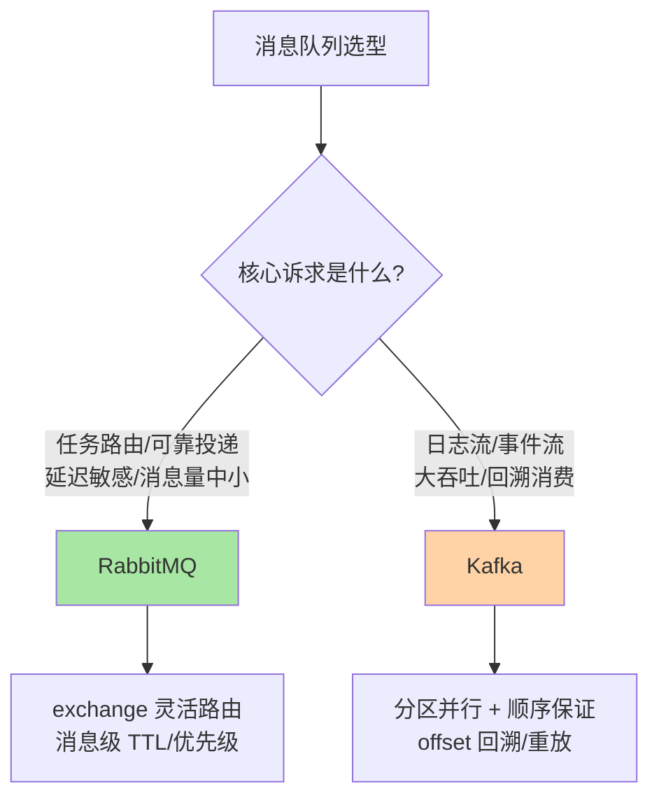
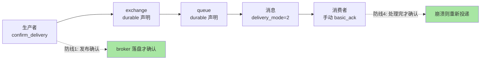
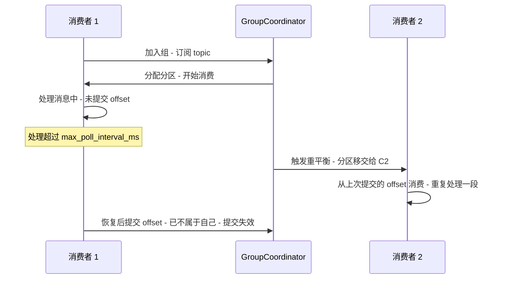

# Python 消息队列集成：RabbitMQ 与 Kafka

> 入门篇讲过「两个消息队列各是什么」，本篇把 Python 客户端层的机制挖透：**pika 的单线程纪律与心跳语义、可靠投递的四道防线、Kafka 生产者的幂等与重平衡陷阱、纯 Python 客户端的 GIL 吞吐天花板**。消息队列集成事故的共同形态是「消息丢了」与「消息重了」——两者的根源都在客户端语义与服务端机制的交界处，这正是本篇要拆解的地方。

## 一句话摘要

Python 集成消息队列的选型主轴：**RabbitMQ = 可靠路由（pika，单连接单线程纪律 + 发布确认 + 手动 ACK）**，**Kafka = 高吞吐流（kafka-python/confluent-kafka，幂等生产者 + 消费者组 + 手动提交偏移量）**。可靠性从来不是中间件单方面给的，而是「生产者确认 + 持久化 + 手动确认 + 消费幂等」四道防线共同守出来的——**Python 侧的全部功夫，在于把这四道防线在每个客户端的正确参数上落地，并且不让 GIL 与线程模型把防线打穿**。

## 🎯 本文核心

**核心一句话：消息队列集成的本质是「投递语义」的逐环控制——RabbitMQ 用 confirm/持久化/ACK 三环保证 at-least-once，Kafka 用 acks=all/幂等生产者/偏移量提交三环保证 at-least-once；at-least-once 必然带来重复，所以消费侧幂等不是可选项而是协议的一部分。Python 客户端的特殊约束是：pika BlockingConnection 非线程安全（一连接一线程）、kafka-python 纯 Python 实现 GIL 天花板明显（换 confluent-kafka 是标准动作）。**

机制链（全文挂这条链上）：选型决策图 → RabbitMQ 可靠链路四道防线 → pika 线程模型与心跳 → Kafka 生产者语义 → 消费者组与重平衡 → 事故复盘 → 量级演进。

## 5W 速记卡

| 维度 | 一句话 |
|---|---|
| What | pika 集成 RabbitMQ + kafka-python/confluent-kafka 集成 Kafka 的完整可靠性链路 |
| Why | 异步解耦/削峰/可靠投递依赖消息队列，但丢消息与重复消费的锅最终在客户端参数 |
| When | 任务队列与复杂路由选 RabbitMQ；日志流/事件流/大吞吐选 Kafka |
| Where | 生产者确认层、中间件持久化层、消费者确认层、消费幂等层四层防线 |
| How | confirm_delivery + durable + persistent + manual ACK；acks=all + enable_idempotence + 手动 commit |

## 一、选型：不是比谁强，是比谁匹配



两者的消费模型差异是选型的机制根源：RabbitMQ 是**推模型 + 队列删除语义**（消费确认后消息即删除，天然适合任务队列「处理完就完」）；Kafka 是**拉模型 + 日志保留语义**（消息按保留策略留存，offset 由消费者自己管理，天然支持回溯重放）。为什么不做「统一消息平台」？——两种模型的运维形态、故障模式、容量单位（RabbitMQ 按队列内存/磁盘报警，Kafka 按分区与保留磁盘）完全不同，合并只会造出两头不讨好的混合体，这是业内多年验证过的结论（公开口径）。

## 二、RabbitMQ：可靠投递的四道防线

「消息不丢」在 RabbitMQ 是四道防线串联的结果，缺任何一道，丢失就会在对应环节发生：



```python
import pika

params = pika.ConnectionParameters(
    host="localhost",
    heartbeat=30,            # 心跳：检测死链，30 秒是常用值
    blocked_connection_timeout=300,  # broker 阻塞（内存/磁盘报警）时的等待上限
)
connection = pika.BlockingConnection(params)
channel = connection.channel()
channel.confirm_delivery()   # 防线 1：开启发布确认
channel.queue_declare(queue="task_queue", durable=True)  # 防线 2+3：队列持久化

channel.basic_publish(
    exchange="",
    routing_key="task_queue",
    body=body,
    properties=pika.BasicProperties(delivery_mode=2),  # 防线 3：消息持久化
    mandatory=True,              # 不可路由时触发 basic_return 而非静默丢弃
)
```

四个容易踩的语义坑，每一个都是「防线看似开了、实际漏了」：**durable 声明只对「之后新建的队列」生效**——对一个已存在的非持久化队列重新声明 durable 会直接报错，而不是自动升级；**delivery_mode=2 只保证「写入磁盘的意图」**，broker 落盘有窗口，配合发布确认才闭环；**mandatory=False 时消息不可路由会被静默丢弃**，加 mandatory 后不可路由的消息通过 basic_return 回到生产者，pika 在 confirm 模式下以异常形式抛出；**prefetch（basic_qos）不设就是无限投递**——消费者内存会被压垮，按「处理耗时 × 吞吐预期」给一个小数字（如 10-50）做背压。

### 追问链：确认机制到底在等什么？

**追问一：confirm_delivery 开启后，basic_publish 为什么会变慢？**——它从「发完就算」变成「broker 确认才算」：单条同步确认模式下每条消息一次网络往返；高吞吐场景应该用批量发布 + 异步确认回调（`add_on_confirm_callback`），把确认成本摊到一批消息上。吞吐与可靠性的交换点就在确认粒度上。

**再深一层：发布确认与事务（AMQP tx）有什么区别？为什么不用 tx？**——AMQP 事务把信道上的一批消息作为原子单元提交，但开销大、吞吐低；发布确认是轻量替代——只回答「broker 收到了没有」，不做原子回滚语义。业内惯例是生产路径全部用 confirm，tx 基本只出现在历史代码里。

**打破砂锅问到底：四道防线全开了还会丢吗？**——会，在「镜像/仲裁队列没开」的场景：队列元数据持久化了，但消息只存在单个节点上，节点磁盘损坏就丢。经典镜像队列或 quorum 队列（Raft 复制，公开口径）解决的是「broker 侧的副本冗余」，这是第四道之外的第五道防线——单节点部署的「可靠」只到进程重启级别，不到磁盘损坏级别。

### 反方案分析：pika 的并发模型为什么必须一连接一线程

**为什么不选「多线程共享一个 BlockingConnection」？**——pika 的 BlockingConnection 不是线程安全对象，多线程并发调用会在同一 socket 上交叉读写帧，轻则消息错乱、重则连接崩溃。正确姿势：每线程独立连接（连接是 TCP 级资源，RabbitMQ 单节点数万连接是常态容量，公开口径），或整条消费链路收敛到单线程、把业务处理扔给线程池。**为什么不选「同步阻塞消费里再起线程处理业务」？**——手动 ACK 的确认必须回到消费线程发，业务线程处理完通过队列把结果传回消费线程 ACK，否则 ACK 乱序会破坏 prefetch 的背压语义。嫌复杂就直接上 `aio-pika`（asyncio 原生客户端）：事件循环天然单线程，回调语义与 ACK 时序在同一个循环里理顺——这也是 asyncio 栈接 RabbitMQ 的主流选择。

## 三、Kafka：生产者语义与重平衡陷阱

```python
from kafka import KafkaProducer
import json

producer = KafkaProducer(
    bootstrap_servers=["broker1:9092"],
    value_serializer=lambda v: json.dumps(v).encode("utf-8"),
    key_serializer=lambda k: k.encode("utf-8"),
    acks="all",                 # 所有 ISR 副本确认才算成功
    enable_idempotence=True,    # 幂等生产者：重试不产生重复
    retries=5,
    linger_ms=5,                # 攒批 5ms，吞吐换延迟
    compression_type="lz4",     # 批内压缩
)
producer.send("events", key=str(user_id), value={"action": "login"})
producer.flush(timeout=10)
```

三个参数的机制深度值得逐个拆。**acks=all + min.insync.replicas**：`acks=all` 的语义是「ISR 列表里的副本都写入才确认」——注意不是「所有副本」，落后太多的副本会被踢出 ISR，`min.insync.replicas=2`（broker 侧配置）保证 ISR 至少两个才接受写入，这组组合才是「不丢」的完整定义。**enable_idempotence**：broker 按「生产者 ID + 序列号」去重，解决「重试导致分区内重复」——它保证的是 at-least-once 升级为「精确一次写入」（分区内），但不解决「应用层重复发送」与「跨分区原子性」，后者需要事务 API，代价高，多数场景消费侧幂等更划算。**分区与顺序**：Kafka 只保证分区内有序，`key=user_id` 让同一用户的事件进同一分区——顺序性是业务设计出来的（选对 key），不是客户端默认给的。

### 消费者组：重平衡是丢消息与重复消费的头号案发地



重平衡的两类后果都能从这个时序推出来：**重复**——消费者处理完但还没提交 offset 时被踢出组，新消费者从旧 offset 重新消费（at-least-once 的正常形态，靠消费幂等吸收）；**丢消息防御**——如果用的是「自动提交 + 先提交后处理」的反模式，提交发生在处理之前，崩溃后那段消息永远跳过。所以纪律只有一条：**手动提交 + 处理完再提交**（`enable_auto_commit=False`，处理完一批 `consumer.commit()`），配上消费幂等兜底。

重平衡的调参三件套：`max_poll_interval_ms` 要大于「单批最大处理时长」（长任务被误判死亡是重平衡风暴的头号原因）；`session_timeout_ms` + 心跳线程管存活探测；消费者数量不超过分区数——多出来的消费者空转。

### 反方案分析：kafka-python 为什么不选做高吞吐生产者

**为什么不选「kafka-python 一路用到底」？**——它是纯 Python 实现：压缩、序列化、网络编解码都在 Python 字节码层跑且持有 GIL，单生产者吞吐天花板明显（业内认知：与 C 实现差数倍）；`confluent-kafka`（librdkafka 的 CFFI 封装）在 C 层执行时释放 GIL，吞吐与内存占用都优一档。选型口诀：低频控制面消息（配置下发、审计事件）kafka-python 够用且部署简单；数据面高吞吐管道直接 confluent-kafka。**为什么不选「自己封装一套消息库统一两个队列」？**——两个队列的语义差异（队列删除 vs 日志保留、ACK vs offset）无法被一层抽象抹平，抽象漏了之后每个业务都要理解底层语义才能写对——直接用各自原生的客户端 + 团队规范约束，比虚假的统一抽象诚实。

## 四、设计思想：推与拉的哲学分野

两个系统的设计哲学差异浓缩在一对动词里：**推（RabbitMQ broker 主动推给消费者）与拉（Kafka 消费者主动拉取）**。推模型把背压责任放在 broker 与 prefetch 参数上——broker 掌握节奏，消费端「被服务」，换来的是低延迟与公平分发，付出的是 broker 要为慢消费者缓冲；拉模型把节奏还给消费者——按自己的能力取数、攒批、提交，换来的是吞吐扩展性与 offset 的完全控制权，付出的是「空轮询延迟」要靠 long polling 技巧消解。理解了这对哲学分野，很多参数的归属就自然清晰了：prefetch 是推模型给消费端的「限流阀」，max_poll_interval 是拉模型给 broker 的「存活契约」——两个队列世界各自用不同的机制回答同一个问题：「消费端出问题的时候，谁来发现、谁来缓冲」。

## 五、事故复盘：两则典型案卷

**复盘一：消费者「假死」导致消息堆积数小时。** 现象：监控显示消费 lag 持续上涨，消费者进程存活但不再处理消息。排查路径：先看消费者日志——没有异常也没有心跳超时；再查线程栈——消费线程卡在一个同步 HTTP 调用上，该调用没配超时，对端挂起导致消费线程永久阻塞；由于 `max_poll_interval_ms` 超时后触发重平衡，分区反复移交、新消费者又卡在同一批消息上，形成「卡死-重平衡-再卡死」循环。复盘动作：所有下游调用强制超时；单批处理时长压到 poll 间隔以内；lag 告警阈值前移。教训：**消费循环里的每一行代码都在占用「poll 间隔预算」**，任何无界等待都会演化为重平衡风暴。

**复盘二：RabbitMQ 消息「静默消失」。** 现象：任务偶发丢失，四道防线自检全部开启。排查路径：先核对生产者日志——publish 无异常；再查 broker 侧 `unroutable` 计数——有增长；还原代码发现某次重构把 routing_key 从常量改成拼接字符串，个别消息路由到不存在的队列，且 `mandatory=False` 静默丢弃。复盘动作：publish 全部加 mandatory + return 回调告警；发布前用「声明式绑定校验」确保路由目标存在。教训：**消息中间件对「发往空处」的处理默认是沉默的**——沉默的失败只能靠显式开启 return/告警机制变成可见的失败。

💡 **实战提示：消费者进程要挂 SIGTERM 钩子做优雅退出**。收到终止信号后先停止拉取、处理完手头这批消息、提交 offset/发完 ACK 再退出——直接被 kill 的消费者留下的「处理到一半未提交」消息，就是每次发版后重复消费告警的来源。

💡 **实战提示：把「单批处理时长」做成断言而不是感觉**。消费循环里给每批消息计时，超过 `max_poll_interval_ms` 的三分之二就告警——重平衡风暴从「偶发生产事故」变成「上线前可测」的工程指标，只差这一个断言。

💡 **实战提示：生产者的 send() 返回的是 Future**。kafka-python 的 `producer.send()` 把消息放进缓冲就返回，失败要靠 `get(timeout)` 或回调暴露——「只 send 不检查」的代码在 broker 抖动时会静默丢消息，发布路径统一走「send + 元数据检查 + 失败重投」的封装。

💡 **实战提示：监控三个数字就够日常巡检**——消费 lag（积压）、unacked（RabbitMQ 未确认）、重平衡次数（稳定性）。这三个数字异常覆盖了本篇两则复盘事故的前兆期。

## 六、什么时候用 / 什么时候不用

**什么时候用消息队列**：生产消费速率差大（削峰）、上游不需要下游的同步结果（解耦）、需要广播给多个下游（发布订阅）、需要缓冲批量（攒批写入）。**什么时候不用 / 先别用**：调用方需要同步拿到结果（那是 RPC 的活）；链路里只有两个固定服务且量很小（直接调用更简单，队列是新增故障面）；强一致要求「必须处理成功才算成功」（同步调用 + 事务边界更可控）。**明确推荐**：Python 新项目按「任务/路由场景用 RabbitMQ（asyncio 栈用 aio-pika），数据管道用 Kafka（confluent-kafka）」执行，团队内统一客户端选型比单点最优更重要。

## 七、Trade-off：每一步都在付出什么

| 选择 | 得到 | 付出 | 适用判断 |
|---|---|---|---|
| 发布确认（同步） | 发一条确认一条 | 吞吐降一个量级 | 低频关键消息 |
| 异步确认 + 批量 | 吞吐恢复 | 失败处理异步化、复杂 | 高吞吐生产者 |
| 手动 ACK/提交 | 不丢已处理语义 | 幂等必须跟上 | 默认纪律 |
| acks=all | 副本级可靠 | 延迟上升 | 数据面管道 |
| enable_idempotence | 重试不重复 | 单生产者 ID 开销、分区内生效 | 生产者默认开 |
| linger 攒批 | 吞吐提升 | 延迟增加毫秒级 | 非实时流 |
| 预加载 prefetch 小值 | 消费者背压 | 吞吐下降 | 长耗时任务 |
| confluent-kafka | C 层吞吐、释放 GIL | 二进制依赖部署复杂 | 高吞吐数据面 |

贯穿全篇的权衡主线：**投递语义的每一档加强（at-most-once → at-least-once → exactly-once）都有对应的延迟/复杂度账单**——Python 侧的工程判断是「at-least-once + 消费幂等」这个性价比拐点，把「精确一次」留给真正付得起账的场景。

## 八、不同量级的思考：架构约束驱动解法

- **十万级（日消息十万量级）**：约束来源是单节点容量与消费处理耗时，思考方式是监控驱动——这一档的核心问题是「lag 与 unacked 有没有被观测」，而不是「要不要上集群」。单节点 RabbitMQ 或单 broker Kafka + 四道防线参数配齐足够；关键动作是队列深度/消费 lag 双告警与死信队列标配。
- **百万级（日消息百万量级）**：约束来源是消费并行度与重平衡稳定性，思考方式是分区驱动——这一档的核心问题是「分区数与消费者扩容的并行上限算清了没有」，而不是「再起几个消费进程」。Kafka 分区数按「目标吞吐 / 单消费者吞吐」预留三倍余量；RabbitMQ 按队列分片 + 多消费者摊，确认机制切异步批。
- **千万级及以上**：约束来源是网络带宽与 broker 副本复制，思考方式是分层分流驱动——这一档的核心问题是「不同可靠性等级的流量要不要拆到不同集群」，而不是「参数还能怎么调」。高可靠交易流与可丢日志流分集群部署，机架感知副本分布、跨机房复制的延迟预算单独立项。
- **自下而上的演进触发器**：lag 稳定但端到端延迟上升 → 查攒批与确认粒度；重平衡频率上升 → 查单批处理时长漂移；broker 磁盘先到顶 → 查保留策略与压缩。每一档的升级都由上一档的监控数据触发——消息队列的容量规划一半是磁盘与带宽规划。到亿级：这一档的核心问题是「消息架构要不要按业务域拆成多套集群」，而不是「把一个集群调到极限」——上下游所有系统共享一个故障域的架构，在亿级流量下会把局部故障放大成全局事件。

## 你们可能会问

**Q1：pika 和 aio-pika 怎么选？**
看并发模型：同步栈（Flask/Django 传统视图、脚本、Celery worker 内部）用 pika；asyncio 栈（FastAPI、自研异步服务）用 aio-pika。核心判据是「消费循环由谁驱动」——BlockingConnection 阻塞当前线程，绝不能放进事件循环。

**Q2：消息体用什么序列化格式？**
JSON 是默认（可读、跨语言、Python 侧标准库直出）；性能敏感的数据管道用 Avro/Protobuf（体积小一半以上、带 schema 演进，业内认知）。无论哪种，消息体里带上 `message_id`（幂等去重键）与 `trace_id`（链路追踪）是生产规范的固定两项。

**Q3：怎么实现延迟投递？**
RabbitMQ 用 TTL + 死信交换机（消息过期后转入真正的消费队列）或延迟交换插件；Kafka 没有原生延迟语义，用「延迟主题 + 定时轮询」或按延迟分层主题。追问式提醒：TTL 队列的过期检查有惰性窗口，秒级精度别指望毫秒级（公开口径）。

**Q4：消费失败的消息怎么处理不丢也不堵？**
重试分层：瞬时错误（网络抖动）立即重试几次；确定性失败（脏数据）直接进死信队列人工处理；有限次退避重试后仍失败进死信。禁止的动作是「失败 requeue 死循环」——一条毒消息能把整条队列的消费卡住，这是死信队列存在的唯一理由。

## 自测三问

1. RabbitMQ 四道防线分别堵住哪个环节的丢失？quorum 队列补的是哪一块？
2. Kafka 重平衡为什么会造成重复消费？max_poll_interval_ms 应该怎么估？
3. 为什么「at-least-once + 消费幂等」比「追求精确一次」更划算？幂等键应该选什么？

## 开放问题

- Kafka 的 KIP 与 Raft 元数据改造持续改变 broker 语义，Python 客户端对新协议特性的跟进速度滞后于 Java 侧，选型时要预留客户端升级窗口。
- 消息队列与流处理（Kafka Streams 类）的边界在 Python 生态仍然模糊，纯 Python 流处理方案的性能水位值得持续观察。

## 🎯 核心带走

- **核心一句话**：消息不丢 = 生产者确认 + 持久化 + 手动确认 + 消费幂等四道防线串联；消息重复是 at-least-once 的必然伴生，幂等是协议的一部分而非补救
- **机制链**：选型模型差异 → RabbitMQ 防线与 pika 线程纪律 → Kafka 生产者语义 → 重平衡时序 → 事故案卷 → 量级演进
- **哪里会坏**：BlockingConnection 跨线程共享、消费循环里无界等待触发重平衡风暴、mandatory 未开静默丢弃、自动提交先于处理
- **边界**：本篇管 Python 客户端集成语义；broker 集群部署、镜像/仲裁队列细节、Kafka 分区再均衡的运维在中间件 MQ 系列展开

## 📌 数据与事实声明

- 写于 2026-09-16，客户端语义以 pika 1.3、kafka-python 2.x、confluent-kafka 官方文档为准；broker 默认值以 RabbitMQ 与 Kafka 官方文档为准
- 吞吐对比、连接容量等数字均为业内认知或公开口径，非特定生产实测
- 两则事故叙事已匿名化并做细节脱敏，复盘结论按通用机制呈现

## 📚 参考资料

| 类型 | 标题 | 来源 |
|---|---|---|
| 官方文档 | pika（ConnectionParameters/Confirm/ threading notes） | pika.readthedocs.io |
| 官方文档 | RabbitMQ Reliability 与 Publisher Confirms | rabbitmq.com/docs |
| 官方文档 | kafka-python Producer/Consumer API | kafka-python.readthedocs.io |
| 官方文档 | Apache Kafka 文档（acks/idempotence/consumer groups） | kafka.apache.org/documentation |
| 官方源码 | aio-pika 与 confluent-kafka-python | github.com/mosquito/aio-pika 等公开仓库 |
| 系列内篇 | 上一篇《Python 连接 MySQL 与数据库治理》/ 下一篇《Python 中间件集成与服务治理》 | 本系列 |
