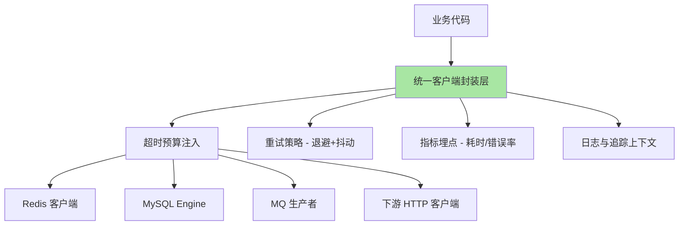
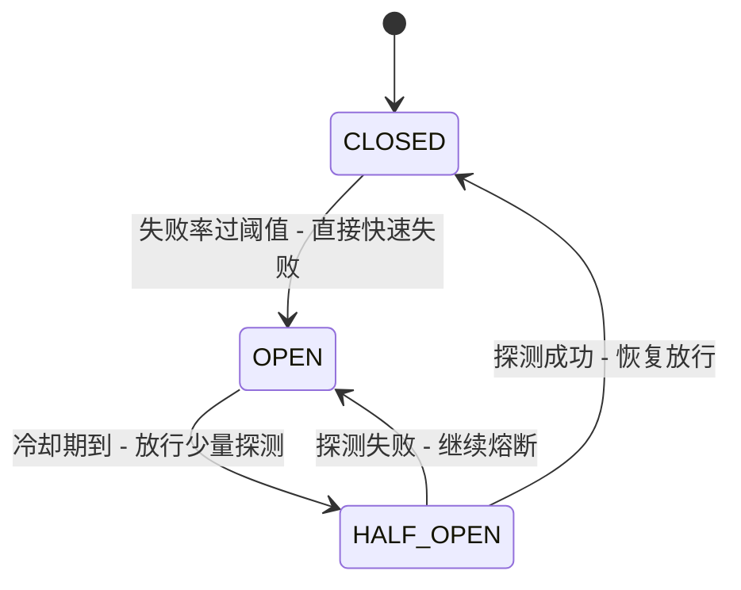
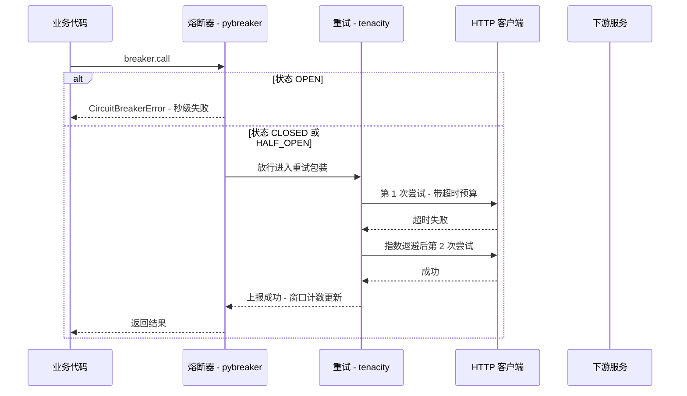

# Python 中间件集成与服务治理

> 前三篇分别拆了 Redis、MySQL、消息队列的集成机制，本篇是系列收束：**把「单个中间件会用了」升维成「一套中间件被治理着用」**——超时预算、重试退避、熔断状态机、分布式限流、优雅启停。这些治理件在 Java 生态有现成全家桶，Python 生态则散落各处、常常要自己拼装——所以 Python 工程师更需要理解每个治理件背后的机制，才能把拼装做对。

## 一句话摘要

Python 的中间件集成治理 = **集成层统一收口（超时/重试/池化/优雅关闭）+ 服务治理四件套（服务发现、负载均衡、熔断降级、限流）**。核心机制判断有三条：超时预算必须逐层递减地分配（上游 > 下游，否则下游超时形同虚设）；重试必须配退避 + 抖动 + 幂等三件套（无脑重试放大故障）；熔断与限流是两种不同方向的保护（熔断保护自己不被拖死、限流保护下游不被压垮）——**治理的每一件都是在「故障发生时」决定系统行为的，平时看不见，出事时定生死**。

## 🎯 本文核心

**核心一句话：服务治理的本质是把「失败」当作一等公民来设计——超时是失败的边界、重试是对抗瞬时失败的机制、熔断是对抗持续失败的机制、降级是失败发生后的业务预案、限流是拒绝过量失败的闸门。Python 侧的特殊性在于：这些机制没有统一框架兜底（对比 Java 的治理全家桶），散装拼装时代码即架构——每个客户端的每个参数都要自己写对。**

机制链（全文挂这条链上）：集成层统一收口 → 超时预算与重试策略 → 熔断状态机 → 分布式限流 → 优雅启停 → 服务发现与负载均衡 → 事故复盘 → 量级演进。

## 5W 速记卡

| 维度 | 一句话 |
|---|---|
| What | 超时/重试/熔断/降级/限流/服务发现六类治理件在 Python 侧的机制与拼装 |
| Why | 中间件是分布式故障的主要来源，治理件决定故障被隔离还是被放大 |
| When | 依赖跨进程服务的第一天就要配超时；流量上来先上限流；依赖不稳先上熔断 |
| Where | 客户端封装层（收口超时重试）、进程内（熔断器/本地限流）、Redis 层（分布式限流） |
| How | 逐层超时预算 + 指数退避 + 状态机熔断 + Redis+Lua 令牌桶 + SIGTERM 优雅退出 |

## 一、集成层统一收口：别让每个调用点自己发明超时

治理的第一步是把散落在业务代码里的中间件调用收进统一的客户端封装层：



收口层的四项职责，缺一项就是一类事故：**超时注入**——每个出站调用必须带显式超时，没有超时的调用是「无界等待」，上一系列 MySQL 篇的消费者假死事故就是它的受害者；**重试策略**——只在封装层做，业务代码不允许随手 retry；**指标埋点**——耗时分布（P50/P99）、错误率按「目标中间件 + 调用点」两个维度打标；**上下文传递**——trace_id 随调用链传播，让跨中间件的失败能串成一条链路。

业内惯例（生产中）：Python 侧常用「客户端工厂 + dataclass 配置」的轻量封装，或直接用 `tenacity`（重试装饰器）+ `pybreaker`（熔断器）这类单一职责库拼装——**为什么不选「重试写在每个业务函数里」？**——散装重试的参数（次数/退避/条件）必然不一致，故障放大时你甚至不知道系统里有多少种重试策略在同时运转；收口的意义不是省代码，是让重试行为「可枚举、可审计、可一次性调整」。

## 二、超时预算：一次请求的时间都花在哪

超时不是孤立的数字，是逐层分配的预算：入口层总预算（如网关 3 秒）→ 应用层 RPC 预算 → 中间件调用预算。机制约束只有一条：**下层的超时必须小于上层对它的等待上限**——上层给 2 秒、下层配 3 秒，下层的超时永远等不到生效，失败会以「上层先放弃」的形式发生，下层还在白烧资源。

```python
# 一次聚合查询的超时预算分配示例（业内惯例参考值）
TIMEOUT_BUDGET = {
    "gateway": 3.0,          # 入口总预算
    "service_logic": 2.5,    # 应用逻辑预算 = 网关 - 网络余量
    "mysql_query": 0.5,      # 单条 SQL
    "redis_get": 0.05,       # 缓存读（秒级单位的 50ms）
    "rpc_downstream": 1.0,   # 单个下游服务
    "mq_publish": 0.3,       # 消息发布确认
}
```

追问：**为什么 Redis 超时要给到 50 毫秒而不是 1 秒？**——因为缓存的职责就是快，一次超过 50ms 的 Redis 操作大概率意味着慢命令或网络异常，快速失败后走「回源数据库」的降级路径比等 1 秒更划算。**再深一层：为什么每个下游的超时不一样？**——超时预算表达的是「这个依赖的预期耗时分布」，P99 是 20ms 的缓存和 P99 是 800ms 的报表接口不能用同一个超时；预算来自依赖的耗时实测，不是统一默认值。打破砂锅：连接超时与读超时为什么要分开配？——建连慢说明网络或对端负载问题（重试换节点可能有用），读慢说明对端处理问题（重试要谨慎），两种失败的处置策略不同，所以 `socket_connect_timeout` 与 `socket_timeout` 在所有正经客户端里都是两个参数。

## 三、熔断：三态状态机与它的调参

熔断器保护的是「自己不被持续失败的依赖拖死」：



```python
from pybreaker import CircuitBreaker

db_breaker = CircuitBreaker(
    fail_max=5,              # 连续 5 次失败进入 OPEN
    reset_timeout=60,        # 60 秒后进入 HALF_OPEN 试探
    exclude=[BusinessError],  # 业务异常不计入（只有「依赖坏了」才熔断）
)

def get_order(order_id):
    return db_breaker.call(query_order, order_id)  # OPEN 期间直接抛 CircuitBreakerError
```

熔断的三个机制要点：**统计窗口**——按「最近 N 次调用」还是「滑动时间窗」统计失败率，粒度决定灵敏度；**异常分类**——熔断器只统计「依赖不可用类异常」（超时、连接失败、5xx），业务校验失败计入会让熔断器在「业务高峰正常报错」时误开，这是最常见的误用；**HALF_OPEN 的探测流量**——只放行少量请求试探，试探通过才恢复，否则恢复瞬间全量流量打到刚缓过来的下游，形成「熔断-恢复-再熔断」振荡。

**反方案分析：为什么不选「失败就降级、不上熔断器」？**——降级是业务层的动作（返回缓存旧值/默认值），熔断是基础设施层的动作（停止调用、快速失败）；没有熔断器的降级每次失败仍要等完整超时，依赖已经瘫痪时，每个请求都在付「等满超时」的税——熔断器的价值就是把这笔税变成一次本地判断。**反方案分析：为什么不选「给所有依赖都上熔断」？**——熔断有代价：状态维护、探测逻辑、以及「误熔断关键弱依赖」的风险；业内惯例是只给「跨进程的强依赖」配熔断（数据库、核心下游服务），进程内调用与缓存读不需要——判断标准是「这个依赖挂了，我等它还有没有意义」。

## 四、限流：单机令牌桶与 Redis+Lua 分布式限流

限流保护的是「下游（包括自己）不被过量请求压垮」。单机限流与分布式限流是两个问题：

```python
# 单机令牌桶：进程内限流，零网络开销
import time

class TokenBucket:
    def __init__(self, rate: float, capacity: int):
        self.rate = rate          # 每秒生成令牌数
        self.capacity = capacity  # 桶容量（允许的突发量）
        self.tokens = float(capacity)
        self.last = time.monotonic()

    def allow(self, n: int = 1) -> bool:
        now = time.monotonic()
        self.tokens = min(self.capacity, self.tokens + (now - self.last) * self.rate)
        self.last = now
        if self.tokens >= n:
            self.tokens -= n
            return True
        return False
```

多实例部署时，单机限流的总量 = 实例数 × 单机配额，缩扩容就失真——所以有分布式限流：**Redis + Lua 的原子「读-改-写」**。为什么必须 Lua？限流的「取令牌」操作是「读当前数 → 计算补充 → 判断扣减 → 写回」四步，多实例并发执行时四步会被交错，配额就超发——Lua 脚本在 Redis 单线程里原子执行，把竞态压掉：

```python
TOKEN_BUCKET_LUA = """
local key = KEYS[1]
local rate = tonumber(ARGV[1])
local capacity = tonumber(ARGV[2])
local now = tonumber(ARGV[3])
local requested = tonumber(ARGV[4])
local data = redis.call('HMGET', key, 'tokens', 'last')
local tokens = tonumber(data[1]) or capacity
local last = tonumber(data[2]) or now
tokens = math.min(capacity, tokens + (now - last) * rate)
local allowed = tokens >= requested
if allowed then tokens = tokens - requested end
redis.call('HMSET', key, 'tokens', tokens, 'last', now)
redis.call('EXPIRE', key, math.ceil(capacity / rate) * 2)
return allowed and 1 or 0
"""

def allow_request(r, key, rate, capacity):
    import time as _t
    return r.eval(TOKEN_BUCKET_LUA, 1, key, rate, capacity, _t.time(), 1) == 1
```

**反方案分析：为什么不选「纯单机限流凑合」？**——无状态水平扩缩容的场景（K8s 弹性伸缩）实例数是变量，「总量 = 实例数 × 配额」的假设每分钟都在漂移；下游按总量保护（数据库连接、第三方配额）时，必须分布式限流兜底。**反方案分析：为什么不选「网关层限流就够」？**——网关能挡住「入口总量」，挡不住「应用内部对某个下游的调用速率」（如对第三方 API 的每分钟调用数）——入口限流与出口限流保护对象不同，二者是分层关系不是替代关系。

### 源码/关键路径：一次受治理调用的完整旅程

从业务代码到下游服务，治理件在关键路径上的挂载点（以 pybreaker + tenacity 的组合为例）：



源码级两个细节值得看：pybreaker 的状态与计数都在**调用方进程内存**里（多实例各自的熔断器互相独立——这正是「熔断粒度是实例级」的原因，也解释了为什么多实例部署下熔断的生效时刻略有差异）；tenacity 的 `wait_exponential` 计算的是「base × 2^n」再叠加 `wait_random` 的抖动区间——源码里抖动是加在退避值上的随机偏移，目的就是打散重试的时间聚集。

## 五、优雅启停：被忽略的治理基本功

进程的启动与关闭是故障注入率最高的两个时刻，Python 侧的纪律：

```python
import signal, asyncio

shutdown = asyncio.Event()

def handle_sigterm(signum, frame):
    shutdown.set()  # 不做清理动作，只发信号 - 清理在协程里做

signal.signal(signal.SIGTERM, handle_sigterm)

async def main():
    server = await start_server()
    mq_consumer = await start_consumer()
    await shutdown.wait()                 # 等终止信号
    await mq_consumer.drain()             # 停止拉取 - 处理完手头消息
    await server.close()                  # 停止接受新请求 - 等存量请求完成
    await engine.dispose()                # 归还并关闭连接池
```

顺序即语义：**先停流量入口（消息/请求），再处理存量，最后关资源**——反过来的顺序（先关连接池）会让存量请求瞬间失败。K8s 环境的 `terminationGracePeriodSeconds` 要大于「存量处理的最长时长」，否则优雅退出会被强杀截断。启动侧对称的纪律是**就绪探针**：连接池预热、缓存加载完成之前不接流量，避免「进程活着但没准备好」的灰色状态。

### 追问链：为什么优雅退出在容器环境特别容易出事？

**追问一：SIGKILL 之前 Python 进程来得及做什么？**——什么都没来得及，SIGKILL 不可捕获。所以 K8s 的删除流程是先发 SIGTERM、等 grace period、再 SIGKILL——治理的目标是把「必须做的清理」全部压在 SIGTERM 到 grace period 结束之间完成。**再深一层：为什么「先从注册表摘除自己」还要等？**——注册表摘除（服务发现下线）到流量真正停止有传播延迟（客户端缓存的服务列表要过期），立刻关服务会杀掉「拿着旧列表刚发出来」的请求——所以摘除后要留一个「引流窗口」再真正关闭。业内惯例是预停钩子里先摘除、sleep 数秒（业内认知：按客户端刷新周期定）、再进入清理流程。

## 六、服务发现与负载均衡：调用之前还有两步

服务发现解决「调用谁」，负载均衡解决「这次调谁」。Python 生态的现实是两者都要拼装：服务发现常用 HTTP/DNS 注册（Nacos/Consul 的 Python SDK 或 etcd3），负载均衡在客户端封装层自己实现（轮询/加权随机/最少连接的纯 Python 实现）。**设计思想**层面值得记的判断：客户端负载均衡把「选择」的实时性做到了最好（能感知每个实例的实际耗时），代价是每个客户端都要维护节点视图；服务端负载均衡（网关/代理）把视图集中维护，代价是多一跳。中小规模先上服务端均衡，规模大了再把「感知型均衡」下沉到客户端封装——治理件跟着量级演进，不是一次到位。

### 事故复盘：一次「熔断误开」的排查

现象：大促预热时段，订单服务对库存服务的调用大量报 `CircuitBreakerError`，但库存服务监控显示一切正常。排查路径：先看熔断器的失败统计——全是最新的超时异常；再看库存服务耗时分布——P99 从 200ms 涨到 900ms（预热流量正常抬升），而调用方超时配的是 500ms。结论：不是依赖坏了，是超时预算没有随流量重新核定，「正常变慢」被熔断器判成「持续失败」。复盘动作：超时配置按 P99 动态核定；熔断统计把「超时」与「连接拒绝」分开计数（前者先查容量、后者才大概率是故障）；预热期接入熔断器状态的告警。教训：**熔断器的输入是「失败」，但「失败」的定义权在超时配置手里**——超时配置失真，熔断就成了放大器。

### 事故复盘：一次「重试风暴」的自我攻击

现象：一次存储层抖动 30 秒，恢复后系统却持续过载了 10 分钟。排查路径：先看流量曲线——恢复后入口流量正常，但对存储层的调用 QPS 是平时的四倍；再查各调用方的重试配置——三次重试、无退避、五处调用点叠乘。结论：抖动期间失败的重试全部延迟到达，恢复瞬间「存量重试 + 新流量 + 重试的重试」三浪叠加，把刚恢复的存储层再次打进高延迟——这次是重试风暴把局部抖动放大成了平台级故障。复盘动作：重试统一收口到封装层并加指数退避 + 抖动；给重试设预算（请求级 retry 预算，例如重试请求占比不超过 10%）；下游恢复初期限流保护。教训：**无退避的重试等于把故障在时间轴上重新整形再打回来**——退避与抖动不是优化项，是重试的组成部分。

💡 **实战提示：给熔断器状态变化挂监听回调接告警**。pybreaker 支持 `CircuitBreakerListener`——OPEN/HALF_OPEN 切换时发事件，熔断器「默默工作」等于没治理：状态切换的告警是「依赖在退化」的最早信号，比下游自己的监控往往早几分钟。

💡 **实战提示：限流的 key 设计比算法更影响效果**。按「保护对象」选 key：保护数据库就按「调用方 + 操作类型」限，保护第三方就按「接口 + 租户」限；全站一把大锁式的全局 key 会把正常业务和失控调用绑在一起惩罚。

💡 **实战提示：重试要带「请求级预算」**。一次入口请求允许的总重试次数要有上限（比如重试请求占比 10% 的预算制）——五层调用各自重试三次就是约二百四十倍的放大，预算制让重试在链路上自动「逐层让路」。

💡 **实战提示：优雅退出先在测试环境演练**。给进程发 SIGTERM 并计时：从收到信号到完全退出的时长、退出期间有没有请求失败——这两个数字要在发版前知道，而不是在 K8s 强杀日志里第一次见到。

## 七、什么时候用 / 什么时候不用

**什么时候上治理件**：第一次跨进程调用就配超时（没有例外）；多实例部署时上收口层埋点；依赖出现过去抖动史就上熔断；对下有保护义务（数据库/第三方配额）就上限流。**什么时候不用 / 先别用**：单体应用的进程内调用不需要熔断限流（那是给跨进程失败准备的）；日请求千级的服务全套治理是过度设计（监控 + 超时两条就够）；没有幂等保障的接口先修幂等再谈重试。**明确推荐**：Python 项目的最小治理起步包 = 「统一客户端封装（超时 + 埋点）+ tenacity 重试 + 优雅退出钩子」，四件在一周内可以铺完，收益覆盖绝大多数日常故障。

## 八、Trade-off：每一步都在付出什么

| 治理件 | 得到 | 付出 | 适用判断 |
|---|---|---|---|
| 统一封装收口 | 治理可枚举、可审计 | 一层间接、团队纪律 | 必做 |
| 逐层超时预算 | 失败有边界、资源不空烧 | 每个依赖要实测核定 | 必做 |
| 指数退避重试 | 瞬时故障自愈 | 延迟上升、需幂等 | 只对幂等读/写开 |
| 熔断器 | 快速失败防拖死 | 误熔断风险、状态复杂度 | 跨进程强依赖 |
| 降级预案 | 故障时业务不断 | 旧数据/默认值的一致性代价 | 核心链路必配 |
| 单机令牌桶 | 零开销挡突发 | 多实例总量失真 | 单机突发 |
| Redis+Lua 分布式限流 | 全局配额精确 | 每请求一次 Redis 往返 | 出口保护 |
| 优雅退出 | 发版不失败 | 停机时间拉长数秒 | 容器环境必配 |

贯穿全篇的权衡主线：**每个治理件都是「用现在的确定成本」换「故障时的不确定损失」**——治理的度由故障概率与损失规模决定，而不是由技术完备欲决定。

## 九、不同量级的思考：架构约束驱动解法

- **十万级（日请求十万量级）**：约束来源是依赖的偶发抖动，思考方式是监控驱动——这一档的核心问题是「每个依赖的超时与耗时基线有没有建立」，而不是「治理件上没上全」。超时 + 埋点 + 优雅退出三件是全部；熔断限流可以等数据说话。
- **百万级（日请求百万量级）**：约束来源是故障的放大效应，思考方式是隔离驱动——这一档的核心问题是「一个依赖抖动会不会拖垮整条链路」，而不是「重试次数够不够」。熔断 + 退避重试 + 出口限流配齐，降级预案从文档变成演练过的代码。
- **千万级及以上**：约束来源是治理件自身成为热点与误判源，思考方式是分级驱动——这一档的核心问题是「治理策略要不要按流量等级分级」，而不是「参数怎么再拧」。核心链路与非核心链路用不同的超时/重试/熔断档位，限流从 Redis 集中式演进到「本地预分配 + 中心校准」的混合形态，规避中心节点的每请求开销。
- **自下而上的演进触发器**：误熔断告警出现 → 查超时预算失真；重试占比超预算 → 查退避配置；限流 Redis 成瓶颈 → 本地化混合限流。每一档的升级都由上一档的治理件自身的运行数据触发——治理件也需要被监控，这是治理的最后一块拼图。

## 你们可能会问

**Q1：pybreaker/backoff 这些库够用吗？要不要自研？**
单一职责库（熔断、重试、限流各一个）拼装 + 自己写「收口层」是 Python 生态的主流姿势；自研只在「需要特殊语义」（如按租户分桶的限流）时启动——治理件的价值在「行为正确且可解释」，不在代码归属。

**Q2：熔断的失败阈值和冷却期怎么定？**
失败阈值按「正常抖动的失败率上限」的数倍定（业内认知：正常失败率 0.1% 以下时，阈值定在 5%-10% 连续失败或窗口失败率 50%）；冷却期按「下游典型故障恢复时长」定（60-120 秒起步）。两个参数都要在演练中验证，拍脑袋的熔断参数等于没配。

**Q3：asyncio 服务的治理件有什么不同？**
机制相同，实现载体不同：熔断状态与令牌桶的并发保护从「线程锁」换成「单线程事件循环的无锁假设」，但要小心「在协程里调用同步的阻塞治理件」会把事件循环卡住；异步栈的客户端（aiohttp/httpx.AsyncClient）超时配置项更细（连接/读/写/池获取分开），预算可以分得更准。

**Q4：怎么验证治理件真的会生效？**
故障演练：对测试环境注入依赖延迟/错误（网络工具或应用内的故障注入开关），核对熔断器状态切换、降级路径触发、限流拒绝率三项是否符合预期——没演练过的治理件在生产的表现永远是未知数。

## 自测三问

1. 超时预算为什么要逐层递减分配？「上层 2 秒、下层 3 秒」会发生什么？
2. 熔断器为什么必须区分「依赖不可用异常」与「业务异常」？HALF_OPEN 为什么要限制探测流量？
3. Redis+Lua 分布式限流解决的核心竞态是什么？它与网关层限流是什么关系？

## 开放问题

- Python 生态是否会出现统一的服务治理框架（对标 Java 侧全家桶），还是继续走「单一职责库 + 团队拼装」路线——eBPF/服务网格把治理下沉基础设施的趋势可能让这个问题失去意义，值得跟踪。
- 故障注入的标准化（错误注入协议、混沌工程规范）在 Python 侧工具链仍属早期，治理件的「可验证性」如何低成本落地是开放题。

## 🎯 核心带走

- **核心一句话**：服务治理是把失败当一等公民设计——超时定失败边界、重试对瞬时失败、熔断对持续失败、降级接失败后果、限流挡过量失败；Python 侧没有全家桶，收口层的代码就是架构本身
- **机制链**：集成收口 → 超时预算 → 熔断三态 → 分布式限流 → 优雅启停 → 发现与均衡 → 事故案卷 → 量级演进
- **哪里会坏**：无超时调用挂死线程、无退避重试酿成风暴、超时失真导致熔断误开、先关资源后停流量的反序退出
- **边界**：本篇管治理件的机制与拼装；K8s 探针/网格的运维细节在 devops 域展开；各中间件客户端语义在前三篇

## 📌 数据与事实声明

- 写于 2026-09-16，机制描述以 pybreaker/tenacity 官方文档与 Redis 官方文档为准；阈值参考值为业内认知，需按实测核定
- 超时预算示例数字为教学口径，非特定生产实测
- 两则事故叙事已匿名化并做细节脱敏，复盘结论按通用机制呈现

## 📚 参考资料

| 类型 | 标题 | 来源 |
|---|---|---|
| 官方文档 | pybreaker（熔断器） | github.com/fabfuel/circuit-breaker（pybreaker） |
| 官方文档 | tenacity（重试库） | tenacity.readthedocs.io |
| 官方文档 | Redis EVAL 与脚本原子性 | redis.io/docs/latest/commands/eval |
| 原理书 | 《Release It!》第二版（超时/熔断/舱壁模式出处） | 公开出版 |
| 系列内篇 | 前三篇：Redis 集成 / MySQL 治理 / 消息队列集成 | 本系列 |
