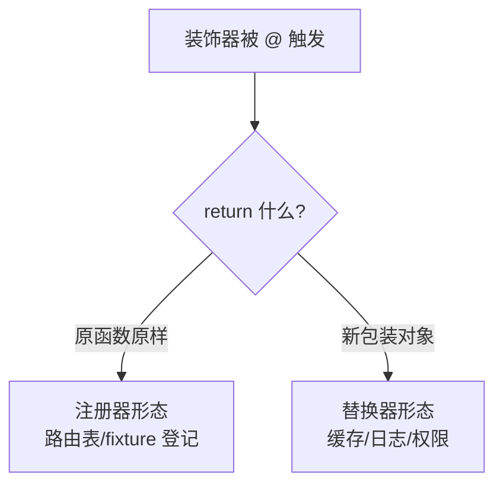
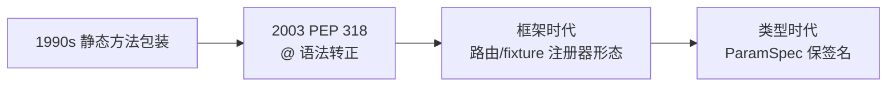

# 装饰器原理：从函数对象到 @ 语法糖的完整链路

> `@decorator` 这一个符号背后藏着一整条机制链：函数是对象 → 闭包捕获环境 → 高阶函数返回包装 → @ 只是「调用并重绑定」的语法糖。为什么 Flask 用 `@app.route` 一个符号就能注册路由？为什么带参数的装饰器要「三层嵌套」？这篇把装饰器拆到字节码层。

## 一句话摘要

装饰器的本质是**高阶函数 + 重绑定**：`@dec` 语法糖等价于 `func = dec(func)`——把原函数作为参数传入装饰器，用返回的包装函数**替换原名字**。装饰器的全部能力（日志/注册/缓存/权限）都来自这一个动作的两个机制支柱：**函数是一等对象**（可传可返）与**闭包捕获**（包装函数记住被装饰函数与配置）。带参数的装饰器再包一层（「装饰器工厂」），三层结构（工厂→装饰器→包装器）是它的完整形态。

## 前置阅读

- 入门层篇 8《函数与作用域》：一等公民与闭包 cell（装饰器的机制地基）

## 🎯 本文核心

**核心机制一句话**：装饰器 = 「接收函数、返回新函数」的高阶函数，@ 语法把它变成声明式的重绑定——能力来自闭包对原函数与配置的捕获。

**机制链**：定义装饰器 → @ 触发 `name = decorator(name)` → 包装函数捕获原函数（cell）→ 调用时增强 → 返回结果。这条链是 Python 元编程架构的总线：框架的路由注册、测试的 fixture、Web 的鉴权，上下游全部坐在同一条「重绑定」机制上。

## 上下游一分钟

装饰器在 Python 代码架构里的位置：它位于「业务函数」与「框架/横切能力」的**模块边界**上——业务函数声明「我需要什么」（路由/缓存/事务），装饰器把声明转接到框架机制。向上它给调用方透明的增强（调用方无感知），向下它依赖闭包与描述符协议（方法装饰器的绑定语义）。理解装饰器的位置就理解了 Python 框架的架构套路：**声明式 API 的背后几乎都是装饰器**。

## 一、从裸机制到语法糖：三步推导

不背语法，从机制推导装饰器的全部形态：

**第一步：手动包装（没有装饰器的世界）**。

```python
def add(a, b):
    return a + b

def logged(fn):                      # 高阶函数：接收函数返回函数
    def wrapper(*args, **kwargs):
        print(f"调用 {fn.__name__}{args}")
        result = fn(*args, **kwargs)
        print(f"返回 {result}")
        return result
    return wrapper

add = logged(add)                    # 重绑定：add 名字现在指向 wrapper
add(1, 2)                            # 走 wrapper → 增强 → 原 add
```

**第二步：@ 语法糖**。`@logged` 放在 `def add` 上面，等价且仅等价于把上面的 `add = logged(add)` 挪到函数定义后一行——**@ 不调用函数，只重绑定名字**。这个理解排除了最大的新手误解：装饰器在「定义时」执行一次（不是每次调用时）。

**第三步：带参数的装饰器 = 再包一层工厂**。`@retry(times=3)` 要先算出「具体的装饰器」再装饰——所以是三层：`retry(times=3)` 返回装饰器（第一层调用，定义时求值），装饰器返回包装器（第二层），包装器在每次调用时增强（第三层）。

```python
def retry(times):                          # 第一层：装饰器工厂（接收参数）
    def decorator(fn):                     # 第二层：真正的装饰器（接收函数）
        def wrapper(*args, **kwargs):      # 第三层：包装器（接收调用参数）
            for i in range(times):
                try:
                    return fn(*args, **kwargs)
                except Exception:
                    if i == times - 1:
                        raise
        return wrapper
    return decorator

@retry(times=3)                            # = do_work = retry(3)(do_work)
def do_work():
    ...
```

## 二、机制穿透：闭包与元数据

**包装器怎么记住原函数**——闭包 cell：`wrapper` 引用了外层的 `fn`，`logged` 返回后 `fn` 不销毁（篇 8 机制）。带参数版多捕获一层 `times`——三层各自的环境都通过 cell 链保留。

**functools.wraps 为什么是必写项**——包装后 `add.__name__` 变成 `"wrapper"`、docstring 丢失、签名失真（调试与文档工具全瞎）。`@functools.wraps(fn)` 把原函数的元数据拷贝到 wrapper 上——机制上它自己也是个装饰器（作用于 wrapper）。**业内惯例：不带 wraps 的装饰器视为缺陷实现**。

```python
import functools

def logged(fn):
    @functools.wraps(fn)                   # 元数据回填
    def wrapper(*args, **kwargs):
        return fn(*args, **kwargs)
    return wrapper
```

## 三、源码关键路径：框架级装饰器的两种形态

装饰器在真实框架里的两个架构套路（源码级，公开仓库命名）：

| 形态 | 代表 | 机制 |
|---|---|---|
| **注册器**（保留原函数，记录副作用） | Flask `@app.route("/x")`、pytest `@pytest.fixture` | 装饰器不替换函数，只把 `(路径, 函数)` 登记进路由表再原样返回——「声明即注册」 |
| **替换器**（返回增强版） | `@functools.lru_cache`、`@dataclass` | 返回新对象替换原名——缓存版函数 / 加工后的类 |

读源码建议：看到框架装饰器先问「它 return 了什么」——返回原函数是注册器，返回新对象是替换器。一个问句切分两种架构套路。



## 四、事故推演：一个装饰器引发的循环导入

真实形态的迁移事故（行业典型案例化用）：项目把鉴权装饰器抽到 `auth.py`，而 `auth.py` 为读取配置 import 了 `config.py`；`config.py` 又为了「请求上下文工具」import 了 `auth.py` 所在包的 `utils.py`，utils 又 import auth——部署当天全站 ImportError。定位：装饰器模块被放进了依赖链的中游（装饰器天然要被几乎所有模块 import，它必须是最上游的叶子）。**复盘 Action**：① 装饰器模块保持零业务依赖（参数全靠传入）；② 循环导入检查进 CI——每一条都指回模块边界纪律（入门层篇 11 的机制在装饰器场景的具象化）。

## 💡 实战提示

- 写装饰器先写「手动版」三行（包装、调用、重绑定），确认逻辑再套 @——从机制写起，语法糖只是最后一步。
- 类也可以做装饰器（实现 `__call__`）：需要带状态的装饰器（计数器/连接池）时用类形态，`functools.wraps` 照样要。



装饰器的三十年演进史，就是 Python「声明式能力」不断加码的历史——每一步演变都在扩大 @ 的管辖范围。

## 与其他语言的区别（跨语言视角）

- **与 Java 注解的区别**：Java 注解是「死数据」（编译后贴在类上，需要反射或 AOP 框架在运行时读取处理）；Python 装饰器是「活代码」——定义时立即执行、直接改写行为，不需要任何框架中介。这是「声明式的能力」与「声明式的数据」的本质架构差异；
- **与 JS 装饰器的区别**：JS 装饰器（TC39 提案多年）只作用于类与类成员，Python 的函数装饰器更基础——函数是一等对象的国家里，装饰器是自然的通用机制；
- **与 Go 的区别**：Go 没有装饰器语法，同样的横切能力用闭包手工包装（`handler = logging(handler)`）——机制相同、表达力差一层，这也是「语法糖价值」的最好对照。

## 常见误区

- ❌ 「装饰器在每次函数调用时执行」——@ 只在**定义时**执行一次（重绑定）；每次调用执行的是 wrapper；
- ❌ 「带参数装饰器 = 装饰器多一个参数」——是三层嵌套工厂；忘记第一层调用（写成 `@retry` 传函数给 times）是最常见的结构错误；
- ❌ 「方法上随意加装饰器没问题」——包装普通函数的装饰器会**吞掉方法绑定**（self 传递错乱），方法装饰器要用 `__get__` 描述符协议处理绑定（特性层描述符篇展开）；
- ❌ 「多个装饰器从上往下执行」——装饰顺序从下往上（`@a @b def f` 等价 `f = a(b(f))`），执行时先走 a 的 wrapper——「装饰逆序、调用正序」记反了顺序 bug 就来了。

## 代价与边界

装饰器的代价三笔账：**调试栈变深**（多一层 wrapper 帧，traceback 多一跳）；**元数据失真风险**（漏 wraps 的静默劣化）；**执行时机隐晦**（定义时副作用——注册器形态把「import 即注册」变成了隐式行为，测试隔离要小心）。边界：横切逻辑（日志/缓存/鉴权/重试）适合装饰器；**业务逻辑进装饰器 = 职责错位**——装饰器是「增强」不是「代工」。

## 你们可能会问

**Q1：装饰器和中间件什么关系？**
同构不同位——装饰器作用在「函数定义时」（编译/加载期重绑定），中间件作用在「请求链路中」（运行时逐层穿透）。Web 框架里两者配合：装饰器声明单点能力，中间件组织全局链路。

**Q2：追问——为什么注册器形态不直接用配置文件，要用装饰器？**
注册器把「路由与处理函数」写在同一处（就近性），且函数对象本身就是注册素材（无需字符串映射到函数名再反射查找）——类型安全 + 重构友好（改名函数路由自动跟随），这是配置文件方案做不到的。

**Q3：再追问——装饰器能叠加几个？有性能上限吗？**
语法无上限，但每层 wrapper 是一帧栈开销 + 一次间接调用；叠加 5 层以上时该反思是不是该合并成一个装饰器——层级是代价，不是勋章。

## 开放问题

- 类型检查器对装饰器的支持仍不完美（包装后的函数签名推导会退化）——PEP 612（ParamSpec）改善了大半，「装饰器保持签名」的类型表达还有哪些角落没覆盖，值得跟踪 mypy/pyright 的兼容矩阵。

## 决策

**决策**：何时用装饰器——横切能力（日志/缓存/重试/鉴权/注册）且需要声明式复用；何时不用——一次性逻辑（直接写调用）、业务分支逻辑（进函数体）。怎么选形态：带状态选类装饰器、带参数选三层工厂、纯增强选函数装饰器——按「状态/参数/增强」三问定形态。

## 自测三问

1. `@dec` 完整等价式是什么？（`f = dec(f)`——定义时重绑定一次，不是每次调用）
2. 三层嵌套各收什么参数？（工厂收参数 → 装饰器收函数 → 包装器收调用参数）
3. 注册器与替换器怎么区分？（看 return：原样返回是注册器，返回新对象是替换器）

## 5W 速记卡

| 问题 | 答案 |
|---|---|
| What | 高阶函数 + @ 重绑定语法糖 |
| Why | 横切能力声明式复用；框架声明式 API 的机制底座 |
| 必写项 | functools.wraps（元数据回填） |
| 形态 | 函数/带参三层工厂/类（__call__） |
| 边界 | 业务逻辑不进装饰器；方法装饰器需描述符协议 |

## 🎯 核心带走

**30 秒复述**：装饰器 = 高阶函数 + @ 重绑定（定义时执行一次）；三层工厂（参数→函数→调用参数）；闭包 cell 捕获原函数与配置；注册器/替换器两形态看 return 即判。**失效点**——漏 wraps、装饰逆序记反、方法装饰器吞绑定、装饰器模块夹进依赖中游。金句带走：

> **@ 不调用函数，只重绑定名字——装饰器的全部魔法，就这一行等价式。**

> **看 return 分形态：原样返回是注册器，返回新对象是替换器——框架的声明式 API，一半是这一句话。**

## 📌 数据与事实声明

- 装饰器语义（PEP 318）、functools.wraps、ParamSpec（PEP 612）为公开语言规范；Flask route/pytest fixture/lru_cache 为公开文档机制；事故叙事为行业典型案例化用。

## 📚 参考资料

- PEP 318——Decorators for Functions and Methods
- 《流畅的 Python》第 7 章「函数装饰器和闭包」——本篇的正源深读
- Flask/pytest 源码路由注册段（公开仓库）
