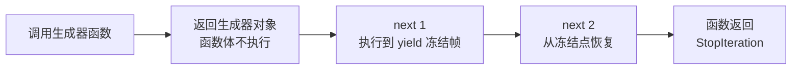
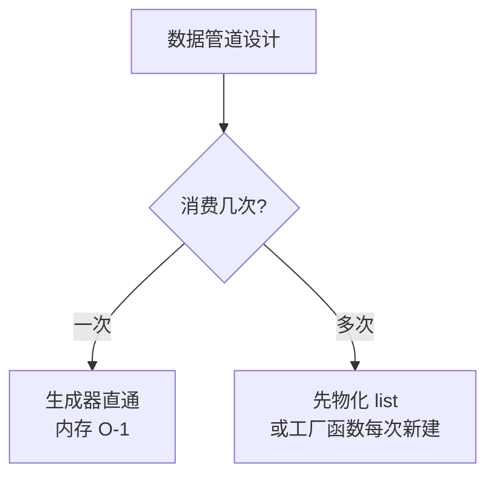

# 迭代器与生成器：惰性求值的完整机制

> 「处理 10GB 日志为什么用 for line in f 不会爆内存？」答案藏在生成器的机制里：**不存储、按需产、走一步算一步**。生成器函数和生成器表达式有什么区别？yield 让函数「暂停」是怎么实现的？这篇把惰性求值的完整机制拆开。

## 一句话摘要

**迭代器协议**（`__iter__/__next__`）定义「可被逐个取值」，**生成器**是迭代器的工厂化语法——带 `yield` 的函数自动实现协议，且**执行状态（局部变量与指令位置）被帧对象完整保存**，next 一次走一段。生成器的全部价值来自惰性求值：内存 O(1)（不物化全量）、可表达无限序列、天然支持流式管道。

## 前置阅读

- 入门层篇 7《控制流与推导式》：for 的迭代协议语义（本篇的语法面）

## 🎯 本文核心

**核心机制一句话**：生成器 = 「可暂停的函数」——yield 处保存整帧状态，next 恢复执行到下一个 yield；迭代器协议是消费端契约，生成器是生产端的最省实现。

**机制链**：调用生成器函数 → 不执行、返回生成器对象 → next → 执行到 yield 并**冻结帧** → 再 next → 从冻结点恢复。这条链是 Python 流式处理的架构总线：文件逐行、数据库游标、分页拉取、ETL 管道，上下游全部走「惰性产出-按需消费」这一条协议。

## 上下游一分钟

生成器在数据链路架构里的位置：它是「生产者与消费者之间的缓冲阀」——上游（文件/网络/DB 游标）按需拉，下游（循环/聚合）按需吃，模块边界处用 yield 解耦两边的速度差。向上它让 for 循环无差别消费任何来源（协议统一），向下它管理一个可暂停的栈帧（机制层的独特存在——普通函数调用要么执行完要么不执行，只有生成器有「中间态」）。理解这个位置，pipe 式数据流的设计就有了地基。

## 一、两种创建方式与协议的完整实现

```python
# 方式一：生成器函数（yield 标记）
def countdown(n):
    while n > 0:
        yield n          # 产出并暂停
        n -= 1

# 方式二：生成器表达式（推导式的惰性版）
squares = (x * x for x in range(10**9))   # 瞬间创建，不计算

# 方式三：手写迭代器类（理解协议的原始形态）
class Countdown:
    def __init__(self, n): self.n = n
    def __iter__(self): return self      # 迭代器返回自身
    def __next__(self):
        if self.n <= 0: raise StopIteration
        self.n -= 1
        return self.n + 1
```

三种方式的机制差异：**手写类**是最原始的协议实现（状态靠实例属性管理）；**生成器函数**把状态管理交给解释器（帧冻结，代码顺序即状态流）；**生成器表达式**是单表达式场景的语法糖。消费端完全一致——`for x in it` 都走 `iter()` + `next()` 到 StopIteration。

**追问链**：为什么生成器函数「调用时不执行」？——`def` 里含 yield 时，编译器把该函数标记为生成器函数：调用它**创建并返回生成器对象**（函数体一行不跑），执行权从第一次 next 才开始。→ 再追问：暂停时局部变量在哪？——在**帧对象**（frame）里：生成器持有自己的帧，yield 时帧出栈但对象保留，next 时帧重新入栈从 yield 的下一条字节码继续——这是「可恢复执行」的机制本质，也是普通函数没有的能力。



## 二、yield 的进阶形态：双向通道与委托

yield 不只是「产出」——它是**双向通道**与**控制权转移**：

```python
def echo():
    while True:
        received = yield        # yield 作为表达式：接收 send 的值
        print("收到", received)

e = echo()
next(e)                  # 预激：推进到第一个 yield（不能跳过）
e.send("hello")          # 双向：值流入 received

def inner():
    yield 1
    yield 2
def outer():
    yield 0
    yield from inner()   # 委托：把 inner 的产出逐个转发（3.3+）
    yield 3
list(outer())            # [0, 1, 2, 3]
```

- **`send`**：把值注入暂停点（yield 表达式的「返回值」）——生成器从「纯生产者」升级为「协程雏形」（asyncio 的早期实现正是基于 yield + send，历史渊源）；
- **`yield from`**：委托子生成器——不只是转发值，还透明转发 send/throw/StopIteration 的返回值（`result = yield from sub` 拿子生成器返回值）。它的完整语义复杂到 PEP 380 用一整篇定义——**这正是后来 async/await 语法要把它简化掉的动因**（演进脉络：yield from 是协程的脚手架，await 是它的成品形态）。

## 三、性能与内存的账本

惰性求值的收益用数字说话（行业认知量级）：

- **内存**：`[x for x in range(10**7)]` 物化 1000 万元素（数百 MB 级）；`(x for x in range(10**7))` 生成器对象常数级内存（百字节级）——**差 6 个数量级**；
- **启动延迟**：生成器表达式创建瞬时完成（不计算），列表推导全量算完才返回——首元素延迟决定交互场景选谁；
- **单元素代价**：生成器每次 next 有帧恢复开销，遍历总时间比列表慢 10-30%（行业认知）——**内存省的钱是用每步的间接性付的**。

**边界判断**：数据需要反复遍历/随机访问/len → 物化列表；一次性流式消费/数据巨大/无限序列 → 生成器。取舍的锚点是**遍历次数**：一次遍历用生成器，多次遍历物化（生成器是一次性的——耗尽即空，这是它最常见的误用点）。

## 四、事故推演：耗尽的生成器

典型线上事故形态（行业化用）：数据管道把 `rows = (parse(r) for r in fetch())` 传给两个下游函数——第一个函数消费完后，第二个函数拿到的是**已耗尽的空生成器**，静默产出空结果，下游报表空了一半且无报错。定位：生成器是**一次性流**，`len()` 都不能调（没有长度概念），二次消费必然为空。**复盘 Action**：① 跨函数共享的数据源一律先物化（`list(rows)`）或改造成「每次调用返回新生成器的工厂函数」；② 管道层加「空结果告警」——空可以是合法状态，但静默变空不行。

💡 实战提示：工具函数接收「可迭代对象」时，内部第一步常做 `items = list(items)`——牺牲一点内存，换取「可迭代入参无论传列表还是生成器都行为一致」的健壮性（标准库大量函数正是这个防御姿态）。

## 与其他语言的区别（跨语言视角）

- **与 Java 的区别**：Java 的 Stream 是「惰性 + 声明式算子」但不是可暂停函数（无 yield）；Java 也没有「帧冻结」的语言原语——Python 的生成器在语言层提供协程地基，Java 要靠线程或虚拟线程模拟；
- **与 JS 的区别**：JS 的 generator/yield 直接借鉴 Python（语法几乎同构），差异在 JS 用 `function*` 标记、迭代器协议叫 Symbol.iterator——**「惰性可暂停函数」是动态语言的共同演进方向**；
- **与 Go 的区别**：Go 1.23 前没有生成器（用 channel 手工模拟流），1.23 引入 range-over-func 才补上——语言演进再次验证「惰性序列原语」的必要性。

## 源码关键路径

- **`iter(obj)`** → 调 `type(obj).__iter__()`；**`next(it)`** → 调 `type(it).__next__()`——协议分发的入口（内建函数版）；
- **生成器对象**：CPython 的 `genobject.c`（`gen_send_ex` 处理帧恢复与 send 注入）——yield 的暂停/恢复在解释器源码层就是「帧出栈保留 / 重新求值」；
- **`yield from` 的完整委托语义**：CPython 编译为 `GET_YIELD_FROM_ITER` + 循环转发指令——PEP 380 定义、字节码层实现（想知道「透明转发」有多复杂，看这条指令的注释长度）。



## 业内惯例与生产实践

- **惯例一**：工具函数入参防御性物化（`items = list(items)`）——标准库与 requests/SQLAlchemy 等主流库的通用姿态，健壮性优先于极致内存。
- **惯例二**：大文件/大结果集一律流式（生成器逐行/逐批），「一次性读入」写进代码评审的黑名单。
- **惯例三**：生成器管道的阶段命名即函数命名（fetch → parse → filter → aggregate），管道架构用函数名自文档。

## 常见误区

- ❌ 「生成器可以重复遍历」——一次性流，耗尽即空（事故推演的主角）；
- ❌ 「生成器表达式里的异常会在创建时抛出」——创建时不执行任何代码，异常推迟到消费（next）时才在对应元素处抛出——「创建成功了怎么还会炸」的困惑根源；
- ❌ 「yield 和 return 一样」——return 终止（值进 StopIteration.value），yield 暂停（值交给消费者）；函数里两者混用时语义要分清；
- ❌ 「列表推导改生成器表达式一定更省」——要二次遍历的数据先物化再遍历，反而生成器更慢（反复重建）；单次流式才是生成器的主场。

## 你们可能会问

**Q1：生成器和协程到底是什么关系？**
生成器是「可暂停函数」，协程是「可暂停且可双向通信的任务」——`send` 让生成器有了协程雏形，`async/await`（PEP 492）把协程独立成原生语法。历史脉络：生成器 → yield from 委托 → asyncio（@generator 协程）→ 原生协程。**协程站在生成器的肩膀上**。

**Q2：追问——什么场景必须 yield from 而不能用循环转发？**
需要透明传递 `send/throw` 与子生成器返回值时（循环转发会丢掉双向通道）——纯单向产出用 `for v in sub: yield v` 也行，双向场景只能 yield from。

**Q3：再追问——生成器能做内存缓存吗（像 lru_cache）？**
能——`yield` 换成「先查缓存再产出」的自定义逻辑，但更推荐直接用 `functools.lru_cache` 包一个普通函数；生成器适合「流」，缓存适合「值」，混用前先想清楚数据形态。

## 开放问题

- 结构化并发（TaskGroup）时代，生成器式协程（send/throw 手工驱动）还有多少生存空间？教学价值与生产价值的分界值得在专题层用案例验证。

## 决策

**决策**：何时用生成器——单次流式消费、数据量不可预知、无限序列、管道分阶段处理；何时物化列表——多次遍历、需要 len/索引、下游要二次消费。怎么选：先问「遍历几次」再问「数据多大」，两个答案决定形态。

## 自测三问

1. 生成器函数调用时函数体为什么不执行？（编译期标记为生成器，调用返回生成器对象，首次 next 才执行）
2. yield 暂停时状态存在哪？（帧对象——局部变量与指令位置完整保留）
3. 生成器被两个下游消费会发生什么？（第一次消费耗尽，第二次拿到空——一次性流）

## 5W 速记卡

| 问题 | 答案 |
|---|---|
| What | yield 暂停函数 + 迭代器协议的工厂化语法 |
| Why | 惰性求值：内存 O(1)、无限序列、流式管道 |
| 双向 | send 注入值 / yield from 委托 |
| 性能 | 省内存 6 个数量级，单步慢 10-30% |
| 边界 | 一次性耗尽；二次消费先物化 |

## 🎯 核心带走

**30 秒复述**：生成器 = 可暂停函数（yield 冻结帧，next 恢复执行）；协议三形态（手写类/生成器函数/生成器表达式）消费端统一；进阶是 send 双向与 yield from 委托（协程的前身）。**失效点**——二次消费为空、创建时不执行（异常延后）、需要多次遍历却用了生成器。金句带走：

> **生成器不存储数据，存储的是「怎么算出下一个」——惰性是把计算推迟到被需要的那一刻。**

> **生成器是一次性的河流：流过就没了——要重复取水，先建水库（物化）。**

## 📌 数据与事实声明

- 生成器语义（PEP 255）、yield from（PEP 380）、原生协程（PEP 492）为公开语言规范；CPython genobject.c 实现为公开源码；性能比例为行业认知量级。

## 📚 参考资料

- PEP 255 / 380 / 492——生成器与协程的三部曲
- 《流畅的 Python》第 14 章「可迭代的对象、迭代器和生成器」
- asyncio 文档「Coroutines and Tasks」的历史说明段（生成器协程的演进注记）
