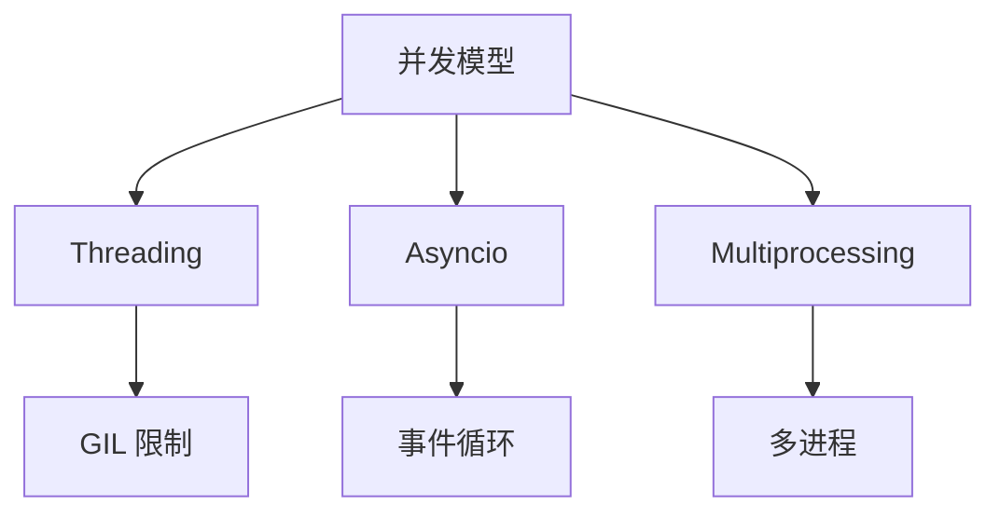
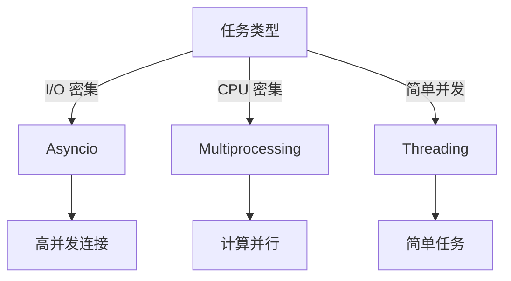

# Python 并发编程与异步生态

## 一句话摘要

Python 并发三件套：threading / asyncio / multiprocessing。本篇讲透三者的原理 + 选型 + 生产实践。

## 三大并发模型



## Threading

### 适用场景
- I/O 密集型（网络请求/文件读写）
- 简单并发任务

### 局限性
- GIL 限制 CPU 并行
- 线程安全需手动处理

```python
# 伪代码：线程池
from concurrent.futures import ThreadPoolExecutor

with ThreadPoolExecutor(max_workers=10) as executor:
    futures = [executor.submit(task, arg) for arg in args]
    results = [f.result() for f in futures]
```

## Asyncio

### 适用场景
- 高并发 I/O（Web 服务/API 调用）
- 协程友好

### 核心概念

```python
# 伪代码：async/await
import asyncio

async def fetch(url):
    async with aiohttp.ClientSession() as session:
        async with session.get(url) as resp:
            return await resp.text()

async def main():
    tasks = [fetch(url) for url in urls]
    results = await asyncio.gather(*tasks)
```

## Multiprocessing

### 适用场景
- CPU 密集型（计算/数据处理）
- 绕过 GIL

```python
# 伪代码：进程池
from concurrent.futures import ProcessPoolExecutor

with ProcessPoolExecutor(max_workers=4) as executor:
    results = list(executor.map(compute, data))
```

## 选型决策树



## 生产踩坑

1. **GIL 误判**：CPU 密集型用 threading 无效
2. **Event Loop 阻塞**：同步调用阻塞事件循环
3. **进程间通信**：序列化开销大
4. **资源竞争**：多线程共享状态需锁

## 量级考量

| 量级 | 方案 |
|---|---|
| < 100 并发 | Threading |
| 100-10000 并发 | Asyncio |
| > 10000 并发 | Asyncio + 多进程 |

## 📌 数据与事实声明

- 三种模型基于 Python 并发实践
- 选型决策树基于任务类型
