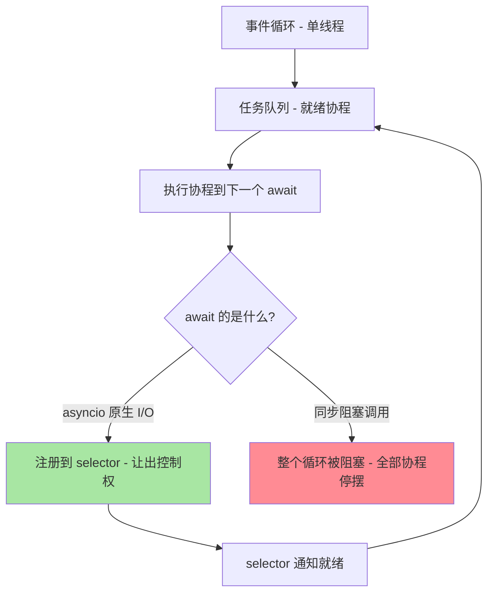
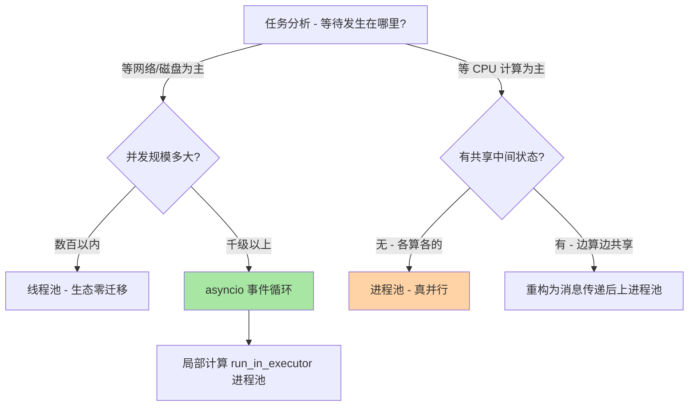
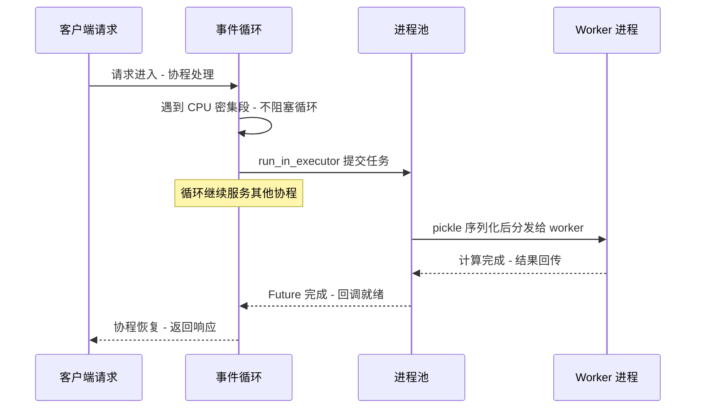

# Python 并发编程与异步生态

> 并发是 Python 与 Java/C++ 差异最大的领域：**GIL 让多线程无法并行执行字节码，asyncio 用协作式调度换来了单线程高并发，multiprocessing 用进程隔离绕开 GIL 却背上了序列化成本**。本篇从运行时机制出发把三种并发模型讲透——理解了「GIL 什么时候释放、事件循环什么时候被阻塞、进程间数据为什么要拷贝」，选型与踩坑都不再是背结论，而是推理。

## 一句话摘要

Python 并发三件套的本质差异在**调度者与阻塞单位**：threading 由操作系统抢占式调度、阻塞单位是线程（GIL 使其只对 I/O 密集有效）；asyncio 由事件循环协作式调度、阻塞单位是协程（单线程内万级并发任务，但一条同步调用阻塞全场）；multiprocessing 由操作系统调度独立进程、阻塞单位是进程（真并行，代价是 IPC 序列化）。**选型不是三选一的口味题，而是「任务被什么阻塞」的机制题：等网络选 asyncio、算数据选进程、少量并发懒得换生态选线程池。**

## 🎯 本文核心

**核心一句话：Python 并发模型的选择 = 回答「任务的等待发生在哪里」——等待在内核网络栈（I/O 密集）→ asyncio 用单线程事件循环把等待重叠起来；等待在 CPU（计算密集）→ multiprocessing 用多进程把 GIL 绕开；两者的混血（高并发 + 局部计算）→ asyncio 事件循环 + run_in_executor 进程池。一切生产事故的根源是模型混用：同步调用进了事件循环、CPU 任务压进线程池、共享状态没锁。**

机制链（全文挂这条链上）：GIL 的释放时机 → threading 的适用边界 → asyncio 事件循环机制 → multiprocessing 的成本模型 → 三模型对照与选型 → 事故复盘 → 量级演进。

## 5W 速记卡

| 维度 | 一句话 |
|---|---|
| What | threading / asyncio / multiprocessing 三种并发模型的机制、边界与组合 |
| Why | GIL 限制字节码级并行，迫使 Python 用 I/O 重叠或进程隔离实现并发 |
| When | I/O 密集高并发选 asyncio；CPU 密集选进程池；低并发脚本选线程池 |
| Where | 事件循环（asyncio）、操作系统线程（threading）、独立进程与管道（multiprocessing） |
| How | async/await 协作调度 + run_in_executor 桥接 + 队列通信替代共享状态 |

## 一、GIL：先搞清楚它到底锁住了什么

GIL（全局解释器锁）保护的是 CPython 解释器的内部状态（引用计数的完整性），不是你的业务数据。它的行为要点：**同一时刻只有一个线程在执行 Python 字节码**；**线程切换由解释器在安全点触发**（`sys.getswitchinterval()` 默认 5 毫秒，公开口径）；**线程进入阻塞式系统调用（网络收发、文件读写、`time.sleep`）时主动释放 GIL**，让其他线程运行。

这三条合起来解释了全部现象：CPU 密集任务多线程无收益（字节码执行被串行化，还要付线程切换与 GIL 争用的税，甚至比单线程慢）；I/O 密集任务多线程有效（等待网络时 GIL 已释放，其他线程在跑）；「两个线程各算各的互不加速」与「两个线程各等各的网络会加速」是同一条机制的两面。

追问：**GIL 为什么迟迟不移除？**——移除 GIL 的历史方案都撞上两堵墙：引用计数是非原子的，去掉全局锁就要给每个对象配细粒度锁（单线程性能大跌）或改用其他内存管理策略；大量 C 扩展依赖「有 GIL 才安全」的假设。这就是 free-threaded 构建（PEP 703，Python 3.13 起实验性，公开口径）出现的历史脉络——不是修一个锁，而是重造内存管理。**再深一层：3.13 之前就没有出路吗？**——有，subprocess/multiprocessing 绕行了几十年；`concurrent.futures` 把进程池封装得和线程池同构，工程上「绕开」的成本已经很低。

## 二、threading：I/O 并发的廉价选项与它的边界

```python
from concurrent.futures import ThreadPoolExecutor
import requests  # 同步客户端 - 每个请求阻塞一个线程

def fetch(url):
    resp = requests.get(url, timeout=5)
    return resp.status_code

with ThreadPoolExecutor(max_workers=50) as pool:
    results = list(pool.map(fetch, urls))
```

线程池的适用边界由两道天花板决定：**线程内存**（每线程 MB 级栈，业内认知）与**调度开销**（千级线程的上下文切换开始可感）。50-500 线程的 I/O 并发是舒适区；上千并发就应该换 asyncio。线程安全纪律：共享可变状态必须加锁（`threading.Lock`），或者更彻底——**共享状态只通过 `queue.Queue` 传递，生产者消费者各管一摊**——用消息传递消灭共享，是比「小心加锁」更可靠的设计思想。

注意 GIL 下仍需要锁的原因：GIL 保证的是「字节码指令不交叉」，但 `counter += 1` 是「读-加-写」多条字节码，线程可以在中间切换——所以「GIL 在，不用锁」是高频误区。

## 三、asyncio：事件循环、协程与阻塞禁忌



```python
import asyncio
import aiohttp

async def fetch(session, url):
    async with session.get(url, timeout=aiohttp.ClientTimeout(total=5)) as resp:
        return resp.status

async def main():
    async with aiohttp.ClientSession() as session:
        results = await asyncio.gather(*(fetch(session, u) for u in urls))
    # Python 3.11+ 更推荐 TaskGroup：异常语义更严格
    # async with asyncio.TaskGroup() as tg:
    #     tasks = [tg.create_task(fetch(session, u)) for u in urls]

asyncio.run(main())
```

事件循环的机制一句话：**协程在 `await` 处主动让出控制权，循环去跑下一个就绪协程；I/O 就绪事件由 selector（Linux epoll/macOS kqueue）通知**。这套协作式调用的纪律异常严苛：**事件循环线程内禁止一切同步阻塞**——同步 `requests`、同步数据库驱动、`time.sleep`、重 CPU 计算，任何一个都会把全部协程冻结。生产中「asyncio 服务偶发全员卡顿」的排查，九成落在「某个协程里藏了同步调用」。

桥接手段是把阻塞工作「托付」出去：`await loop.run_in_executor(None, sync_fn, arg)`（默认线程池）或传入 `ProcessPoolExecutor`（CPU 任务）。**反方案分析：为什么不选「干脆全用线程池，不学 asyncio」？**——线程模型在万级并发下被内存与调度成本卡死，而单台服务的万级长连接（WebSocket 网关、SSE 推送）正是 asyncio 的舒适区； 业内认知是 asyncio 单进程可支撑的并发任务数比线程模型高一到两个数量级。**为什么不选「异步框架里混用同步客户端」？**——上一段就是答案：混用的代价不是「慢一点」，是「整个服务的并发性归零」，这是事故级别的错误而不是风格问题。

### 追问链：协程到底比线程轻在哪里？

**追问一：协程切换的成本是什么？**——协程切换是用户态的「保存/恢复栈帧指针 + 循环队列操作」，纳秒到微秒级；线程切换要陷入内核、保存完整上下文，微秒级起步且缓存失效的代价更大。**再深一层：协程的内存成本呢？**——协程对象只持有栈帧与状态，KB 级；线程要 MB 级栈。两项叠加，万级并发的内存与切换成本差出数量级——这就是「高并发 I/O 用 asyncio」的全部机制依据。**打破砂锅：协作式调度最大的风险是什么？**——一个协程不配合（不让出），全体陪绑；抢占式调度没有这个问题但成本高。asyncio 的 debug 模式（`loop.set_debug(True)`、`PYTHONASYNCIODEBUG=1`）会把「超过 100 毫秒不放手」的回调打日志（公开口径的默认阈值），是定位阻塞协程的第一工具。

## 四、multiprocessing：真并行的代价模型

```python
from concurrent.futures import ProcessPoolExecutor

def crunch(chunk):
    return sum(x * x for x in chunk)

if __name__ == "__main__":  # Windows/macOS spawn 模式必须的保护
    with ProcessPoolExecutor(max_workers=8) as pool:
        results = list(pool.map(crunch, chunks))
```

进程池绕开 GIL 获得真并行，代价模型有三项：**启动成本**——`spawn` 启动方式（macOS 3.8+ 默认）每个进程都要重新 import 主模块，启动慢；`fork`（Linux 默认）快但与线程混用时可能死锁（fork 只复制调用线程，锁状态被原样带走），这就是「fork 不安全」问题；**IPC 成本**——参数与返回值都要 pickle 序列化跨进程拷贝，传大对象（大 DataFrame、大数组）的序列化时间可能超过计算本身；**内存成本**——每个进程独立解释器与堆，8 进程就是 8 份运行时。

工程纪律由此推出：**进程池只传「小的输入、小的输出」**——大共享数据用模块级初始化（子进程各自加载）或共享内存（`multiprocessing.shared_memory`）；**任务粒度要粗**——毫秒级小任务切给进程池，IPC 开销反超收益，按「单任务 ≥ 数十毫秒」起估（业内认知）。

**反方案分析：为什么不选「所有 CPU 密集都上多进程」？**——进程间没有廉价共享，凡业务需要「边算边共享中间状态」的任务，进程模型会把代码改成消息传递风格；且进程数超过物理核数后无收益。numpy/pandas 这类 C 扩展在自己的 C 层释放 GIL 且用 SIMD 并行，很多「数值计算」根本不需要进程池——先确认「瓶颈真的在 Python 字节码里」再上多进程。

## 五、三模型对照与组合拳

| 维度 | threading | asyncio | multiprocessing |
|---|---|---|---|
| 调度方式 | 内核抢占式 | 事件循环协作式 | 内核抢占式（独立进程） |
| GIL 影响 | 字节码串行 | 单线程无争用 | 完全绕开 |
| 并发成本 | 每线程 MB 级栈 | 每协程 KB 级 | 每进程完整解释器 |
| 适用负载 | 中低并发 I/O | 万级并发 I/O | CPU 密集 |
| 致命禁忌 | 共享状态漏锁 | 循环内同步阻塞 | 大对象 IPC |

生产系统的真实形态常常是组合：**asyncio 服务 + 进程池**（事件循环管万级连接，计算丢给 `run_in_executor` 的进程池）、**多进程 worker + 线程池**（每个 worker 进程内再用线程池摊 I/O 等待）——组合的选择逻辑依然是「每一层回答一次『等待发生在哪里』」。

### 选型决策：把「等待在哪里」画出来



组合形态（asyncio 服务把计算托付给进程池）的调用时序：



### 事故复盘：一次「异步服务的定时全服卡顿」

现象：asyncio 网关服务每隔几分钟出现秒级全接口延迟尖峰，CPU 不高、下游正常。排查路径：先看访问日志确认「同一时刻所有路由」同时变慢——排除单个下游；开 `PYTHONASYNCIODEBUG` 复跑，日志捕捉到一个回调 900 毫秒未让出；回溯代码发现上报埋点用了同步日志库（内置 flush 时刷盘阻塞）且日志卷在增长。复盘动作：埋点换异步安全的队列日志；事件循环加 debug 探针常态化；压测中加入「阻塞检测」。教训：**事件循环的单线程既是它的性能来源，也是它的一票否决制**——一个协程的同步阻塞就是全服务的阻塞。

### 事故复盘：一次「fork 死锁」的排查

现象：服务在 Linux 上偶发启动后整体无响应，进程存在但不干活，macOS 开发机上无法复现。排查路径：先看线程栈——主线程持有一把锁后 fork，子进程的日志线程等这把锁；再查代码——服务在已有多线程的状态下用了 `multiprocessing`（默认 fork 启动方式），子进程继承了「已锁定但永不释放」的锁状态。复盘动作：多线程服务的子进程一律显式 `spawn` 启动；fork 后立即执行的工作收窄到「只做 exec 类操作」；排查指引沉淀进 oncall 文档。教训：**fork 复制的是进程的瞬时状态（包括锁的持有状态），不是「重新开始」**——线程与 fork 混用是 Unix 老坑，Python 只是原样继承。

💡 **实战提示：把「事件循环延迟」做成核心监控指标**。看门狗协程每秒醒来一次并上报「预期唤醒与实际唤醒的偏差」，偏差持续超过 100 毫秒告警——它是 asyncio 服务的「体温计」，异常升温总在用户报障之前。

💡 **实战提示：进程池的 max_workers 按物理核数而不是逻辑核数定**。计算任务在超线程的逻辑核上收益有限（业内认知：一到三成），核数超配只会加剧内存与调度开销；用 `os.cpu_count()` 起估后按实测校准。

💡 **实战提示：线程池与进程池的异常不要吞**。`future.result()` 会重新抛出任务内的异常，`pool.map` 则在迭代结果时抛出——批量任务里「某个任务失败导致整批结果拿不到」是高频坑，按任务粒度包一层 try 或用 `return_exceptions=True` 语义收集。

💡 **实战提示：压测必须覆盖「模型错误」场景**。把一段 50 毫秒的同步 sleep 注入事件循环、把 CPU 任务塞进线程池各跑一轮——让团队亲眼看一次「模型选错的曲线长什么样」，比十次 code review 都有效。

## 六、什么时候用 / 什么时候不用

**什么时候用 threading / 线程池**：几十到几百并发的 I/O 任务、依赖只有同步客户端（老 SDK）、脚本级批处理——成本最低的并发选项。**什么时候用 asyncio**：高并发 I/O（千级以上连接）、长连接服务（WebSocket/SSE）、异步生态齐全（aiohttp/asyncpg/aioredis）的服务端——并发规模与等待重叠是它的两把尺。**什么时候用 multiprocessing**：纯计算（无共享中间状态）、任务粒度粗、核数可摊——先用性能分析确认瓶颈在字节码再动手。**明确推荐**：新服务端项目默认 asyncio 生态起步（同步依赖就绪度作为前置评审项）；数据处理脚本按「I/O 批量 → 线程池 / 计算密集 → 进程池」两行口诀执行；混合负载直接上「asyncio + 进程池」组合。

## 七、Trade-off：每一步都在付出什么

| 选择 | 得到 | 付出 | 适用判断 |
|---|---|---|---|
| 线程池做 I/O | 生态零迁移、心智简单 | 内存与调度天花板 | 数百并发以内 |
| asyncio | 万级并发、低成本等待重叠 | 全栈异步纪律、阻塞禁忌 | 高并发服务 |
| TaskGroup/gather | 并发组织清晰 | 异常传播语义要吃透 | 异步必会 |
| run_in_executor | 同步代码平滑接入 | 桥接的额外延迟 | 混合依赖 |
| 进程池 | 真并行绕开 GIL | IPC 序列化与内存拷贝 | 粗粒度 CPU 任务 |
| shared_memory | 免序列化共享 | 平台差异与生命周期管理 | 大数据集并行 |
| fork 启动 | 启动快 | 与线程混用死锁风险 | 无线程时才默认 |
| spawn 启动 | 干净安全 | 每进程重新 import | 多线程服务必选 |

贯穿全篇的设计思想：**Python 的并发设计空间是用「模型纪律」换「性能上限」**——线程的纪律是加锁、asyncio 的纪律是不阻塞、进程的纪律是少共享；每接受一种纪律，就换来对应量级的并发能力。纪律被打破的那一刻（漏锁、阻塞、大 IPC），性能优势立即反转成故障源。

## 八、不同量级的思考：架构约束驱动解法

- **十万级（日请求十万量级）**：约束来源是单机进程容量与依赖延迟，思考方式是监控驱动——这一档的核心问题是「并发模型与依赖生态是否一致」，而不是「并发数还能不能调」。同步栈 + 线程池（每 worker 数十线程）或单进程 asyncio 都能覆盖；关键动作是给每种模型上对应的监控（线程池队列深度 / 事件循环延迟）。
- **百万级（日请求百万量级）**：约束来源是连接密度与尾延迟，思考方式是等待重叠驱动——这一档的核心问题是「等待时间有没有被重叠起来」，而不是「加机器还是加线程」。全面 asyncio 化（客户端全部换异步）+ 阻塞检测常态化；多进程部署 asyncio 服务（每核一进程，进程内万级协程）成为标准形态。
- **千万级及以上**：约束来源是单机网络栈上限与调度抖动，思考方式是分片驱动——这一档的核心问题是「连接与任务怎么跨进程跨机器分片」，而不是「单进程还能榨多少」。按连接分片的 SO_REUSEPORT 多进程、按业务域的服务拆分、CPU 部件下沉为独立计算服务（进程池出壳）——量级到顶时，「单机并发模型」就升格为「分布式并发架构」。
- **自下而上的演进触发器**：线程池队列开始排队 → 上 asyncio 或加进程；事件循环延迟毛刺 → 阻塞排查；CPU 打满但 I/O 等待占比仍高 → 检查是否有任务误入了错误的模型。每一档的迁移都由上一档的瓶颈数据触发——并发模型的迁移成本高，但错的模型撑不到量级。到亿级：这一档的核心问题是「并发架构要不要跨机器分片」，而不是「单机模型还能优化多少」——上下游的分片键（连接归属、任务归属）决定了水平扩展的天花板，单机并发模型的所有优化都以此为边界。

## 你们可能会问

**Q1：asyncio.gather 和 TaskGroup 有什么区别？**
`gather` 默认收集所有结果，某个任务抛异常时默认快速上抛但其余任务仍在后台跑（3.8+ 有 `return_exceptions` 语义）；3.11+ 的 `TaskGroup` 是结构化并发——任一任务失败会取消同组全部任务并聚合异常，「不会留下失控的后台任务」。新代码优先 TaskGroup。

**Q2：`asyncio.run()` 之后事件循环就关闭了吗？里面的后台任务呢？**
循环关闭，未完成的任务被取消——「fire-and-forget」的任务（`create_task` 后不持有引用）既可能被 GC 回收也可能静默丢失。需要后台常驻任务就显式持有 Task 引用并在优雅退出时 await/取消，这是 asyncio 优雅停机的一部分。

**Q3：GIL 移除（free-threaded Python）后还要学这些吗？**
要。3.13 的 free-threaded 构建仍是实验性（公开口径），生态适配与单线程性能代价还在验证；而且 asyncio 的价值不止绕 GIL——协作调度对高并发 I/O 的成本优势在无 GIL 世界依然成立。并发模型思维（等待在哪里、阻塞归谁管）是跨版本不变的。

**Q4：怎么测量「事件循环被阻塞了多久」？**
两种手段：debug 模式的慢回调日志（阈值 100 毫秒，公开口径默认）；或起一个「看门狗协程」周期 sleep 并对比预期唤醒时间与实际唤醒时间之差——差值即循环被阻塞的时长，可接监控指标。生产 asyncio 服务建议两项都常开。

## 自测三问

1. GIL 在什么时机释放？为什么 I/O 密集多线程有效而 CPU 密集无效？
2. 事件循环里一条同步阻塞调用会造成什么后果？有哪些桥接手段？
3. multiprocessing 的三项成本是什么？「fork 不安全」的机制根源在哪里？

## 开放问题

- free-threaded 构建与 JIT（3.13 实验性）将改变「GIL 约束下」的全部性能推理，Python 并发生态（异步/线程库的适配矩阵）未来两三年会重新洗牌，选型时保留迁移弹性。
- asyncio 的结构化并发（TaskGroup/ExceptionGroup）语义仍在细化，跨框架（Web/任务队列/测试）的一致性尚在收敛，团队规范要先于语言特性统一。

## 🎯 核心带走

- **核心一句话**：并发选型 = 回答「等待发生在哪里」——网络等待用 asyncio 重叠、计算等待用进程并行、小规模用线程池；每种模型换来性能的代价是一份必须遵守的纪律（加锁/不阻塞/少共享）
- **机制链**：GIL 释放时机 → 线程边界 → 事件循环与协作调度 → 进程成本模型 → 组合形态 → 事故案卷 → 量级演进
- **哪里会坏**：同步调用混进事件循环全员卡顿、多线程 fork 死锁、共享计数器漏锁、CPU 任务误入线程池
- **边界**：本篇管并发模型选型与纪律；GIL 内部实现、字节码与内存管理的机制在下一篇《Python 运行时机制深度解析》展开

## 📌 数据与事实声明

- 写于 2026-09-16，机制描述以 CPython 3.12/3.13 官方文档为准；线程切换间隔默认 5 毫秒、asyncio 慢回调阈值 100 毫秒为官方默认值
- 线程栈大小、协程内存、并发数量级对比均为业内认知或公开口径，非特定实测
- free-threaded（PEP 703）与 JIT 状态以 PEP 与官方发布说明为准

## 📚 参考资料

| 类型 | 标题 | 来源 |
|---|---|---|
| 官方文档 | asyncio（事件循环/结构化并发） | docs.python.org/3/library/asyncio |
| 官方文档 | concurrent.futures（线程池/进程池） | docs.python.org/3/library/concurrent.futures |
| 官方文档 | multiprocessing（启动方式/shared_memory） | docs.python.org/3/library/multiprocessing |
| 公开规范 | PEP 703（free-threaded CPython）/ PEP 653 相关讨论 | peps.python.org |
| 官方源码 | cpython（Modules/signalmodule.c、Lib/asyncio） | github.com/python/cpython |
| 系列内篇 | 本系列篇 1《装饰器原理》篇 2《迭代器与生成器》/ 运行时机制系列篇 1《GIL 与线程模型》 | 关联系列 |
