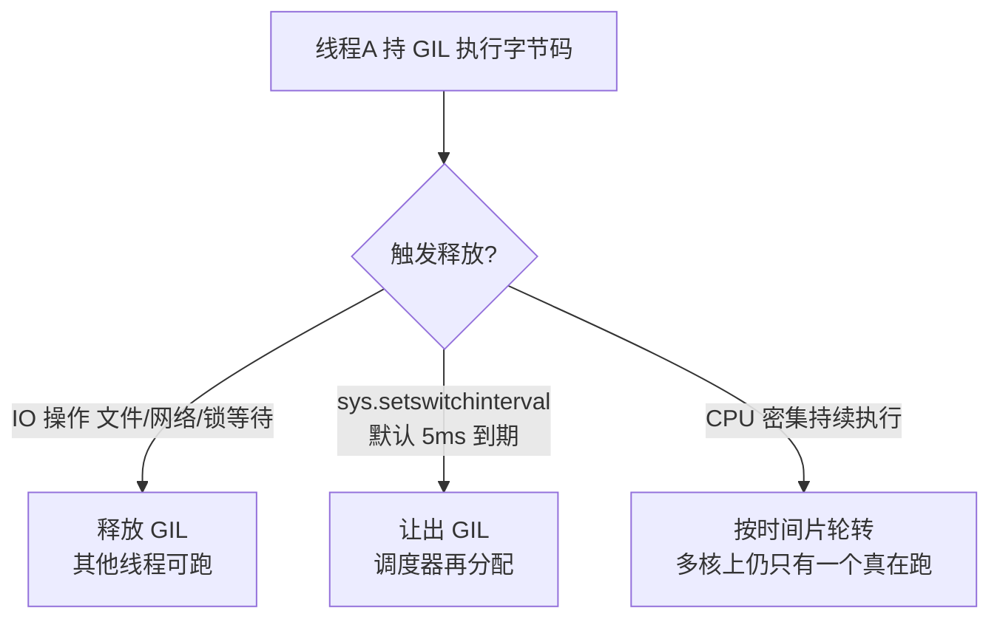
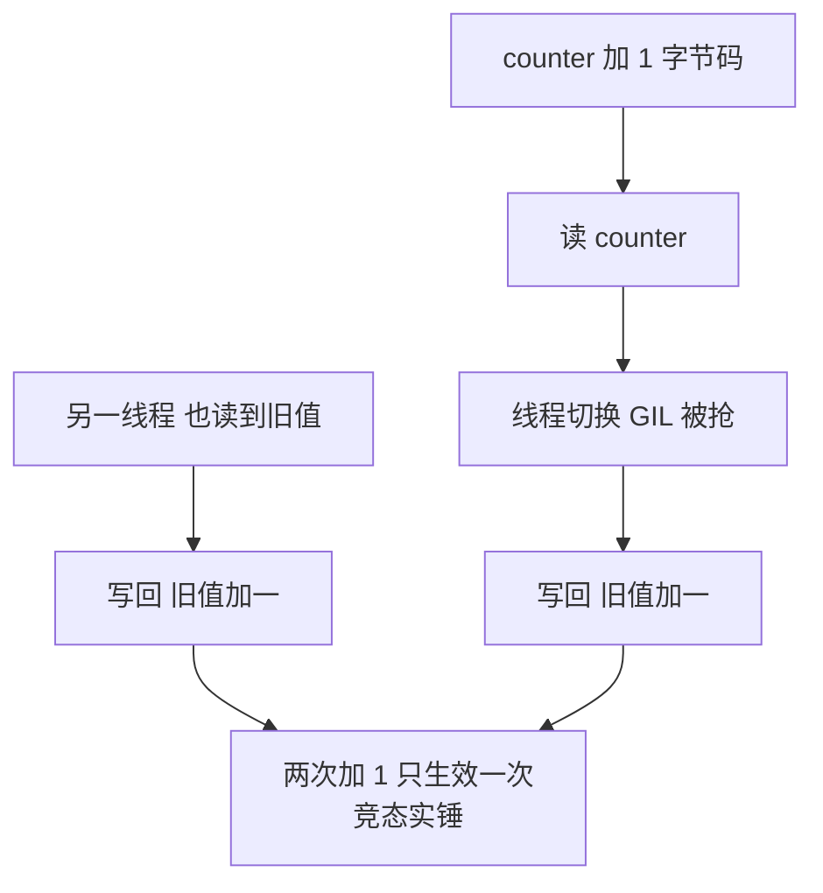

# GIL 与线程模型：一把全局锁的来龙去脉

> 「Python 多线程没用」——这句话对了一半。为什么 CPU 密集任务多线程不加速、IO 密集任务却加速明显？GIL 到底锁住了什么、为什么至今不删、free-threading（PEP 703）又要怎么改写它？这篇把一把锁讲成一部并发架构史。

## 一句话摘要

GIL（全局解释器锁）是 CPython 的**互斥锁：同一时刻只允许一个线程执行 Python 字节码**。它保护的是解释器的内部状态（引用计数的并发安全），代价是**多线程无法在多核上并行执行 Python 代码**——CPU 密集任务多线程不但不加速还因锁争用变慢；但 **IO 等待时会释放 GIL**，所以 IO 密集任务多线程依然有效。CPU 并行的正解是 multiprocessing（多进程）或下沉 C 扩展。

## 前置阅读

- 入门层篇 1《Python 是什么》：解释执行与 C 扩展下沉（GIL 存在的架构前提）

## 🎯 本文核心

**核心机制一句话**：GIL 锁的不是你的数据，是**解释器执行字节码的权利**——每线程必须持锁才能跑字节码，多核并行被锁成单核轮转。

**机制链**：线程执行字节码前抢 GIL → 执行若干指令（或遇 IO/定时检查）→ 释放 → 其他线程抢锁。这条链决定了 Python 并发的模块边界：**线程内并行被锁死、线程间 IO 并发保留、进程级并行完整**——三种并发工具的适用域由这把锁一刀切开。

## 上下游一分钟

GIL 在 Python 并发架构里的位置：向上它决定「threading 能干什么」的承诺边界（并发调度 ≠ 并行计算），向下它系于 CPython 的内存管理实现（引用计数无锁即错）。它是解释器实现层的决策外溢到语言层——**语言规范没说必须有 GIL**（Jython/IronPython 就没有），这是「实现细节变成语言烙印」的经典案例，也是理解 free-threading 演进的关键视角。

## 一、为什么需要 GIL：引用计数的并发死穴

CPython 的内存管理靠**引用计数**：每个对象头部计数器，加减引用即加减计数。两个线程同时 `sys.getrefcount` 修改同一对象的计数（非原子操作：读-加-写三步）——计数错乱 → 内存泄漏或悬垂指针 → 崩溃。

历史上的三个解法对比（演进脉络）：

| 方案 | 做法 | 为什么 CPython 没选 |
|---|---|---|
| 细粒度锁 | 每个对象一把锁 | 死锁风险 + 锁开销在单线程场景反而更慢（GIL 单线程几乎零成本） |
| 循环 GC 替代计数 | 放弃引用计数 | 引用计数是简单性与实时性的最优折中（确定性回收） |
| **全局一把锁** | 解释器级互斥 | **单线程零开销、实现简单——1990 年代的务实选择** |

**追问链**：为什么当年不选细粒度锁？——1991 年的硬件没有多核常态，细粒度锁的复杂度买不到任何收益；GIL 是「单核时代正确、多核时代负债」的教科书级技术债。→ 再追问：为什么三十年不还？——每次移除尝试都撞上「C 扩展生态依赖 GIL 的隐式线程安全」这座山：NumPy/数据库驱动等扩展在无 GIL 下的正确性是生态级迁移工程。

## 二、机制细节：什么时候释放、切换怎么发生

两条释放规则的推论：

1. **IO 释放**——阻塞式 IO（socket/文件/sleep）前主动释放 GIL：8 个线程爬 8 个网页，等待期完全并发——**这就是「多线程对 IO 密集有效」的机制根据**；
2. **时间片轮转**——CPU 密集线程按 `sys.setswitchinterval()`（默认 5ms）强制让出：切换开销照付，**却没有并行收益**——CPU 密集多线程「不加速反变慢」的机制根据（切换 + 缓存失效都是纯损耗）。

**事故推演**：数据服务把「JSON 大对象序列化」放进线程池想加速，QPS 不升反降——序列化是纯 CPU 字节码执行，线程池只增加 GIL 争用与上下文切换。复盘 Action：CPU 密集段改 multiprocessing 或换 orjson（C 扩展，序列化循环在 C 层不受 GIL 约束）——**同一任务的两种改法都成立，判断依据只有一条：字节码执行占比**。

## 三、三种并发工具的适用域（决策核心）

GIL 一刀切出的三块领地（决策构件，给明确推荐）：

| 工具 | 并行性 | 适用 | 为什么 |
|---|---|---|---|
| **threading** | 并发（非并行） | IO 密集：爬虫/DB 查询聚合/文件网络 | IO 等待期释放 GIL，等待期并发即可加速 |
| **multiprocessing** | 真并行（多进程多核） | CPU 密集：批量计算/压缩/解析 | 每进程独立解释器+独立 GIL，进程间无锁争用 |
| **asyncio** | 并发（单线程协程） | 高并发 IO：万级连接网关 | 事件循环 + await 主动让出，无锁无线程切换开销 |

**推荐口径**：IO 并发量小（<100 连接）用 threading（心智最简）；海量 IO 连接用 asyncio；CPU 打满用 multiprocessing 或下沉 C。「并发」与「并行」这两个词在这里必须分清：**GIL 禁的是并行，不禁并发**——所有争议的根源都是把这两个词混用。

## 四、free-threading：PEP 703 的改写

Python 3.13 起 free-threading 构建（实验性）允许**关闭 GIL**：机制上改用**偏向引用计数（biased reference counting）**——对象归属线程用无锁计数、跨线程访问走慢路径加锁，配合 mimalloc 式分配器把锁成本压到可接受。两个现实约束（行业认知）：

1. **生态迁移是长跑**：C 扩展需声明自身线程安全（`Py_mod_gil` 槽位声明不支持 GIL 的约束），存量扩展的审核是生态级工程；
2. **单线程性能损耗**：free-threading 构建下单线程代码约有百分之十几的损耗（量级认知，随版本改善）——**并行收益与单线程成本并存**，按负载选构建。

演进判断：GIL 不会「被删除」，会「被可选化」——default 构建长期保留 GIL，free-threading 作为独立构建按需启用。这是技术债清偿的第三种形态：不是还清，是**拆分成两个产品线**。

## 💡 实战提示

- 判断任务归属的第一问：「这段代码在等（IO）还是在算（CPU）？」——等的多用 threading，算的多用 multiprocessing/下沉 C，一句话完成选型。
- 两个线程共享的计数器/集合，别赌 GIL 的字节码原子性——`queue.Queue` 或锁是唯一的正解，竞态 bug 的复现成本远高于加锁成本。

## 与其他语言的区别（跨语言视角）

- **与 Java 的区别**：JVM 每对象自带轻量锁（偏向锁/轻量级锁升级机制），线程天然多核并行——代价是每个对象头都为并发付出 8 字节；CPython 选择「对象头保持最小 + 一把全局锁」，两者的取舍镜像；
- **与 JS 的区别**：JS 干脆单线程（无共享内存线程模型，Worker 是消息传递），回避了同一问题；Python 选择「线程存在但执行串行」——回避的方式不同，GIL 是折中产物；
- **与 Go 的区别**：goroutine 由运行时调度到多核（MPG 模型），并发原语与并行能力统一——对比之下 GIL 把「并发编程模型」与「并行执行能力」撕开了，Python 社区三十年都在缝补这道缝。

## 源码关键路径

- **GIL 本体**：CPython `ceval_gil.h`（`take_gil/ drop_gil`）——抢锁/释放的实现；切换间隔由 `sys.setswitchinterval` 落到 `_PyEval_SetSwitchInterval`；
- **释放点**：阻塞 IO 的 C 层包装（`Py_BEGIN_ALLOW_THREADS / Py_END_ALLOW_THREADS` 宏对）——NumPy 大运算、DB 驱动 query 都在这里放行多线程；
- **free-threading 构建**：`--disable-gil` 编译开关 + 对象头 `ob_tid`/偏向计数字段（`object.h` 变更）——PEP 703 的实现落点，读源码可直接看引用计数的双路径。

## 你们可能会问

**Q1：GIL 下还需要给共享数据加锁吗？**
要——GIL 保证字节码级原子性，不保证「多字节码操作序列」的原子性：`counter += 1` 是读-加-写三条字节码，线程切换可插在中间（竞态真实存在）。GIL 不是线程安全银弹，锁该加还得加。

**Q2：追问——为什么 `counter += 1` 会错，`d[key] = v` 也一样吗？**
同类风险——任何「读-改-写」复合操作都可被打断；dict 的单次 setitem 在 CPython 实现里碰巧原子，但这是实现细节不是语言承诺，换解释器/换版本即失效。**依赖实现巧合的线程安全 = 定时炸弹**。

**Q3：再追问——multiprocessing 开销多大，什么时候不值得？**
进程启动 + 数据序列化（pickle 跨进程）是主要开销：任务耗时毫秒级则开销吞掉收益，任务耗时秒级且可分片才值得。经验口径：单任务 < 100ms 直接线程或单进程（认知值，按实测为准）。

## 业内惯例与生产实践

- **惯例一**：线程池大小按「IO 等待比」估（纯 IO 可远大于核数），进程池大小 = CPU 核数（多一个反而争抢）——池化参数的第一性依据；
- **惯例二**：C 扩展调用前释放 GIL（扩展里 `Py_BEGIN_ALLOW_THREADS`）——NumPy 大矩阵运算能多线程并行的原因；选库时「是否释放 GIL」是性能评审项；
- **惯例三**：3.13+ 的 free-threading 构建先在无 C 扩展依赖的纯 Python 服务试点，核心生产服务等生态就绪——新技术线的灰度纪律。

## 开放问题

- free-threading 生态就绪后，threading/asyncio/multiprocessing 三分天下的格局会重排吗？（free-threading 的线程池可能同时吃掉 IO 并发与 CPU 并行两个市场）——3.14/3.15 的采纳率是观察窗口。

## 决策

**决策**：何时 threading——IO 等待占比高且并发量中小；何时 asyncio——海量 IO 连接 + 代码愿意全面异步化；何时 multiprocessing——CPU 密集且任务可分片；何时下沉 C——单点热点函数且三方库已有轮子。取舍总纲：**判断依据永远是「字节码执行占比」**，不是语言偏好。

## 自测三问

1. GIL 到底锁什么？（解释器执行字节码的权利——保护解释器内部状态而非用户数据）
2. 为什么 IO 密集多线程有效？（IO 等待前释放 GIL，等待期真并发）
3. CPU 密集的正解与判断依据？（multiprocessing/下沉 C；依据 = 字节码执行占比）

## 5W 速记卡

| 问题 | 答案 |
|---|---|
| What | 解释器级互斥锁：同刻一线程跑字节码 |
| Why 存在 | 引用计数的并发安全，1990 年代的务实选择 |
| 释放时机 | IO 阻塞 / 5ms 时间片到期 |
| 三工具 | threading=IO 并发 / asyncio=海量 IO / multiprocessing=CPU 并行 |
| 演进 | PEP 703 free-threading：GIL 可选化，生态迁移长跑 |

## 🎯 核心带走

**30 秒复述**：GIL 为引用计数并发安全而生，锁的是字节码执行权——IO 释放所以 IO 并发有效，CPU 轮转所以计算并行无效；三分天下的判据是字节码执行占比；PEP 703 把 GIL 变成可选构建。**失效点**——`+=` 复合操作的竞态、CPU 任务误进线程池、依赖实现巧合的原子性。金句带走：

> **GIL 禁的是并行，不禁并发——所有「Python 多线程没用」的争论，都死于这两个词的混用。**

> **技术债的终局未必是还清——GIL 的答案是拆成两条产品线，让历史债务与未来架构各走各的路。**

## 📌 数据与事实声明

- GIL 机制、切换间隔默认 5ms、PEP 703 free-threading（3.13 起实验性）为 CPython 公开文档与 PEP；单线程损耗与并发规模阈值为行业认知量级，随版本与负载浮动。

## 📚 参考资料

- CPython 官方 Wiki：GlobalInterpreterLock
- PEP 703——Making the Global Interpreter Lock Optional
- 《流畅的 Python》并发章节（GIL 影响的实验复现）
