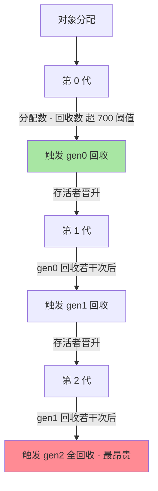
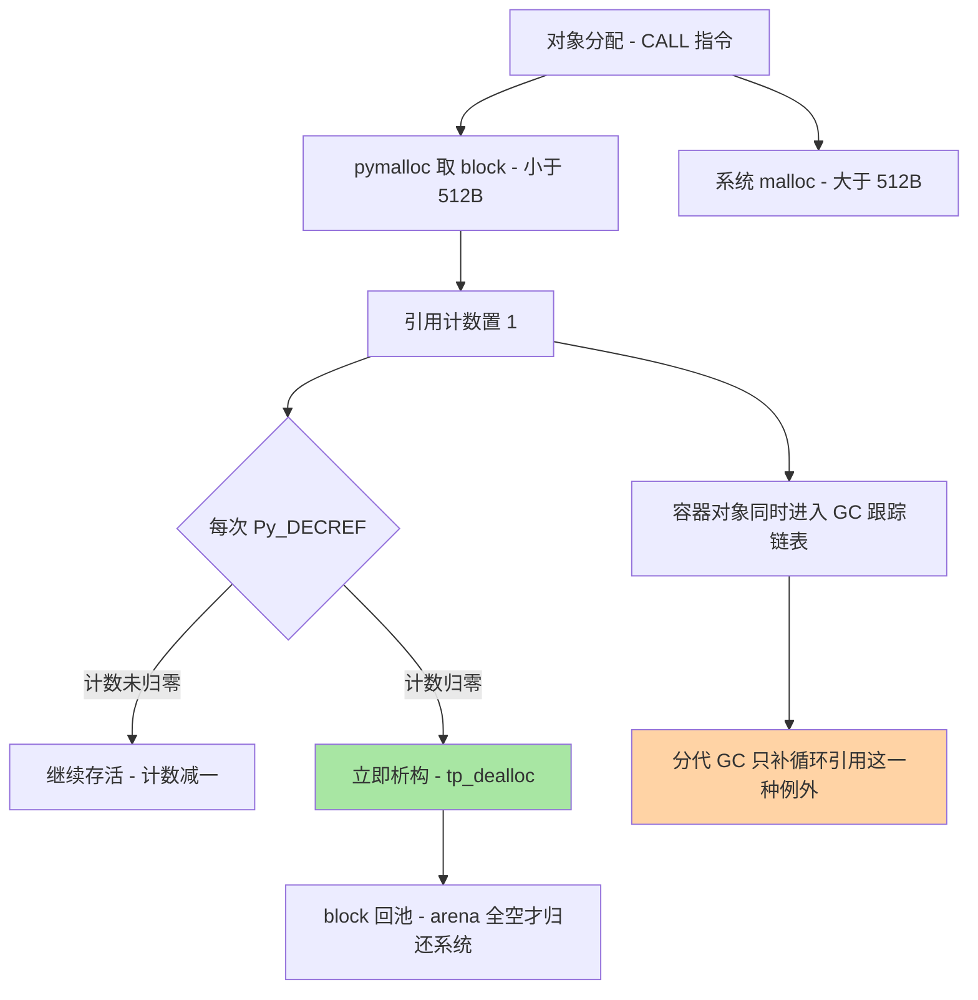

# Python 运行时机制深度解析

> 本系列篇 1 讲了 GIL 与线程模型，本篇把运行时的其余支柱一次拆透：**源码怎么变成字节码、字节码在求值循环里怎么跑、引用计数与分代 GC 怎么分工、pymalloc 怎么管理内存**。运行时机制不是玄学谈资——性能优化的每一个动作（局部变量、join、slots）、每一个生产事故（内存缓涨、递归爆栈、`+=` 误解）的病根都在这一层。

## 一句话摘要

CPython 运行时 = **编译器（源码 → AST → 字节码 + 窥孔优化）+ 求值循环（ceval 逐条解释字节码）+ 内存管理（引用计数即时回收 + 分代 GC 兜循环引用 + pymalloc 分层分配）**。三条机制推论支撑全部日常实践：字节码是栈机指令所以局部变量快于全局变量（LOAD_FAST vs LOAD_GLOBAL）；引用计数决定「离开作用域即释放」的确定性，分代 GC 只为兜住循环引用这个例外；pymalloc 的小对象池决定了「碎片与 arena 不归还」是内存缓涨的常见形态。**懂运行时的标志不是背概念，是能从现象反推到机制。**

## 🎯 本文核心

**核心一句话：CPython 的三层结构（编译 → 求值 → 内存）各有一条铁律——编译层的铁律是「字节码按栈机语义执行、窥孔优化在编译期完成」；求值层的铁律是「GIL 之下字节码执行串行、切换点在 eval_breaker」；内存层的铁律是「引用计数是主回收器、分代 GC 是循环引用的补丁、pymalloc 只管 512 字节以内的小对象」。性能优化与事故排查，本质是在这三条铁律上做推理。**

机制链（全文挂这条链上）：解释器形态 → 编译与字节码 → 求值循环与 GIL 协作 → 引用计数 → 分代 GC → pymalloc → 性能优化的机制依据 → 事故复盘 → 量级演进。

## 5W 速记卡

| 维度 | 一句话 |
|---|---|
| What | CPython 编译管线、字节码求值循环、引用计数 + 分代 GC + pymalloc 内存管理 |
| Why | 解释执行的每一步成本、对象生死的每一个时机，都由运行时机制决定 |
| When | 性能优化无方向时、内存缓涨排查时、解释器行为反直觉时，回到本篇机制 |
| Where | 编译器（compile/peephole）、求值循环（ceval）、对象系统与分配器（obmalloc/gc） |
| How | dis 反汇编定位热点、gc 模块排查循环引用、pymalloc 语义解释 RSS 行为 |

## 一、解释器形态：从字节码到 3.13 的两条新路

CPython 是「字节码解释器」：源码先编译成字节码，再由虚拟机逐条解释。实现形态的演进值得放进同一张图理解——Jython/IronPython 把字节码交给 JVM/.NET 执行，PyPy 用 JIT 把热点字节码编译成机器码（计算密集可获数倍加速，公开口径，代价是启动预热与 C 扩展兼容性），Cython 把类 Python 代码翻译成 C 再编译，CPython 自己则在 3.11/3.12 引入**自适应特化解释器**（PEP 659：热点字节码按实际类型特化成快速版本）、3.13 起实验性 JIT——「解释慢」这个刻板印象正在被主线版本自己打破。

**反方案分析：为什么不选「性能不行就换 PyPy」？**——PyPy 对纯 Python 代码提速显著，但 numpy/C 扩展生态的兼容成本（CPython C API 是事实标准）让多数数据类工作负载迁不动；生产选择的常见路径反而是「CPython + 热点下沉 C 扩展/Cython」。判断依据是「热点代码是否可下沉」，不是「解释器谁更快」的抽象比较。

## 二、编译管线与字节码：一切优化的地基

```text
源码 --词法/语法分析--> AST --编译--> 字节码 --窥孔优化--> code 对象 --缓存--> __pycache__/*.pyc
```

```python
import dis

def sum_squares(n):
    total = 0
    for i in range(n):
        total += i * i
    return total

dis.dis(sum_squares)   # 反汇编：看清单条指令与跳转目标
```

字节码是**栈机指令**：操作数压栈、指令从栈顶取数、结果压回——`LOAD_FAST`（局部变量，按索引直取栈帧槽位）与 `LOAD_GLOBAL`（查全局字典再回落内建字典，两级哈希查找）的成本差就来自这里，这是「函数内局部变量更快」的机制本源。窥孔优化在编译期完成小范围改写（常量折叠 `2*8` 编译期算成 16、相邻的跳转化简）——所以「写成什么形状」有一部分性能是编译期定死的。模块首次导入后字节码缓存在 `__pycache__`，`import` 的查找顺序是 `sys.modules` 缓存 → finder → loader——「同名模块遮蔽标准库」这类诡异问题就发生在 finder 阶段。

追问：**字节码是跨版本兼容的吗？**——不是，字节码格式随版本自由演进（3.11 重排了几乎全部指令编号，公开口径），`.pyc` 里的魔法号校验版本，不匹配就重编译。**再深一层：解释执行的「慢」慢在哪？**——每条字节码都有「取指-分派-执行」的固定开销，3.11 的特化解释器（`BINARY_OP` 特化成 `BINARY_OP_ADD_INT` 这类）削减的正是分派与通用检查开销；这解释了为什么「同样一行算术，Python 与 C 差几十倍，但数值循环套上 numpy 后差距消失」——瓶颈从字节码层转移到了 C 层。

## 三、求值循环与 GIL：字节码层面的并发真相

篇 1 讲过 GIL 的调度语义，本篇补上它在求值循环里的挂载点：CPython 主循环（ceval，3.11 后拆分优化）每执行若干条字节码检查一次 `eval_breaker` 标志，GIL 的让位请求、信号处理、异步异常都挂在这个检查点上——**「字节码级原子」的边界由此而来**：单条字节码不会被打断，但 `counter += 1` 这种「多条字节码序列」随时会在检查点让位，这就是并发篇「GIL 在也要加锁」的指令级证据。

异常与栈帧的机制也在这一层：每个 Python 函数调用对应一个栈帧对象（局部变量、字节码指针、求值栈都在里面），异常抛出就是沿帧栈展开找 handler——`sys.setrecursionlimit`（默认 1000，公开口径）限制的是 Python 帧深度，递归爆栈的 `RecursionError` 就是这个防线在报警。

## 四、引用计数：确定性的主力回收器

每个对象头部带着引用计数（`ob_refcnt`），`Py_INCREF`/`Py_DECREF` 维护，**减到零立即析构释放**——这就是 `with` 块退出文件即关闭、离开作用域内存即归还的机制来源。确定性回收是引用计数的礼物：内存行为可推理、析构时机可预测，这对资源管理（连接、文件句柄）比「等 GC」的模型友好得多。

```python
import sys

a = [1, 2, 3]
sys.getrefcount(a)   # 2：a 本身 + 函数参数的临时引用
```

两个必知的坑：**getrefcount 永远比「你以为的」多 1**（传参产生的临时引用）；**小整数与短字符串池**——`-5` 到 `256` 的小整数与标识符样式的字符串常量是解释器预建/驻留的（`sys.intern` 可手动驻留），`a is b` 在这些值上为真纯属实现细节，值比较请永远用 `==`。

**反方案分析：为什么引用计数没有成为唯一回收器？**——它解决不了循环引用：`a.b = b; b.a = a` 之后两者的计数互相支撑，永远到不了零。要打破循环就必须有第二台机器——分代 GC，这就是下一节。为什么不用「纯追踪 GC」（像 JVM）？——追踪 GC 放弃了「计数归零立即释放」的确定性，把资源管理押在 GC 时机上，CPython 选择「确定性为主、追踪为补」的组合，这是核心设计思想：**常见情况（无循环）走最便宜的路，例外情况（循环）付专门成本**。

## 五、分代 GC：循环引用的补丁与它的调参



分代 GC 的机制要点：**只处理容器对象**（数字/字符串不可循环引用，不进 GC 跟踪）；**分代假设**（对象越年轻越早死）让高频回收集中在便宜的第 0 代；**晋升机制**让长寿对象少被扫描。`gc` 模块是它的操作面板：

```python
import gc

gc.get_threshold()      # (700, 10, 10)：三代的触发阈值（公开口径默认值）
gc.get_count()          # 当前计数
gc.collect(2)           # 手动全代回收
gc.freeze()             # 把现有对象冻结为永久代 - 预 fork 服务专用
```

**反方案分析：为什么不选「关掉 GC 换性能」？**——`gc.disable()` 在特定场景（对象图稳定的服务预热后、预 fork 前配合 `gc.freeze()`）确实消除 GC 停顿，但循环引用从此无人回收，长跑进程内存只涨不跌——业内惯例是「冻结 + 阈值调优」而不是一刀关闭；抖音式「运行时调优」的每一步都要拿内存曲线验证。

## 六、pymalloc：512 字节以下的小对象王朝

CPython 的内存分层：**大于 512 字节**走系统 malloc；**512 字节以内**走 pymalloc——arena（256KB）→ pool（4KB）→ 定长 block（8 字节对齐的固定档位）三级结构（公开口径）。这个设计的机制推论很重要：**arena 按整体向系统归还**——一个 arena 里只要还有一个存活对象就不能归还，这就是「长时间运行的进程 RSS 不回落」的最常见解释：不是泄漏，是碎片把 arena 钉住了。同理，`del` 之后的内存多数回到 pymalloc 池而非操作系统——进程内视角的「空闲」与操作系统视角的 RSS 是两个口径，排查内存问题前先统一口径。

编译管线与对象生命周期的两张机制图——先看代码怎么变成字节码：


再看一个对象从生到死的完整生命周期（引用计数主线 + 分代 GC 补线）：



### 源码/关键路径：一次赋值语句的全链路

`x = SomeClass()` 从源码到内存的关键路径（CPython 3.12）：

```text
编译期：源码 -> AST -> 字节码 LOAD_BUILD_CLASS / CALL / STORE_FAST
                                |
运行期：ceval 执行 CALL
   -> type.__call__ 分配对象
      -> type 的 tp_alloc -> _PyObject_Malloc
         (<= 512B: pymalloc 从当前 pool 取 block / > 512B: malloc)
   -> __init__ 执行
   -> 引用计数置 1
                                |
回收期：引用计数归零
   -> tp_dealloc -> _PyObject_Free (block 回池，arena 满空闲则整块归还)
   -> 若对象在 GC 跟踪中 -> 从链表摘除
```

源码级两个细节：**对象的结构是「头部 + 数据」**——每个对象都扛着引用计数、类型指针的头部开销（几十字节），十亿个小对象的内存大头可能是对象头部而不是数据，这是「用 numpy 数组替代百万个 Python 数」的机制依据；**`__slots__` 的收益也在这一层**——去掉实例的 `__dict__`（又一个容器对象 + 哈希表开销），属性访问从哈希查找变成固定槽位偏移，大量小对象场景内存与速度双收。

### 追问链：内存「泄漏」到底是谁的锅？

**追问一：Python 有 GC 为什么还会内存泄漏？**——因为「泄漏」在 Python 里通常是三种非 GC 问题：循环引用里挂着 `__del__`（旧版本语义下 GC 不敢释放，3.4 后 PEP 442 已大幅缓解但仍要留心）、C 扩展层的分配绕过引用计数、以及全局容器只进不出（缓存无界）。**再深一层：怎么区分这三种？**——`gc.get_objects()` + `tracemalloc` 快照对比定位「哪类对象在涨」（纯 Python 层）；`objgraph.count()` 看循环引用；RSS 涨但 tracemalloc 平 → 嫌疑指向 C 扩展或 pymalloc 碎片。**打破砂锅：tracemalloc 为什么能精确到行？**——它在分配点给每块内存挂「分配时的 traceback」，代价是整体减速（公开口径：生产常开在抽样模式或压测环境），这是「精确归因 vs 运行开销」的又一次权衡。

💡 **实战提示：性能问题先 py-spy 后改代码**。py-spy 采样不需要改代码、不需要重启进程，火焰图里 ceval 占比高说明瓶颈在纯 Python 字节码（可下沉/可向量化），系统调用占比高说明瓶颈在 I/O——先定位再优化，禁止「感觉慢就加缓存」。

💡 **实战提示：`dis.dis` 是怀疑解释器的第一现场**。怀疑「这行代码为什么这么快或这么慢」时反汇编看指令序列——「为什么 += 不是原子的」「局部变量为什么快」的答案都写在指令列表里，比背结论可靠。

💡 **实战提示：内存巡检三个指标固定看**——`gc.get_count()`（分代压力）、`len(gc.garbage)`（不可回收对象）、RSS 与 tracemalloc 差值（碎片或 C 层嫌疑）。三项建基线，偏离即排查，内存问题就不再是深夜悬案。

💡 **实战提示：升级解释器版本是免费的性能优化**。3.11/3.12 的特化解释器让多数纯 Python 负载获得一到五成的提速（公开口径），升级前跑一遍基准测试与兼容性检查，是所有优化手段里性价比最高的一档。

## 七、性能优化的机制依据清单

| 优化动作 | 机制依据 | 量级感受（业内认知） |
|---|---|---|
| 热点搬进函数（局部变量） | LOAD_FAST vs LOAD_GLOBAL | 一到两成 |
| `''.join(list)` 替代循环 `+` | 字符串不可变，`+` 每次 O(n) 拷贝新建对象 | 数量级 |
| 列表推导替代 append 循环 | 字节码层专门的 LIST_APPEND 快路径 | 数成 |
| `__slots__` | 去实例 dict、槽位直取 | 内存减半级（小对象多时） |
| numpy 向量化 | 瓶颈移出字节码层进 C/SIMD | 数量级 |
| functools.lru_cache | 纯函数重复调用变哈希查找 | 视命中率 |
| 字符串驻留 intern | 高频重复串共享一份 | 视场景 |

**反方案分析：为什么不选「背优化清单当武功秘籍」？**——清单是机制的推论，机制一变清单就过期（3.11 特化让部分老结论失效）；正确姿势是 `dis` 反汇编 + 性能分析（cProfile/py-spy）实测，让清单回到「机制验证」的地位。性能分析先于优化，永远先看火焰图再改代码。

## 八、事故复盘：两则运行时案卷

**复盘一：数据管道进程 RSS 六小时翻三倍。** 现象：长跑 ETL 进程内存持续缓涨，重启后恢复。排查路径：先 `tracemalloc` 快照对比——Python 层对象总量平稳，排除业务泄漏；再看对象类型统计——`gc.get_objects()` 里几十万个空列表残留，指向循环引用；用 `objgraph` 找到增长链——处理函数里的异常对象带上了完整的帧引用，帧里嵌着循环结构，异常对象被挂在全局的失败重试列表里，分代 GC 够不到（列表本身被全局引用着）。复盘动作：失败记录只存必要字段（id 与错误码）而不是整个异常对象；重试列表加上限；`gc.collect` 后对比 `gc.garbage` 的巡检纳入例行。教训：**Python 的「泄漏」几乎都是「引用被意外保住」，排查动作是找「谁还指着它」而不是「谁没释放它」**。

**复盘二：递归解析 JSON 深层结构时进程崩溃。** 现象：解析一条用户构造的嵌套结构时服务直接抛 `RecursionError`，未捕获导致请求路径 500 扇出。排查路径：先看错误日志确认 `RecursionError`（`sys.getrecursionlimit()` 默认 1000，公开口径）；再看数据——嵌套深度数万层的恶意构造。复盘动作：入口对嵌套深度做校验；解析器改迭代实现（显式栈）；`RecursionError` 纳入统一异常处理。教训：**递归深度防线默认在 1000，攻击者与坏数据都会去探它**——任何「深度不可控的递归」都要么加防线要么改迭代。

## 九、什么时候用 / 什么时候不用

**什么时候需要运行时机制知识**：性能优化没有方向时（先反汇编与火焰图，再改代码）；内存行为反直觉时（RSS 口径、arena 碎片、引用保活）；选型「纯 Python 实现 vs C 扩展/Cython 下沉」时（瓶颈是否在字节码层）。**什么时候不用深究**：业务代码的常规开发（机制知识不该变成炫技式微优化）；热点未测量的「预防性优化」——先测量后优化是铁律。**明确推荐**：每个 Python 项目配两件基础设施——性能分析工具链（py-spy 或 cProfile）与内存观测（tracemalloc 抽样），机制知识只有配上观测数据才能落地。

## 十、Trade-off：每一步都在付出什么

| 选择 | 得到 | 付出 | 适用判断 |
|---|---|---|---|
| 引用计数为主 | 确定性回收、可推理 | 循环引用需补丁、计数开销 | CPython 既定路线 |
| 分代 GC | 循环引用可回收 | 扫描停顿（微秒到毫秒级） | 容器对象默认开启 |
| gc.freeze + 调阈值 | 预 fork 服务省内存省停顿 | 调优复杂度 | fork 型服务标配 |
| pymalloc 小对象池 | 分配快两个量级（业内认知） | arena 碎片导致 RSS 不回落 | 默认行为，须理解 |
| `__slots__` | 内存与属性访问双优化 | 失去动态属性、继承要都声明 | 海量小对象 |
| Cython/C 扩展下沉 | 热点提速数量级 | 构建链与调试复杂度 | 瓶颈实测在字节码层 |
| PyPy/JIT | 纯 Python 代码加速 | C 生态兼容代价 | 纯 Python 负载 |
| tracemalloc 常开 | 泄漏精确定位到行 | 运行减速 | 抽样或压测环境 |

贯穿全篇的设计思想：**CPython 的每个子系统都在「通用简单」与「特化快速」之间选了前者作为默认，把特化留作局部优化**——引用计数（简单直接）优先于追踪 GC，pymalloc（只管小对象）优先于全能分配器，解释器（简单正确）优先于激进 JIT（3.11 后才局部引入）。理解这个保守哲学，就理解了为什么每个「加速外挂」（特化、JIT、slots、C 扩展）都长得像「局部补丁」而不是「全局重写」。

## 十一、不同量级的思考：架构约束驱动解法

- **十万级（日请求十万量级）**：约束来源是单进程吞吐与 GC 停顿占比，思考方式是监控驱动——这一档的核心问题是「字节码层热点与 GC 停顿有没有被测量」，而不是「要不要换解释器」。标准动作：py-spy 火焰图例行化 + GC 阈值按对象分配速率核定，多数服务的答案只是「热点进函数 + 该缓存缓存」。
- **百万级（日请求百万量级）**：约束来源是每请求的 CPU 成本与内存水位，思考方式是成本驱动——这一档的核心问题是「每个请求的 CPU 毫秒花在哪类指令上」，而不是「并发参数怎么调」。热点下沉 C 扩展/Cython、`__slots__` 与对象瘦身、pyc 预编译镜像（启动提速）成为工程标配；GC 策略按「服务类型」分化（预 fork 服务 freeze、流式服务调阈值）。
- **千万级及以上**：约束来源是机房里的每一度电与每一台机器，思考方式是架构下沉驱动——这一档的核心问题是「哪些组件值得留在 Python 层」，而不是「解释器还能快多少」。计算密集部件独立成服务用更快的语言实现、Python 层保留编排与胶水（它的真正强项）、运行时升级（3.11+ 特化收益）作为低垂果实优先收割。
- **自下而上的演进触发器**：CPU profile 集中在 ceval 循环 → 热点下沉或升级解释器版本；RSS 长期缓涨 → tracemalloc + gc.garbage 巡检；进程启动慢影响弹性伸缩 → 预编译与 import 治理。每一档的动作都由观测数据触发——运行时优化没有「感觉快了」，只有测量说了算。到亿级：这一档的核心问题是「每个请求消耗的 CPU 毫秒与电费能不能被摊薄」，而不是「某段代码还能快百分之几」——运行时优化到架构层的分界线，就是单点优化的收益被规模化成本吞没的那一刻。

## 你们可能会问

**Q1：`__pycache__` 可以删除吗？删了会怎样？**
可以删，下次导入按源码重新编译并再生成——只是首次加载慢一点。只读部署环境（容器）里预先生成并打进镜像，省掉每个实例的首次编译开销。

**Q2：为什么 `is` 比较小整数为真、比较大整数为假？**
小整数（-5 到 256）与驻留字符串是解释器预建共享的对象，`is` 比的是对象身份所以为真；大整数每次出现是新分配的对象。这是实现细节不是语义承诺——值比较永远用 `==`。

**Q3：怎么判断该不该用 Cython/进程池优化一段代码？**
两步测量：py-spy 看火焰图确认热点在字节码层（ceval 占比高）而不是系统调用或 C 库；再看任务是否「粗粒度、无共享」。两个条件都满足，先试进程池（改动小），不够再 Cython（收益大但工程重）。

**Q4：`gc.disable()` 到底能不能在生产用？**
特定形态可以：对象图在预热后基本稳定的服务，`gc.freeze()` + 关闭后再开定期手动 `gc.collect` 是业内惯例；对象高速增删的流式服务关闭 GC 就是给循环引用开闸。判断依据是「服务里的容器对象有没有循环引用生长点」，用 `gc.callbacks` 与 `gc.garbage` 验证后再定。

## 自测三问

1. 一行 `total += i` 从源码到内存经历了哪些运行时阶段？LOAD_FAST 与 LOAD_GLOBAL 的成本差来自哪里？
2. 引用计数与分代 GC 的分工边界在哪里？为什么说「常见情况走最便宜的路」？
3. 进程 RSS 涨了但 tracemalloc 显示对象总量平稳，下一步查什么？

## 开放问题

- 自适应特化解释器与实验性 JIT 的下一步（更细粒度特化、 tier 2 优化器成熟度）会持续改写「Python 慢」的性能推理基线，旧优化结论需随版本复核。
- free-threaded 构建下引用计数方案的落地（分代式延迟回收 vs 有偏计数）仍在演进，对象模型的微调会影响扩展生态的全部假设，值得持续跟踪。

## 🎯 核心带走

- **核心一句话**：CPython = 编译（字节码 + 窥孔优化）、求值（ceval + GIL 挂载点）、内存（引用计数主回收 + 分代 GC 补循环 + pymalloc 管小对象）三层铁律——性能优化与内存排查都是在这三条铁律上做推理
- **机制链**：解释器形态 → 编译管线 → 求值循环 → 引用计数 → 分代 GC → pymalloc → 优化清单 → 事故案卷 → 量级演进
- **哪里会坏**：引用被全局容器意外保住导致的「泄漏」、递归防线（默认 1000）被坏数据打爆、arena 碎片钉住 RSS、误信「GIL 在不用锁」
- **边界**：本篇管 CPython 运行时三层机制；GIL 调度语义与并发模型在函数进阶系列篇 3、线程模型细节在本系列篇 1 展开

## 📌 数据与事实声明

- 写于 2026-09-16，机制描述以 CPython 3.12/3.13 源码与官方文档为准；recursionlimit 默认 1000、GC 阈值 (700, 10, 10)、pymalloc 512 字节界与 arena 尺寸为公开口径默认值
- 各项优化收益倍数、分配速度差异均为业内认知或公开口径，随解释器版本变化，需按版本实测
- 两则事故叙事已匿名化并做细节脱敏，复盘结论按通用机制呈现

## 📚 参考资料

| 类型 | 标题 | 来源 |
|---|---|---|
| 官方文档 | dis 模块（字节码指令集） | docs.python.org/3/library/dis |
| 官方文档 | gc 模块（分代回收/阈值/freeze） | docs.python.org/3/library/gc |
| 官方文档 | tracemalloc 与 sys 模块 | docs.python.org/3/library/tracemalloc |
| 官方源码 | cpython（Python/ceval.c、Objects/obmalloc.c、Modules/gcmodule.c） | github.com/python/cpython |
| 公开规范 | PEP 659（自适应特化解释器）/ PEP 703（free-threaded） | peps.python.org |
| 系列内篇 | 本系列篇 1《GIL 与线程模型》/ 函数进阶系列篇 3《Python 并发编程与异步生态》 | 关联系列 |
