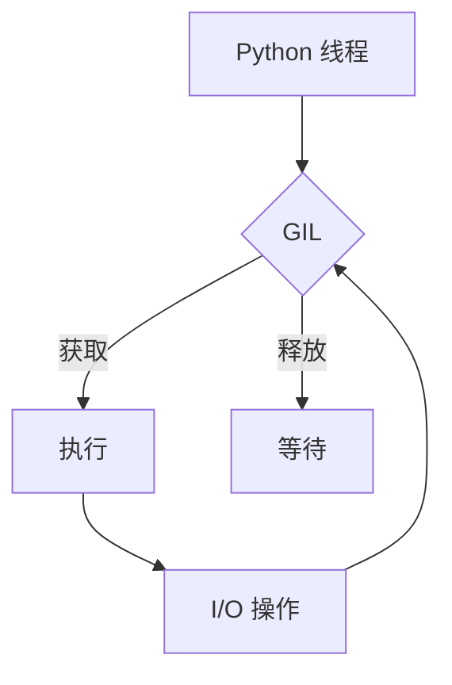
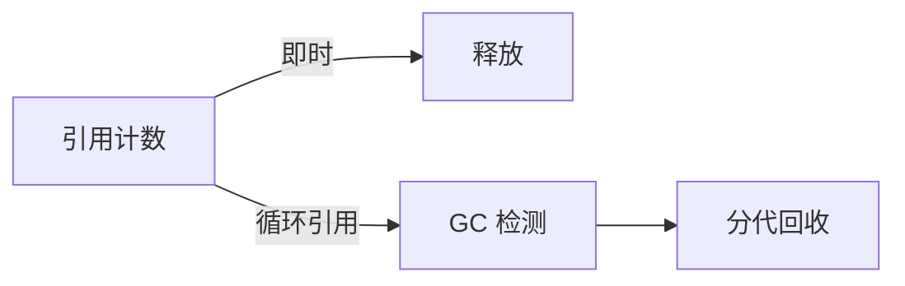

# Python 运行时机制深度解析

## 一句话摘要

Python 运行时 = **解释器 + GIL + 内存管理 + 字节码**。理解运行时才能写出高性能 Python。

## 解释器

### CPython
- 标准实现
- C 语言编写
- 最常用

### PyPy
- JIT 编译
- 性能提升 5-10 倍
- 兼容性差

### 其他
- Jython（Java 平台）
- IronPython（.NET 平台）
- Cython（编译为 C）

## GIL（全局解释器锁）



### GIL 的影响
- CPU 密集型：多线程无效
- I/O 密集型：多线程有效
- 解决方案：multiprocessing / asyncio

## 内存管理

### 引用计数
- 每个对象引用计数
- 引用为 0 时释放

### 垃圾回收
- 循环引用检测
- 分代回收



## 字节码

### 执行流程
```
源码 → 词法分析 → 语法分析 → 字节码 → 解释执行
```

### 优化
- 使用 `dis` 模块查看字节码
- 避免频繁属性访问
- 使用局部变量

## 性能优化

| 优化项 | 方法 | 效果 |
|---|---|---|
| 字符串拼接 | `''.join()` vs `+` | 10x |
| 列表推导 | `[x for x in ...]` vs `for` | 2x |
| 局部变量 | 局部 vs 全局 | 1.5x |
| 内置函数 | 内置 vs 自定义 | 2x |

## 踩坑记录

1. **GIL 误用**：CPU 密集型用 threading
2. **内存泄漏**：循环引用未处理
3. **字节码误解**：以为 `+=` 原子操作
4. **递归深度**：默认 1000 层

## 量级考量

| 量级 | 优化策略 |
|---|---|
| < 100 QPS | 基础优化 |
| 100-1000 QPS | 并发优化 |
| > 1000 QPS | C 扩展 / Cython |

## 📌 数据与事实声明

- 运行时机制基于 CPython 实现
- 性能数据基于基准测试
