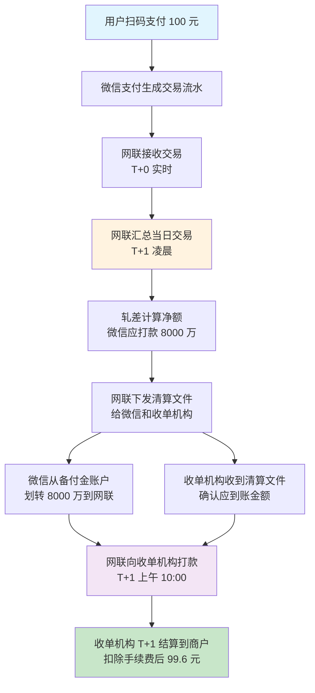
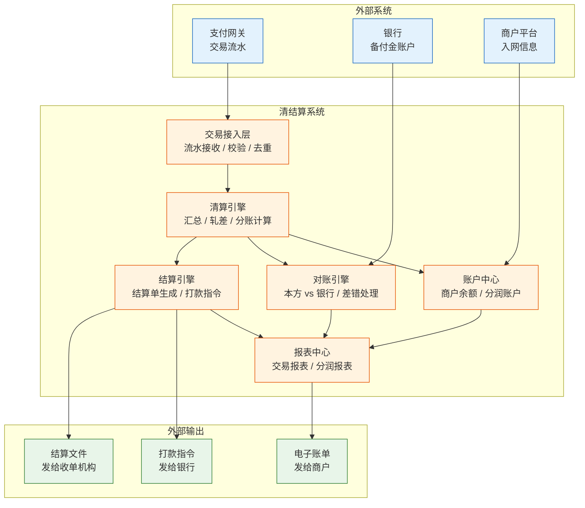
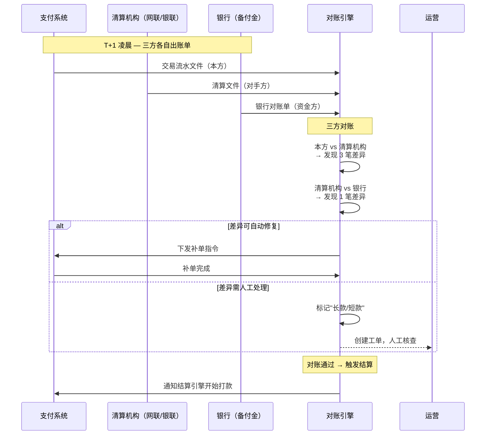
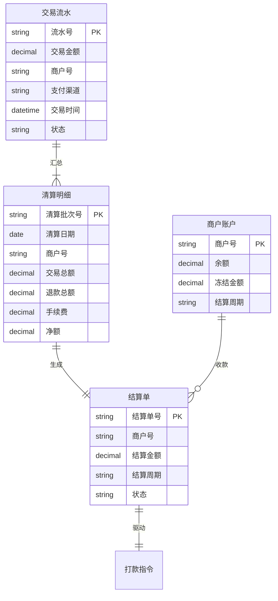

# 清结算体系：一笔支付钱的"后半场"

> **一句话定义**：清算是算账——谁该给谁多少钱；结算是转账——把钱真正打过去。清结算是支付交易的"后半场"，用户无感知，但占支付机构 80% 的运营成本。

---

## 1. 业务背景与价值

你微信扫码付了 100 块买杯咖啡。看起来钱"嗖"地从你账户飞到商户账户。实际上这笔钱走了至少 5 站：

```
用户 → 微信支付 → 网联/银联 → 收单机构 → 商户
```

**问题来了**：这 100 块不是实时到商户口袋的。中间有一个**算账**的环节——谁收了多少钱、该给谁多少钱、手续费怎么分——这就是**清算**。算完之后再打款，就是**结算**。

**为什么清结算要单独建一个系统，而不是在支付系统里一把梭？**

| 维度 | 支付（前半场） | 清结算（后半场） |
|---|---|---|
| 时效 | 毫秒级 | T+1 天级 |
| 精度 | 单笔 | 汇总轧差 |
| 关注点 | 成功率、耗时 | 差错率、对账一致性 |
| 瓶颈 | 并发量 | 数据一致性 |
| 出错后果 | 用户投诉 | 资金损失 |

> **一句话：支付失败最多被骂，清算错了是要赔钱的。**

---

## 2. 业务术语表

| 术语 | 英文 | 一句话解释 |
|---|---|---|
| 清算 | Clearing | 算账——汇总交易、计算各方应收应付 |
| 结算 | Settlement | 转账——把清算结果变成真实的资金划拨 |
| 轧差 | Netting | 多笔交易正负相抵，只打差额 |
| 头寸 | Position | 账户里可用于结算的资金余额 |
| 备付金 | Reserve / Deposit | 支付机构在央行的沉淀资金（100% 集中存管） |
| 对账 | Reconciliation | 本方流水 vs 对方流水，找差异 |
| 长款/短款 | Long/Short | 对账差异：多钱（长款）、少钱（短款） |
| T+1 / D+0 | T+1 / D+0 | 结算周期：交易日后 1 天 / 当天 |
| 四方模式 | Four-party Model | 用户↔发卡行↔清算机构↔收单机构↔商户 |
| 网联 | NUCC | 非银行支付机构网络支付清算平台（"线上银联"） |

---

## 3. 业务形态与模式

### 四方模式（国内主流）

```
        ┌──────────────────────┐
        │    清算机构（银联/网联）│
        └──┬──────────────┬───┘
           │              │
    ┌──────▼──┐     ┌────▼─────┐
    │  发卡行  │     │ 收单机构  │
    │ (用户侧) │     │ (商户侧)  │
    └──────┬──┘     └────┬─────┘
           │              │
    ┌──────▼──┐     ┌────▼─────┐
    │   用户   │     │   商户    │
    └─────────┘     └──────────┘
```

**四方各自赚什么钱：**

| 角色 | 收入来源 | 费率参考 |
|---|---|---|
| 发卡行 | 手续费分成（70%） | 交易金额 ×0.4% |
| 清算机构 | 转接费 | 交易金额 ×0.05% |
| 收单机构 | 手续费分成（30%）+ 商户服务费 | 交易金额 ×0.2% + SaaS 费 |
| 商户 | 卖货/服务 | — |

### 两种清算模式

| 模式 | 代表 | 特点 |
|---|---|---|
| **逐笔清算** | 银联 | 每笔交易实时清算 |
| **轧差清算** | 网联 | 汇总后只打差额，节省头寸 |

> **轧差**：你今天收了 1000 万，付了 800 万。不是打 1000 万再收 800 万，而是**差额 200 万一次打款**。大幅降低资金占用。

---

## 4. 业务流程图

一笔微信支付的钱，从用户扫码到商户收到钱：



> **上图要点**：用户付钱只要 100 毫秒，但商户收到钱要等到第二天。中间的 T+1 就是清结算在干活。

---

## 5. 系统架构

清结算系统不是一个模块，而是一个**独立系统群**：



**六大核心模块职责：**

| 模块 | 一句话 | 关键 |
|---|---|---|
| 交易接入层 | 接住支付网关的流水 | 幂等、去重、校验 |
| 清算引擎 | 算账的核心 | 汇总、轧差、分账 |
| 结算引擎 | 打款的核心 | 生成打款指令、调用银行接口 |
| 对账引擎 | 找差异的侦探 | 本方 vs 清算机构 vs 银行三方对 |
| 账户中心 | 管钱的账本 | 商户余额、冻结、分润 |
| 报表中心 | 给所有人看的 | 商户对账单、内部报表 |

---

## 6. 对账机制

清结算最核心的日常工作：**对账**。



**对账差异常见原因：**

| 差异类型 | 原因 | 处理方式 |
|---|---|---|
| 长款（我方有，对方无） | 我方重复记账 / 对方漏记 | 冲正或补单 |
| 短款（对方有，我方无） | 我方漏记 / 网络丢包 | 补入流水 |
| 金额不一致 | 手续费计算差异 / 汇率差异 | 人工核查后调账 |
| 状态不一致 | 退款未同步 / 部分退款 | 同步状态 |

**对账铁律：** 三方（本方、清算机构、银行）金额完全一致才能触发结算。差一分都不能打款。

---

## 7. Trade-off 分析

### 决策 1：T+1 vs D+0

| 维度 | T+1（次日结算） | D+0（当日结算） |
|---|---|---|
| 商户体验 | 次日到账 | 当天到账 |
| 资金占用 | 压 1 天资金 | 不压资金 |
| 风险控制 | 有 1 天缓冲排查异常交易 | 异常交易没时间拦截 |
| 对账压力 | 充裕 | 极高——几小时内出结果 |
| 手续费 | 标准 | 加收 0.1%-0.2% |
| **适用场景** | 普通商户 | 资金敏感商户（如小微商户急需周转） |

### 决策 2：自建 vs 对接清算机构

| 维度 | 自建清结算系统 | 对接银联/网联标准接口 |
|---|---|---|
| 灵活性 | 完全可控，定制分账规则 | 受限于清算机构规范 |
| 成本 | 研发 + 运维 + 合规成本高 | 按交易量付费 |
| 合规 | 需要支付牌照 / 备付金存管 | 清算机构已合规 |
| **结论** | 大厂（支付宝/微信）自建 | 中小支付机构必对接 |

---

## 8. 业务前景

- **备付金 100% 集中存管**（2019 年起）：支付机构不再能靠备付金吃利息，必须靠手续费和服务费盈利
- **网联切断直连**：以前微信直接对接银行（"直连模式"），现在统一走网联，清算更透明
- **跨境清算**：CIPS（人民币跨境支付系统）在做人民币国际化的清算通道
- **数字人民币**：DC/EP 的"支付即结算"可能简化甚至跳过传统清结算环节

---

## 9. 产品形态与用户角色

### 谁在用清结算系统

| 角色 | 核心诉求 | 使用功能 |
|---|---|---|
| 运营人员 | 每天对账、处理差错 | 对账面板、差异工单、调账 |
| 财务人员 | 资金安全、账实相符 | 结算报表、备付金核对、打款审批 |
| 商户 | 钱什么时候到 | 到账查询、对账单下载 |
| 产品经理 | 分账规则怎么配 | 分账模板、费率配置 |
| 风控人员 | 异常交易拦截 | 大额预警、可疑交易标记 |

### 产品形态

清结算系统是典型的 **B 端后台系统**，不是 C 端产品：
- **Web 管理后台**：运营/财务用的对账、调账、报表
- **API 接口**：支付网关 → 清结算系统的流水推送
- **定时任务**：T+1 凌晨批量跑清算、对账、结算
- **文件交互**：与银行/清算机构之间通过 SFTP 交换清算文件

---

## 10. 数据模型

清结算系统的核心数据表：



**关键设计约束：**
- 流水号全局唯一，幂等去重靠它
- 清算明细按 `清算日期 + 商户号` 唯一定位一笔汇总
- 结算单状态机：待生成 → 待审批 → 待打款 → 已打款 → 已到账
- 任何状态变更都要记操作日志（谁、什么时候、做了什么）

---


---

## 10.5 服务模型

清结算系统的服务拆分和调用关系：

| 服务 | 职责 | 接口 |
|---|---|---|
| clearing-service | 清算引擎 | `POST /clearing/batch-run` 日切清算 |
| settle-service | 结算引擎 | `POST /settle/create` 生成结算单 |
| recon-service | 对账引擎 | `POST /recon/compare` 三方对账 |
| account-service | 账户中心 | `GET /account/balance` `POST /account/freeze` |
| bill-service | 报表中心 | `GET /bill/merchant/{id}` 商户对账单 |

调用链：`支付网关 → clearing-service → settle-service → account-service → bill-service`

服务间通信走 **RPC（Dubbo/gRPC）**，清算文件交换走 **SFTP**。


## 11. 核心功能用例

| 场景 | 触发 | 结果 |
|---|---|---|
| **T+1 日切清算** | 每日 00:00 定时任务 | 汇总昨日交易 → 生成清算明细 → 轧差计算 |
| **三方对账** | 清算完成后自动触发 | 本方 vs 网联 vs 银行 → 差异自动修复或人工工单 |
| **结算打款** | 对账通过后触发 | 生成结算单 → 调用银行接口打款 → 更新商户余额 |
| **分账** | 交易完成后实时/准实时 | 按模板分给多方（平台、代理商、服务商） |
| **异常调账** | 运营发起 | 冲正原交易 → 生成调账单 → 重新清算 |

---

## 12. 业务打法与通用做法

### 行业通用做法

| 做法 | 说明 |
|---|---|
| **T+1 为主、D+0 为辅** | 绝大多数商户走 T+1，资金敏感商户加费走 D+0 |
| **备付金 100% 央行存管** | 2019 年后无例外，断绝"吃利息"模式 |
| **三段对账** | 本方 vs 清算机构 vs 银行，三段都平才打款 |
| **结算打款双人复核** | 大额打款（>100 万）需两人审批 |
| **清结算分离** | 清算引擎和结算引擎独立部署，互不阻塞 |

### 差异化竞争点

| 维度 | 大厂（支付宝/微信） | 中小支付机构 |
|---|---|---|
| 清结算系统 | 自建，支持实时分账 | 对接银联/网联标准接口 |
| D+0 能力 | 全量支持（自有资金池） | 仅限小额或加费 |
| 分账能力 | 多级分账、实时分账 | 标准分账模板 |
| 差异化 | 生态内闭环（花呗、借呗联动） | 垂直行业定制（餐饮 SaaS、教育分期） |

---

## 13. 业务视角与产品意识形态

**清结算不是"技术系统"，是"资金中台"。**

- **技术视角**：一个处理交易流水、跑批量任务的后台系统
- **业务视角**：公司的"钱袋子"——管着所有商户的钱，差一分就是事故
- **产品意识形态**：清结算的最高境界是**透明**——商户无感知、运营少工单、资金零差错

> **一句话判断清结算系统好坏：每天 T+1 凌晨跑批，运营要不要加班处理差异工单？**

---

## 14. 技术架构

清结算系统对技术的要求和支付系统完全不同：

| 维度 | 支付系统 | 清结算系统 |
|---|---|---|
| 并发模型 | 高并发、低延迟 | 批量处理、高吞吐 |
| 数据库 | 分布式 NewSQL（TiDB） | 传统关系型（MySQL + 读写分离） |
| 事务 | 柔性事务、最终一致 | 刚性事务、强一致 |
| 任务调度 | 实时流（Kafka） | 定时批（XXL-Job / 自研调度器） |
| 缓存 | Redis 热点数据 | 基本不用缓存（数据一致性优先） |
| 灾备 | 同城双活 | 异地灾备（RPO < 1min） |

**典型技术栈：** Spring Boot + MySQL + XXL-Job + Kafka + SFTP 文件交互

---

## 15. 一句话总结

> **清算是算账，结算是转账。清结算系统 = 支付交易的"后半场"——用户看不见，但它是支付机构最核心的基础设施。搞懂清结算，你才能真正看懂支付业务的钱是怎么流动的。**
