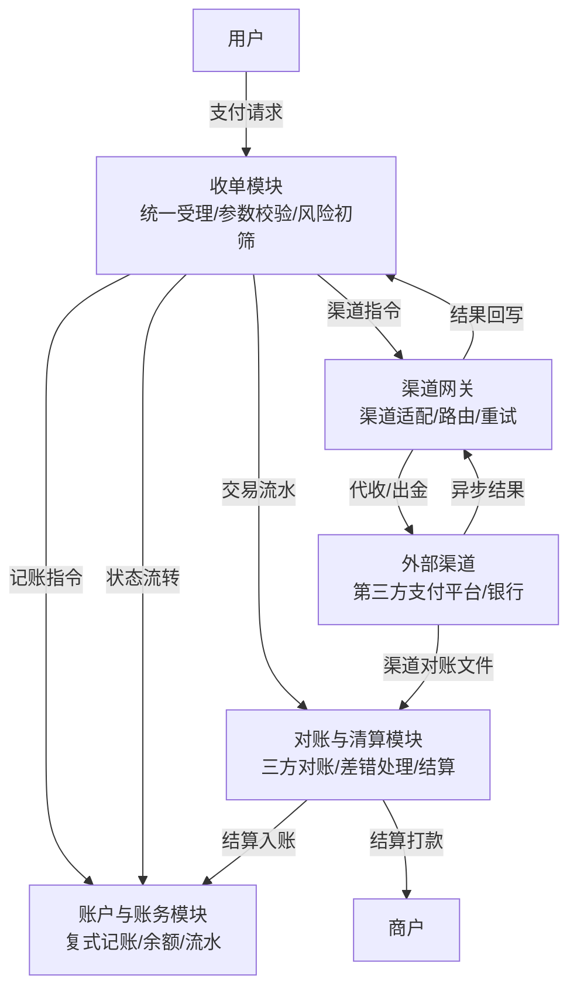
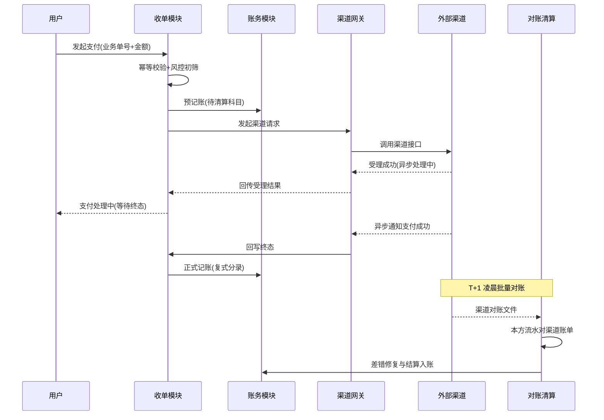
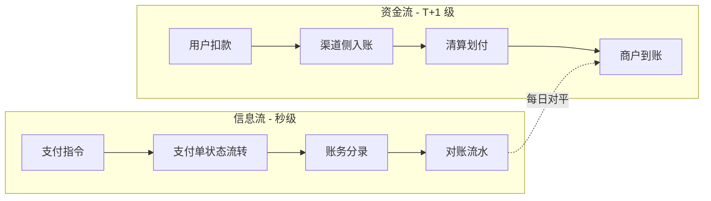

# 支付系统的最小骨架：一个能跑的支付系统由什么组成

> **一句话摘要**：一个能跑的支付系统由四个模块构成——收单、账户账务、渠道网关、对账清算。模块可以简陋，闭环不能缺失：信息流驱动资金流、对账兜底一致性，每天钱和账必须对得上。

## 🎯 本文核心

**核心机制一句话**：支付系统的底层机制是「信息流驱动资金流，对账兜底一致性」——用户看到的"支付成功"是信息流的终态，商户收到的钱是资金流的终态，两个终态之间隔着渠道受理、清算、结算多个环节，靠账务和对账把两条流钉在一起。

**机制链**：收单受理（接住请求）→ 账务记账（钱在账上怎么动）→ 渠道网关（钱从哪里出去/进来）→ 对账清算（每天核对两条流）→ 结算落地（钱真正到商户）。缺任何一环，系统就退化成"能收钱、但算不清钱"的脚本。

**系列定位（与本仓库已有内容的关系）**：

- 站内《清结算体系》讲的是"后半场"——清算、结算、轧差、对账的专题深潜；跨境系列讲的是跨境域的收单与清结算。
- 本系列是**架构视角**：假设从零设计一个支付系统，先造哪些模块、每个模块的关键决策是什么、按什么顺序演进。本篇回答"由什么组成"，第 2 篇回答"六个高频决策怎么选"。

## 5W 速记卡

| 维度 | 一句话 |
|---|---|
| What | 支付系统最小骨架 = 收单 + 账户账务 + 渠道网关 + 对账清算四大模块 |
| Why | 业务要收钱、退钱、分钱，更要每天"钱账对平"——收款是功能，对平是系统 |
| Who | 平台型/SaaS 型业务的技术团队；财务与运营是账务和对账的日常用户 |
| When | 自有资金流与信息流开始出现不一致的那一刻，就必须建对账；其余模块随业务长 |
| How | 先跑通一笔钱的最小闭环（受理-记账-出金-对账），再谈高并发与复杂分账 |

---

## 1. 业务背景与价值：为什么"接了个支付能力"不等于"有支付系统"

一笔用户支付，表面上只有两个动作：用户付钱、商户收钱。但落到平台自己的系统里，至少要回答四个问题：

1. **钱收上来了吗**——收单：接住用户的支付请求，转成内部支付单，调用外部渠道完成受理。
2. **账记清楚了吗**——账户账务：这笔钱记在谁的账上、记多少、什么时候从"待清算"变成"可用"。
3. **钱付出去了吗**——渠道网关与结算：商户的结算款、用户的退款，通过什么渠道打出去。
4. **钱和账对得上吗**——对账清算：本方流水和渠道账单每天核对，差异有人管、能修复。

> 很多团队的第一版"支付"只是一次渠道接口调用。它没有账务，对账靠财务手工导表，退款状态靠人肉追。业务量小的时候能活，量一大，第一个崩的不是性能，而是**账**。

**价值判断一句话**：支付系统的价值不在"能收款"——渠道 SDK 也能收款——而在"每一分钱的来龙去脉都可追溯、可核对、可修复"。这是支付系统和支付脚本的本质分界。

💡 **实战提示**：判断一个团队"有没有支付系统"，不要看它能不能收款，要看 T+1 早上能不能**自动**产出一张三方对平的账。能，就是系统；不能，只是脚本加人力。

---

## 2. 四大模块：最小骨架的全景

### 2.1 收单模块——系统的"大门"

| 职责 | 说明 |
|---|---|
| 统一受理 | 屏蔽业务差异，把下单/订阅/充值都转成标准支付单 |
| 参数与风控校验 | 金额、币种、商户状态、限额、频次，不合规直接拒绝 |
| 状态机推进 | 支付单从创建到终态的唯一推进者（状态机细节见第 2 篇决策三） |
| 幂等防重 | 同一笔业务请求重放，不能产生两笔支付单 |

收单模块的设计思想是**唯一入口**：所有资金动作必须收口到这里，任何绕过收单直接调渠道的行为都是架构漏洞——那部分钱从此没有账。

### 2.2 账户与账务模块——系统的"账本"

账户账务回答"钱在账上怎么动"。它的设计思想是**每一分钱都要有来处和去处**：一笔收款进来，不是给某条流水加个标记，而是同时记两笔——用户侧少一笔、平台待清算多一笔，金额相等、方向相反。这就是复式记账的设计思想，第 2 篇决策一会展开为什么不用"流水表 + 余额字段"的简化方案。

| 职责 | 说明 |
|---|---|
| 账户体系 | 用户账、商户账、平台待清算账、渠道在途账 |
| 记账 | 支付/退款/结算/调账全部落复式分录 |
| 余额与流水 | 任意时点可重放出任一账户的余额（试算） |
| 冻结与解冻 | 风控冻结、结算在途，余额和可用余额分开 |

### 2.3 渠道网关——系统的"对外接口"

外部渠道（第三方支付平台、银行、聚合服务商）接口形态五花八门：协议不同、签名不同、错误码不同、异步通知格式不同。渠道网关的职责是**把这些差异挡在系统外面**：

| 职责 | 说明 |
|---|---|
| 渠道适配 | 每接一个渠道写一个适配器，对内暴露统一接口 |
| 路由 | 按费率、成功率、限额、场景选渠道（第 2 篇决策五） |
| 重试与超时 | 网络抖动重试、查询补单，把"不确定"收敛成"确定" |
| 异步通知处理 | 验签、幂等、回写状态机 |

### 2.4 对账与清算模块——系统的"兜底"

对账是资损的最后一道防线。行业通行的做法是**三方对账**：本方流水、渠道账单、（如有）银行资金流水，三边核对，差异进差错池处理。这块的机制细节，站内《清结算体系》已有专题，本篇只强调定位：**对账不是运营工具，是系统模块**——它必须能自动消费差异、驱动状态修复，而不是导出 Excel 给人看。

💡 **实战提示**：对账模块最容易省掉，也最不该省。推演一个行业里反复出现的经典事故：某平台上线时把对账排进"二期"，第三个月渠道侧重复扣款，用户投诉进来才发现——本方状态是成功、渠道实际失败，中间三个月的差错没有任何机制能发现。复盘的结论永远是同一句：对账体系晚建一个月，差错池就深一个月，排查成本指数上涨，资损只能自认。

---

## 3. 最小闭环：一笔支付的信息流与资金流

两条流的节奏完全不同：

| 维度 | 信息流 | 资金流 |
|---|---|---|
| 载体 | 支付单状态 + 账务分录 | 银行/渠道账户里的真实资金 |
| 时效 | 秒级 | 秒级扣款，但结算多在 T+1 |
| 终点 | 支付单终态 | 商户结算到账 |
| 失真来源 | 丢通知、重放、状态落后 | 在途、轧差、退票 |
| 兜底手段 | 查询补单 | 每日对账 + 差错处理 |

**追问**：为什么信息流和资金流天然对不齐？因为两者是两套独立系统在记账——你的账务记的是"你认为是这样"，渠道账单记的是"实际发生是这样"，网络丢通知、重试重放、状态落后，都会让"认为"和"实际"分叉。

**再追问**：渠道不是有异步通知吗，为什么不能只靠通知对齐？因为通知本身可能丢、可能重、可能乱序——通知只是加速器，不是事实源。事实源只有两个：你的支付单流水，和渠道的对账文件。

**打破砂锅**：对账为什么放在 T+1 批量，而不是每笔实时核对？实时逐笔核对等于把渠道查询接口变成系统的同步依赖，量一大渠道限流先把你打死；批量对账用一次文件交换换全天一致性，差错第二天修，代价可控。行业惯例是批量为主、查询补单为辅——这不是技术偷懒，是成本与确定性的权衡。

---

## 4. 自建支付骨架与直接接第三方支付平台的区别

第三方支付平台是自建系统最重要的"渠道"，而不是替代品。两者在架构里不在同一层：

| 维度 | 自建支付最小骨架 | 直接接第三方支付平台 |
|---|---|---|
| 定位 | 管理资金流与信息流的**内部层** | 一个**外部渠道** |
| 账务 | 自有账户体系 + 复式记账 | 依赖平台后台，本方无独立账本 |
| 对账 | 三方对账、差错自动修复 | 手工下载账单核对（如果核对） |
| 多渠道 | 统一网关，可切换/并行多渠道 | 换渠道 = 业务代码重接 |
| 分账/退款 | 按业务规则自主编排 | 受平台产品能力边界约束 |
| 合规责任边界 | 平台不碰资金池，资金走持牌机构（见第 2 篇决策六） | 资金合规由平台承担 |

**区别的本质**：第三方支付平台替你完成"钱的搬运"，但"账的清楚"永远是本方责任——渠道对账单只保证它那一侧的准确，你自己的业务账、商户账、分账账，平台一概不知。把"接了平台"当成"有了支付系统"，等于把资产负债表外包给了别人。

## 5. 典型使用场景

| 场景 | 最小骨架形态 | 关键模块侧重 |
|---|---|---|
| SaaS 平台代收货款 | 收单 + 账务 + 单渠道网关 + 对账 | 账务（代收必须分清平台钱和商户钱） |
| 平台电商多渠道收款 | 收单 + 网关多渠道路由 + 对账 | 渠道网关（费率与成功率路由） |
| 企业内部分账/结算 | 账务为核心 + 出金网关 + 对账 | 账户账务（内部往来自动化） |
| 线下设备无人零售 | 收单（小额高频）+ 对账 | 对账（设备掉线导致通知丢失高频） |
| 内容订阅扣款 | 收单（周期扣）+ 渠道网关 + 对账 | 幂等与重试（扣款失败重试编排） |

这些场景规模差异极大，但骨架相同——**四大模块一个都不能少，差的只是每个模块的厚度**。

---

## 6. 不同量级的思考：骨架怎么随交易量演进

- **十万级（日交易 10 万笔以下）**。约束来源是人力：一到两名工程师就要维护全部链路。这一档的核心问题是"把闭环跑通"，而不是"扛峰值"——单库单表、同步调用、每日批量对账足够，量级意识上宁可简单也不提前优化（思考方式：闭环驱动——先把最简正确版跑通，再谈任何优化）。
- **千万级（日交易千万笔上下）**。约束来源变成数据库写吞吐与渠道接口配额。这一档的核心问题是"状态与账务的吞吐"，而不是"功能不全"——支付单按商户/时间分表、账务异步批量记账、渠道请求并发受配额调度，都是在给一致性域做切分（思考方式：吞吐驱动——一致性域的切分跟着写压力走）。
- **亿级（日交易过亿笔）**。约束来源是一致性域的大小：全局统一状态机已不可能，分片后每片自成闭环，跨片只有资金汇总结算。这一档的核心问题是"分片后的全局可对账"，而不是"单机性能"——对账体系必须升级为分层对账（渠道-平台-账务三层各自核对再互相勾稽）（思考方式：分片驱动——每一片自成闭环，全局只留资金勾稽）。

收尾两件事：**自下而上**看，每一档都是上一档的简化版先跑通再拆分，没有团队能跳档；**触发升级**的信号很明确——对账差错率抬头、账务批量跑不进窗口、渠道限流开始影响成功率，三者任一出现就是升档指令，而不是等业务方提需求。

---

## 7. 什么时候用/不用：最小骨架的适用边界

**什么时候用（明确推荐）**：

- 业务有自有资金流（平台代收、分账、结算周期自有节奏），渠道后台满足不了记账颗粒度。
- 需要多渠道并行或切换能力，不想被单一平台的产品边界锁死。
- 财务/审计要求本方有独立、可重放的账（这是最常见的硬需求）。

**什么时候不用（误区与代价）**：

- 纯卖货、单一渠道、无分账：直接用平台标准产品 + 平台对账单即可，自建骨架是负资产——四大模块的维护成本换不来任何收益。
- 团队没有财务人员可对接：账务模块的科目设计离不开财务口径，没有对接人时先补组织条件，否则造出来的账没人认。
- 期待"一次建到位"：最小骨架的"最小"是刻意选择，提前建设亿级架构是典型过度设计，代价是闭环迟迟跑不通。

**跨公司视角**：头部公司自建全链路是因为资金规模大到费率与自主权都能回本；中型公司通常是"自建账务与对账 + 租用渠道能力"；小公司先活下来，用平台产品，把骨架留给业务量说话。同一张骨架图，三层厚度完全不同。

---

## 8. Trade-off：最小骨架刻意省掉了什么

| 省掉的能力 | 短期收益 | 欠下的代价 | 补课时机 |
|---|---|---|---|
| 实时风控引擎 | 上线快，依赖渠道侧风控 | 欺诈损失由渠道赔付规则兜底，覆盖有限 | 欺诈率抬头时 |
| 渠道智能路由 | 单渠道简单 | 费率与成功率无议价、无备份 | 日交易量可谈价时 |
| 复杂分账引擎 | 账务模型简单 | 多方分润只能人工调账 | 分账方超过两方时 |
| 准实时对账 | 只跑每日批量 | 差错发现延迟一天 | 大额交易占比上升时 |
| 多机房容灾 | 成本低 | 渠道故障即全量不可用 | 交易额大到宕机即资损时 |

Trade-off 的主线只有一条：**最小骨架用"功能厚度"换"闭环确定性"**——先保证每一分钱可追溯，再逐项把厚度加回来。反过来（先堆功能后补闭环）的团队，几乎都会在对账环节还债。

---

## 9. 你们可能会问

**Q1：四大模块能不能再砍成一个？比如只留收单？**
追问一句就知道不行：只留收单，账记在哪？商户余额怎么算？对账跟谁对？砍模块的本质是把职责转嫁给人和外部系统——钱还是那些钱，只是没人对它负责了。

**Q2：账务模块能不能先用一张流水表顶着，以后再改复式记账？**
可以顶，但要清楚代价：流水表能回答"发生过什么"，回答不了"现在各账户还有多少、对不对"。第 2 篇决策一会给出完整对比和迁移成本，结论先放这里：账务是支付系统里最贵的返工项，第一版就建议复式。

**Q3：对账为什么是三方？两方（本方对渠道）不够吗？**
再深一层看：本方对渠道只能发现"数据差异"，发现不了"资金差异"——渠道账单对了，钱没真到账（在途、退票）只有资金流水能暴露。三方对账是把"数据对平"升级成"资金对平"，这也是监管检查的重点动作（公开检查口径中资金核对是必查项）。

**Q4：这套骨架和微服务什么关系？必须拆微服务吗？**
无关。四大模块是**逻辑职责**划分，物理上可以是一个进程里的四个包。模块边界（上下游依赖、数据所有权）先划清楚，物理拆分随时可以做；反过来先拆服务再想边界，只会得到分布式单体。

## 🎯 核心带走

- **核心一句话**：最小骨架 = 收单 + 账户账务 + 渠道网关 + 对账清算，本质是"信息流驱动资金流、对账兜底一致性"。
- **链条复述**：受理 → 记账 → 出入金 → 每日对平 → 结算落地；模块可简陋，闭环不可缺。
- **失效点/边界**：闭环失效的标志是"钱和账对不上且无人发现"——对账模块是一切简化的底线；业务无自有资金流时，整个骨架可以不建。
- **留一个问题（开放讨论）**：如果你的业务明天要把结算周期从 T+1 改成 D+0，四大模块里最先崩的是哪个？想清楚这个，就知道每个模块真正的压力点在哪。

## 自测三问

1. 一笔支付的"信息流终态"和"资金流终态"分别是什么？靠什么机制把两者钉在一起？
2. 为什么"接了第三方支付平台"不等于"有了支付系统"？缺的三个能力是什么？
3. 你的业务处在十万/千万/亿级哪一档？这一档的核心问题是什么，升级信号是什么？

## 📌 数据与事实声明

- 本篇为架构设计推演文：四大模块划分、模块职责、演进路径均为行业通行的架构认知口径，不描述也不指向任何特定公司的真实系统。
- 文中金额、费率、交易量级均为**示例数字**（行业认知口径的量级示意），不构成任何机构的真实经营数据。
- 监管相关表述（三方对账与资金核对要求、备付金集中存管等）以监管公开文件与公开报道口径为准，具体以最新监管规定为准。
- 事故段落为行业常见问题的**推演复盘**，非真实案例主体，已做匿名化与泛化处理。

## 📚 参考资料

| 来源 | 内容 | 链接 |
|---|---|---|
| 站内《清结算体系》 | 清算/结算/轧差/三方对账的"后半场"专题 | [../1_清结算体系.md](../1_清结算体系.md) |
| 站内《跨境支付全景》 | 跨境域的参与方与核心概念对照 | [../../跨境支付/浅析业务/0_跨境支付全景与核心概念-全景.md](../../跨境支付/浅析业务/0_跨境支付全景与核心概念-全景.md) |
| 站内第 2 篇 | 六个高频设计决策的推荐与反方案代价 | [./2_支付设计的六个高频决策-入门.md](./2_支付设计的六个高频决策-入门.md) |
| 监管公开口径 | 支付结算领域监管公开文件（备付金集中存管等） | 以监管机构官网公开文件为准 |
