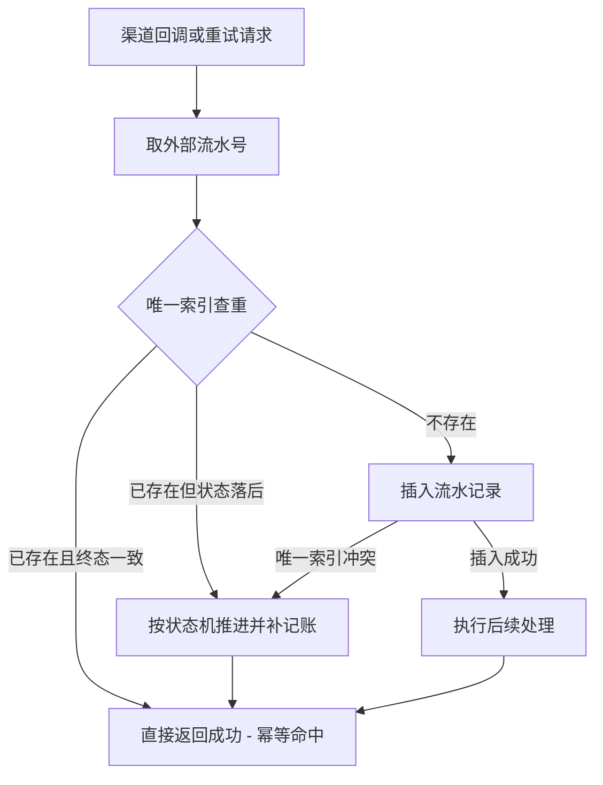
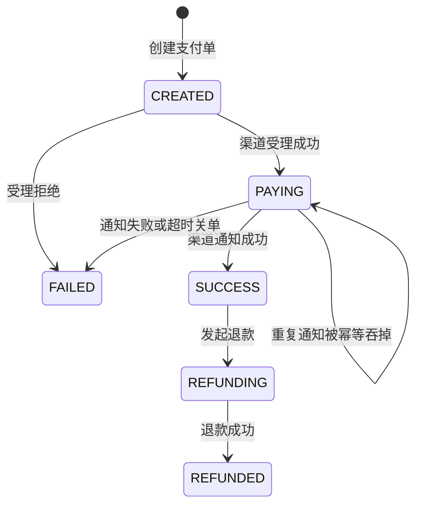
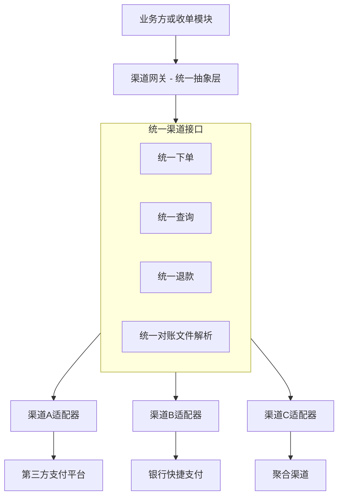

# 支付设计的六个高频决策：从零设计必答的取舍题

> **一句话摘要**：从零设计支付系统，有六个决策绕不开——账务要不要复式记账、异步化边界划在哪、幂等与防重怎么做、对账体系何时启动、渠道接入要不要抽象层、合规红线怎么守。每个决策本文给「推荐 + 反方案代价」，先说结论再讲为什么。

## 🎯 本文核心

**核心机制一句话**：六个高频决策共享同一条底层主线——**把钱的不确定性收敛进机制，而不是靠人盯**：复式记账收敛"账错"的不确定性，异步化边界收敛"耗时"的不确定性，幂等收敛"重复"的不确定性，对账收敛"状态分叉"的不确定性，渠道抽象收敛"外部差异"的不确定性，合规边界收敛"资格"的不确定性。

**机制链**：先定合规边界（能不能做）→ 再定账务模型（怎么记）→ 再定同步/异步与幂等（怎么跑）→ 最后定渠道抽象与对账（怎么接、怎么兜）。顺序反了的团队，通常在返工里重学一遍。

**系列定位**：本篇是《从零设计支付系统》系列第 2 篇，承接第 1 篇的四大模块骨架（收单/账务/渠道网关/对账清算），把骨架里每个模块的"必答题"逐个拆开；清结算的机制细节见站内《清结算体系》专题。

## 5W 速记卡

| 维度 | 一句话 |
|---|---|
| What | 六个决策：复式记账 / 异步化边界 / 幂等防重 / 对账启动时机 / 渠道抽象层 / 合规红线 |
| Why | 每个决策都直接决定资损风险与返工成本，选错方向的代价远超实现成本 |
| Who | 支付系统设计者与业务负责人共同拍板——尤其合规红线不是纯技术问题 |
| When | 全部在写第一行支付代码之前定方向；对账与合规不允许"二期再说" |
| How | 每个决策按「推荐 + 反方案代价」两栏读，先对齐结论再抠实现 |

---

## 决策总览

| # | 决策 | 本文推荐 | 反方案的核心代价 |
|---|---|---|---|
| 1 | 账务模型 | 复式记账，第一版就用 | 流水表回答不了余额正确性，返工最贵 |
| 2 | 异步化边界 | 受理与出金请求同步，结果确认异步 | 全同步被渠道超时拖死，全异步用户流失 |
| 3 | 幂等与防重 | 业务单号 + 数据库唯一索引兜底 | 只靠内存去重，重启/多实例即重复记账 |
| 4 | 对账启动时机 | 第一笔交易上线前 | 晚一个月，差错池深一个月，资损无感知 |
| 5 | 渠道接入 | 统一抽象层 + 适配器 | 业务直连渠道，换渠道即全量改造 |
| 6 | 合规红线 | 平台不碰资金池，资金走持牌机构 | 二清定性风险，业务直接叫停 |

---

## 决策一：账务要不要复式记账

**推荐：要，而且第一版就要。** 账务模块用复式记账——每笔资金动作记一借一贷、金额相等方向相反，全部账户合计恒为零。

**为什么不用反方案**（流水表 + 余额字段的简化模型）？它的吸引力在于上手快：一张表、一个累加字段。代价在追问两层之后显形：

- **第一层（正确性）**：余额 = 期初 + 累加流水，任何一笔漏记/重记都会让余额悄悄漂移，而系统没有任何自检手段——借贷平衡天然是一个**全局自检机制**，跑一遍合计就知道账有没有错。
- **第二层（演进）**：加第二、第三个账户（待清算、渠道在途、商户分账）后，流水表模型每次都要重推余额逻辑；复式记账只是加科目，模型不动。
- **第三层（协作）**：财务、审计认的是借贷语言。用流水表造的账，财务团队无法验收，最后技术团队自己养一套"影子账"。

**实践叙事（推演复盘，已匿名泛化）**：某平台第一版用流水表顶了一年，商户反馈余额对不上，排查一周，最后定位是两笔并发退款都读到旧余额又各自累加——复盘结论：问题不在并发处理，而在**模型本身没有"账平"的概念，错了也不知道错**。迁移复式记账花了一个季度，是那套系统历史上最贵的返工。

💡 **实战提示**：复式记账不等于复杂。最小实现只需要三张表：账户表、分录表（成对出现）、科目表。难的不是表结构，是和财务对齐科目口径——这是设计者躲不掉的功课。

---

## 决策二：异步化边界——哪些环节必须同步

**推荐：两段同步、其余异步。** 用户/调用方在等待的链路里，只同步做两件事：①收单受理（校验 + 创建支付单 + 预记账）；②向渠道发出请求并拿到"受理成功/失败"。渠道的**最终结果**（成功/失败终态）一律异步：等通知、主动查询、对账兜底三级推进。

**反方案的代价**：

- **全同步**（等渠道终态才返回）：渠道处理时长不受你控制，高峰期超时大面积出现；更糟的是超时后调用方重试，重复支付的口子从此打开。渠道侧一个慢，你的线程池先阵亡。
- **全异步**（受理即返回"处理中"，没有任何同步确认）：参数错误、风控拒绝这类确定性失败也变成"稍后通知"，用户在收银台干等，转化率受损；调用方（业务方）的对接成本也陡增。

**边界判断一句话**：**同步只做"可逆、快、本方说了算"的事**（校验、落单、记账），异步承接"慢、不确定、对方说了算"的事（渠道终态）。这条线也是第 1 篇"信息流/资金流两条节奏"的工程落地。

💡 **实战提示**：判定某个环节放同步还是异步，问一个问题就够——"这个环节的结果由谁决定？"本方决定 → 同步；外部决定 → 异步 + 查询补单。把决定权当边界，比拍脑袋画时序图稳得多。

---

## 决策三：幂等与防重

**推荐：业务唯一单号贯穿全链路 + 数据库唯一索引做最后防线 + 状态机只允许合法跃迁。** 三层各司其职：

| 层 | 机制 | 拦什么 |
|---|---|---|
| 入口层 | 业务单号（订单号+支付场景）做幂等键 | 调用方重放同一笔请求 |
| 存储层 | 外部流水号唯一索引 | 渠道重复通知、重试请求 |
| 状态机层 | 合法跃迁表 | 乱序/迟到通知改写终态 |

**为什么不能只靠内存去重**（常见反方案）？内存去重表在重启后清空、多实例间不同步、容量无界增长——三个洞随便哪个被踩到，都是重复记账。数据库唯一索引慢一点，但它是**最终防线**：并发插同一流水号，必有一个失败，失败方转入"读已有记录推进状态"的路径。防重的底层原理是**把判断和写入放进同一个原子操作**，任何绕开存储层判重的方案都在裸奔。

状态机的价值在**拒绝非法跃迁**：终态不可再变、退款只能从成功发起——它和幂等是一对搭档，幂等挡重复，状态机挡乱序。

💡 **实战提示**：设计完状态机，把"哪些跃迁允许并发发生"标出来，对每个并发点问一句"两次同时执行会怎样"。答不上来的跃迁，就是未来资损工单的候选名单。

---

## 决策四：对账体系的启动时机

**推荐：第一笔真实交易上线之前，对账必须能跑。** 哪怕第一版只做"本方流水对渠道账单"两方核对 + 差异落表，也必须先有；三方对账（加资金流水）随后补齐。

**反方案的代价**（"业务先上，对账二期补"）：对账的价值 = 差错发现时延 × 差错规模的止损。晚上线一个月，等于这一个月内所有渠道差错（丢单、重扣、金额不符）都在无感知状态下积累：

- 用户投诉是唯一的差错探测器——用真人体验当监控，品牌与客服成本双输。
- 追溯窗口变窄：渠道侧流水保留与查询能力有限，积压越久越查不动，很多差错最后只能"悬账"。
- 上线对账当天要一次性消化积压差错，运营首日即过载，项目口碑直接崩掉。

**量级演进视角**：十万级交易时，两方核对、日批一次就够；千万级要拆文件分片并行核对、差错自动分类修复；亿级必须分层对账（渠道-平台-账务三层各自勾稽）。约束来源从"人力审差异"演进到"机制自修复"——但这一切的前提都是**它存在**。

💡 **实战提示**：判断对账该不该上线的标准只有一个——有没有真实交易。测试环境数据不产生真实差错，对账在测试环境跑通不等于上线就绪；把"首笔真实交易"当作对账的上线时钟。

---

## 决策五：渠道接入的抽象层

**推荐：统一渠道网关做抽象层，对内一套统一接口（下单/查询/退款/对账文件解析），对外每个渠道一个适配器。** 业务与收单模块只面对统一接口，永远不直接感知渠道差异。

**为什么不直接对接**（业务代码直连渠道 SDK）？第一年省了抽象层的设计成本，之后每次还债：换渠道 = 业务全量改造；双渠道并行做路由 = 改造翻倍；渠道错误码、异步通知格式、对账文件格式的差异散落在各个业务里，没人能说清系统整体支持哪些能力。抽象层的本质是**把"外部世界的不稳定"压缩到一个包里**——外部怎么变，内部语义不动。

**抽象到什么程度**：只抽象稳定概念（支付、退款、查询、对账文件），不为渠道的独有功能提前造通用接口。过度抽象和没有抽象一样致命——前者用错误的通用模型套住所有渠道，后者让差异到处蔓延。

💡 **实战提示**：抽象层的验收标准很朴素——新接一个渠道，只允许写适配器这一个包的代码，统一接口与业务侧零改动。做不到，说明抽象泄漏了。

---

## 决策六：合规红线——备付金与二清

这不是技术取舍，是**资格边界**，所以放最后压轴：前五个决策做错是返工，这个决策做错是业务不存在。

**两条红线（监管公开文件与公开报道口径）**：

1. **备付金**：支付机构的客户备付金自 2019 年起实行 100% 集中存管——监管意图很清楚：客户的钱不是机构经营性资金，掐断"沉淀资金吃利息、挪用资金扩张"的旧模式，把资金安全变成硬约束。对自建系统者的含义：你的架构里**不存在任何能触碰客户资金的账户设计**。
2. **二清**（二次清算）：无支付业务资质的平台，以自己名义归集商户资金再向下结算，即触碰"未经许可从事支付结算业务"的定性。监管意图是资金路径必须全程在持牌体系内：平台可以管理**信息**（订单、分账指令），不能管理**资金**（归集、截留、代付）。

**推荐姿势**：平台侧做"信息层"——订单、分账指令、对账；资金路径全部交给持牌机构的产品能力（合规的分账/代付产品），资金不落平台账户。反方案的代价不是"罚款了事"：支付通道可能被单边关闭、存量资金被冻结、业务直接叫停——这在其监管沟通案例与公开报道中反复出现，属于"一次定性、没有第二次"的红线。

**跨公司视角**：头部平台自持牌照，红线内化为内部规范；中型平台的普遍选择是与持牌机构深度绑定，用其分账能力替代自建资金池；小平台的常见错误恰恰是"先用平台账户收钱跑起来再说"——这条起跑线，起步即越线。

💡 **实战提示**：架构评审时给资金路径画一张图：从用户付款到商户到账，每一个资金停留点标注"谁在持有、凭什么的资质"。任何一个停留点的答案是"本平台账户"，评审直接不通过——这是比任何代码规范都优先的一票否决项。

---

## 不同量级的思考：六个决策的取舍随量级变化

- **十万级**。约束来源是人力与时间：六个决策全部取"最简正确版"——复式记账三张表、两段同步、唯一索引幂等、两方对账、单适配器、资金走持牌产品。这一档的核心问题是"闭环跑通且账平"，而不是"架构完备"（思考方式：最简正确驱动——每个决策取能证明账平的最简版）。
- **百万级**。约束来源是稳定性与差错时效：单渠道开始偶发限流，差错不能再靠人工逐笔看。这一档的核心问题是"让机制接管差错的分类与修复"，而不是"换更强的机器"（思考方式：机制替换人工驱动——先自动化差错处理，再扩功能）。
- **千万级**。约束来源变成吞吐与差错规模：账务转批量异步、对账拆分片并行、渠道出多渠道路由。这一档的核心问题是"机制吃得住规模"，而不是"再加功能"（思考方式：吞吐驱动——一切改造先问写压力与配额）。
- **亿级**。约束来源是一致性域与监管关注度的双重放大：分层对账、分片账务、多活部署，同时合规成本（报送、审计颗粒度）随规模非线性上升。这一档的核心问题是"分片后依然全局可对账、可举证"，而不是"单点更快"（思考方式：分片驱动——一致性域拆到哪，对账与举证跟到哪）。

自下而上收个尾：每一档都是上一档跑通后的自然拆分，跳档建设从未被验证成功过；触发升级的信号永远先出现在对账与账务——差错率与跑批时长，是量级压力最早的温度计。

---

## 什么时候用/不用：六个推荐的适用边界

**明确推荐的组合**：六个推荐是"默认值"——没有特殊理由，按推荐走。它们是行业多年资损教训的公约数。

**可以偏离的场景**：

- 纯内部工具、无外部商户资金：决策六降级为"走公司既有资金通道"，其余五个照旧。
- 交易量极小且永远小的系统：决策一可以用平台产品账单替代自建账务——但"永远小"这个前提，历史上很少有团队押对。
- 单一渠道且已签排他：决策五的抽象层可以薄到只剩一个适配器骨架，但**骨架要留**——排他协议都有到期日。

**误区别踩**：

- 把"合规红线"理解为"法务的事"：资金路径是架构画出来的，法务审的是图纸不是代码。
- 把"幂等"只当接口层的事：渠道通知、定时任务、人工补单，每个入口都要过幂等三件套。
- 把"异步"理解成"不用管"：异步必有查询补单与对账兜底，否则只是把失败藏得更深。

---

## Trade-off：六个决策的共性取舍

| 共性取舍 | 取这边 | 舍那边 | 判断依据 |
|---|---|---|---|
| 正确性 vs 开发速度 | 决策一/三/四取正确性 | 牺牲首版速度 | 账务返工成本 > 一切提速收益 |
| 简单 vs 扩展性 | 决策五取扩展性 | 多一层抽象成本 | 渠道必然多接，差异必然蔓延 |
| 体验 vs 确定性 | 决策二取边界拆分 | 牺牲部分实时性 | 外部终态本就不受本方控制 |
| 业务自由 vs 资格合规 | 决策六取合规 | 放弃资金池 "灵活性" | 无资格的灵活性 = 定性风险 |

六个决策的 Trade-off 主线：**凡是"错了会资损或违规"的，永远取正确性与合规；凡是"慢了影响体验"的，用异步与机制兜住**。两边的优先级不可交换——这也是支付系统与一般业务系统最根本的气质差异。

## 你们可能会问

**Q1：六个决策有没有优先级？资源只够先做一个时先做哪个？**
合规（决策六）与账务（决策一）是底线对，其余可以慢。追问一层：为什么不是幂等优先？因为幂等的前提是有账可记——账务模型定了，幂等的"重"才有意义。

**Q2：复式记账会不会过度设计？小系统真的用得上吗？**
再追问一层：小系统的"账平"靠什么证明？流水表给不出证明。复式的最小实现就是三张表，成本最高的是与财务对齐科目——这个功课小系统同样逃不掉，只是晚做更贵。

**Q3：渠道给了"同步返回支付成功"的接口，还要异步化吗？**
打破砂锅问一句：渠道说的"成功"是终态吗？受理成功、用户已付、清算完成是三件事。任何声称同步的渠道，都仍要通知 + 查询 + 对账三级兜底——把"接口返回"当"资金事实"，是资损叙事里最经典的开场。

**Q4：这些决策和微服务/领域驱动设计什么关系？**
六个决策是**职责边界**的答案，微服务是**部署形态**的选择。先有边界（账务域、渠道域、对账域），再谈要不要物理拆分；跳过决策直接画服务图，得到的是按团队人数缩放的混乱。

## 🎯 核心带走

- **核心一句话**：六个决策 = 把钱的不确定性收敛进机制——账务定模型、异步定边界、幂等防重复、对账兜分叉、抽象挡差异、合规定资格。
- **链条复述**：合规边界 → 账务模型 → 同步/异步 + 幂等 → 渠道抽象 → 对账兜底；顺序错了全链返工。
- **失效点/边界**：六个推荐是默认值，偏离的前提是清楚反方案代价；唯一不可偏离的是决策六——合规红线没有"先跑再说"。
- **留一个问题（开放讨论）**：如果渠道通知和渠道对账文件冲突（通知说成功、账单里没有这笔），你的系统该信谁？这个问题的答案，就是对账体系的设计起点。

## 自测三问

1. 复式记账比"流水表+余额字段"多出来的那个**自检机制**是什么？
2. 同步/异步的边界判断口诀是什么？"结果由谁决定"怎么套用到你当前的链路上？
3. 二清定性的触发条件是什么？画出你所在业务的资金路径，有没有平台持有资金的停留点？

## 📌 数据与事实声明

- 本篇为架构决策推演文：六个决策的推荐与代价分析为行业通行的架构认知口径，不描述也不指向任何特定公司的真实系统与真实项目。
- 文中交易量级、时间成本均为**示例数字**（行业认知口径的量级示意），不构成任何机构的真实经营数据。
- 备付金集中存管（2019 年起全面实施）、二清定性等监管表述，以监管公开文件与公开报道口径为准，具体执行以最新监管规定为准。
- 事故与复盘段落均为**推演复盘**，已匿名化与泛化处理，非真实案例主体。

## 📚 参考资料

| 来源 | 内容 | 链接 |
|---|---|---|
| 站内第 1 篇 | 最小骨架四大模块与最小闭环 | [./1_支付系统的最小骨架-入门.md](./1_支付系统的最小骨架-入门.md) |
| 站内《清结算体系》 | 三方对账、轧差与结算的机制细节 | [../1_清结算体系.md](../1_清结算体系.md) |
| 站内《渠道管理与路由策略》 | 渠道路由与费率的跨境域展开 | [../../跨境支付/浅析业务/5_通道管理与路由策略-深度.md](../../跨境支付/浅析业务/5_通道管理与路由策略-深度.md) |
| 监管公开口径 | 备付金集中存管、支付结算业务资质相关监管公开文件 | 以监管机构官网公开文件为准 |
