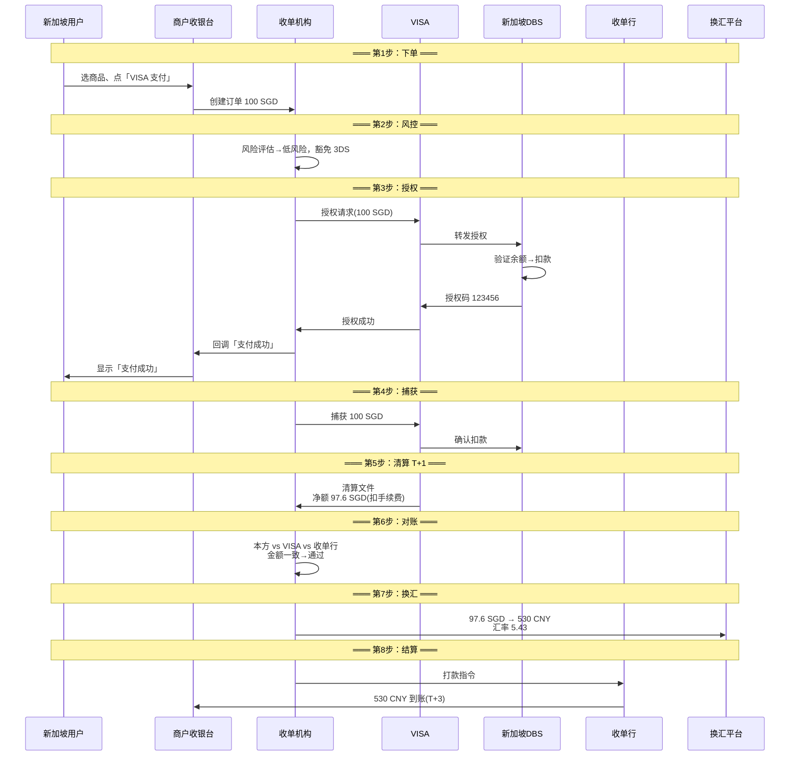

# 端到端实战：境外 VISA 卡在中国商户的全链路走查

> **一句话定义**：用一个真实场景走通跨境收单的全链路——新加坡用户用 VISA 卡买 100 SGD 的 SaaS 软件，钱怎么一步步到深圳商户的账上。

---

## 1. 场景设定

```
用户：新加坡持卡人，DBS VISA 信用卡
商户：深圳 SaaS 公司，接入了跨境收单
商品：一年 SaaS 订阅，100 SGD
支付方式：VISA
```

---

## 2. 端到端时序



---

## 3. 每一步的细节

| 步骤 | 谁参与 | 耗时 | 技术实现 |
|---|---|---|---|
| 下单 | 用户+商户 | <100ms | HTTPS + API |
| 风控 | 收单机构 | <50ms | 规则引擎 |
| 授权 | 收单+VISA+DBS | 2-3s | ISO 8583 / REST |
| 回调 | 收单→商户 | <500ms | Webhook + 重试 |
| 捕获 | 收单+VISA | <1s | API 调用 |
| 清算 | VISA→收单 | T+1凌晨 | 文件 SFTP |
| 对账 | 收单机构 | 2-4h | 自动+人工 |
| 换汇 | 收单+FX平台 | T+1白天 | API+锁汇 |
| 结算 | 收单→商户银行 | T+3 | 银行转账 |

---

## 4. 可能出问题的环节

| 环节 | 问题 | 影响 |
|---|---|---|
| 授权 | DBS 拒绝（余额不足/卡过期） | 交易失败，提示用户换卡 |
| 3DS | 用户输错验证码 | 重试 3 次后拒绝 |
| 捕获 | 已授权但超时未捕获 | 授权作废，钱退回持卡人 |
| 对账 | VISA 清算文件和收单行对账单差 0.01 SGD | 人工核查，延迟结算 |
| 换汇 | 汇率从 5.43 跌到 5.38 | 商户少收 3 CNY |
| 拒付 | 30 天后用户说"没买过" | chargeback，罚金 15 USD |

---

## 5. 一句话总结

> **一笔 100 SGD 的交易，3 秒授权，3 天到账，涉及 6 个机构、2 次跨境通信、1 次换汇。每一步都可能出问题——这就是跨境收单的日常。**
