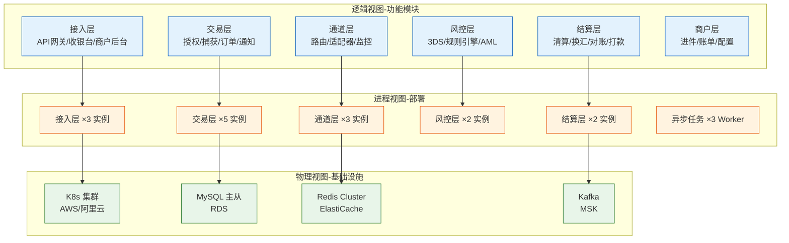
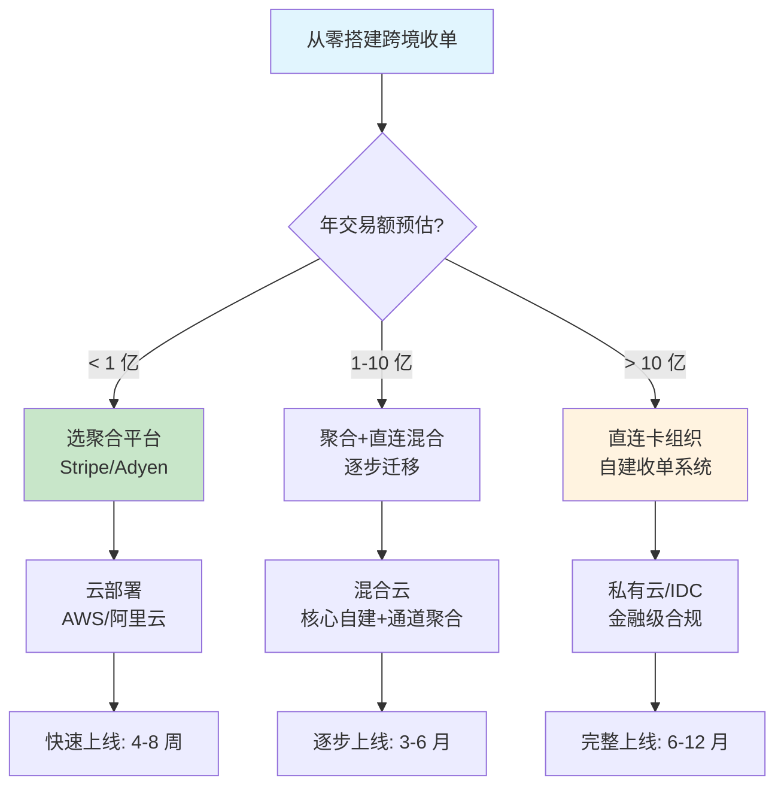

# 全局架构设计：跨境收单系统全景

> **一句话定义**：跨境收单系统 = 接入层 + 交易层 + 通道层 + 风控层 + 结算层 + 商户层。每层独立演进、独立部署、独立故障隔离。从零搭建的核心决策：直连还是聚合？自建还是采购？

---

## 1. 4+1 架构视图

---

## 2. 技术栈全景

| 层 | 组件 | 技术选型 | 备选 |
|---|---|---|---|
| 接入 | API 网关 | Kong | Nginx + Lua |
| 接入 | 收银台 SDK | 自研 JS/iOS/Android | Stripe Elements |
| 交易 | 服务框架 | Spring Boot 3 + gRPC | Go + Gin |
| 交易 | 数据库 | MySQL 8.0 主从 | TiDB |
| 通道 | 适配器 | 策略模式 + SPI | — |
| 风控 | 规则引擎 | Drools / 自研 DSL | Flink CEP |
| 风控 | 3DS | Cardinal / Netcetera | — |
| 结算 | 任务调度 | XXL-Job | Apache DolphinScheduler |
| 结算 | 换汇 | 对接 Refinitiv API | 银行牌价 |
| 消息 | 异步队列 | Kafka | RocketMQ |
| 缓存 | 分布式缓存 | Redis Cluster | — |
| 搜索 | 交易查询 | Elasticsearch | — |
| 监控 | 指标采集 | Prometheus + Grafana | Datadog |
| 日志 | 日志平台 | ELK | Loki |
| 部署 | 容器编排 | K8s + Helm | Docker Compose |
| CI/CD | 持续交付 | GitHub Actions + ArgoCD | Jenkins |

---

## 3. 关键 Trade-off 汇总

| # | 决策 | 选项 A | 选项 B | 推荐 |
|---|---|---|---|---|
| 1 | 模式 | 聚合收单 | 直连卡组织 | 量小选聚合，量大选直连 |
| 2 | 币种 | 实时换汇 | 批量换汇 | 小额批量，大额实时 |
| 3 | 3DS | 全量强制 | 按风险分级 | **按风险分级** |
| 4 | 通道 | 单通道 | 多通道 | 多通道（容灾+成本优化） |
| 5 | 对账 | 人工对账 | 自动对账 | 自动+人工兜底 |
| 6 | 部署 | 单机房 | 多机房 | 多机房（灾备） |
| 7 | 数据库 | 单库 | 分库分表 | 按商户号分库 |
| 8 | 自建 vs 采购 | 自建全套 | 采购 SaaS | 核心自建，非核心采购 |

---

## 4. 从零搭建决策清单

---

## 5. 一句话总结

> **跨境收单系统的复杂度 = 国内支付 × 3（多币种、多卡组织、多监管）+ 拒付这个国内没有的东西。从零搭建的核心不是技术，是决策：量小选聚合、量大选直连、风控按风险分级、通道按成本+健康度路由。**
