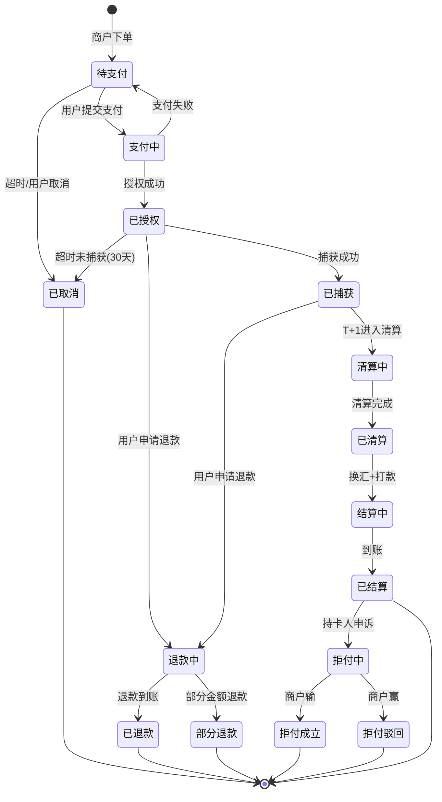

# 跨境收单订单生命周期：从下单到销户的完整状态机

> **一句话定义**：一笔跨境订单不是「付了就是成功」。它有正向（下单→支付→结算）和逆向（取消/退款/撤销/冲正/拒付）两条路径，共 9+ 个关键状态节点。

---

## 1. 正向与逆向

| | 正向订单 | 逆向订单 |
|---|---|---|
| 方向 | 下单 → 支付成功 | 从已支付状态往回走 |
| 触发 | 用户主动付款 | 用户/商户/银行发起 |
| 6 种类型 | — | 取消、退款、撤销、冲正、拒付、部分退款 |

---

## 2. 订单完整状态机

---

## 3. 9 个关键节点

| 节点 | 英文 | 谁触发 | 用户看到什么 |
|---|---|---|---|
| 待支付 | Pending | 商户下单 | 「等待付款」 |
| 支付中 | Processing | 用户提交 | 「支付处理中」 |
| 已授权 | Authorized | 发卡行 | 「支付成功」（但钱还没到） |
| 已捕获 | Captured | 商户/自动 | 「已扣款」 |
| 清算中 | Clearing | 卡组织 T+1 | 不感知 |
| 已清算 | Cleared | 卡组织 | 不感知 |
| 结算中 | Settling | 收单机构 | 不感知 |
| 已结算 | Settled | 收单机构 | 商户看到钱到账 |
| 已取消/退款/拒付 | Cancelled | 各方 | 「已退款」 |

---

## 4. 逆向订单 6 种类型

| 类型 | 英文 | 触发条件 | 和正向订单的关系 |
|---|---|---|---|
| **取消** | Cancel | 超时未付/用户主动取消 | 待支付→取消 |
| **退款** | Refund | 用户申请/商户同意 | 已支付→退款 |
| **撤销** | Void | 当日撤销（未清算） | 已授权→撤销 |
| **冲正** | Reversal | 系统异常（超时/通讯错） | 支付中→冲正 |
| **拒付** | Chargeback | 持卡人向发卡行申诉 | **已结算→强制扣回** |
| **部分退款** | Partial Refund | 退部分金额 | 已支付→部分退款 |

**关键区分：**

| 对比 | 退款 Refund | 拒付 Chargeback |
|---|---|---|
| 谁发起 | 商户/用户协商 | **持卡人直接找银行** |
| 商户同意？ | ✅ 同意 | ❌ 不同意 |
| 金额 | 可部分 | 通常是全额+罚金 |
| 罚金 | 无 | **15-100 USD/笔** |
| 周期 | 3-15 天 | **30-120 天** |

---

## 5. 一句话总结

> **订单状态机 = 正向 8 步（待支付→支付→授权→捕获→清算→结算）+ 逆向 6 种（取消/退款/撤销/冲正/拒付/部分退款）。正向前半段用户可见，后半段（清算→结算）不可见。拒付是逆向里最危险的一种——商户没同意，钱被强制扣回还要交罚金。**
