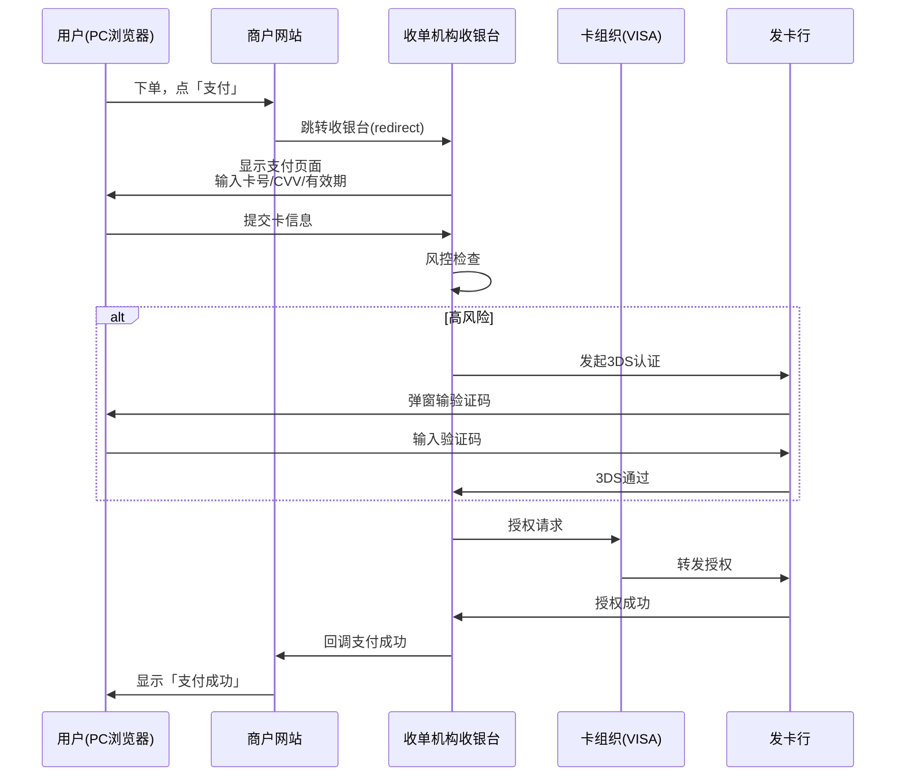

# 线上支付全流程：PC收银台、H5与APP内支付

> **一句话定义**：线上支付分三种形态——PC收银台（浏览器跳转）、H5支付（移动网页）、APP内支付（JSAPI唤起钱包）。每种形态的技术实现和用户体验完全不同。

---

## 1. 三种线上支付形态对比

| 维度 | PC收银台 | H5支付 | APP内支付 |
|---|---|---|---|
| 终端 | 电脑浏览器 | 手机浏览器 | 原生APP |
| 技术 | 页面跳转/iframe | 页面跳转 | **JSAPI唤起钱包APP** |
| 用户操作 | 输卡号+CVV | 跳转银行页面 | 唤起钱包→指纹/面容支付 |
| 3DS | 弹窗认证 | 跳转认证 | 后台Frictionless |
| 转化率 | 中 | 低（跳转流失） | **高（无感支付）** |
| 典型场景 | SaaS订阅、跨境电商 | 移动端购物 | 滴滴打车、美团外卖 |

---

## 2. PC收银台流程



---

## 3. APP内支付（JSAPI）

APP内支付的核心是 **JSAPI**——在商户APP内唤起微信/支付宝/钱包APP完成支付：

```
1. 用户在商户APP内点「支付」
2. 商户APP调用收单机构SDK
3. SDK唤起钱包APP（如GrabPay）
4. 用户在钱包APP内指纹/面容确认
5. 钱包返回支付结果
6. 商户APP收到回调
```

**优势**：无需跳转、无需输入卡号、转化率最高。**挑战**：每个钱包的JSAPI协议不同，需要逐个适配。

---

## 4. 一句话总结

> **PC收银台=输卡号、H5=跳转页面、APP内=唤起钱包。用户体验越好（APP内），开发成本越高（每个钱包一套SDK）。选哪种取决于你的用户在哪。**
