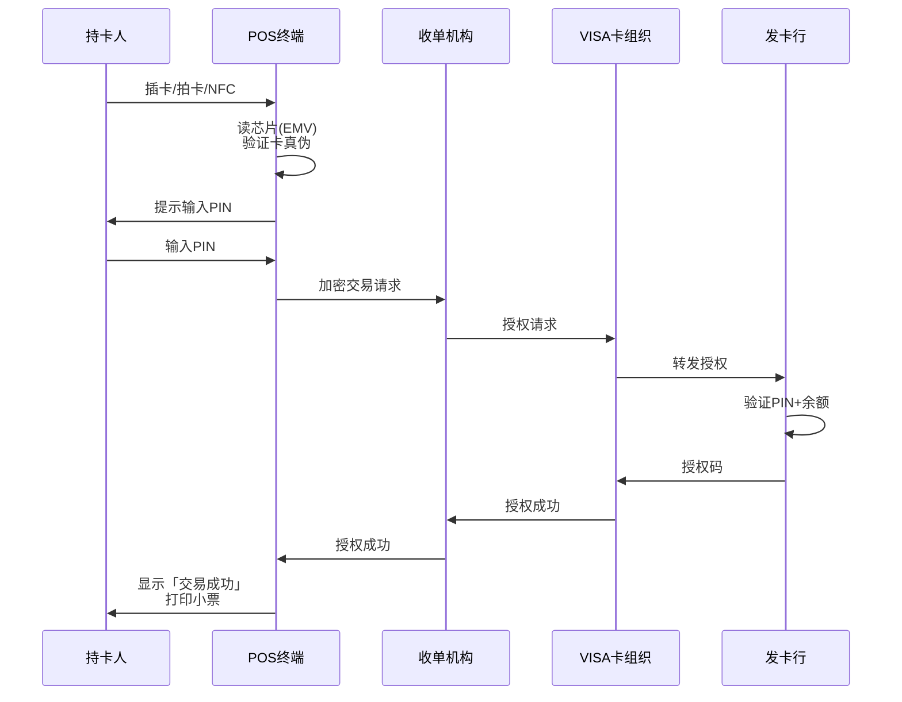

# POS刷卡支付：终端、EMV芯片与卡组织交互

> **一句话定义**：POS刷卡支付 = CP（Card Present）模式。和线上卡支付最大的区别是多了物理终端——POS机负责读卡、输PIN、和卡组织交互。EMV芯片卡的安全性远超磁条卡。

---

## 1. 线下 vs 线上卡支付

| 维度 | 线上卡（CNP） | 线下卡（CP） |
|---|---|---|
| 卡在哪 | 用户输入卡号 | **实体卡在POS机上** |
| 认证 | CVV + 3DS | **芯片 + PIN/签名** |
| 欺诈风险 | 高（卡号泄露） | 低（需实体卡） |
| 交易速度 | 2-5秒 | **<1秒（拍卡/NFC）** |
| 费率 | 高 | 低（风险低→费率低） |

---

## 2. POS刷卡流程

---

## 3. 三种读卡方式

| 方式 | 技术 | 安全性 | 速度 |
|---|---|---|---|
| **插卡** | EMV芯片 | ⭐⭐⭐ 最高 | 慢(5-10s) |
| **拍卡** | NFC/Contactless | ⭐⭐ 中 | **快(<1s)** |
| **刷卡** | 磁条 | ⭐ 最低 | 中(2-3s) |

> **趋势**：磁条卡正在被淘汰。EMV芯片是主流，NFC拍卡是增长最快的（Apple Pay/Google Pay）。

---

## 4. 一句话总结

> **POS刷卡 = 线下卡支付。EMV芯片 + PIN = 最高安全级别，NFC拍卡 = 最快用户体验。线下卡费率和拒付率都远低于线上——因为实体卡在用户手里，欺诈成本高得多。**
