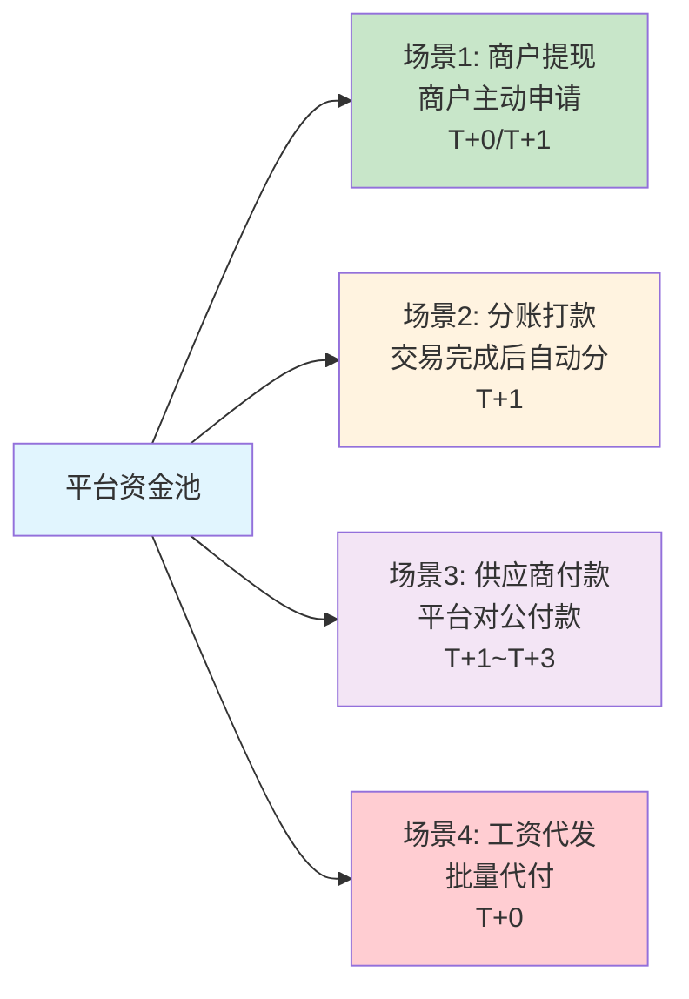

# 代付Payout：资金流出的逆向全流程

> **一句话定义**：代付（Payout）= 收单的反向——把钱从平台打出去，而不是收进来。典型场景包括商户提现、供应商付款、分账打款、工资代发。

---

## 1. 收单 vs 代付

| 维度 | 收单（Pay-in） | 代付（Payout） |
|---|---|---|
| 资金方向 | **用户→平台→商户** | **平台→商户/供应商** |
| 谁发起 | 消费者 | **平台/商户** |
| 核心动作 | 授权 + 捕获 | 打款指令 |
| 风险 | 拒付 | **打款失败/打错账户** |
| 合规 | 反洗钱（入金） | **反洗钱（出金）+ 外管申报** |
| 时效 | 秒级授权 | T+0~T+3 到账 |

---

## 2. 代付的 4 大场景



---

## 3. 代付流程

```
1. 商户/平台发起代付申请（金额/收款账户/币种）
2. 风控审核（金额上限/频次/收款账户黑白名单）
3. 合规检查（反洗钱/制裁名单/外管申报）
4. 资金冻结（从平台资金池冻结对应金额）
5. 调用银行/支付通道打款
6. 回调通知（成功/失败/处理中）
7. 失败→原路退回资金池，通知商户重试
```

---

## 4. 一句话总结

> **代付 = 钱从平台出去。核心风险不是拒付，是打错账户和洗钱。每一笔代付都要过风控+合规+外管三道关。**
