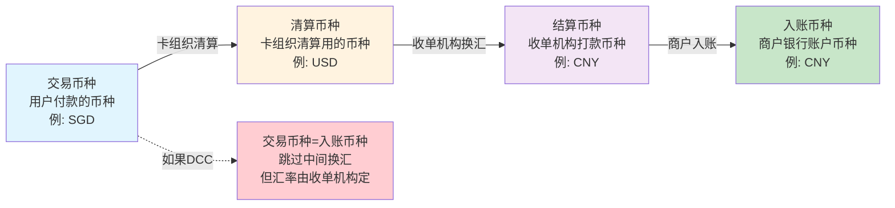

# 跨境支付多币种路径：4层币种口径与换汇流转

> **一句话定义**：一笔跨境交易涉及 4 层币种——交易币种、清算币种、结算币种、入账币种。每一层换汇都产生汇损，理解这 4 层才能算清一笔跨境交易到底多少钱。

---

## 1. 4 层币种模型



| 层 | 币种 | 谁决定 | 示例 |
|---|---|---|---|
| 交易币种 | 用户在收银台看到的币种 | 商户/收单机构 | SGD（用户在新加坡） |
| 清算币种 | 卡组织清算用的币种 | **卡组织** | USD（VISA 的清算币种） |
| 结算币种 | 收单机构打款给商户的币种 | 收单机构/商户 | CNY（商户在中国） |
| 入账币种 | 商户银行账户的币种 | 商户 | CNY |

---

## 2. 每一次换汇的汇损

```
交易币种 SGD → 清算币种 USD → 结算币种 CNY → 入账币种 CNY
    │                │                │
    └─ 汇损 1        └─ 汇损 2        └─ 无汇损（同币种）
       SGD→USD          USD→CNY
       银行买入价        银行买入价
```

**100 SGD 的完整换汇链条：**

| 步骤 | 金额 | 汇率 | 汇损 |
|---|---|---|---|
| 交易币种 | 100 SGD | — | — |
| 卡组织清算 | 74.5 USD | 1 SGD = 0.745 USD | ~0.1 USD |
| 收单机构换汇 | 530 CNY | 1 USD = 7.12 CNY | ~5 CNY |
| 商户到账 | **525 CNY** | — | **约 2.8% 总汇损** |

---

## 3. DCC 的特殊性

**DCC（动态货币转换）** = 跳过卡组织清算币种，直接从交易币种→结算币种。

| | 普通路径 | DCC 路径 |
|---|---|---|
| 换汇次数 | 2 次（SGD→USD→CNY） | 1 次（SGD→CNY） |
| 汇率定价权 | 卡组织 + 收单机构 | **收单机构自己定** |
| 对用户 | 按卡组织汇率 | 按收单机构 DCC 汇率（**通常更贵**） |
| 对收单机构 | 无额外收益 | **DCC 加价 = 额外利润** |

> **DCC 的真相**：收单机构用 DCC 赚取汇差——报价时用的汇率比市场汇率差 3%-5%。对用户通常不划算，但对收单机构是重要利润来源。

---

## 4. 一句话总结

> **跨境支付 = 4 层币种 × 最多 2 次换汇 × 每次 1% 汇损。DCC 是收单机构的利润工具——用户以为省了麻烦，实际上多付了 3%-5%。搞懂这 4 层币种口径，才能算清一笔跨境交易到底值多少钱。**
