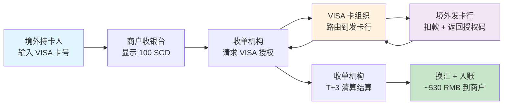
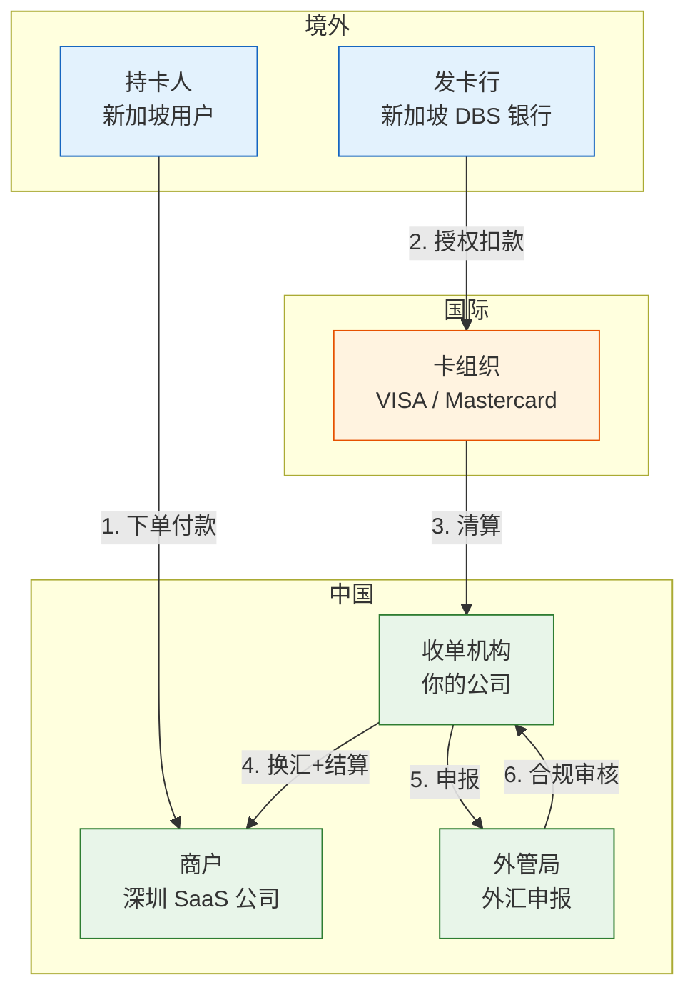

# 跨境支付收单：技术人 10 分钟入门

> **一句话定义**：跨境支付收单 = 让境外消费者用他们习惯的支付方式（VISA、Mastercard、本地钱包），在中国商户的网站或 App 上付款，钱最后换成人民币到商户账上。

---

## 1. 为什么需要跨境收单

你是一个深圳的 SaaS 公司，卖给新加坡客户一套软件。客户想用新加坡的信用卡付款。

**如果只接国内支付（微信/支付宝）：** 新加坡客户根本没有微信支付。没法付。

**如果接跨境收单：** 客户用 VISA/Mastercard 付款 → 美元/新币 → 换成人民币 → 到你的银行账户。

> **跨境收单的本质：帮中国商户收境外消费者的钱。**

---

## 2. 国内支付 vs 跨境收单

| 维度 | 国内支付 | 跨境收单 |
|---|---|---|
| 消费者在哪 | 国内 | 境外 |
| 用什么付款 | 微信/支付宝/银联 | VISA/MC/本地钱包 |
| 币种 | 人民币 | 外币 → 换人民币 |
| 清算机构 | 网联/银联 | VISA/MC 等国际卡组织 |
| 结算周期 | T+1 | T+3 ~ T+7（更慢，链路更长） |
| 手续费 | ~0.6% | ~3%-5%（高 5-8 倍！） |
| 最大风险 | 盗刷 | **拒付（chargeback）**——持卡人说"我没买过" |
| 监管 | 央行 | 央行 + 外管局 + 国际卡组织规则 |

---

## 3. 一笔境外卡交易的 7 站旅程

新加坡用户用 VISA 卡在你的网站上付 100 SGD（约 540 RMB）：



**每一步的差异：**

| 步骤 | 国内支付 | 跨境收单 |
|---|---|---|
| 1. 用户付款 | 扫码/输密码 | 输卡号+CVV+有效期（卡支付） |
| 2. 收银台 | 人民币 | 多币种显示，动态汇率 |
| 3. 授权 | 网联转发 | VISA/MC 网络转发（跨 3-5 个中间机构） |
| 4. 发卡行扣款 | 国内银行 | 境外银行（新加坡/美国/欧洲...） |
| 5. 清算 | 网联 T+1 | 卡组织按批次清算 |
| 6. 换汇 | 不需要 | **外币→人民币，有汇损** |
| 7. 结算 | T+1 | **T+3~T+7**（链路长+合规审查） |

---

## 4. 跨境独有的 4 个概念

### 4.1 卡组织

国内有银联和网联。跨境有：

| 卡组织 | 覆盖区域 | 全球市占率 |
|---|---|---|
| VISA | 全球 | ~40% |
| Mastercard | 全球 | ~30% |
| American Express | 北美为主 | ~15% |
| JCB | 日本 | ~5% |
| 银联国际 | 中国+东南亚 | ~10% |

### 4.2 3DS 认证

**3D Secure** = 在线支付时多一步验证持卡人身份（输入银行发送的短信验证码 / 指纹）。

> 国内用 U 盾/短信验证码。跨境用 3DS。没通过的交易 → 拒付风险极高。

### 4.3 DCC（动态货币转换）

用户在境外网站付款时，可以选择用「本国货币」还是「人民币」结算。

```
100 SGD 的订单：
- 用 SGD 付 → 发卡行按银行汇率换 → 可能更便宜
- 用 RMB 付 → 收单机构按 DCC 汇率换 → 多收 3%-5%
```

> **DCC = 收单机构的利润工具。对消费者通常不划算。**

### 4.4 Chargeback（拒付）

**国内没有的东西，跨境支付最大的风险。**

持卡人说「我没买过 / 没收到货 / 货不对版」→ 发卡行直接把钱从商户账上扣回。

| | 国内退款 | 跨境 Chargeback |
|---|---|---|
| 谁发起 | 商户/用户申请 | **持卡人直接向发卡行申诉** |
| 谁来判 | 平台 | **发卡行 → 卡组织仲裁** |
| 赔率 | 商户通常不赔 | **商户输了要赔钱+罚金** |
| 周期 | 实时-3天 | **30-120 天** |

---

## 5. 跨境收单的参与方



---

## 6. 核心 Trade-off

### 直连卡组织 vs 聚合收单

| 维度 | 直连（直接签约 VISA） | 聚合（通过 Stripe/Adyen） |
|---|---|---|
| 费率 | 低（~2%） | 高（~3%-5%） |
| 接入成本 | 极高（合规+技术+保证金） | 低（API 几周搞定） |
| 结算周期 | T+3 | T+5~T+7 |
| 通道稳定性 | 高 | 依赖聚合方 |
| **适合谁** | 年交易额 > 10 亿的大商户 | 中小商户 / 快速上线 |

### 本地收单 vs 跨境收单

| 维度 | 本地收单 | 跨境收单 |
|---|---|---|
| 模式 | 在境外当地有牌照，直接收单 | 通过卡组织跨境收单 |
| 费率 | 更低（本地费率） | 更高（跨境费率） |
| 拒付率 | 低 | **高 3-5 倍**（跨境消费争议多） |
| 合规 | 当地监管 | 两地监管 |

---

## 7. 一句话总结

> **跨境支付收单 = 国内支付的复杂度 × 3（币种、卡组织、监管） + 拒付这个国内不存在的东西。搞懂拒付，你就搞懂了跨境支付最大的风险。**
