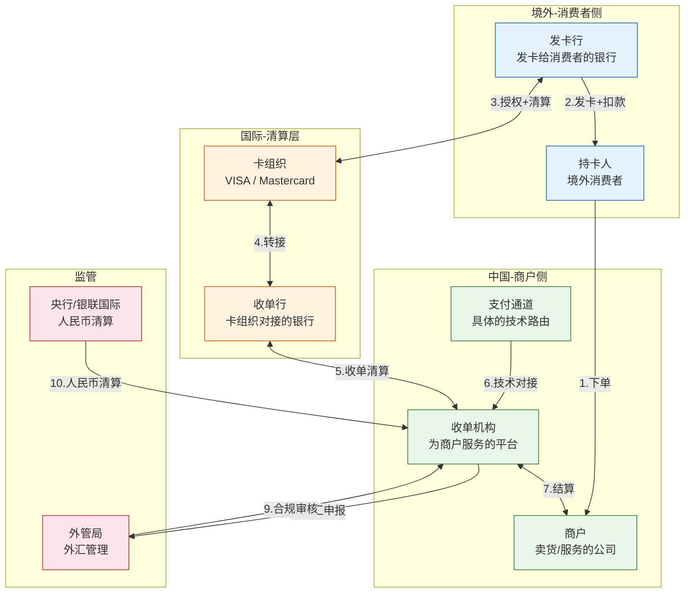

# 跨境收单的 9 类参与者：谁在赚钱，谁在扛风险

> **一句话定义**：跨境收单不是两个人（用户和商户）的事。一笔 VISA 卡交易跨越 3 个国家、经过 6 个机构、涉及 9 类参与者。搞懂每个角色干什么、赚什么钱、扛什么风险，才算真正入行。

---

## 1. 9 类参与者全景图



---

## 2. 逐层拆解

### 第一层：消费者侧（境外）

#### 持卡人（Cardholder）

| 维度 | 内容 |
|---|---|
| 是谁 | 境外消费者——可能是新加坡的学生、美国的工程师、欧洲的游客 |
| 做什么 | 在你的网站上买东西，用他的 VISA/Mastercard 付款 |
| 关心什么 | 价格对不对、汇率划不划算、卡会不会被盗刷 |
| 赚什么钱 | 不赚钱，花钱的 |

#### 发卡行（Issuing Bank）

| 维度 | 内容 |
|---|---|
| 是谁 | 给持卡人发信用卡/借记卡的银行——比如新加坡 DBS、美国 Chase |
| 做什么 | 验证卡号+CVV+有效期 → 扣款 → 返回授权码 |
| 赚什么钱 | **手续费的大头（~70%）** ——交易金额的 1.5%-2% |
| 扛什么风险 | 盗刷风险（持卡人说"我没买过"→银行要赔） |

> **关键认知**：发卡行在境外，不在中国管辖范围内。出了争议，你是跟一个你从来没听过的境外银行打交道。这就是为什么跨境拒付很难搞。

---

### 第二层：国际清算层

#### 卡组织（Card Network）

| 维度 | 内容 |
|---|---|
| 是谁 | VISA、Mastercard、American Express、JCB、银联国际 |
| 做什么 | 在发卡行和收单行之间**路由**交易——"这笔交易从新加坡 DBS 来，要送到中国的收单机构" |
| 赚什么钱 | **转接费（~0.05%）** + 品牌使用费 |
| 话语权 | 极高——卡组织定规则，所有人都得遵守 |

**五大卡组织对比：**

| 卡组织 | 全球市占率 | 覆盖区域 | 特点 |
|---|---|---|---|
| VISA | ~40% | 全球 | 最大，规则最完善 |
| Mastercard | ~30% | 全球 | 老二，紧追 VISA |
| American Express | ~15% | 北美 | 高端卡，费率最高 |
| JCB | ~5% | 日本 | 日本市场主导 |
| 银联国际 | ~10% | 中国+东南亚 | 中国主场，海外拓展中 |

#### 收单行（Acquiring Bank）

| 维度 | 内容 |
|---|---|
| 是谁 | 与卡组织签约的银行——在中国通常是商业银行 |
| 做什么 | 接收卡组织的清算文件 → 把外币资金转给收单机构 |
| 赚什么钱 | 收单服务费（交易金额的 0.1%-0.3%） |
| 与收单机构的区别 | **收单行 = 银行（有牌照），收单机构 = 技术平台（可能没牌照）** |

> **关键认知**：很多"收单机构"其实没有银行牌照，不能直接收钱。它们必须找一个收单行做资金通道。这就是为什么跨境支付链路这么长——**每多一层就多一笔费用。**

---

### 第三层：商户侧（中国）

#### 收单机构（Payment Service Provider / Acquirer）

| 维度 | 内容 |
|---|---|
| 是谁 | 为商户提供跨境收单服务的平台——比如你的公司 |
| 做什么 | 技术对接（接卡组织 API）→ 交易处理 → 风控 → 结算给商户 |
| 赚什么钱 | 手续费分成（~30%）+ SaaS 服务费 + 汇兑收益 |
| 扛什么风险 | **拒付风险（最大！）** + 汇率风险 + 合规风险 |

**收单机构的核心能力：**

| 能力 | 说明 |
|---|---|
| 通道接入 | 接 VISA/MC/本地钱包等多种支付方式 |
| 交易处理 | 授权、捕获、退款、查单 |
| 风控 | 盗刷检测、3DS 强制、黑名单 |
| 结算 | 多币种清算、换汇、打款到商户 |
| 合规 | 外管申报、反洗钱、制裁名单筛查 |
| 商户服务 | 进件、账单、报表、客服 |

#### 商户（Merchant）

| 维度 | 内容 |
|---|---|
| 是谁 | 卖货/服务的公司——深圳的 SaaS 公司、义乌的外贸商家 |
| 做什么 | 申请接入跨境收单 → 在网站/App 上展示多币种价格 → 发货 |
| 关心什么 | 手续费多少、几天到账、拒付率高不高 |
| 扛什么风险 | **拒付（货发了钱被扣回）+ 汇率波动（报价时汇率和结算时不一样）** |

#### 支付通道（Payment Channel）

| 维度 | 内容 |
|---|---|
| 是谁 | 具体的**技术路由**——不是人，是一个技术概念 |
| 做什么 | 把一笔交易从收单机构路由到具体的卡组织/银行 |
| 为什么重要 | 不同通道费率不同、覆盖地区不同、支持币种不同。**选错通道 = 多花钱或少覆盖用户。** |

---

## 3. 角色关系图：钱怎么分

一笔 100 美元的跨境交易，各方怎么分钱：

```
100 USD 交易
│
├─ 发卡行拿走  ~1.5 USD  (70% 的手续费)
├─ 卡组织拿走  ~0.1 USD  (转接费)
├─ 收单行拿走  ~0.2 USD  (收单服务费)
├─ 收单机构拿  ~0.6 USD  (30% 的手续费 + SaaS 费)
└─ 商户到手    ~97.6 USD (扣了 ~2.4%)
```

> **关键认知**：商户看到的「2.4% 手续费」不是一家收的，是 4 家分的。**收单机构只拿到其中的 25%，还得扛 100% 的拒付风险。**

---

## 4. 谁来扛什么风险

| 风险类型 | 谁来扛 | 严重程度 |
|---|---|---|
| **盗刷** | 发卡行 → 商户 | 🔴 高——发卡行赔持卡人，然后 chargeback 商户 |
| **拒付（chargeback）** | **收单机构 → 商户** | 🔴🔴🔴 极高——跨境拒付率是国内 5-10 倍 |
| **汇率波动** | 收单机构 / 商户 | 🟡 中——报价时刻和结算时刻汇率不同 |
| **合规** | 收单机构 | 🟡 中——违反外管/反洗钱规则 → 罚款或吊销牌照 |
| **通道故障** | 收单机构 | 🟡 中——卡组织宕机、银行拒绝交易 |
| **跨境结算延迟** | 商户 | 🟢 低——T+3~T+7，比国内慢，但不是风险 |

---

## 5. 常见误解

| 误解 | 真相 |
|---|---|
| "接了一个 VISA 通道就能收全球 VISA 卡" | 不一定——有些通道只覆盖特定国家 |
| "手续费高是因为收单机构黑心" | 手续费是 4 家分的，收单机构拿小头 |
| "拒付就是退款" | 完全不是——退款是商户同意的，拒付是持卡人强制的，商户还要交罚金 |
| "收单机构 = 收单行" | 收单行有银行牌照，收单机构是技术平台 |
| "跨境支付和国内支付差不多" | 复杂度 ×3（多币种+卡组织+监管）+ 多了拒付 |

---

## 6. 一句话总结

> **跨境收单有 9 类参与者、4 层结构、3 个风险源头。发卡行在境外拿手续费大头，收单机构在中国扛拒付全责。搞懂这个利益分配格局，你才能理解为什么跨境支付的每一个决策都是 trade-off。**
