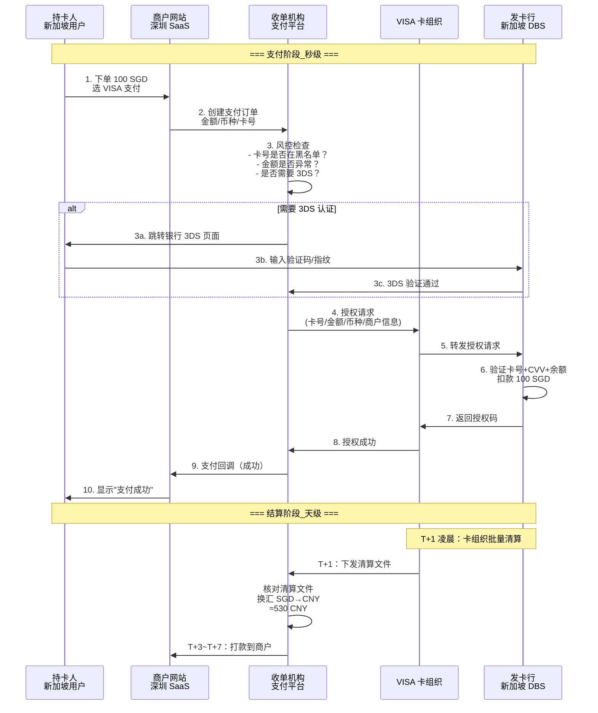
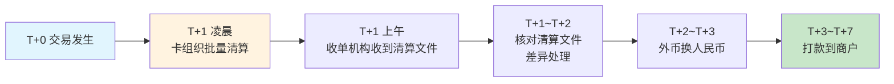
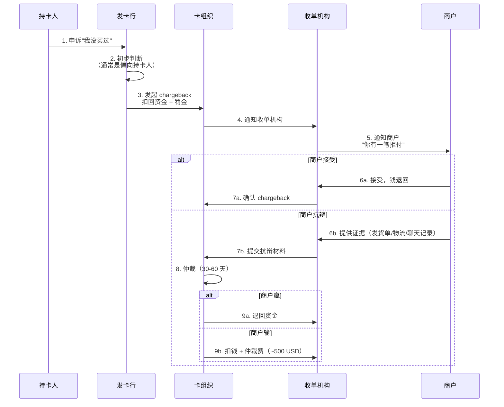

# 外卡支付全流程：一笔 VISA 卡的钱怎么到你账上

> **一句话定义**：外卡支付 = 境外消费者用 VISA/Mastercard 在中国商户网站付款，钱经过 6 个机构、换一次汇，T+3~T+7 到商户账上。

---

## 1. 支付和结算是两个阶段

很多人以为"用户付款 = 商家收到钱"。在跨境支付里，这是**两个完全独立、间隔好几天**的阶段：

```
┌────────────── 支付阶段（秒级）──────────────┐    ┌──── 结算阶段（天级）────┐
│                                            │    │                         │
│  用户输卡号 → 授权 → 扣款 → 回调            │ →  │  清算 → 换汇 → 打款     │
│  -几秒钟                                 │    │  -3至7天后            │
└────────────────────────────────────────────┘    └─────────────────────────┘
```

> **关键认知**：用户付完钱，商户看到的只是"授权成功"，不是"钱到了"。

---

## 2. 支付阶段：6 步走完

一笔 100 SGD 的 VISA 卡交易，从用户输卡号到商户看到"支付成功"：



**每一步的细节：**

| 步骤 | 做什么 | 耗时 | 失败会怎样 |
|---|---|---|---|
| 1-2. 下单 | 商户创建支付订单，跳转收银台 | <100ms | 重试 |
| 3. 风控 | 黑名单、金额异常、3DS 强制 | <200ms | 直接拒绝交易 |
| 4-8. 授权 | 卡组织路由 → 发卡行扣款 | 1-3 秒 | decline（发卡行拒绝） |
| 9-10. 回调 | 通知商户支付结果 | <500ms | 异步重试 |
| 清算 | 卡组织批量出清算文件 | T+1 凌晨 | 第二天补发 |
| 换汇 | SGD → CNY，按当天汇率 | 清算后立即 | 汇率波动 |
| 打款 | 人民币打到商户账户 | T+3~T+7 | **最慢的一步** |

---

## 3. 授权码的 6 个数字

发卡行返回的授权码（`Approval Code`）是 6 位数字。**它不等于钱到了。**

| 授权码的含义 | 说明 |
|---|---|
| ✅ 卡有效、余额够 | 发卡行确认可以扣款 |
| ✅ 冻结了这笔金额 | 持卡人暂时不能用这 100 SGD |
| ❌ 不是钱已到账 | 钱还在发卡行，要等清算 |

**授权码的有效期**：通常 7-30 天。过期不捕获 → 授权作废，钱退回持卡人。

---

## 4. 捕获（Capture）：授权 ≠ 扣款

授权只是"冻结"，**捕获（Capture）才是真正扣款**。

```
授权（Authorization）  →  冻结金额，获得授权码
       │
       ├─ 捕获（Capture）  →  真正扣款，这笔钱进入清算流程
       │
       ├─ 取消（Void）     →  解冻，持卡人恢复额度
       │
       └─ 过期             →  30 天后自动解冻
```

> **什么时候做捕获？** 实物商品发货时捕获，虚拟商品下单即捕获。**先授权后捕获 = 减少拒付风险。**

---

## 5. 结算阶段：为什么 T+3 才到账



**每一步为什么慢：**

| 步骤 | 为什么慢 | 能加速吗 |
|---|---|---|
| 卡组织清算 | 批量处理，不是实时 | ❌ 卡组织定的规则 |
| 清算文件核对 | 三方对账（收单机构 vs 卡组织 vs 收单行） | ⚠️ 自动化可缩减到几小时 |
| 换汇 | 等当天汇率窗口 | ❌ 外汇市场开盘时间限制 |
| 打款 | 银行转账 + 合规审查 | ⚠️ 大行可 T+0，小行慢 |

---

## 6. 退款 vs 拒付：本质区别

| 维度 | 退款（Refund） | 拒付（Chargeback） |
|---|---|---|
| 谁发起 | 商户主动 | **持卡人直接找发卡行** |
| 商户同意？ | ✅ 同意 | ❌ 不同意，强制扣回 |
| 资金流向 | 商户 → 用户 | 发卡行直接从收单机构扣 |
| 罚金 | 无 | **15-100 USD/笔** |
| 周期 | 3-15 天 | 30-120 天 |
| 对商户的影响 | 正常业务流程 | 拒付率 > 1% → 卡组织罚款/关通道 |

**拒付流程：**



> **关键认知**：拒付仲裁费 ~500 USD，比交易金额本身还高。**小额交易被拒付，商户通常直接认栽，不值得抗辩。**

---

## 7. 一句话总结

> **外卡支付的本质：一个发生在 3 秒内的授权 + 一场持续 7 天的资金旅行。支付阶段追求快，结算阶段追求准。搞懂授权和捕获的区别，你才能理解为什么用户付了钱、商户却没收到。**
