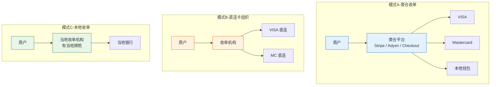
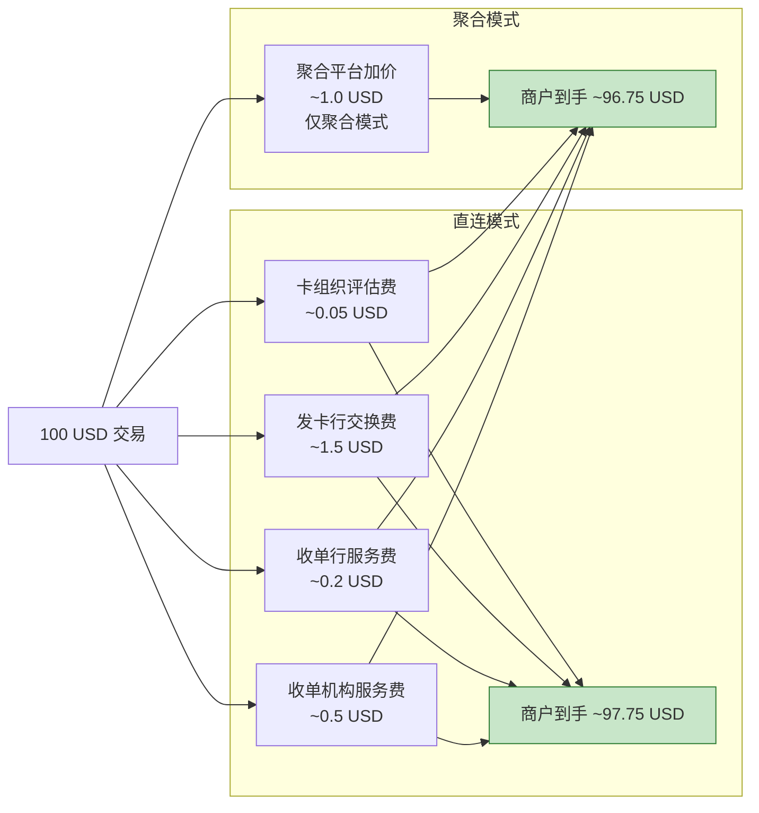

# 跨境收单业务模式：聚合 vs 直连，费率与分润深度拆解

> **一句话定义**：跨境收单有三种主流模式——聚合收单（如 Stripe）、直连卡组织（如直接签约 VISA）、本地收单（在当地有牌照）。选哪种取决于你的交易量、技术能力和风险承受度。

---

## 1. 三种模式全景对比



---

## 2. 三种模式逐层拆解

### 聚合收单

| 维度 | 内容 |
|---|---|
| 怎么玩 | 商户对接一个聚合平台（Stripe/Adyen），平台帮你接好所有卡组织和本地钱包 |
| 费率 | **3%-5%**（最高，因为聚合平台也要赚一层） |
| 接入成本 | **低**——几周搞定的 API 对接 |
| 技术门槛 | 低——不需要理解卡组织协议 |
| 结算周期 | T+5~T+7 |
| 适合谁 | 中小商户、快速上线、不想养支付团队 |
| 代表 | Stripe、Adyen、Checkout.com、Payoneer |

### 直连卡组织

| 维度 | 内容 |
|---|---|
| 怎么玩 | 收单机构直接和 VISA/MC 签约，拿 MIDs（Merchant ID），自己处理授权和清算 |
| 费率 | **~2%**（最低，少了一层聚合平台的分成） |
| 接入成本 | **极高**——合规审查 3-6 个月 + 保证金 $50K-$500K |
| 技术门槛 | 高——需要理解 ISO 8583、卡组织 API、3DS 协议 |
| 结算周期 | T+3（最快） |
| 适合谁 | 年交易额 > 10 亿 RMB 的大型商户或支付机构 |
| 代表 | 支付宝国际、微信跨境支付、连连支付 |

### 本地收单

| 维度 | 内容 |
|---|---|
| 怎么玩 | 在目标市场（如新加坡）申请当地支付牌照，成为当地收单机构 |
| 费率 | **1%-2%**（最低，本地费率） |
| 接入成本 | **最高**——牌照申请 1-2 年 + 资本金要求 + 合规团队 |
| 技术门槛 | 极高——需要本地银行合作 + 当地监管合规 |
| 结算周期 | T+1~T+3 |
| 适合谁 | 在目标市场有实体、有牌照资源的跨国企业 |
| 代表 | 支付宝（东南亚本地钱包）、微信（香港钱包） |

---

## 3. 费率结构深度拆解

一笔 100 USD 的跨境交易，费率的完整链路：



**各费用详解：**

| 费用项 | 英文 | 谁收 | 费率 | 能否谈判 |
|---|---|---|---|---|
| 交换费 | Interchange Fee | 发卡行 | 1%-2% | ❌ 卡组织定的 |
| 评估费 | Assessment Fee | 卡组织 | 0.05%-0.15% | ❌ 卡组织定的 |
| 收单行服务费 | Acquiring Markup | 收单行 | 0.1%-0.3% | ⚠️ 可谈 |
| 收单机构服务费 | PSP Markup | 收单机构 | 0.3%-0.8% | ✅ 可谈 |
| 聚合平台加价 | Aggregator Markup | 聚合平台 | 0.5%-2% | ⚠️ 量大可谈 |

> **关键认知**：商户看到的「3.5% 手续费」里，发卡行和卡组织拿走 ~1.5%，这是没得谈的。收单机构和聚合平台拿走的 ~2% 是可谈的——**交易量越大，议价权越大。**

---

## 4. 分润模型

### 标准分润：按比例

```
100 USD 交易
├─ 发卡行： 1.5 USD (70% 的手续费)
├─ 卡组织： 0.1 USD (5%)
├─ 收单行： 0.2 USD (10%)
└─ 收单机构：0.3 USD (15%)
```

### 分账：一笔钱分给多方

平台型商户（如电商平台）需要把一笔支付分给多个子商户：

```
用户付 100 USD 给平台
├─ 平台抽成：  10 USD (佣金)
├─ 子商户A：   50 USD (卖家)
├─ 物流商：    30 USD (运费)
└─ 代理商：    10 USD (推广佣金)
```

**分账的技术挑战：**
- 跨境分账涉及多币种——原币种分还是换汇后分？
- 分账的合规——每笔分账都是一次资金转移，需要外管申报
- 分账的时效——实时分 vs 批处理分

---

## 5. 核心 Trade-off

### 聚合 vs 直连

| 维度 | 聚合 | 直连 |
|---|---|---|
| 费率 | 高（3%-5%） | 低（~2%） |
| 接入速度 | 几周 | 3-6 月 |
| 技术门槛 | API 对接 | 理解卡组织协议 |
| 通道稳定性 | 依赖聚合方 | 直接可控 |
| 定制能力 | 受限于聚合平台 | 完全自定义 |
| 结算周期 | T+5~T+7 | T+3 |
| **年交易额 < 1 亿** | ✅ 选聚合 | ❌ 不划算 |
| **年交易额 1-10 亿** | ⚠️ 可考虑迁移 | ⚠️ 值得评估 |
| **年交易额 > 10 亿** | ❌ 费率太高 | ✅ 必须直连 |

### 跨境 vs 本地

| 维度 | 跨境收单 | 本地收单 |
|---|---|---|
| 费率 | 高（跨境费率） | 低（本地费率） |
| 拒付率 | **3-5 倍** | 正常水平 |
| 合规 | 两地监管 | 当地监管 |
| 牌照 | 不需要当地牌照 | 需要当地牌照 |
| 覆盖范围 | 全球 | 仅当地 |

---

## 6. 一句话总结

> **选聚合 = 花钱买时间，选直连 = 花时间省钱，选本地 = 花大钱挣大钱。没有最好的模式，只有最适合你交易规模的模式。年交易额每翻 10 倍，就应该重新评估一次。**
