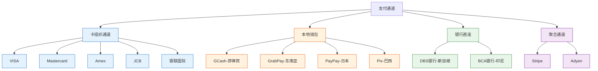
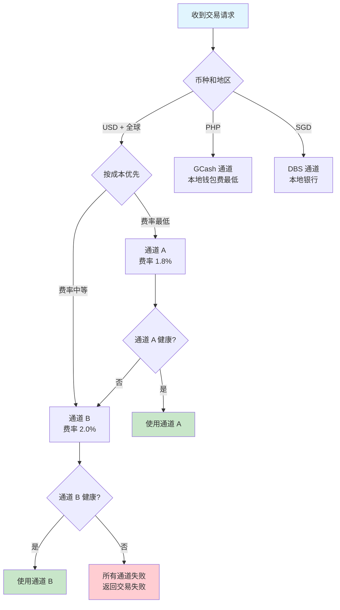
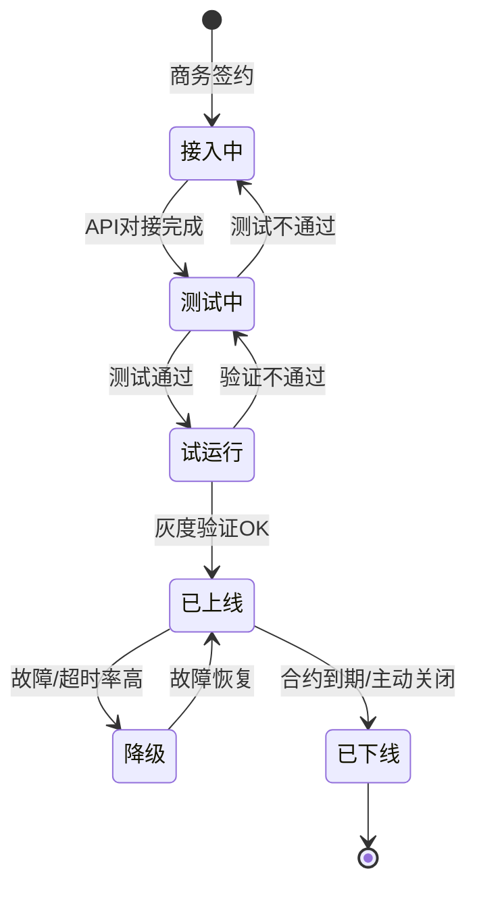

# 通道管理与路由：从原理到实践的深度拆解

> **一句话定义**：通道 = 收单系统对接的「具体支付路径」。选错通道 = 多花钱、少覆盖、高故障率。通道管理 = 接入 → 测试 → 上线 → 监控 → 降级 → 下线，6 阶段全生命周期。

---

## 1. 通道的 4 大分类

---

## 2. 通道的 5 大属性

| 属性 | 说明 | 示例 |
|---|---|---|
| 覆盖地区 | 支持哪些国家/地区 | VISA 全球、GCash 仅菲律宾 |
| 支持币种 | 可以收哪些币种 | USD/EUR/GBP/SGD/JPY... |
| 费率 | 每笔交易收多少 | 卡组织 ~2%，本地钱包 ~1% |
| 结算周期 | 几天到账 | VISA T+3、本地钱包 T+1 |
| 支持功能 | 授权/捕获/退款/拒付/查单 | 卡组织全功能，本地钱包可能不支持拒付 |

**通道能力矩阵示例：**

| 通道 | 覆盖 | 币种 | 费率 | 结算 | 3DS | 退款 | 拒付处理 |
|---|---|---|---|---|---|---|---|
| VISA | 全球 200+ | 150+ | 2% | T+3 | ✅ | ✅ | ✅ |
| GCash | 仅菲律宾 | PHP | 1.5% | T+1 | ❌ | ✅ | ❌ |
| GrabPay | 东南亚 8 国 | 8 种 | 1.8% | T+2 | ❌ | ✅ | ❌ |
| Stripe | 全球 40+ | 135+ | 3.5% | T+7 | ✅ | ✅ | ✅ |

---

## 3. 通道路由策略

**路由策略优先级：**

| 优先级 | 规则 | 说明 |
|---|---|---|
| 1 | 币种+地区匹配 | 先筛出能处理这笔交易的通道 |
| 2 | 通道健康度 | 剔除故障通道 |
| 3 | 成本优先 | 同条件下选费率最低的 |
| 4 | 权重分配 | 多个通道同成本 → 按权重分流 |
| 5 | 故障转移 | 主通道故障 → 自动切备通道 |

---

## 4. 通道生命周期

| 阶段 | 做什么 | 关键动作 |
|---|---|---|
| 接入中 | 商务签约 + API 对接 | 签合同、拿密钥、对接文档 |
| 测试中 | 沙箱测试 + 异常场景 | 正常支付、退款、拒付模拟 |
| 试运行 | 小流量灰度 | 1% 流量 → 5% → 20% |
| 已上线 | 全量运行 | 监控成功率/耗时/错误码 |
| 降级 | 故障自动切换 | 成功率 < 95% → 自动降级 |
| 已下线 | 停止使用 | 确认无在途交易 → 关闭 |

---

## 5. 通道健康度

| 指标 | 阈值 | 触发动作 |
|---|---|---|
| 授权成功率 | < 95% | 自动降级 |
| 平均响应时间 | > 5s | 告警 + 切备通道 |
| 5 分钟错误数 | > 10 | 自动降级 |
| 连续失败数 | > 3 | 立即降级 |

---

## 6. Trade-off

| 维度 | 多通道 | 单通道 |
|---|---|---|
| 可用性 | 高（故障转移） | 低（单点故障） |
| 费率 | 可优化（成本优先路由） | 不可优化 |
| 覆盖 | 多地区多币种 | 仅覆盖单一通道范围 |
| 维护成本 | 高（每个通道需适配器） | 低 |
| **适合** | 年交易额 > 1 亿 | 创业初期 |

---

## 7. 一句话总结

> **通道是收单系统的「手和脚」——没有通道什么都做不了。通道管理的核心不是接得多，而是接得好：费率低的优先用、健康的放心用、故障的自动切。通道路由 = 币种匹配 + 健康检查 + 成本优先 + 故障转移。**
