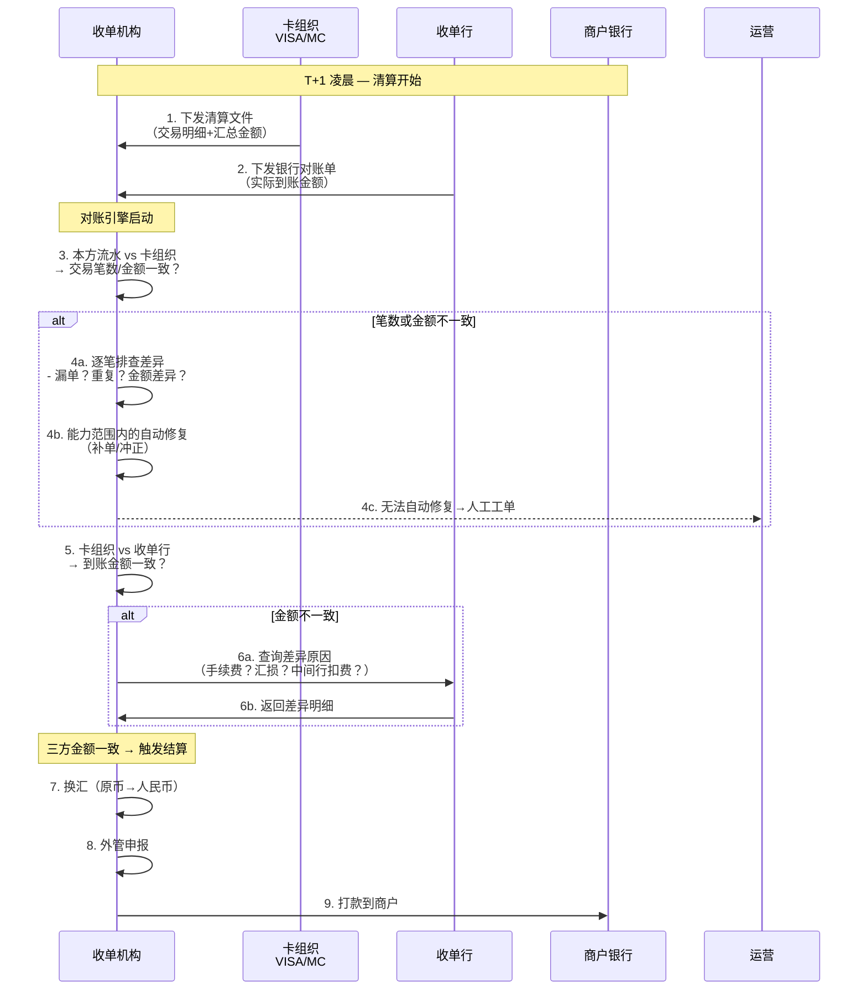
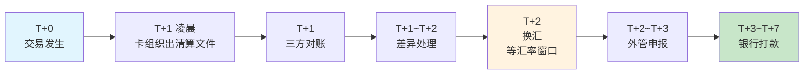

# 跨境对账与结算：三方模型、换汇与差异处理

> **一句话定义**：跨境对账 = 收单机构 vs 卡组织 vs 收单行 三方逐笔核对。任何一方对不平都不能结算。跨境结算比国内多两件事：换汇和外管申报。

---

## 1. 跨境 vs 国内对账

| 维度 | 国内对账 | 跨境对账 |
|---|---|---|
| 对手方 | 1 个（网联/银联） | **2 个**（卡组织 + 收单行） |
| 币种 | 单一（人民币） | **多币种**，需换汇 |
| 清算文件 | 网联标准格式 | 卡组织各有各的格式 |
| 差异处理 | 自动修复为主 | **人工工单多**（汇率差异/时区差异） |
| 结算触发 | T+1 | **对账 + 换汇 + 合规审查后** |

---

## 2. 三方对账模型

**对账铁律：** 收单机构流水=卡组织清算文件=收单行对账单。三方金额完全一致才能触发结算，差一分都不能打款。

---

## 3. 结算周期为什么这么长

**每一步耗时原因：**

| 步骤 | 耗时 | 为什么慢 | 能加速吗 |
|---|---|---|---|
| 卡组织清算 | T+1 凌晨 | 全球交易批量处理 | ❌ 卡组织规则 |
| 三方对账 | 几小时 | 三方数据核对 | ⚠️ 自动化可缩短 |
| 差异处理 | 0.5-2 天 | 人工工单 | ⚠️ 提高自动修复率 |
| 换汇 | 等汇率窗口 | 外汇市场非 24h | ❌ 市场规则 |
| 外管申报 | 几小时 | 合规审查 | ❌ 监管要求 |
| 银行打款 | 1-3 天 | 跨行转账 | ⚠️ 大行可 T+0 |

---

## 4. 换汇的 3 个关键决策

| 决策 | 选项 A | 选项 B | 怎么选 |
|---|---|---|---|
| 换汇时机 | 实时换汇（交易时锁定汇率） | 批量换汇（T+1 统一换） | 小额用批量降低成本，大额用实时锁定汇率 |
| 汇率来源 | 银行牌价 | 外汇交易平台（Refinitiv/Bloomberg） | 量大用平台，量小用银行 |
| 汇损承担 | 商户承担（报价时汇率×结算时汇率） | 收单机构承担（加进费率里） | 默认商户承担，高净值商户可谈判 |

---

## 5. 差异处理

| 差异类型 | 原因 | 自动处理 | 人工处理 |
|---|---|---|---|
| 本方有、卡组织无 | 重复记账/网络超时重试 | 冲正 | — |
| 卡组织有、本方无 | 本方漏记 | 补入流水 | — |
| 金额不一致 | 手续费差异/汇率四舍五入 | — | 人工核查调账 |
| 状态不一致 | 退款未同步 | 同步状态 | — |
| 到账金额不对 | 中间行扣费 | — | 联系收单行 |

---

## 6. 一句话总结

> **跨境对账比国内多一个对手方、多一个币种、多一层换汇。三方金额一致才能结算——这是铁律。结算慢不是因为技术不行，是因为要做完清算→对账→换汇→合规四件事。**
