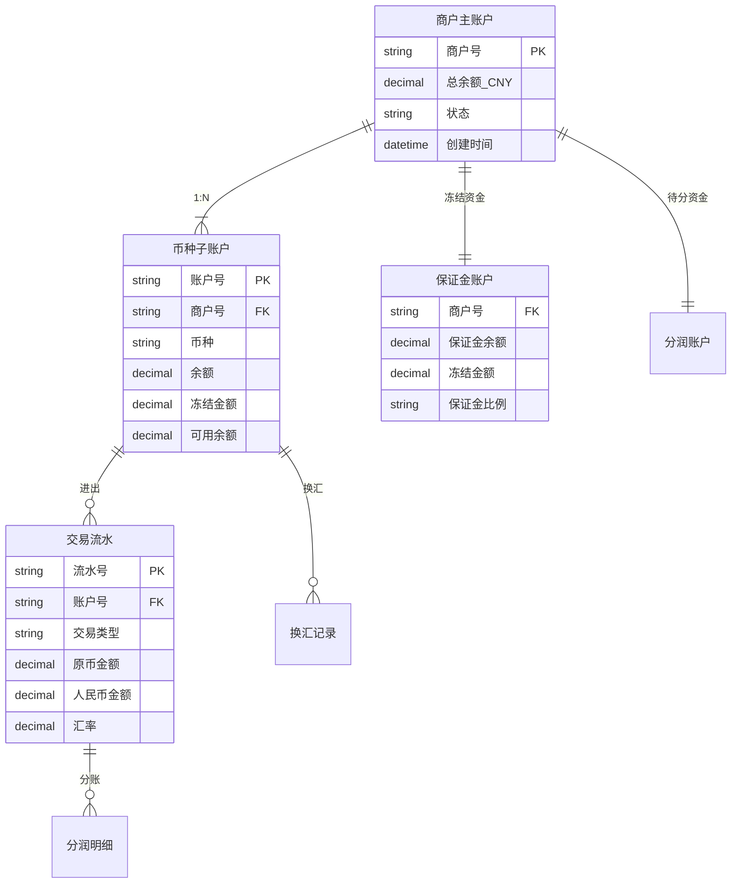
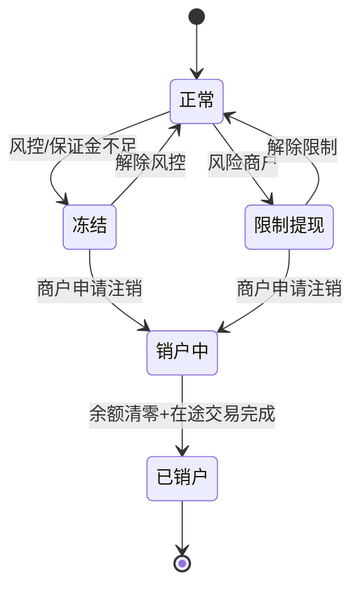

# 多币种账户体系：从模型到状态机的设计原理

> **一句话定义**：跨境收单的账户体系 = 每个商户有多个币种子账户 + 一个分润账户 + 一个保证金账户。核心挑战不是存钱，而是汇率波动时怎么记账和怎么对账。

---

## 1. 账户模型

---

## 2. 账户状态机

---

## 3. 换汇策略

| 策略 | 做法 | 优势 | 劣势 |
|---|---|---|---|
| 实时换汇 | 每笔交易立即换汇 | 锁定汇率、无汇损风险 | 高频交易成本高 |
| 批量换汇 | T+1 汇总后统一换 | 降低换汇成本 | 汇率波动风险 |
| 原币结算 | 不换汇，原币打给商户 | 商户自己换汇 | 需要商户有外币账户 |

---

## 4. 一句话总结

> **多币种账户 = 每个币种一个子账户 + 实时冻结 + 状态机控制。核心 trade-off 是换汇时机：实时锁定汇率 vs 批量降低成本。**
