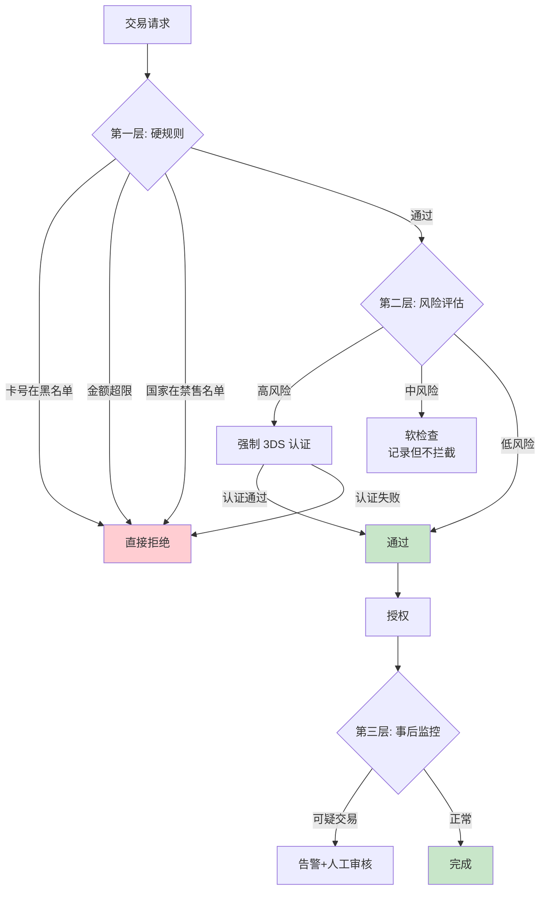

# 跨境风控与合规：3DS、拒付率、反洗钱与制裁筛查

> **一句话定义**：跨境风控 = 3DS 认证（事前）+ 实时风控（事中）+ 拒付处理（事后）。合规 = AML/KYC + 制裁名单筛查 + 外管申报。风控太松 → 拒付率飙升；风控太严 → 支付转化率暴跌。

---

## 1. 风控三层模型

---

## 2. 3DS v1 vs v2

| 维度 | 3DS v1（旧） | 3DS v2（新） |
|---|---|---|
| 体验 | 弹窗跳转（friction） | **无感认证**（frictionless） |
| 认证方式 | 短信验证码 | 生物特征+设备指纹+行为分析 |
| 通过率 | ~80% | **~95%** |
| 拒付责任 | 通过后 → 发卡行承担 | 通过后 → 发卡行承担 |
| 豁免 | 不支持 | 低风险交易可豁免 3DS |

> **关键认知**：3DS v2 = 用户体验和风控的平衡点。低风险交易直接豁免 3DS，高风险才弹验证。

---

## 3. 拒付率控制

| 拒付率 | 卡组织态度 | 后果 |
|---|---|---|
| < 0.5% | 优秀 | 无 |
| 0.5%-1% | 关注 | 卡组织发警告 |
| 1%-2% | 严重 | **罚款 $10K-$50K** |
| > 2% | 极严重 | **关闭通道**（列入 MATCH/TMF 黑名单） |

**降低拒付率的 5 个方法：**

| 方法 | 效果 |
|---|---|
| 强制 3DS 高风险交易 | 拒付率降 60%-80% |
| 清晰的商品描述 | 减少「不认识这笔交易」型拒付 |
| 主动退款（用户联系客服时） | 避免升级为 chargeback |
| 发货后通知 + 物流单号 | 减少「未收到货」型拒付 |
| AVS/CVV 校验 | 减少盗刷 |

---

## 4. 合规框架

| 合规项 | 要求 | 检查频率 |
|---|---|---|
| **KYC（了解你的客户）** | 商户进件时验证营业执照、法人身份 | 每次进件 |
| **AML（反洗钱）** | 大额交易上报、可疑交易监控 | 实时 |
| **制裁名单筛查** | 对照 OFAC/UN/EU 制裁名单 | 实时 |
| **外管申报** | 跨境收支申报（RCPMIS） | 每笔 |
| **数据保护** | GDPR（欧洲）/ PDPA（东南亚） | 持续 |

---

---

## 4. 国际合规标准速查

| 标准 | 地区 | 关键要求 | 影响 |
|---|---|---|---|
| **PCI DSS** | 全球 | 卡数据存储/传输加密/访问控制 | 不合规=不能收卡 |
| **PSD2/SCA** | 欧盟 | 强客户认证（密码+设备+生物） | 必须支持3DS |
| **3DS2/EMV 3DS** | 全球 | 卡支付强认证（替代3DS1） | 无感认证=frictionless |
| **GDPR** | 欧盟 | 数据保护+用户同意 | 罚款最高年收入4% |
| **PIPL** | 中国 | 个人信息保护法（跨境数据） | 数据出境需评估 |
| **MAS PSA** | 新加坡 | 支付服务法 | 需牌照 |
| **央行259号文** | 中国 | 跨境支付牌照 | 无牌=违法 |
| **US BSA** | 美国 | 银行保密法（反洗钱） | 需AML/KYC体系 |

## 5. Trade-off

| 维度 | 风控严 | 风控松 |
|---|---|---|
| 支付转化率 | 低（拦截多） | 高 |
| 拒付率 | 低 | **高** |
| 卡组织罚款 | 低 | 高风险 |
| 用户体验 | 差（频繁 3DS） | 好 |
| **推荐** | 高风险地区/大额交易 | 低风险/回头客 |

---

## 6. 一句话总结

> **跨境风控是在「转化率」和「拒付率」之间走钢丝。3DS v2 是最好的平衡工具——低风险免认证，高风险强认证。合规不是可选项，AML 和制裁筛查搞砸了，罚的不是钱，是牌照。**
