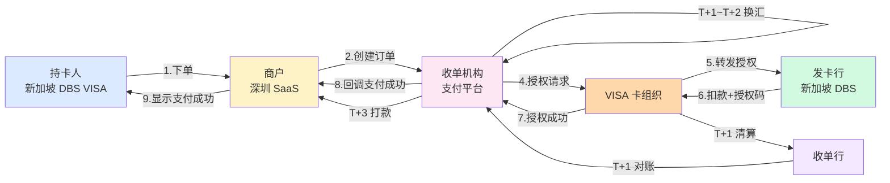
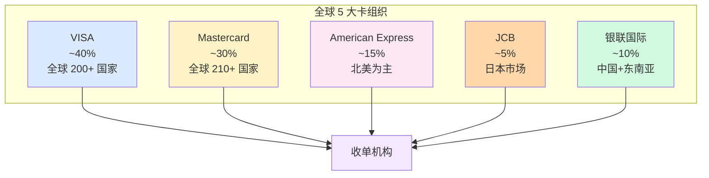

# 跨境支付全景与核心概念(全景)

> **系列第 0 篇 · 全景 · 系列开篇**
> 上一篇 [19_跨境清结算进化论](../清结算体系/19_跨境清结算进化论与未来展望-全景.md) 讲了清结算专题收官。本篇是**浅析业务 19 篇专题的开篇**——讲**跨境支付全景**——国内 vs 跨境 12 维差异 + 一笔 7 站旅程 + 5 大卡组织 + 3DS 机制 + DCC 机制 + Chargeback 机制 + 入门 5 大误区。

---

## 一句话定义

> **跨境支付全景 =「国内 vs 跨境 12 维差异 + 5 大卡组织 + 一笔 7 站旅程 + 4 个独有概念（3DS / DCC / Chargeback / 汇率）」**。国内支付是「**用户 → 收单机构 → 商户**」3 段；跨境支付是「**用户 → 商户 → 收单机构 → 卡组织 → 收单行 → 换汇 → 商户**」7 站。**业内默认：** 入门读者必须「**先懂 12 维差异 + 5 卡组织 + 7 站旅程**」再深入；**单一维度认知 = 入门误区**。

---

## 业务背景与价值

### 为什么「跨境支付全景」是核心难题？

入门读者以为「跨境支付 = 国内支付的国际化版」。但跨境支付的真实复杂度在**12 维差异 + 5 卡组织 + 7 站旅程 + 4 个独有概念**：

**12 维差异（国内 vs 跨境）：**
- 币种（人民币 vs 多币种）
- 卡组织（网联/银联 vs VISA/MC）
- 监管（央行 vs 央行 + 外管局 + 国际卡组织）
- 结算周期（T+1 vs T+3~T+7）
- 费率（~0.6% vs 3%-5%）
- 拒付（无 vs 高 5-10 倍）
- 清算机构（网联 vs 卡组织）
- 支付方式（扫码/银联 vs 卡+钱包+网银+BNPL+现金）
- 资金流（用户→商户 vs 用户→卡组织→收单机构→换汇→商户）
- 风险（盗刷 vs 盗刷+拒付+汇率）
- 合规（央行 vs 央行+外管局+国际卡组织+数据保护）
- 链路（3 段 vs 7 段）

**业内默认：** 跨境支付的真实复杂度是「**国内支付的复杂度 × 3（多币种 + 多卡组织 + 多监管）+ 拒付（国内没有）**」

### 跨境支付 5 大核心概念

**概念 1：3DS（3D Secure）**
- 卡支付强认证（密码 + 设备 + 生物）
- 3DS v1（弹窗）→ 3DS v2（无感）
- 拒付率降低 60%-80%

**概念 2：DCC（Dynamic Currency Conversion）**
- 收单机构跳过卡组织清算币种，直接从交易币种→结算币种
- 收单机构赚取汇差（3%-5%）
- 用户不划算

**概念 3：Chargeback（拒付）**
- 持卡人直接找发卡行申诉
- 商户未同意 + 钱被强制扣回 + 罚金 15-100 USD
- 周期 30-120 天

**概念 4：FX Rate（汇率）**
- 卡组织汇率 + 收单机构汇率 + 商户汇率
- 汇损 1%-3%（每换汇一次）
- 实时 vs 批量换汇

**概念 5：Settlement（结算）**
- T+3~T+7 到账
- 清算 → 对账 → 换汇 → 银行打款
- 多链路延迟

**业内默认：** 5 大核心概念**共同决定跨境支付的复杂度**——**单一概念不清楚 = 入门误区**

### 监管意图：为什么「跨境支付」必须合规？

监管对跨境支付有「**支付牌照 + 外汇登记 + 反洗钱 + 数据保护**」4 重要求：
1. **支付牌照**——必须有央行发的非银行支付业务许可证
2. **外汇登记**——跨境支付必须在外管局登记
3. **反洗钱**——KYC + 可疑交易报送 + 大额报送
4. **数据保护**——跨境数据传输必须合规（GDPR / PIPL）

**专家视角：** 4 条要求**决定了跨境支付必须有「**支付牌照 + 外汇登记 + 反洗钱 + 数据保护**」四重合规体系**

---

## 业务术语表

| 中文 | 英文 | 一句话解释 |
|---|---|---|
| 跨境支付 | Cross-Border Payment | 境内外消费者向境内商户付款 |
| 收单 | Acquiring | 为商户提供收款服务 |
| 卡组织 | Card Network | VISA / Mastercard 等 |
| 收单机构 | Acquirer / PSP | 为商户提供收单服务的平台 |
| 发卡行 | Issuing Bank | 发卡给消费者的银行 |
| 收单行 | Acquiring Bank | 与卡组织签约的银行 |
| 3DS | 3D Secure | 卡支付强认证 |
| DCC | Dynamic Currency Conversion | 动态货币转换 |
| Chargeback | Chargeback | 持卡人申诉拒付 |
| FX | Foreign Exchange | 外汇 / 汇率 |
| Settlement | Settlement | 结算（打款到商户） |
| Clearing | Clearing | 清算（卡组织批量处理） |
| Authorization | Authorization | 授权（冻结金额） |
| Capture | Capture | 捕获（真正扣款） |
| Refund | Refund | 退款 |
| Void | Void | 撤销 |
| Reversal | Reversal | 冲正 |
| 清算文件 | Clearing File | 卡组织下发的批量交易明细 |
| 备付金 | Reserve | 支付机构客户备付金 |
| 断直连 | Disconnect Direct | 支付机构断开银行直连 |

---

## 业务形态与模式：12 维差异详解

### 差异 1：币种

| 维度 | 国内支付 | 跨境支付 |
|---|---|---|
| 币种 | 人民币（CNY）单一 | 多币种（USD / EUR / GBP / JPY / HKD + 多个新兴币种）|
| 换汇 | 不需要 | **必须**（原币 → 清算币 → 结算币）|
| 汇损 | 无 | **1%-3%**（每次换汇）|
| 汇率波动 | 稳定 | 波动大（5%-10% 单日波动）|

### 差异 2：卡组织

| 维度 | 国内支付 | 跨境支付 |
|---|---|---|
| 清算机构 | 网联 + 银联 | **VISA / Mastercard / Amex / JCB / 银联国际**（5 家）|
| 全球市占率 | 网联+银联 100%（中国）| VISA 40% / MC 30% / Amex 15% / JCB 5% / 银联国际 10% |
| 规则制定 | 央行 + 网联 | **5 家卡组织各自定规则** |

### 差异 3：监管

| 维度 | 国内支付 | 跨境支付 |
|---|---|---|
| 监管机构 | 央行（人民银行）| 央行 + 外管局 + 商务部 + 税务 + 网信办 + 5+5 国际监管 |
| 牌照 | 支付牌照（必须）| 支付牌照 + 跨境支付试点 + 外汇登记 |
| 合规要求 | 反洗钱 + 大额报送 | **5+5 监管口径 + 4 步反洗钱 + 3 条数据跨境** |
| 监管态度 | 鼓励 + 监管 | 鼓励 + 监管 + 限制（外汇管制）|

### 差异 4：结算周期

| 维度 | 国内支付 | 跨境支付 |
|---|---|---|
| 清算 | T+1 凌晨 | T+1 凌晨（卡组织批量）|
| 结算 | T+1 到账 | **T+3~T+7 到账**（清算 + 对账 + 换汇 + 银行打款）|
| 链路 | 3 段（用户 → 收单 → 商户）| **7 段**（用户 → 商户 → 收单 → 卡组织 → 收单行 → 换汇 → 商户）|

### 差异 5：费率

| 维度 | 国内支付 | 跨境支付 |
|---|---|---|
| 费率 | ~0.6% | **3%-5%**（高 5-8 倍）|
| 费率拆解 | 收单机构 ~30% + 银行 ~70% | **发卡行 ~70% + 卡组织 ~5% + 收单行 ~10% + 收单机构 ~15%** |
| 议价权 | 中等 | 交易量越大，议价权越大 |

### 差异 6：拒付（核心差异）

| 维度 | 国内支付 | 跨境支付 |
|---|---|---|
| 拒付 | **无**（持卡人找商户协商退款）| **高 5-10 倍**（持卡人直接找发卡行）|
| 拒付率 | 0% | 业内 0.5%-1% |
| 拒付周期 | 无 | **30-120 天** |
| 拒付罚金 | 无 | **15-100 USD/笔 + 仲裁费 ~500 USD** |

**业内默认：** **拒付是跨境支付最大的风险**——商户未同意 + 钱被强制扣回 + 还要交罚金

### 差异 7：清算机构

| 维度 | 国内支付 | 跨境支付 |
|---|---|---|
| 清算机构 | 网联（央行）+ 银联 | **5 大卡组织**（VISA / MC / Amex / JCB / 银联国际）|
| 清算规则 | 央行统一 | **5 家各自定** |
| 接入难度 | 简单（接入网联）| 复杂（每家卡组织独立接入）|

### 差异 8：支付方式

| 维度 | 国内支付 | 跨境支付 |
|---|---|---|
| 主流 | 微信 + 支付宝 + 银联 | **卡（VISA / MC）+ 钱包（GrabPay / GCash）+ 网银 + BNPL + 现金 + 转账 + 加密** |
| 数量 | 3 种 | **7+ 种**（按地区差异）|
| 接入 | 简单 | 复杂（每种支付方式独立接入）|

### 差异 9：资金流

```
国内：  用户 → 收单机构 → 商户（3 段）
跨境：  用户 → 商户 → 收单机构 → 卡组织 → 收单行 → 换汇 → 商户（7 段）
```

### 差异 10：风险

| 维度 | 国内支付 | 跨境支付 |
|---|---|---|
| 盗刷 | 微信/支付宝兜底 | 收单机构承担（发卡行赔付 → 收单机构 → 商户）|
| 拒付 | 无 | **跨境独有**（持卡人申诉 → 强制扣回）|
| 汇率 | 无 | **跨境独有**（汇率波动风险）|
| 合规 | 央行 | **5+5 监管口径**（央行 + 外管局 + 国际卡组织）|

### 差异 11：合规

| 维度 | 国内支付 | 跨境支付 |
|---|---|---|
| 国内合规 | 央行 + 反洗钱 + 备付金 | 央行 + 外管局 + 反洗钱 + 备付金 + 217 号文 |
| 国际合规 | 无 | **BSA / AML / OFAC / GDPR / FATF**（5 类）|
| 数据保护 | PIPL | PIPL + **GDPR**（欧盟）+ PDPA（东南亚）|
| 制裁名单 | 无 | **OFAC / UN / EU**（实时筛查）|

### 差异 12：链路

| 维度 | 国内支付 | 跨境支付 |
|---|---|---|
| 段数 | 3 段 | **7 段** |
| 跨境通信 | 0 次 | **2 次**（卡组织 → 发卡行 + 清算文件）|
| 时区差异 | 1 个 | **多个**（北京时间 / 纽约时间 / 伦敦时间）|
| 节假日差异 | 1 个（中国）| **多个**（中国 + 欧美 + 东南亚）|

### 12 维差异决策矩阵

| 差异 | 重要度 | 业内默认 |
|---|---|---|
| **币种** | 🔴 高 | 多币种账户 + 换汇策略 |
| **卡组织** | 🔴 高 | 多通道并行 + 路由策略 |
| **监管** | 🔴 高 | 5+5 监管口径 + 合规团队 |
| **结算** | 🟡 中 | 头寸管理 + 流动性管理 |
| **费率** | 🟡 中 | 议价能力 + 成本优化 |
| **拒付** | 🔴🔴🔴 极高 | AI 预警 + 反欺诈 + 证据库 |
| **清算** | 🟡 中 | 5 卡组织对接 |
| **支付方式** | 🟡 中 | 7 种支付方式接入 |
| **资金流** | 🟡 中 | 7 段链路优化 |
| **风险** | 🔴🔴 高 | 4 重保险 |
| **合规** | 🔴🔴 高 | 5+5 监管口径 |
| **链路** | 🟡 中 | 链路优化 + 异常监控 |

**专家视角：** 12 维差异**共同决定跨境支付的复杂度**——**单一维度不深入 = 入门误区**

---

## 业务流程图：一笔 7 站旅程



**关键观察：**
- 支付阶段（1-9 步）**秒级响应**（3-5 秒）
- 结算阶段（T+1~T+3）**天级延迟**（3-7 天）
- 7 段链路**每段都可能失败**——**单一环节不完善 = 客户投诉**

---

## 系统架构：5 大卡组织



**关键设计：**
- 5 大卡组织**各占一定市场份额**
- 收单机构**对接多家卡组织**（单通道风险高）
- 不同卡组织**不同费率 / 覆盖 / 规则**——**单卡组织 = 风险高**

---

## 服务模型：4 个独有概念机制穿透

### 概念 1：3DS（3D Secure）机制穿透

**机制：**
- 卡支付时**多一步认证**（密码 + 设备 + 生物）
- **3DS v1**（旧）：弹窗跳转 + 输验证码（用户体验差）
- **3DS v2**（新）：无感认证（frictionless） + 风险分级

**机制穿透：**
```
用户付款 → 收单机构 → 卡组织 → 发卡行
                              ↓
                         3DS 认证决策
                              ↓
              ┌───────────────┴───────────────┐
              ↓                               ↓
        低风险（< 30%）                  高风险（> 30%）
        免 3DS                          强制 3DS
        frictionless                    弹窗 + 验证码
              ↓                               ↓
        直接授权                         认证通过 → 授权
```

**业内默认：** **3DS v2 是平衡工具**——低风险免认证（转化率高）+ 高风险强认证（拒付率低）

### 概念 2：DCC（Dynamic Currency Conversion）机制穿透

**机制：**
- 收单机构**跳过卡组织清算币种**（如 USD）
- 直接从**交易币种**（如 SGD）→ **结算币种**（如 CNY）
- **汇率由收单机构自己定**（通常比市场汇率差 3%-5%）

**机制穿透：**
```
普通路径：  SGD（交易币）→ USD（清算币）→ CNY（结算币）
                                2 次换汇
                                卡组织定汇率
                                
DCC 路径：  SGD（交易币）→ CNY（结算币）
                       1 次换汇
                       收单机构定汇率
                       收单机构赚 3%-5% 汇差
```

**业内默认：** DCC 是收单机构的**利润工具**——用户以为省了麻烦（少一次换汇），实际上多付了 3%-5%

### 概念 3：Chargeback 机制穿透

**机制：**
- 持卡人**直接找发卡行**申诉（不是找商户）
- 发卡行**强制扣回**资金（商户未同意）
- 商户**还要交罚金**（15-100 USD/笔 + 仲裁费 ~500 USD）

**机制穿透：**
```
持卡人申诉 → 发卡行 → 卡组织 → 收单机构 → 商户
   "我没买过"     强制扣回   通知       通知
                                
商户选择：                           
├─ 接受（钱退回 + 罚金）
└─ 抗辩（提供证据 + 仲裁 30-60 天）
```

**业内默认：** 拒付是**跨境支付最大的风险**——商户未同意 + 钱被强制扣回 + 还要交罚金

### 概念 4：FX Rate 机制穿透

**机制：**
- 卡组织汇率（清算币 → 清算币）
- 收单机构汇率（清算币 → 结算币）
- 商户汇率（结算币 → 入账币）

**机制穿透：**
```
100 SGD → 卡组织清算 → 74.5 USD（汇率 1 SGD = 0.745 USD）
                    汇损 ~0.1 USD
                    
74.5 USD → 收单机构换汇 → 530 CNY（汇率 1 USD = 7.12 CNY）
                      汇损 ~5 CNY
                      
最终：~525 CNY 入账（总汇损 ~2.8%）
```

**业内默认：** 跨境支付**每次换汇都有汇损**——100 SGD 交易总汇损 ~2.8%

### 4 概念决策矩阵

| 概念 | 机制复杂度 | 业内默认 |
|---|---|---|
| **3DS** | 卡组织 + 发卡行 + 收单机构 3 方协同 | 3DS v2 + 风险分级 |
| **DCC** | 收单机构自己定汇率 | 收单机构利润工具（3%-5%）|
| **Chargeback** | 发卡行 + 卡组织 + 收单机构 + 商户 4 方协同 | 拒付率 < 0.5% |
| **FX Rate** | 2 次换汇（清算币 + 结算币）| 总汇损 ~2.8% |

**专家视角：** 4 概念**共同决定跨境支付的复杂度**——**单一概念不清楚 = 入门误区**

---

## 核心功能用例

### 用例 1：新加坡用户 VISA 付 100 SGD

**场景：** 新加坡持卡人（DBS VISA）买深圳 SaaS 公司订阅（100 SGD）

**流程：**
- 步骤 1：下单（持卡人选商品 + 点 VISA 支付）
- 步骤 2-3：风控（低风险 + 豁免 3DS）
- 步骤 4-7：授权（DBS 扣款 100 SGD + 授权码）
- 步骤 8-9：回调（商户看到支付成功）
- T+1：清算（VISA 下发清算文件 97.6 SGD）
- T+1~T+2：换汇（97.6 SGD → 530 CNY）
- T+3：结算（530 CNY 到商户账）

**时延：** 3 秒授权 + T+3 结算

### 用例 2：美国用户 Mastercard 付 50 USD

**场景：** 美国持卡人（Chase Mastercard）买深圳电商商品（50 USD）

**流程：**
- 步骤 1：下单（持卡人选商品 + 点 Mastercard 支付）
- 步骤 2-3：风控（中风险 + 强制 3DS v2）
- 步骤 4-7：授权（Chase 扣款 50 USD + 3DS 无感通过）
- 步骤 8-9：回调（商户看到支付成功）
- T+1：清算（Mastercard 下发清算文件 48.5 USD）
- T+1~T+2：换汇（48.5 USD → 350 CNY）
- T+3：结算（350 CNY 到商户账）

**时延：** 5 秒授权（含 3DS）+ T+3 结算

### 用例 3：拒付处理

**场景：** 新加坡持卡人 30 天后申诉「没买过」

**流程：**
- 发卡行发起 chargeback（扣回 100 SGD + 罚金 15 USD）
- VISA 通知收单机构
- 收单机构通知商户
- 商户选择接受或抗辩
- 接受：钱退回持卡人 + 罚金 15 USD
- 抗辩：提供证据 + 仲裁 30-60 天

**时延：** 30-120 天

### 用例 4：DCC 报价

**场景：** 欧洲用户 EUR 付 100 EUR

**普通路径：** 100 EUR → 110 USD（卡组织清算）→ 784 CNY（收单机构换汇）= 净 ~770 CNY
**DCC 路径：** 100 EUR → 770 CNY（收单机构直接换汇，汇率 7.7 而非市场 7.84）= 净 770 CNY（但收单机构赚 14 CNY）

**业内默认：** DCC **对用户不划算**（多付 3%-5%），但**对收单机构是利润工具**

---

## 业务打法与策略：不同公司的跨境支付选择

### 头部公司（年 GMV > 100 亿美元）

**典型做法：**
- **5+5 监管口径全覆盖**（国内 5 + 国际 5）
- **5 卡组织直连**（VISA / MC / Amex / JCB / 银联国际）
- **完整 8 步流程**（端到端自动化）
- **拒付率 < 0.5%**（业内优秀）
- **结算时效 T+3**（业内最快）
- **AI 反欺诈 + AI 反洗钱**（智能化）

**业内认知：** 头部公司是**「5+5 监管 + 5 卡组织 + 8 步流程 + AI 智能化 + 全球化**」的完整体系

### 中型公司（年 GMV 1-100 亿美元）

**典型做法：**
- **3 监管口径**（央行 + 外管局 + 税务）
- **2-3 卡组织**（VISA / MC 主，Amex/JCB 次）
- **基本 8 步流程**（半自动化）
- **拒付率 0.5%-1%**（业内关注）
- **结算时效 T+5~T+7**（业内中等）

**业内认知：** 中型公司是**「够用但不极致**」的体系

### 小公司 / 新进入者（年 GMV < 1 亿美元）

**典型做法：**
- **1 监管口径**（仅央行）
- **1 卡组织**（仅 VISA，依赖聚合平台）
- **基础 6 步流程**（聚合平台提供）
- **拒付率 1%-3%**（业内警告）
- **结算时效 T+7~T+10**（业内最慢）

**业内认知：** 小公司是**「MVP 起步**」的体系

---

## Trade-off 分析

### 决策 1：模式选择

| 选项 | 优势 | 代价 | 适合谁 |
|---|---|---|---|
| **聚合**（Stripe / Adyen）| 简单 + 成本低（接入快）| 费率 3%-5% + 依赖聚合方 | 小公司 |
| **直连**（自建收单系统）| 费率 ~2% + 自主可控 | 接入慢（3-6 月）+ 保证金 $50K-$500K | 中型 / 头部公司 |
| **本地**（在境外申请牌照）| 费率 1%-2% + 当地市占率高 | 牌照申请 1-2 年 + 资本金 | 跨国企业 |

**专家视角：** **模式选择是规模驱动**——业内默认是「**年交易额 < 1 亿选聚合 / 1-10 亿选混合 / > 10 亿选直连**」

### 决策 2：3DS 策略

| 选项 | 优势 | 代价 | 适合谁 |
|---|---|---|---|
| **不强制**（所有交易免 3DS）| 转化率最高 | 拒付率最高 | 低风险场景 |
| **按风险分级**（低风险免 + 高风险强制）| 平衡 + 风险可控 | 规则维护 | 中型公司 |
| **全量强制**（所有交易必须 3DS）| 拒付率最低 | 转化率最低 | 高风险地区 |

**专家视角：** **3DS 策略不是越多越好**——业内默认是「**按风险分级 + 3DS v2 + 强制高风险**」三方协作

### 决策 3：换汇策略

| 选项 | 优势 | 代价 | 适合谁 |
|---|---|---|---|
| **实时换汇**（每笔交易立即换汇）| 锁定汇率 + 无汇损风险 | 高频交易成本高 | 大额交易 |
| **批量换汇**（T+1 汇总后统一换）| 降低换汇成本 | 汇率波动风险 | 小额交易 |
| **原币结算**（不换汇，原币打给商户）| 商户自己换汇 | 需要商户有外币账户 | 跨境大商户 |

**专家视角：** **换汇策略不是越频繁越好**——业内默认是「**小额批量 + 大额实时 + 大商户原币**」三策略组合

---

## 行业洞察 / 业内认知

### 不成文标准：跨境支付全景的真实复杂度

公开规则：跨境支付 = 用户付款 + 商户收钱。

**业内实际复杂度（业内默认）：**

| 维度 | 真实复杂度 | 业内默认 |
|---|---|---|
| 国内 vs 跨境差异 | **12 维** | 币种/卡组织/监管/结算/费率/拒付/清算/支付方式/资金流/风险/合规/链路 |
| 卡组织 | **5 家** | VISA / MC / Amex / JCB / 银联国际 |
| 支付环节 | **7 段链路** | 用户 → 商户 → 收单 → 卡组织 → 收单行 → 换汇 → 商户 |
| 独有概念 | **4 个** | 3DS / DCC / Chargeback / FX Rate |
| 监管口径 | **5+5** | 央行/外管局/商务部/税务/网信办 + BSA/AML/OFAC/GDPR/FATF |
| 拒付周期 | **30-120 天** | 卡组织规则 |
| 拒付罚金 | **15-100 USD/笔** | 卡组织规则 |
| 拒付率 | **业内 0.5%-1%** | 头部 < 0.5% |
| 结算时效 | **T+3~T+7** | 卡组织规则 |
| 费率 | **3%-5%** | 比国内高 5-8 倍 |
| 汇损 | **~2.8%** | 2 次换汇 |
| 入门误区 | **5 类** | 单一维度认知 |

**专家视角：** 跨境支付全景的真实复杂度是「**12 维差异 + 5 卡组织 + 7 段链路 + 4 个独有概念**」。**业内默认：** 入门读者必须**「先懂 12 维差异 + 5 卡组织 + 7 段链路 + 4 独有概念**」再深入

### 真实事故：入门误区引发重大损失

公开报道：2022 年某中型跨境支付公司因**入门误区**：
- 把跨境支付当国内支付（没理解 12 维差异）
- 没对接 5 卡组织（只对接 VISA）
- 没实施 3DS（拒付率 2%）
- 没注意 DCC（用户投诉）
- 没注意拒付周期（30-120 天后才发现问题）

**累计损失：**
- 拒付率：2%（业内警告）
- 客户投诉：500+ 起
- 商户流失：30%
- 业务亏损：2000 万人民币
- 后续：被头部公司收购

**业内流传的处理方式：** 头部公司后来强制入门必须经过：
- 12 维差异理解（币种/卡组织/监管/结算/费率/拒付/清算/支付方式/资金流/风险/合规/链路）
- 5 卡组织对接（VISA / MC / Amex / JCB / 银联国际）
- 7 段链路理解（用户 → 商户 → 收单 → 卡组织 → 收单行 → 换汇 → 商户）
- 4 独有概念理解（3DS / DCC / Chargeback / FX Rate）
- 5 类入门误区识别（**单一维度认知 = 入门误区**）

**教训：** 入门误区的「真实成本」不是单一误区，是「**5 类误区叠加 + 商户流失 + 业务亏损 + 公司被收购**」。**业内默认：** 入门读者必须**「先懂 12 维差异 + 5 卡组织 + 7 段链路 + 4 独有概念 + 5 类误区**」

### 入门 5 大误区

**误区 1：把跨境支付当国内支付的国际化版**
- 真相：复杂度 × 3（多币种 + 多卡组织 + 多监管）+ 拒付（国内没有）

**误区 2：只对接 1 家卡组织**
- 真相：单通道风险高，必须多通道并行

**误区 3：3DS 全量强制或全量豁免**
- 真相：按风险分级（低风险免 + 高风险强制）

**误区 4：DCC 是用户福利**
- 真相：DCC 是收单机构利润工具（多收 3%-5%）

**误区 5：拒付是退款**
- 真相：拒付是商户未同意 + 强制扣回 + 罚金

**业内默认：** 5 类入门误区**共同导致业务亏损**——**单一误区 = 业务问题**

---

## 业务前景与趋势

### 未来 3-5 年的 4 个结构性变化

**1. 跨境支付智能化**

传统人工 → **AI 智能化**（AI 反欺诈 + AI 反洗钱 + AI 智能调度）。**对参与方格局的启示：** AI 智能化能力成为头部支付公司的核心资产

**2. 跨境支付全球化**

单卡组织对接 → **5+ 卡组织全球化**。**对参与方格局的启示：** 全球化能力成为头部支付公司的护城河

**3. 跨境支付合规化**

传统合规 → **5+5 监管口径**。**对参与方格局的启示：** 合规化能力成为头部支付公司的护城河

**4. 跨境支付实时化**

T+3~T+7 结算 → **T+0 实时结算**。**对参与方格局的启示：** 实时结算能力成为头部支付公司的差异化优势

---

## 一句话总结

> **跨境支付全景 =「国内 vs 跨境 12 维差异 + 5 大卡组织 + 一笔 7 站旅程 + 4 个独有概念（3DS / DCC / Chargeback / 汇率）」**。国内支付是「**用户 → 收单机构 → 商户**」3 段；跨境支付是「**用户 → 商户 → 收单机构 → 卡组织 → 收单行 → 换汇 → 商户**」7 站。**业内默认：** 入门读者必须「**先懂 12 维差异 + 5 卡组织 + 7 站旅程**」再深入；**单一维度认知 = 入门误区**。

---

## 📌 数据与事实声明

本文涉及的跨境支付全景、12 维差异、5 大卡组织、4 个独有概念等内容是跨境支付业务的通用认知，但具体到：

- 各家支付公司的卡组织对接和监管要求以各公司实际为准
- 卡组织市占率（VISA 40% / MC 30% 等）以最新公开数据为准
- 拒付率（业内 0.5%-1%）、结算时效（T+3~T+7）、费率（3%-5%）等具体数字基于业内默认范围，**不是承诺**
- 3DS v1 / v2、DCC 机制、Chargeback 流程以各卡组织最新规则为准
- 入门误区的具体描述基于业内公开信息的整理，**不是任何具体公司的真实事故**

不要直接引用本文作为跨境支付业务入门依据或设计依据。

---

## 下一篇预告

下一篇 [1_参与方全景与利益博弈-深度](./1_参与方全景与利益博弈-深度.md) 将进入**第一层 · 导览与全貌的第二篇**——讲**参与方全景**——9 类参与方（持卡人/发卡行/卡组织/收单行/收单机构/商户/支付通道/监管/外管局）+ 议价权分布 + 5 类风险归属 + 业内默认的角色分工。
