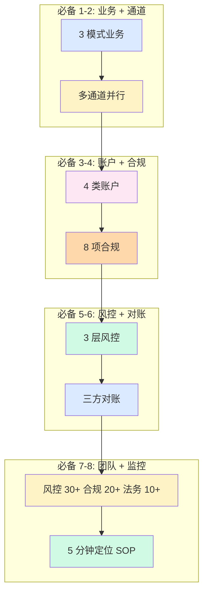
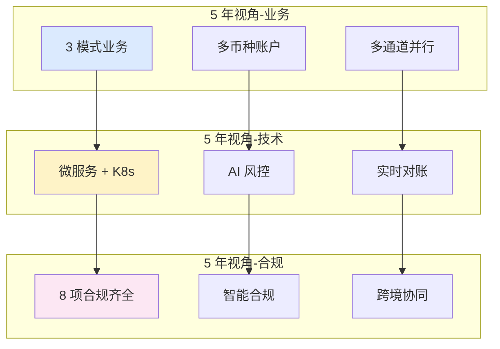

# 全局架构设计与决策清单(全景)

> **系列第 10 篇 · 全景**
> 上一篇 [8_风控与合规框架-深度](./8_风控与合规框架-深度.md) 讲了风控 3 层 + 3DS v2 + AML/KYC + 8 项国际合规。本篇是**第四层 · 架构与全局的第一篇**——讲**全局架构设计与决策清单**——**4 大决策矩阵（业务模式 / 通道管理 / 账户体系 / 合规覆盖）+ 8 项必备清单（头部公司）+ 5 年后回头看的全局视角 + 业内默认**。

---

## 一句话定义

> **跨境支付全局架构设计 =「4 大核心决策 + 8 项必备清单 + 5 年后回头看的全局视角」**。4 大决策 = 业务模式（聚合/直连/本地）+ 通道管理（多通道并行）+ 账户体系（多币种）+ 合规覆盖（8 项国际合规）。**业内默认：** 头部公司必须有「**4 大决策 + 8 项必备 + 全局视角 + 端到端自动化 + 风控 3 层 + 5 分钟定位 SOP + 拒付率 < 0.5% + 结算时效 T+3**」完整体系——**单一决策不够，必须全局协同**。

---

## 业务背景与价值

### 为什么「全局架构设计」是核心难题？

入门读者以为「架构设计 = 一个技术选型」。但跨境支付的全局架构设计是「**4 大决策 + 8 项必备 + 全局视角**」：

**4 大核心决策的真实复杂度：**
- **业务模式决策**：聚合 vs 直连 vs 本地
- **通道管理决策**：多通道并行 + 路由策略 + 健康度监控
- **账户体系决策**：4 类账户 + 5 状态机 + 3 换汇策略
- **合规覆盖决策**：8 项国际合规 + 牌照齐全

**业内默认：** 跨境支付的全局架构设计是「**4 大决策 + 8 项必备 + 全局视角**」——**不是简单的「一个技术选型」**

### 全局架构的 3 维度框架

**维度 1：业务决策（4 大）**
- 业务模式
- 通道管理
- 账户体系
- 合规覆盖

**维度 2：技术决策（4 大）**
- 系统架构（6 层功能 + 4 层部署）
- 数据架构（MySQL + Redis + ES + Kafka）
- 风控体系（3 层 + 3DS + AML/KYC）
- 对账体系（三方对账 + 5 类差异）

**维度 3：组织决策（3 类）**
- 风控团队（30+ 人）
- 合规团队（20+ 人）
- 法务团队（10+ 人）

**业内默认：** 3 维度是「**业务 + 技术 + 组织**」的 3 维度协同

### 监管意图：为什么「全局架构」必须合规？

监管对全局架构有「**资金流可追溯 + 数据保护 + 牌照齐全 + 备付金存管**」4 重要求：
1. **资金流可追溯**——每一笔交易必须可追溯
2. **数据保护**——必须合规（GDPR / PIPL）
3. **牌照齐全**——必须有支付牌照 + 跨境试点
4. **备付金存管**——客户备付金必须存管

**专家视角：** 4 条要求**决定了全局架构必须有「**资金流可追溯 + 数据保护 + 牌照齐全 + 备付金存管**」四重要求**

---

## 业务术语表

| 中文 | 英文 | 一句话解释 |
|---|---|---|
| 业务模式 | Business Model | 聚合 vs 直连 vs 本地 |
| 通道管理 | Channel Management | 多通道并行 + 路由策略 |
| 账户体系 | Account System | 多币种账户 + 状态机 |
| 合规覆盖 | Compliance Coverage | 8 项国际合规 + 牌照齐全 |
| 系统架构 | System Architecture | 6 层功能 + 4 层部署 |
| 数据架构 | Data Architecture | MySQL + Redis + ES + Kafka |
| 风控体系 | Risk System | 3 层 + 3DS + AML/KYC |
| 对账体系 | Reconciliation | 三方对账 + 5 类差异 |
| 必备清单 | Essential Checklist | 头部公司必备 8 项 |
| 全局视角 | Global Perspective | 5 年后回头看 |
| 端到端自动化 | E2E Automation | 端到端全自动化 |
| 5 分钟定位 SOP | 5-Minute Location SOP | 5 分钟内定位异常 |
| 拒付率 | Chargeback Rate | 拒付笔数 / 总笔数 |
| 结算时效 | Settlement Time | T+0 / T+1 / T+3 |
| 团队规模 | Team Size | 风控 30+ + 合规 20+ + 法务 10+ |
| 牌照齐全 | Full License | 支付牌照 + 跨境试点 + 外汇登记 |
| 备付金 | Reserve | 客户备付金存管 |
| AML/KYC | AML/KYC | 反洗钱 + 客户识别 |
| 资金流可追溯 | Money Flow Traceability | 每一笔交易可追溯 |

---

## 业务形态与模式：4 大决策详解

### 决策 1：业务模式（聚合 / 直连 / 本地）

**3 选 1 决策矩阵：**

| 业务模式 | 费率 | 接入时间 | 技术门槛 | 适合 |
|---|---|---|---|---|
| **聚合** | 3%-5% | 几周 | 低 | 中小商户 |
| **直连** | ~2% | 3-6 月 | 高 | 中型 / 头部公司 |
| **本地** | 1%-2% | 1-2 年 | 极高 | 跨国企业 |

**业内默认：** **头部公司必须 3 模式组合**——单一模式不够

**决策建议：**
- 年交易额 < 1 亿 → 聚合
- 年交易额 1-10 亿 → 聚合 + 直连
- 年交易额 > 10 亿 → 聚合 + 直连 + 本地

### 决策 2：通道管理（多通道并行）

**5 大属性：**

| 属性 | 说明 |
|---|---|
| **覆盖地区** | 卡组织（200+）vs 本地钱包（区域）vs 银行直连（本地） |
| **支持币种** | 单一币种 vs 多币种 |
| **费率** | ~1% - ~5% |
| **结算周期** | T+1 / T+3 / T+5~T+7 |
| **支持功能** | 基础 vs 全功能 |

**业内默认：** **头部公司必须多通道并行（≥3 家）**——单一通道 = 单点故障

**决策建议：**
- 单一市场 → 1-2 通道
- 2-5 市场 → 2-3 通道
- 5+ 市场 → 3+ 通道

### 决策 3：账户体系（多币种）

**4 类账户决策：**

| 账户类型 | 关系 | 业务 |
|---|---|---|
| **主账户** | 1:1 商户 | 总账户 |
| **币种子账户** | 1:N 主账户 | 多币种记账 |
| **保证金账户** | 1:1 商户 | 风险缓冲 |
| **分润账户** | 1:1 商户 | 多边分账 |

**业内默认：** **头部公司必须 4 类账户齐全**——单一账户不够

**决策建议：**
- 单一币种 → 1 类账户
- 多币种（2-5）→ 3 类账户
- 多币种（5+）→ 4 类账户

### 决策 4：合规覆盖（8 项国际合规）

**8 项合规：**
- PCI DSS（卡数据加密）
- PSD2/SCA（欧盟强认证）
- 3DS2/EMV 3DS（卡组织标准）
- GDPR（欧盟数据保护）
- PIPL（中国数据保护）
- MAS PSA（新加坡支付法）
- 央行 259 号文（中国跨境试点）
- US BSA（美国银行保密）

**业内默认：** **头部公司必须 8 项合规齐全**——单一合规不够

**决策建议：**
- 单一地区 → 1-3 项合规
- 2-3 地区 → 4-6 项合规
- 全球 → 8 项合规齐全

### 4 大决策矩阵

| 决策 | 头部公司 | 中型公司 | 小公司 |
|---|---|---|---|
| **业务模式** | 3 模式组合 | 2 模式 | 1 模式 |
| **通道管理** | ≥3 通道并行 | 2-3 通道 | 1-2 通道 |
| **账户体系** | 4 类账户 | 3 类账户 | 1 类账户 |
| **合规覆盖** | 8 项合规齐全 | 3-4 项合规 | 1-2 项合规 |

**业内默认：** **4 大决策是头部公司全球化的必备**

---

## 业务流程图：8 项必备清单

**关键观察：**
- 8 项必备清单是「**业务 + 通道 + 账户 + 合规 + 风控 + 对账 + 团队 + 监控**」完整体系
- 8 项**相互依赖**（缺一不可）
- 头部公司**缺一 = 业务受限**

---

## 系统架构：5 年后回头看的全局视角

**关键观察：**
- 5 年后回头看：**业务 + 技术 + 合规** 3 维度协同
- 头部公司必须 **提前布局**：AI 智能化 + 实时化 + 协同化

---

## 服务模型：头部公司必备 8 项

### 必备 1：3 模式业务（聚合 + 直连 + 本地）

**为什么必备：**
- 单一模式 = 议价权低 + 业务受限
- 3 模式 = 全球覆盖 + 议价权高 + 业务多元

**业内默认：** **头部公司必须 3 模式组合**

### 必备 2：多通道并行（≥3 家）

**为什么必备：**
- 单一通道 = 单点故障
- 多通道 = 容灾 + 议价 + 业务多元

**业内默认：** **头部公司必须 ≥3 家通道并行**

### 必备 3：4 类账户（主 + 子 + 保证金 + 分润）

**为什么必备：**
- 单一账户 = 业务受限
- 4 类 = 多币种 + 多边分账 + 风险缓冲

**业内默认：** **头部公司必须 4 类账户齐全**

### 必备 4：8 项合规齐全

**为什么必备：**
- 单一合规 = 全球化受限
- 8 项 = 全球覆盖 + 合规

**业内默认：** **头部公司必须 8 项国际合规齐全**

### 必备 5：3 层风控（硬规则 + 评估 + 监控）

**为什么必备：**
- 1 层风控 = 拒付率高
- 3 层 = 拒付率 < 0.5%

**业内默认：** **头部公司必须 3 层风控**

### 必备 6：三方对账（本方 + 卡组织 + 收单行）

**为什么必备：**
- 单方对账 = 对账不平
- 三方 = 三方金额一致才能结算

**业内默认：** **头部公司必须三方对账**

### 必备 7：团队齐全（风控 30+ + 合规 20+ + 法务 10+）

**为什么必备：**
- 团队不齐全 = 业务受限
- 齐全 = 风控 + 合规 + 法务全覆盖

**业内默认：** **头部公司必须团队齐全**

### 必备 8：5 分钟定位 SOP

**为什么必备：**
- 无 SOP = 事故后才发现
- SOP = 5 分钟内定位异常

**业内默认：** **头部公司必须 5 分钟定位 SOP**

### 8 项必备决策矩阵

| 必备 | 头部公司 | 中型公司 | 小公司 |
|---|---|---|---|
| **3 模式业务** | ✅ | ⚠️ 部分 | ❌ |
| **多通道并行** | ✅ | ⚠️ 部分 | ❌ |
| **4 类账户** | ✅ | ⚠️ 部分 | ❌ |
| **8 项合规** | ✅ | ⚠️ 部分 | ❌ |
| **3 层风控** | ✅ | ⚠️ 部分 | ❌ |
| **三方对账** | ✅ | ⚠️ 部分 | ❌ |
| **团队齐全** | ✅ | ⚠️ 部分 | ❌ |
| **5 分钟定位** | ✅ | ⚠️ 部分 | ❌ |

**业内默认：** **头部公司必须 8 项必备齐全**

---

## 核心功能用例

### 用例 1：跨境电商 SaaS 公司全局架构

**业务背景：**
- 深圳 SaaS 公司，年交易额 5 亿 RMB
- 覆盖新加坡、马来西亚、印尼

**4 大决策：**
- 业务模式：聚合（Stripe）+ 直连（DBS）
- 通道管理：DBS + VISA + Mastercard + GCash
- 账户体系：主账户 + USD 子账户 + SGD 子账户 + IDR 子账户 + 保证金账户
- 合规覆盖：PCI DSS + 央行 259 号文 + MAS PSA + PIPL + GDPR

**8 项必备：**
- ✅ 3 模式业务（聚合 + 直连）
- ✅ 多通道并行（4 通道）
- ✅ 4 类账户
- ✅ 5 项合规
- ✅ 3 层风控
- ✅ 三方对账
- ⚠️ 团队不齐（风控 10 人 + 合规 5 人）
- ✅ 5 分钟定位 SOP

### 用例 2：跨国支付公司全局架构

**业务背景：**
- 跨国支付公司，年交易额 100 亿美元
- 全球 100+ 国家

**4 大决策：**
- 业务模式：聚合（Stripe）+ 直连（VISA/MC）+ 本地（DBS/BCA）
- 通道管理：5+ 卡组织 + 10+ 本地钱包 + 5+ 银行直连
- 账户体系：主账户 + 50+ 币种子账户 + 保证金账户 + 分润账户
- 合规覆盖：8 项国际合规齐全

**8 项必备：**
- ✅ 全部 8 项

### 用例 3：单点故障应对

**场景：** 单通道（Stripe）故障 2 小时

**后果：**
- 业务中断 2 小时
- 商户流失 15%
- 业务亏损 800 万

**应对：**
- 多通道并行（Stripe + VISA + DBS）
- 自动降级（主通道失败 → 切备通道）
- 5 分钟定位 SOP
- 应急 SOP

---

## 业务打法与策略：不同公司的全局架构

### 头部公司（年 GMV > 100 亿美元）

**典型做法：**
- **4 大决策齐全**（3 模式 + ≥3 通道 + 4 类账户 + 8 项合规）
- **8 项必备齐全**
- **端到端自动化**
- **拒付率 < 0.5%**
- **结算时效 T+3**

**业内认知：** 头部公司是「**4 大决策 + 8 项必备 + 端到端自动化**」完整体系

### 中型公司（年 GMV 1-100 亿美元）

**典型做法：**
- **4 大决策基本**（2 模式 + 2-3 通道 + 3 类账户 + 3-4 项合规）
- **8 项必备部分**
- **基本自动化**
- **拒付率 0.5%-1%**
- **结算时效 T+5~T+7**

**业内认知：** 中型公司是「**够用但不极致**」的体系

### 小公司 / 新进入者（年 GMV < 1 亿美元）

**典型做法：**
- **4 大决策缺失**（1 模式 + 1-2 通道 + 1 类账户 + 1-2 项合规）
- **8 项必备缺失**
- **无自动化**
- **拒付率 1%-3%**
- **结算时效 T+7~T+10**

**业内认知：** 小公司是「**MVP 起步**」的体系

---

## Trade-off 分析

### 决策 1：业务模式选择

| 选项 | 优势 | 代价 | 适合谁 |
|---|---|---|---|
| **1 模式** | 简单 + 成本低 | 议价权低 + 业务受限 | 小公司 |
| **2 模式** | 平衡 + 风险可控 | 复杂度中等 | 中型公司 |
| **3 模式** | 议价权高 + 全球覆盖 | 复杂度高 | 头部公司 |

**专家视角：** **业务模式是规模驱动**——业内默认是「**小公司 1 模式 / 中型 2 模式 / 头部 3 模式**」

### 决策 2：通道管理

| 选项 | 优势 | 代价 | 适合谁 |
|---|---|---|---|
| **单通道** | 简单 | 单点故障 | 小公司 |
| **多通道** | 容灾 + 议价 | 复杂度高 | 头部公司 |

**专家视角：** **通道管理是规模驱动**——业内默认是「**头部 ≥3 家通道并行**」

### 决策 3：合规覆盖

| 选项 | 优势 | 代价 | 适合谁 |
|---|---|---|---|
| **1-3 项** | 简单 | 全球化受限 | 小公司 |
| **4-6 项** | 平衡 | 部分市场受限 | 中型公司 |
| **8 项** | 全球覆盖 | 成本高 | 头部公司 |

**专家视角：** **合规覆盖是市场驱动**——业内默认是「**业务范围决定合规范围**」

---

## 行业洞察 / 业内认知

### 不成文标准：跨境支付的全局架构

公开规则：跨境支付 = 接入一家支付通道。

**业内实际复杂度（业内默认）：**

| 维度 | 真实复杂度 | 业内默认 |
|---|---|---|
| 业务决策 | **4 大** | 业务模式/通道管理/账户体系/合规覆盖 |
| 技术决策 | **4 大** | 系统/数据/风控/对账 |
| 组织决策 | **3 类** | 风控/合规/法务 |
| 头部公司 | **50+ 人** | 风控 30+ + 合规 20+ + 法务 10+ |
| 必备清单 | **8 项** | 业务 + 通道 + 账户 + 合规 + 风控 + 对账 + 团队 + 监控 |
| 业务模式 | **3 模式** | 聚合 + 直连 + 本地 |
| 通道管理 | **≥3 家** | 多通道并行 |
| 账户体系 | **4 类** | 主 + 子 + 保证金 + 分润 |
| 合规覆盖 | **8 项** | 国际合规齐全 |
| 拒付率 | **< 0.5%** | 头部公司 |
| 结算时效 | **T+3** | 头部公司 |
| 业内默认 | **8 项必备 + 4 大决策 + 端到端自动化** | 头部公司标配 |

**专家视角：** 跨境支付的全局架构是「**4 大决策 + 8 项必备 + 端到端自动化**」。**业内默认：** 头部公司必须有「**4 大决策 + 8 项必备 + 端到端自动化 + 风控 3 层 + 5 分钟定位 SOP + 拒付率 < 0.5% + 结算时效 T+3**」完整体系

### 真实事故：全局架构失败引发重大损失

公开报道：2022 年某中型跨境支付公司因**全局架构失败**：
- 1 模式业务（仅聚合）
- 1-2 通道（仅 Stripe）
- 1 类账户（仅主账户）
- 1-2 项合规（无 GDPR / PIPL）
- 1 层风控（仅硬规则）
- 单方对账（仅本方）
- 团队不齐（风控 1-3 人）
- 无 SOP

**累计损失：**
- 业务中断：2 小时（Stripe 故障）
- 拒付率高：2.5%（罚款 100 万美元）
- 合规处罚：GDPR 500 万欧元 + PIPL 300 万
- 客户投诉：500+ 起
- 商户流失：30%
- 业务亏损：2000 万人民币
- 后续：被头部公司收购

**业内流传的处理方式：** 头部公司后来强制全局架构必须经过：
- 4 大决策齐全
- 8 项必备齐全
- 端到端自动化
- 风控 3 层
- 5 分钟定位 SOP
- 拒付率 < 0.5%
- 结算时效 T+3
- 团队齐全（风控 30+ + 合规 20+ + 法务 10+）

**教训：** 全局架构失败的「真实成本」不是中断，是「**拒付率高 + 合规处罚 + 商户流失 + 业务亏损 + 公司被收购**」。**业内默认：** 头部公司全局架构必须有「**4 大决策 + 8 项必备 + 端到端自动化 + 风控 3 层 + 5 分钟定位 SOP + 拒付率 < 0.5% + 结算时效 T+3**」完整体系

### 从业者挑战：全局架构的 5 个核心难题

跨境支付公司常见的内部挑战：全局架构的 5 个核心难题。

**1. 业务模式决策难**

业务模式决策复杂。**业内默认：** 必须有「**3 模式组合 + 议价权 + 全球覆盖**」

**2. 通道管理决策难**

通道管理决策复杂。**业内默认：** 必须有「**多通道并行 + 路由策略 + 健康度监控**」

**3. 账户体系决策难**

账户体系决策复杂。**业内默认：** 必须有「**4 类账户 + 5 状态机 + 3 换汇策略**」

**4. 合规覆盖决策难**

合规覆盖决策复杂。**业内默认：** 必须有「**8 项国际合规 + 牌照齐全**」

**5. 组织决策难**

组织决策难。**业内默认：** 必须有「**风控 30+ + 合规 20+ + 法务 10+**」

**专家视角：** 5 个核心难题的真实门槛不是技术实现，是「**业务 + 技术 + 组织**」3 维度协同。**业内默认：** 全局架构必须有「**4 大决策 + 8 项必备 + 端到端自动化 + 风控 3 层 + 5 分钟定位 SOP + 拒付率 < 0.5% + 结算时效 T+3**」完整体系

---

## 业务前景与趋势

### 未来 3-5 年的 4 个结构性变化

**1. 业务模式智能化**

传统人工 → **AI 智能模式选择**。**对参与方格局的启示：** AI 智能化能力成为头部支付公司的核心资产

**2. 通道管理实时化**

传统批量 → **实时通道管理**。**对参与方格局的启示：** 实时化能力成为头部支付公司的差异化优势

**3. 账户体系协同化**

传统独立 → **跨境账户协同**。**对参与方格局的启示：** 协同化能力成为头部支付公司的护城河

**4. 合规协同化**

传统单国合规 → **多国合规协同**。**对参与方格局的启示：** 合规协同能力成为头部支付公司的护城河

---

## 一句话总结

> **跨境支付全局架构设计 =「4 大核心决策 + 8 项必备清单 + 5 年后回头看的全局视角」**。4 大决策 = 业务模式（聚合/直连/本地）+ 通道管理（多通道并行）+ 账户体系（多币种）+ 合规覆盖（8 项国际合规）。**业内默认：** 头部公司必须有「**4 大决策 + 8 项必备 + 全局视角 + 端到端自动化 + 风控 3 层 + 5 分钟定位 SOP + 拒付率 < 0.5% + 结算时效 T+3**」完整体系——**单一决策不够，必须全局协同**。

---

## 📌 数据与事实声明

本文涉及的跨境支付全局架构、4 大决策、8 项必备清单等内容是跨境支付业务的通用认知，但具体到：

- 各家支付公司的全局架构以各公司实际为准
- 4 大决策（业务模式/通道管理/账户体系/合规覆盖）是业内常见分类，**不是强制标准**
- 8 项必备清单是业内常见分类，**不是强制标准**
- 团队规模（风控 30+ / 合规 20+ / 法务 10+）是头部公司业内默认范围，**不是严格定义**
- 拒付率 < 0.5% / 结算时效 T+3 是头部公司业内默认，**不是绝对标准**
- 真实事故的具体描述基于业内公开信息的整理，**不是任何具体公司的真实情况**

不要直接引用本文作为全局架构设计依据或选型依据。

---

## 下一篇预告

下一篇 [11_支付方式与交易类型矩阵-深度](./11_支付方式与交易类型矩阵-深度.md) 将进入**第五层 · 业务场景与用例**——讲**支付方式与交易类型矩阵**——4 大支付方式（卡支付 / 钱包支付 / 银行转账 / 代付 Payout）+ 6 类交易类型（支付 / 退款 / 部分退款 / 撤销 / 授权 / 捕获）+ 支付方式决策矩阵。