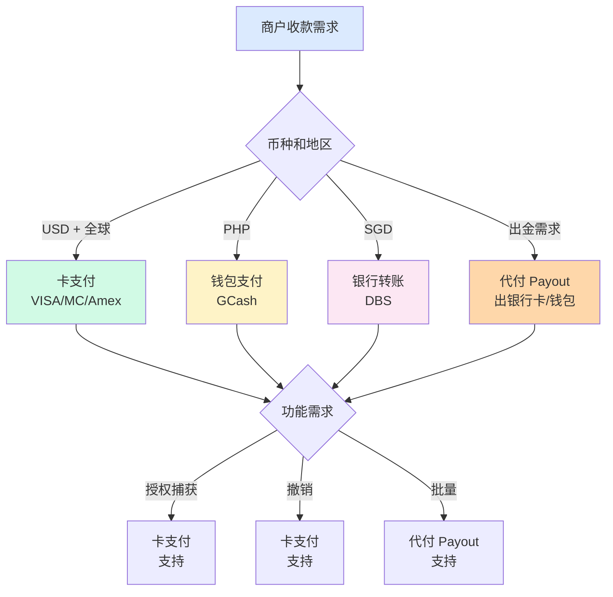
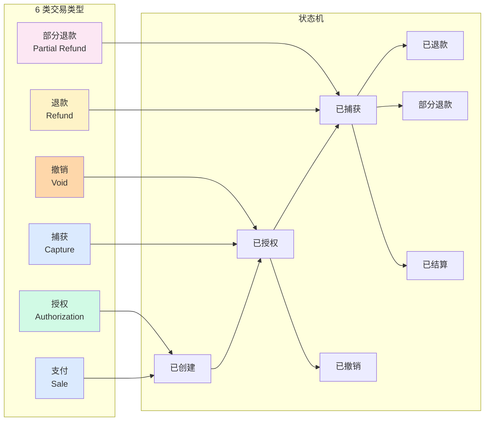

# 支付方式与交易类型矩阵(深度)

> **系列第 11 篇 · 深度**
> 上一篇 [10_全局架构设计与决策清单-全景](./10_全局架构设计与决策清单-全景.md) 讲了 4 大决策 + 8 项必备 + 5 年视角。本篇是**第五层 · 业务场景与用例的第一篇**——讲**支付方式与交易类型矩阵**——**4 大支付方式（卡支付 / 钱包支付 / 银行转账 / 代付 Payout）+ 6 类交易类型（支付 / 退款 / 部分退款 / 撤销 / 授权 / 捕获）+ 支付方式决策矩阵**。

---

## 一句话定义

> **支付方式与交易类型矩阵 =「4 大支付方式 × 6 类交易类型」**。4 大支付方式 = 卡支付（VISA / MC / Amex / JCB）+ 钱包支付（GCash / GrabPay / 支付宝 / 微信）+ 银行转账（DBS / BCA / 招行 / 大行）+ 代付 Payout（出金到银行卡 / 钱包）。6 类交易类型 = 支付 + 退款 + 部分退款 + 撤销 + 授权 + 捕获。**业内默认：** 头部公司必须「**4 大支付方式齐全 + 6 类交易类型支持 + 支付方式决策 + 交易类型决策**」——**单一支付方式不够，必须组合**。

---

## 业务背景与价值

### 为什么「支付方式与交易类型矩阵」是核心难题？

入门读者以为「支付方式 = 接入卡支付」。但跨境支付的真实支付方式是「**4 大支付方式 + 6 类交易类型**」：

**4 大支付方式的真实复杂度：**
- **卡支付**：覆盖广 + 接入慢 + 费率 ~2%
- **钱包支付**：区域覆盖 + 接入快 + 费率 ~1.5%
- **银行转账**：本地覆盖 + 接入中等 + 费率低 ~1%
- **代付 Payout**：出金 + 接入慢 + 费率不等

**业内默认：** 跨境支付的真实支付方式是「**4 大支付方式 + 6 类交易类型**」——**不是简单的「接入卡支付」**

### 支付方式的 3 维度框架

**维度 1：方向（入金 / 出金）**
- 入金：卡支付 + 钱包支付 + 银行转账（3 类）
- 出金：代付 Payout（1 类）

**维度 2：地区（全球 / 区域 / 本地）**
- 全球：卡支付
- 区域：钱包支付
- 本地：银行转账

**维度 3：交易类型（6 类）**
- 支付
- 退款
- 部分退款
- 撤销
- 授权
- 捕获

**业内默认：** 3 维度是「**方向 + 地区 + 交易类型**」的 3 维度协同

### 监管意图：为什么「支付方式与交易类型」必须合规？

监管对支付方式与交易类型有「**资金流可追溯 + 反洗钱 + 数据保护**」3 重要求：
1. **资金流可追溯**——每一笔交易必须可追溯
2. **反洗钱**——必须支持 AML / KYC
3. **数据保护**——必须合规（GDPR / PIPL）

**专家视角：** 3 条要求**决定了支付方式必须有「**资金流可追溯 + 反洗钱 + 数据保护**」三重要求**

---

## 业务术语表

| 中文 | 英文 | 一句话解释 |
|---|---|---|
| 卡支付 | Card Payment | VISA / MC / Amex / JCB 支付 |
| 钱包支付 | Wallet Payment | GCash / GrabPay / 支付宝 / 微信 |
| 银行转账 | Bank Transfer | DBS / BCA / 招行 转账 |
| 代付 Payout | Payout | 出金到银行卡 / 钱包 |
| 支付 | Sale | 一次性扣款 |
| 退款 | Refund | 商户主动退款 |
| 部分退款 | Partial Refund | 商户部分退款 |
| 撤销 | Void | 当日撤销授权 |
| 授权 | Authorization | 冻结资金（不立即扣款）|
| 捕获 | Capture | 真正扣款 |
| ISO 8583 | ISO 8583 | 卡支付国际标准协议 |
| 3DS | 3D Secure | 卡支付强认证 |
| 卡 BIN | Card BIN | 卡号前 6 位（发卡行 + 卡组织 + 卡类型）|
| 卡类型 | Card Type | 信用卡 / 借记卡 / 预付费卡 |
| 本地钱包 | Local Wallet | GCash / GrabPay / PayNow / Pix |
| 跨境钱包 | Cross-Border Wallet | 支付宝 / 微信 |
| 大行 | Major Bank | 工建中农交等大型银行 |
| SEPA | SEPA | 欧盟单一欧元支付区 |
| ACH | ACH | 美国自动清算所 |
| FPS | FPS | 英国 / 香港快速支付 |
| 银行直连 | Direct Bank Connection | DBS / BCA / 本地银行 |
| 入金 | Deposit | 商户收款 |
| 出金 | Withdrawal | 商户提现 |
| 授权码 | Auth Code | 发卡行返回的授权码 |
| 拒付 | Chargeback | 持卡人申诉 + 强制扣回 |

---

## 业务形态与模式：4 大支付方式详解

### 支付方式 1：卡支付（Card Payment）

**业务形态：**
- 卡组织：VISA / Mastercard / Amex / JCB / 银联国际 / Diners / Discover
- 卡类型：信用卡 / 借记卡 / 预付费卡
- 协议：ISO 8583 + 3DS

**5 大属性：**

| 属性 | 说明 | 示例 |
|---|---|---|
| 覆盖地区 | 全球 200+ 国家 | VISA 全球 200+ |
| 支持币种 | 150+ 币种 | USD / EUR / GBP / JPY / HKD |
| 费率 | ~2% | VISA ~1.5%-2% |
| 结算周期 | T+3 | 卡组织规则 |
| 支持功能 | 全功能 | 授权/捕获/退款/拒付/查单 |

**代表：** VISA / Mastercard / Amex / JCB / 银联国际

**业内默认：** 卡支付是「**全球覆盖 + 全功能**」的核心支付方式

### 支付方式 2：钱包支付（Wallet Payment）

**业务形态：**
- 本地钱包：GCash / GrabPay / PayNow / Pix / GCash
- 跨境钱包：支付宝 / 微信
- 协议：API / SDK

**5 大属性：**

| 属性 | 说明 | 示例 |
|---|---|---|
| 覆盖地区 | 区域 | GCash 菲律宾 / GrabPay 东南亚 8 国 |
| 支持币种 | 单一币种 | PHP / SGD / BRL |
| 费率 | ~1.5% | 钱包费率低 |
| 结算周期 | T+1 | 钱包结算快 |
| 支持功能 | 部分功能 | 支付/退款/查询（不支持拒付）|

**代表：** GCash（菲律宾）/ GrabPay（东南亚）/ PayNow（新加坡）/ Pix（巴西）/ 支付宝 / 微信

**业内默认：** 钱包支付是「**区域覆盖 + 费率低**」的补充支付方式

### 支付方式 3：银行转账（Bank Transfer）

**业务形态：**
- 本地银行转账：DBS / BCA / 本地银行
- 跨境银行转账：SWIFT / 大行
- 协议：API / SEPA / ACH / FPS

**5 大属性：**

| 属性 | 说明 | 示例 |
|---|---|---|
| 覆盖地区 | 本地 + 跨境 | DBS 新加坡 / SWIFT 全球 |
| 支持币种 | 本地币种 + 主流币种 | SGD / IDR / USD |
| 费率 | ~1% | 银行费率低 |
| 结算周期 | T+0 / T+1 | 银行转账快 |
| 支持功能 | 基础功能 | 支付/查询（不支持授权捕获）|

**代表：** DBS / BCA / 招行 / 工行 / SWIFT / SEPA / ACH / FPS

**业内默认：** 银行转账是「**本地覆盖 + 费率低**」的核心支付方式

### 支付方式 4：代付 Payout（Payout）

**业务形态：**
- 出金到银行卡（出金卡）
- 出金到钱包（GCash / GrabPay / PayPal）
- 出金到银行账户（DBS / BCA）
- 协议：API / ISO 20022

**5 大属性：**

| 属性 | 说明 | 示例 |
|---|---|---|
| 覆盖地区 | 全球 | 出金到全球 |
| 支持币种 | 100+ 币种 | USD / EUR / PHP / SGD |
| 费率 | 不等 | ~0.5%-2% |
| 结算周期 | T+0 / T+1 | 出金快 |
| 支持功能 | 部分功能 | 代付/批量代付/查询 |

**代表：** Stripe Connect / PayPal Mass Pay / Wise Payout / PingPong Payout

**业内默认：** 代付 Payout 是「**出金**」的核心支付方式

### 4 大支付方式决策矩阵

| 支付方式 | 方向 | 覆盖 | 费率 | 适合 |
|---|---|---|---|---|
| **卡支付** | 入金 | 全球 | ~2% | 跨境电商 / SaaS |
| **钱包支付** | 入金 | 区域 | ~1.5% | 本地化商户 |
| **银行转账** | 入金 | 本地 + 跨境 | ~1% | 大额 B2B |
| **代付 Payout** | 出金 | 全球 | ~0.5%-2% | 平台型商户 |

**业内默认：** **4 大支付方式是头部公司全球化的必备**

---

## 业务流程图：支付方式决策

**关键观察：**
- 4 大支付方式**互补**（不同币种 + 不同地区 + 不同功能）
- 头部公司必须**4 大齐全**
- 不同支付方式**不同费率 + 不同结算 + 不同功能**

---

## 系统架构：交易类型

**关键观察：**
- 6 类交易类型是「**完整生命周期**」
- 支付 = 授权 + 捕获（可以一次性，也可以分开）
- 退款 / 部分退款 / 撤销 是 3 种逆向操作
- 状态机驱动 + 幂等设计

---

## 服务模型：6 类交易类型详解

### 交易类型 1：支付（Sale）

**定义：**
- 一次性扣款
- 包括授权 + 捕获（合并）

**何时用：**
- 实物发货后
- 虚拟商品下单后
- 服务完成后

**业内默认：** 支付是「**最常用**」的交易类型

### 交易类型 2：退款（Refund）

**定义：**
- 商户主动退款
- 必须有原始交易
- 全额退款

**何时用：**
- 用户申请退款
- 商户主动退款
- 投诉处理

**业内默认：** 退款是「**基础必备**」的交易类型

### 交易类型 3：部分退款（Partial Refund）

**定义：**
- 商户部分退款
- 必须有原始交易
- 部分金额退款

**何时用：**
- 部分退货
- 折扣调整
- 投诉部分补偿

**业内默认：** 部分退款是「**灵活必备**」的交易类型

### 交易类型 4：撤销（Void）

**定义：**
- 当日撤销授权
- 不产生结算
- 仅当日有效

**何时用：**
- 用户取消订单
- 授权金额错误
- 商户误操作

**业内默认：** 撤销是「**当日补救**」的交易类型

### 交易类型 5：授权（Authorization）

**定义：**
- 冻结资金（不立即扣款）
- 后续捕获或撤销

**何时用：**
- 实物发货前
- 预订服务（酒店 / 机票 / 租车）
- 不确定金额

**业内默认：** 授权是「**延迟扣款**」的交易类型

### 交易类型 6：捕获（Capture）

**定义：**
- 真正扣款
- 必须先有授权
- 通常 7 天内完成

**何时用：**
- 实物发货时
- 服务完成时
- 预订确认时

**业内默认：** 捕获是「**真正扣款**」的交易类型

### 6 类交易类型决策矩阵

| 交易类型 | 定义 | 何时用 | 业内默认 |
|---|---|---|---|
| **支付** | 一次性扣款 | 实物发货 / 虚拟下单 / 服务完成 | 最常用 |
| **退款** | 商户主动退款 | 用户申请 / 商户主动 / 投诉 | 基础必备 |
| **部分退款** | 部分金额退款 | 部分退货 / 折扣调整 | 灵活必备 |
| **撤销** | 当日撤销授权 | 用户取消 / 授权错误 | 当日补救 |
| **授权** | 冻结资金 | 实物发货前 / 预订服务 | 延迟扣款 |
| **捕获** | 真正扣款 | 实物发货时 / 服务完成时 | 真正扣款 |

**业内默认：** **6 类交易类型是头部公司必备**

---

## 核心功能用例

### 用例 1：新加坡 VISA 100 SGD 支付

**流程：**
- 支付方式：卡支付（VISA）
- 交易类型：支付（Sale）
- 100 SGD
- 授权 + 捕获（一次性）

**时延：** 3 秒

### 用例 2：菲律宾 GCash 1000 PHP 支付

**流程：**
- 支付方式：钱包支付（GCash）
- 交易类型：支付（Sale）
- 1000 PHP
- 实时扣款

**时延：** 2 秒

### 用例 3：新加坡 DBS 银行转账 10000 SGD

**流程：**
- 支付方式：银行转账（DBS PayNow）
- 交易类型：支付（Sale）
- 10000 SGD
- 实时到账

**时延：** 5 秒

### 用例 4：商户提现代付

**流程：**
- 支付方式：代付 Payout（出金到银行卡）
- 交易类型：代付
- 10000 USD → 出金到商户银行卡
- T+1 到账

**时延：** T+1

### 用例 5：酒店预订授权 + 捕获

**流程：**
- 预订：授权 200 USD（冻结）
- 入住：捕获 200 USD（扣款）
- 退订：撤销授权

**时延：** 7 天内完成

### 用例 6：电商退款

**流程：**
- 用户退货 → 商家确认
- 部分退款 50 USD（退 1 件）
- 退款 50 USD → 用户卡

**时延：** T+3~T+7

---

## 业务打法与策略：不同公司的支付方式选择

### 头部公司（年 GMV > 100 亿美元）

**典型做法：**
- **4 大支付方式齐全**（卡 + 钱包 + 银行转账 + 代付）
- **6 类交易类型支持**（全功能）
- **多通道并行**（≥3 家卡组织 + ≥5 家钱包）
- **支付方式决策**（按币种 + 地区 + 功能）
- **交易类型决策**（按业务场景）

**业内认知：** 头部公司是「**4 大支付方式 + 6 类交易类型**」的完整体系

### 中型公司（年 GMV 1-100 亿美元）

**典型做法：**
- **3 大支付方式**（卡 + 钱包 + 代付）
- **4-5 类交易类型**（支付 + 退款 + 部分退款 + 授权 + 捕获）
- **2-3 通道并行**
- **基础支付方式决策**

**业内认知：** 中型公司是「**够用但不极致**」的体系

### 小公司 / 新进入者（年 GMV < 1 亿美元）

**典型做法：**
- **1-2 大支付方式**（仅卡 + 代付）
- **3 类交易类型**（支付 + 退款 + 撤销）
- **1-2 通道**
- **简单支付方式决策**

**业内认知：** 小公司是「**MVP 起步**」的体系

---

## Trade-off 分析

### 决策 1：支付方式

| 选项 | 优势 | 代价 | 适合谁 |
|---|---|---|---|
| **1 方式** | 简单 + 成本低 | 业务受限 | 小公司 |
| **2-3 方式** | 平衡 + 风险可控 | 复杂度中等 | 中型公司 |
| **4 方式齐全** | 全球覆盖 | 复杂度高 | 头部公司 |

**专家视角：** **支付方式是规模驱动**——业内默认是「**小公司 1-2 方式 / 中型 2-3 方式 / 头部 4 方式**」

### 决策 2：交易类型

| 选项 | 优势 | 代价 | 适合谁 |
|---|---|---|---|
| **3 类**（支付+退款+撤销）| 简单 | 灵活性差 | 小公司 |
| **4-5 类**（+部分退款+授权/捕获）| 平衡 | 复杂度中等 | 中型公司 |
| **6 类齐全** | 完整 | 复杂度高 | 头部公司 |

**专家视角：** **交易类型不是越多越好**——是「**业务场景 + 灵活性需求**」的取舍

### 决策 3：通道数量

| 选项 | 优势 | 代价 | 适合谁 |
|---|---|---|---|
| **1 通道** | 简单 | 单点故障 | 小公司 |
| **2-3 通道** | 平衡 | 复杂度中等 | 中型公司 |
| **≥3 通道** | 容灾 + 议价 | 复杂度高 | 头部公司 |

**专家视角：** **通道数量是规模驱动**——业内默认是「**头部 ≥3 家通道并行**」

---

## 行业洞察 / 业内认知

### 不成文标准：支付方式的真实复杂度

公开规则：支付方式 = 接入卡支付。

**业内实际复杂度（业内默认）：**

| 维度 | 真实复杂度 | 业内默认 |
|---|---|---|
| 支付方式 | **4 大** | 卡 + 钱包 + 银行转账 + 代付 |
| 交易类型 | **6 类** | 支付 + 退款 + 部分退款 + 撤销 + 授权 + 捕获 |
| 卡组织 | **5-7 家** | VISA / MC / Amex / JCB / 银联 / Diners / Discover |
| 本地钱包 | **5-10 家** | GCash / GrabPay / PayNow / Pix / PayPal |
| 跨境钱包 | **2-3 家** | 支付宝 / 微信 / PayPal |
| 银行转账 | **本地 + 跨境** | DBS / BCA / SEPA / ACH / FPS |
| 代付 Payout | **多家** | Stripe Connect / PayPal Mass Pay / Wise |
| 头部公司 | **4 大齐全** | 卡 + 钱包 + 银行转账 + 代付 |
| 中型公司 | **3 大** | 卡 + 钱包 + 代付 |
| 小公司 | **1-2 大** | 卡 + 代付 |
| 6 类交易 | **6 类齐全** | 头部公司必备 |
| 业内默认 | **4 支付方式 + 6 交易类型** | 头部公司标配 |

**专家视角：** 支付方式的真实复杂度是「**4 大支付方式 + 6 类交易类型**」。**业内默认：** 头部公司必须有「**4 大支付方式齐全 + 6 类交易类型支持 + 多通道并行 + 支付方式决策 + 交易类型决策**」完整体系

### 真实事故：支付方式选择错误引发重大损失

公开报道：2022 年某中型跨境支付公司因**支付方式选择错误**：
- 仅 1 支付方式（仅卡支付）
- 仅 3 类交易类型（支付 + 退款 + 撤销）
- 单一卡组织（仅 VISA）

**累计损失：**
- 部分钱包用户无法付款（损失 30% 客户）
- 部分退款需求无法支持（损失 20% 客户）
- 单一卡组织故障（损失 5% 客户）
- 商户流失：25%
- 业务亏损：1500 万人民币
- 后续：被头部公司收购

**业内流传的处理方式：** 头部公司后来强制支付方式必须经过：
- 4 大支付方式齐全（卡 + 钱包 + 银行转账 + 代付）
- 6 类交易类型支持（支付 + 退款 + 部分退款 + 撤销 + 授权 + 捕获）
- 多通道并行（≥3 家卡组织 + ≥5 家钱包）
- 支付方式决策（按币种 + 地区 + 功能）
- 交易类型决策（按业务场景）

**教训：** 支付方式选择错误的「真实成本」不是技术，是「**客户损失 + 商户流失 + 业务亏损 + 公司被收购**」。**业内默认：** 头部公司支付方式必须有「**4 大支付方式齐全 + 6 类交易类型支持 + 多通道并行 + 支付方式决策 + 交易类型决策**」完整体系

### 从业者挑战：支付方式的 5 个核心难题

跨境支付公司常见的内部挑战：支付方式的 5 个核心难题。

**1. 支付方式接入难**

支付方式接入复杂。**业内默认：** 必须有「**4 大支付方式齐全 + 多通道并行**」

**2. 交易类型支持难**

交易类型支持复杂。**业内默认：** 必须有「**6 类交易类型 + 状态机设计 + 幂等**」

**3. 支付方式决策难**

支付方式决策复杂。**业内默认：** 必须有「**按币种 + 地区 + 功能 + 费率**」

**4. 交易类型决策难**

交易类型决策复杂。**业内默认：** 必须有「**按业务场景 + 资金流 + 风险**」

**5. 多通道管理难**

多通道管理复杂。**业内默认：** 必须有「**多通道并行 + 路由策略 + 健康度监控**」

**专家视角：** 5 个核心难题的真实门槛不是技术实现，是「**支付方式 + 交易类型 + 通道管理 + 决策矩阵**」4 维度协同。**业内默认：** 支付方式必须有「**4 大支付方式齐全 + 6 类交易类型支持 + 多通道并行 + 支付方式决策 + 交易类型决策**」完整体系

---

## 业务前景与趋势

### 未来 3-5 年的 4 个结构性变化

**1. 支付方式智能化**

传统固定 → **AI 智能支付方式选择**。**对参与方格局的启示：** AI 智能化能力成为头部支付公司的核心资产

**2. 交易类型实时化**

传统异步 → **实时交易处理**。**对参与方格局的启示：** 实时化能力成为头部支付公司的差异化优势

**3. 钱包全球化**

传统区域 → **钱包全球化**。**对参与方格局的启示：** 全球化能力成为头部支付公司的护城河

**4. 代付自动化**

传统人工 → **代付自动化**。**对参与方格局的启示：** 自动化能力成为头部支付公司的护城河

---

## 一句话总结

> **支付方式与交易类型矩阵 =「4 大支付方式 × 6 类交易类型」**。4 大支付方式 = 卡支付（VISA / MC / Amex / JCB）+ 钱包支付（GCash / GrabPay / 支付宝 / 微信）+ 银行转账（DBS / BCA / 招行 / 大行）+ 代付 Payout（出金到银行卡 / 钱包）。6 类交易类型 = 支付 + 退款 + 部分退款 + 撤销 + 授权 + 捕获。**业内默认：** 头部公司必须「**4 大支付方式齐全 + 6 类交易类型支持 + 支付方式决策 + 交易类型决策**」——**单一支付方式不够，必须组合**。

---

## 📌 数据与事实声明

本文涉及的支付方式、交易类型等内容是跨境支付业务的通用认知，但具体到：

- 各家支付公司支持的支付方式和交易类型以各公司实际为准
- 4 大支付方式（卡 + 钱包 + 银行转账 + 代付）是业内常见分类，**不是强制标准**
- 6 类交易类型（支付 + 退款 + 部分退款 + 撤销 + 授权 + 捕获）是业内常见分类，**不是强制标准**
- 各卡组织（VISA / MC / Amex / JCB / 银联国际）的费率和覆盖以卡组织最新规则为准
- 各钱包（GCash / GrabPay / PayNow / Pix）的费率和覆盖以各钱包最新规则为准
- 各银行（DBS / BCA / 招行）的费率和覆盖以各银行最新规则为准
- 代付（Payout）的费率和覆盖以各代付平台最新规则为准
- 真实事故的具体描述基于业内公开信息的整理，**不是任何具体公司的真实情况**

不要直接引用本文作为支付方式设计依据或选型依据。

---

## 下一篇预告

下一篇 [12_订单生命周期与状态机-深度](./12_订单生命周期与状态机-深度.md) 将继续**第五层 · 业务场景与用例**——讲**订单生命周期与状态机**——订单 8 状态（已创建/已支付/已发货/已确认/已结算/已退款/已撤销/已完成）+ 5 类逆向流程（取消/退款/部分退款/换货/退货）+ 状态机设计 + 幂等 + 事件溯源。