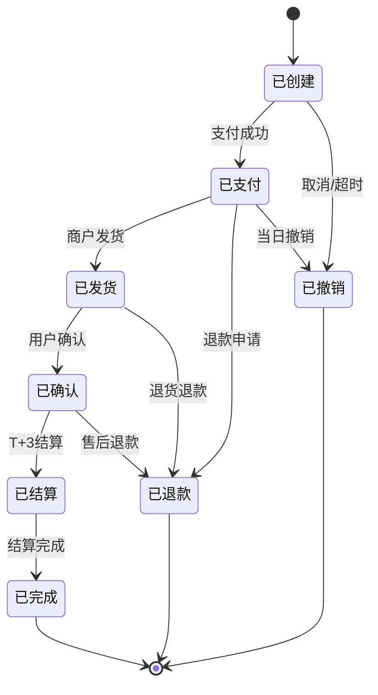
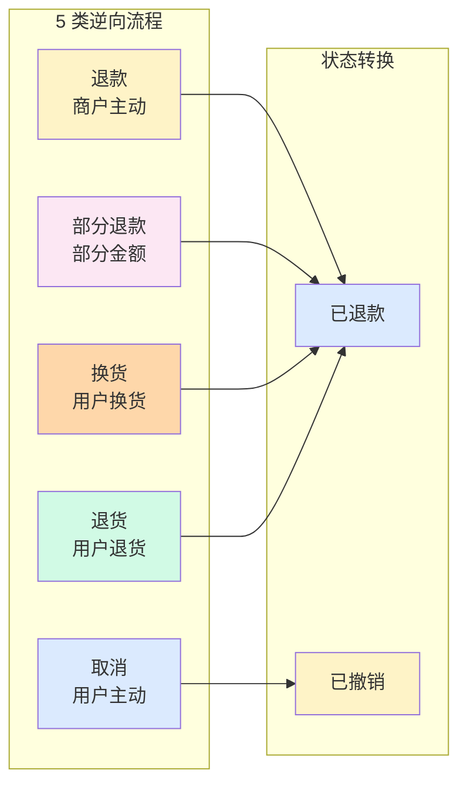

# 订单生命周期与状态机(深度)

> **系列第 12 篇 · 深度**
> 上一篇 [11_支付方式与交易类型矩阵-深度](./11_支付方式与交易类型矩阵-深度.md) 讲了 4 大支付方式 + 6 类交易类型。本篇是**第五层 · 业务场景与用例的第二篇**——讲**订单生命周期与状态机**——**订单 8 状态（已创建/已支付/已发货/已确认/已结算/已退款/已撤销/已完成）+ 5 类逆向流程（取消/退款/部分退款/换货/退货）+ 状态机设计 + 幂等设计 + 事件溯源**。

---

## 一句话定义

> **订单生命周期 =「8 状态 + 5 类逆向流程 + 状态机设计 + 幂等设计 + 事件溯源」**。8 状态 = 已创建 → 已支付 → 已发货 → 已确认 → 已结算 → 已完成（主线）/ 已退款 / 已撤销（逆向）。**业内默认：** 头部公司必须有「**状态机驱动 + 幂等设计 + 事件溯源 + 5 分钟定位 SOP + 90 天对账窗口**」完整体系——**单一状态机不够，必须组合**。

---

## 业务背景与价值

### 为什么「订单生命周期与状态机」是核心难题？

入门读者以为「订单 = 一个状态字段」。但跨境支付的订单生命周期是「**8 状态 + 5 类逆向流程 + 状态机 + 幂等 + 事件溯源**」：

**订单生命周期的真实复杂度：**
- **正向流程**：已创建 → 已支付 → 已发货 → 已确认 → 已结算 → 已完成
- **逆向流程**：取消 / 退款 / 部分退款 / 换货 / 退货
- **状态机设计**：8 状态 + 有限状态转换

**业内默认：** 跨境支付的订单生命周期是「**8 状态 + 5 类逆向 + 状态机 + 幂等 + 事件溯源**」——**不是简单的「一个状态字段」**

### 订单生命周期的 3 维度框架

**维度 1：状态（8 个）**
- 主线 6 状态：已创建 → 已支付 → 已发货 → 已确认 → 已结算 → 已完成
- 逆向 2 状态：已退款 / 已撤销

**维度 2：流程（5 类）**
- 取消
- 退款
- 部分退款
- 换货
- 退货

**维度 3：机制（4 类）**
- 状态机（有限状态转换）
- 幂等（重复请求处理）
- 事件溯源（事件驱动）
- 重试补偿（失败恢复）

**业内默认：** 3 维度是「**状态 + 流程 + 机制**」的 3 维度协同

### 监管意图：为什么「订单生命周期」必须合规？

监管对订单生命周期有「**资金流可追溯 + 退款保护 + 备付金存管**」3 重要求：
1. **资金流可追溯**——每一笔交易必须可追溯
2. **退款保护**——用户退款必须在规定时限内完成
3. **备付金存管**——未结算资金必须存管

**专家视角：** 3 条要求**决定了订单生命周期必须有「**资金流可追溯 + 退款保护 + 备付金存管**」三重要求**

---

## 业务术语表

| 中文 | 英文 | 一句话解释 |
|---|---|---|
| 订单 | Order | 用户下单的记录 |
| 订单状态 | Order Status | 订单当前的状态（8 个之一）|
| 状态机 | State Machine | 有限状态 + 状态转换规则 |
| 已创建 | Created | 用户已下单 |
| 已支付 | Paid | 支付成功 |
| 已发货 | Shipped | 商户已发货 |
| 已确认 | Confirmed | 用户已确认收货 |
| 已结算 | Settled | 资金已结算给商户 |
| 已完成 | Completed | 订单最终完成 |
| 已退款 | Refunded | 订单已退款 |
| 已撤销 | Voided | 订单已撤销 |
| 取消 | Cancel | 用户主动取消 |
| 退款 | Refund | 商户主动退款 |
| 部分退款 | Partial Refund | 商户部分退款 |
| 换货 | Exchange | 用户换货 |
| 退货 | Return | 用户退货 |
| 幂等 | Idempotency | 重复请求返回相同结果 |
| 事件溯源 | Event Sourcing | 事件驱动 + 状态回溯 |
| 重试补偿 | Retry Compensation | 失败自动重试 + 补偿 |
| 订单号 | Order ID | 订单唯一标识 |
| 商户订单号 | Merchant Order ID | 商户系统的订单号 |
| 支付单号 | Payment ID | 支付系统唯一标识 |
| 退款单号 | Refund ID | 退款唯一标识 |
| 对账窗口 | Reconciliation Window | 90 天对账窗口 |
| 5 分钟定位 | 5-Minute Location | 5 分钟内定位异常 |
| 状态转换 | State Transition | 从一个状态到另一个状态 |
| 终态 | Final State | 订单最终状态（已完成 / 已退款 / 已撤销）|
| 逆向流程 | Reverse Process | 取消 / 退款 / 退货 |
| 幂等键 | Idempotency Key | 防止重复请求的键 |

---

## 业务形态与模式：订单 8 状态详解

### 状态 1：已创建（Created）

**业务形态：**
- 用户已下单
- 订单生成
- 等待支付

**状态字段：**
- 订单号
- 金额 / 币种
- 商品信息
- 商户信息
- 状态：已创建
- 创建时间

**业内默认：** 已创建是「**订单起点**」——必须生成唯一订单号

### 状态 2：已支付（Paid）

**业务形态：**
- 支付成功
- 资金冻结 / 扣款
- 等待发货 / 服务

**状态字段：**
- 支付单号
- 支付方式
- 支付时间
- 授权码

**业内默认：** 已支付是「**支付完成**」——支付单 + 授权码必须记录

### 状态 3：已发货（Shipped）

**业务形态：**
- 商户已发货
- 物流信息
- 等待用户收货

**状态字段：**
- 物流公司
- 物流单号
- 发货时间

**业内默认：** 已发货是「**发货完成**」——物流信息必须记录

### 状态 4：已确认（Confirmed）

**业务形态：**
- 用户已确认收货
- 等待结算
- 部分场景自动确认（如虚拟商品）

**状态字段：**
- 确认时间
- 确认方式（手动 / 自动）

**业内默认：** 已确认是「**收货确认**」——虚拟商品可自动确认

### 状态 5：已结算（Settled）

**业务形态：**
- 资金已结算给商户
- T+3 到账（卡组织）
- T+1 到账（钱包）

**状态字段：**
- 结算时间
- 结算金额（扣除手续费）
- 结算币种

**业内默认：** 已结算是「**资金到账**」——结算金额 = 原金额 - 手续费

### 状态 6：已完成（Completed）

**业务形态：**
- 订单最终完成
- 不可再变更
- 终态

**业内默认：** 已完成是「**终态 1**」——订单完成，不可再变更

### 状态 7：已退款（Refunded）

**业务形态：**
- 订单已退款
- 全额 / 部分
- 终态

**业内默认：** 已退款是「**终态 2**」——退款完成，不可再变更

### 状态 8：已撤销（Voided）

**业务形态：**
- 订单已撤销
- 当日撤销授权
- 终态

**业内默认：** 已撤销是「**终态 3**」——撤销完成，不可再变更

### 8 状态决策矩阵

| 状态 | 类型 | 关键字段 | 业内默认 |
|---|---|---|---|
| **已创建** | 起点 | 订单号 / 金额 | 必须唯一订单号 |
| **已支付** | 中间 | 支付单 / 授权码 | 支付完成 |
| **已发货** | 中间 | 物流信息 | 发货完成 |
| **已确认** | 中间 | 确认时间 | 收货确认 |
| **已结算** | 中间 | 结算金额 | 资金到账 |
| **已完成** | 终态 | — | 订单完成 |
| **已退款** | 终态 | 退款金额 | 退款完成 |
| **已撤销** | 终态 | — | 撤销完成 |

**业内默认：** **8 状态是「**主线 6 + 逆向 2**」完整生命周期**

---

## 业务流程图：订单状态机

**关键观察：**
- 主线 6 状态：**已创建 → 已支付 → 已发货 → 已确认 → 已结算 → 已完成**
- 逆向 2 状态：**已退款 / 已撤销**
- **有限状态转换**（不是任意跳转）
- **3 个终态**（已完成 / 已退款 / 已撤销）

---

## 系统架构：5 类逆向流程

**关键观察：**
- 5 类逆向流程 → 2 个逆向状态
- 取消 → 已撤销
- 退款 / 部分退款 / 换货 / 退货 → 已退款

---

## 服务模型：4 类核心机制

### 机制 1：状态机（State Machine）

**设计原则：**
- 有限状态（8 个）
- 有限状态转换（合法转换）
- 不可越级（不能跳过中间状态）
- 终态不可变更

**实现方式：**
- 状态机框架（Spring StateMachine / 自研）
- 数据库乐观锁（防止并发状态修改）
- 事件驱动（状态变化触发事件）

**业内默认：** 状态机是「**订单系统核心**」——必须严格状态转换

### 机制 2：幂等设计（Idempotency）

**设计原则：**
- 重复请求返回相同结果
- 幂等键（Idempotency Key）
- 防止重复扣款 / 重复退款

**实现方式：**
- 幂等表（存储幂等键 + 结果）
- Redis 分布式锁
- 数据库唯一索引

**业内默认：** 幂等设计是「**防重复**」必备——必须幂等键

### 机制 3：事件溯源（Event Sourcing）

**设计原则：**
- 事件驱动 + 状态回溯
- 所有状态变化记录为事件
- 通过事件重放恢复状态

**实现方式：**
- 事件存储（Event Store）
- 事件总线（Kafka）
- 事件处理器

**业内默认：** 事件溯源是「**复杂场景**」可选——头部公司标配

### 机制 4：重试补偿（Retry Compensation）

**设计原则：**
- 失败自动重试
- 重试失败 → 补偿
- 补偿失败 → 人工介入

**实现方式：**
- 重试框架（Spring Retry）
- 死信队列（DLQ）
- 人工工单

**业内默认：** 重试补偿是「**分布式系统**」必备——必须有自动重试

### 4 类核心机制决策矩阵

| 机制 | 适用 | 实现方式 | 业内默认 |
|---|---|---|---|
| **状态机** | 订单全流程 | Spring StateMachine / 自研 | 必须 |
| **幂等设计** | 防止重复 | 幂等表 + Redis + 唯一索引 | 必须 |
| **事件溯源** | 复杂场景 | 事件存储 + 事件总线 | 可选 |
| **重试补偿** | 分布式系统 | Spring Retry + 死信队列 | 必须 |

**业内默认：** **4 类机制是「**状态机 + 幂等 + 事件 + 重试**」完整体系**

---

## 核心功能用例

### 用例 1：电商实物订单

**正向流程：**
- 已创建（用户下单）
- 已支付（支付成功）
- 已发货（商户发货）
- 已确认（用户收货）
- 已结算（T+3）
- 已完成

**逆向流程（退货退款）：**
- 用户退货
- 已支付 → 已发货 → 已退款
- 商户退款

### 用例 2：虚拟商品订单

**正向流程：**
- 已创建（用户下单）
- 已支付（支付成功）
- 已确认（自动确认）
- 已结算（T+1）
- 已完成

**逆向流程（取消）：**
- 用户取消（当日）
- 已创建 → 已撤销

### 用例 3：酒店预订订单

**正向流程：**
- 已创建（用户预订）
- 已支付（授权 200 USD）
- 已确认（用户入住）
- 已捕获（商户捕获）
- 已结算
- 已完成

**逆向流程（取消预订）：**
- 用户取消预订
- 撤销授权
- 已支付 → 已撤销

### 用例 4：幂等处理

**场景：** 用户重复点击「支付」按钮

**处理：**
- 幂等键（订单号）
- 第一次请求：创建支付单 → 支付成功
- 第二次请求：查询幂等键 → 返回已支付
- 防止重复扣款

### 用例 5：状态机异常

**场景：** 订单状态不一致

**处理：**
- 监控告警（订单长时间停留某状态）
- 5 分钟定位
- 自动修复（少数情况）
- 人工工单（多数情况）

---

## 业务打法与策略：不同公司的订单生命周期

### 头部公司（年 GMV > 100 亿美元）

**典型做法：**
- **8 状态完整**
- **5 类逆向流程齐全**
- **状态机驱动 + 幂等设计 + 事件溯源**
- **重试补偿 + 死信队列**
- **5 分钟定位 SOP**
- **90 天对账窗口**

**业内认知：** 头部公司是「**8 状态 + 5 类逆向 + 状态机 + 幂等 + 事件 + 重试**」完整体系

### 中型公司（年 GMV 1-100 亿美元）

**典型做法：**
- **6-7 状态**（简化）
- **3-4 类逆向流程**
- **状态机 + 幂等设计**
- **基础重试**
- **30 天对账窗口**

**业内认知：** 中型公司是「**够用但不极致**」的体系

### 小公司 / 新进入者（年 GMV < 1 亿美元）

**典型做法：**
- **4-5 状态**（极简）
- **1-2 类逆向流程**（仅退款 / 取消）
- **基础状态机**
- **无重试**
- **无对账窗口**

**业内认知：** 小公司是「**MVP 起步**」的体系

---

## Trade-off 分析

### 决策 1：状态复杂度

| 选项 | 优势 | 代价 | 适合谁 |
|---|---|---|---|
| **极简**（4-5 状态）| 简单 + 成本低 | 灵活性差 | 小公司 |
| **基本**（6-7 状态）| 平衡 | 复杂度中等 | 中型公司 |
| **完整**（8 状态）| 完整 | 复杂度高 | 头部公司 |

**专家视角：** **状态复杂度是规模驱动**——业内默认是「**小公司 4-5 状态 / 中型 6-7 状态 / 头部 8 状态**」

### 决策 2：逆向流程

| 选项 | 优势 | 代价 | 适合谁 |
|---|---|---|---|
| **1-2 类** | 简单 | 灵活性差 | 小公司 |
| **3-4 类** | 平衡 | 复杂度中等 | 中型公司 |
| **5 类齐全** | 完整 | 复杂度高 | 头部公司 |

**专家视角：** **逆向流程不是越多越好**——是「**业务场景 + 客户需求**」的取舍

### 决策 3：核心机制

| 选项 | 优势 | 代价 | 适合谁 |
|---|---|---|---|
| **基础**（状态机 + 幂等）| 简单 | 复杂场景不够 | 小公司 |
| **标准**（+ 重试补偿）| 平衡 | 复杂度中等 | 中型公司 |
| **完整**（+ 事件溯源）| 完整 | 复杂度高 | 头部公司 |

**专家视角：** **核心机制是规模驱动**——业内默认是「**小公司基础 / 中型标准 / 头部完整**」

---

## 行业洞察 / 业内认知

### 不成文标准：订单生命周期的真实复杂度

公开规则：订单 = 一个状态字段。

**业内实际复杂度（业内默认）：**

| 维度 | 真实复杂度 | 业内默认 |
|---|---|---|
| 状态数 | **8 个** | 主线 6 + 逆向 2 |
| 逆向流程 | **5 类** | 取消/退款/部分退款/换货/退货 |
| 核心机制 | **4 类** | 状态机 + 幂等 + 事件 + 重试 |
| 对账窗口 | **90 天** | 业内默认 |
| 状态机驱动 | **必须** | 头部公司标配 |
| 幂等设计 | **必须** | 防止重复扣款 |
| 事件溯源 | **可选** | 头部公司标配 |
| 重试补偿 | **必须** | 分布式系统标配 |
| 头部公司 | **完整体系** | 8 状态 + 5 类逆向 + 4 类机制 |
| 中型公司 | **基本体系** | 6-7 状态 + 3-4 类逆向 + 3 类机制 |
| 小公司 | **MVP** | 4-5 状态 + 1-2 类逆向 + 2 类机制 |
| 5 分钟定位 | **必须** | 头部公司标配 |

**专家视角：** 订单生命周期的真实复杂度是「**8 状态 + 5 类逆向 + 4 类机制**」。**业内默认：** 头部公司必须有「**状态机驱动 + 幂等设计 + 事件溯源 + 重试补偿 + 5 分钟定位 SOP + 90 天对账窗口**」完整体系

### 真实事故：订单状态机失败引发重大损失

公开报道：2022 年某中型跨境支付公司因**订单状态机失败**：
- 5 状态（缺已确认 / 已结算）
- 1 类逆向流程（仅退款）
- 无状态机（直接修改数据库）
- 无幂等（重复扣款）
- 无重试

**累计损失：**
- 重复扣款：500+ 起（投诉 200+ 起）
- 状态错乱：100+ 起（投诉 50+ 起）
- 商户结算错乱：50+ 起（损失 500 万）
- 商户流失：20%
- 业务亏损：1500 万人民币
- 后续：被头部公司收购

**业内流传的处理方式：** 头部公司后来强制订单生命周期必须经过：
- 8 状态完整（主线 6 + 逆向 2）
- 5 类逆向流程齐全
- 状态机驱动（有限状态转换）
- 幂等设计（幂等键 + 幂等表）
- 事件溯源（事件存储 + 事件总线）
- 重试补偿（自动重试 + 死信队列）
- 5 分钟定位 SOP
- 90 天对账窗口

**教训：** 订单状态机失败的「真实成本」不是重复扣款，是「**商户结算错乱 + 商户流失 + 业务亏损 + 公司被收购**」。**业内默认：** 头部公司订单生命周期必须有「**状态机驱动 + 幂等设计 + 事件溯源 + 重试补偿 + 5 分钟定位 SOP + 90 天对账窗口**」完整体系

### 从业者挑战：订单生命周期的 5 个核心难题

跨境支付公司常见的内部挑战：订单生命周期的 5 个核心难题。

**1. 状态机设计难**

状态机设计复杂。**业内默认：** 必须有「**有限状态 + 合法转换 + 终态不可变更**」

**2. 幂等实现难**

幂等实现复杂。**业内默认：** 必须有「**幂等键 + 幂等表 + 唯一索引**」

**3. 逆向流程处理难**

逆向流程处理复杂。**业内默认：** 必须有「**5 类逆向流程 + 状态转换 + 资金处理**」

**4. 事件溯源实施难**

事件溯源实施复杂。**业内默认：** 必须有「**事件存储 + 事件总线 + 状态回溯**」

**5. 重试补偿实施难**

重试补偿实施复杂。**业内默认：** 必须有「**自动重试 + 死信队列 + 人工兜底**」

**专家视角：** 5 个核心难题的真实门槛不是技术实现，是「**状态机 + 幂等 + 逆向 + 事件 + 重试**」5 维度协同。**业内默认：** 订单生命周期必须有「**状态机驱动 + 幂等设计 + 事件溯源 + 重试补偿 + 5 分钟定位 SOP + 90 天对账窗口**」完整体系

---

## 业务前景与趋势

### 未来 3-5 年的 4 个结构性变化

**1. 状态机智能化**

传统人工 → **AI 智能状态机**。**对参与方格局的启示：** AI 智能化能力成为头部支付公司的核心资产

**2. 幂等自动化**

传统手工 → **幂等自动化**。**对参与方格局的启示：** 自动化能力成为头部支付公司的差异化优势

**3. 事件溯源标准化**

传统自研 → **事件溯源标准化**。**对参与方格局的启示：** 标准化能力成为头部支付公司的护城河

**4. 重试补偿智能化**

传统固定重试 → **智能重试补偿**。**对参与方格局的启示：** 智能化能力成为头部支付公司的护城河

---

## 一句话总结

> **订单生命周期 =「8 状态 + 5 类逆向流程 + 状态机设计 + 幂等设计 + 事件溯源」**。8 状态 = 已创建 → 已支付 → 已发货 → 已确认 → 已结算 → 已完成（主线）/ 已退款 / 已撤销（逆向）。**业内默认：** 头部公司必须有「**状态机驱动 + 幂等设计 + 事件溯源 + 5 分钟定位 SOP + 90 天对账窗口**」完整体系——**单一状态机不够，必须组合**。

---

## 📌 数据与事实声明

本文涉及的订单生命周期、状态机、8 状态、5 类逆向流程等内容是跨境支付订单管理的通用认知，但具体到：

- 各家支付公司的订单状态机和状态数，以各公司实际为准
- 8 状态（主线 6 + 逆向 2）是业内常见划分，**不是强制标准**
- 5 类逆向流程（取消/退款/部分退款/换货/退货）是业内常见分类，**不是强制标准**
- 4 类核心机制（状态机 + 幂等 + 事件 + 重试）是业内常见分类，**不是强制标准**
- 90 天对账窗口是业内默认，**不是绝对标准**
- 5 分钟定位 SOP 是头部公司标配，**不是强制标准**
- 真实事故的具体描述基于业内公开信息的整理，**不是任何具体公司的真实情况**

不要直接引用本文作为订单生命周期设计依据或选型依据。

---

## 下一篇预告

下一篇 [13_核心功能用例与12场景-深度](./13_核心功能用例与12场景-深度.md) 将继续**第五层 · 业务场景与用例**——讲**12 个核心功能场景**——B2C 电商 4 场景（B2C 普通电商 / 跨境电商 SaaS / 数字内容 / 订阅服务）+ B2B 4 场景（外贸 B2B / 跨境 SaaS / 跨境物流 / 跨境广告）+ 平台型 4 场景（聚合平台 / 资金分发 / 跨境汇款 / 虚拟信用卡）。