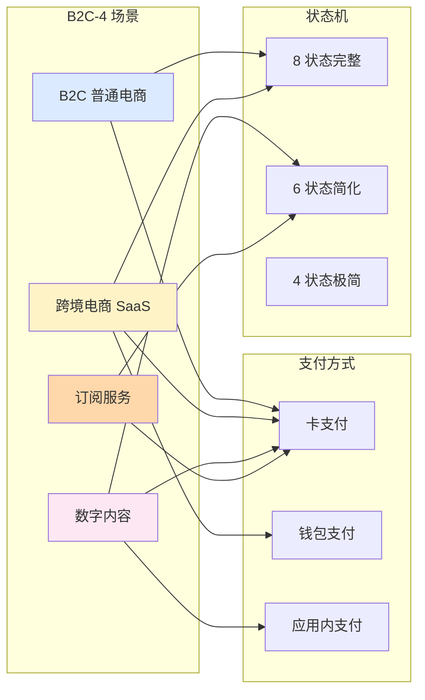
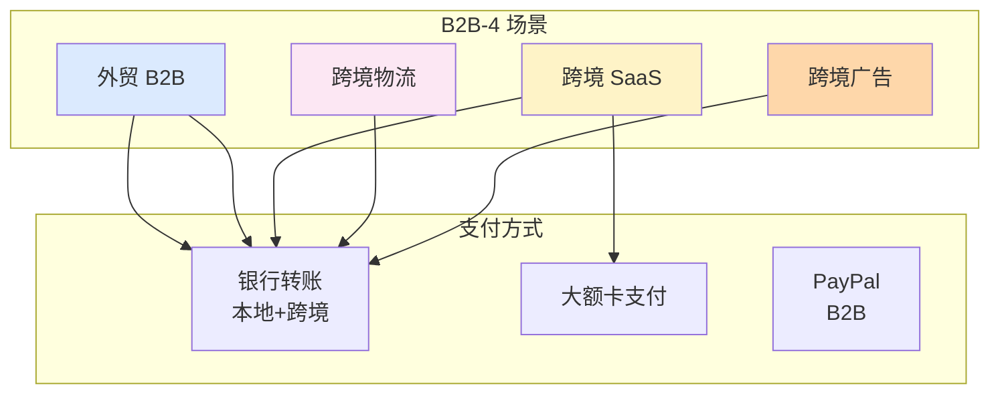

# 核心功能用例与12场景(深度)

> **系列第 13 篇 · 深度**
> 上一篇 [12_订单生命周期与状态机-深度](./12_订单生命周期与状态机-深度.md) 讲了 8 状态 + 5 类逆向流程 + 4 类核心机制。本篇是**第五层 · 业务场景与用例的第三篇**——讲**核心功能用例与 12 场景**——**B2C 电商 4 场景（B2C 普通电商 / 跨境电商 SaaS / 数字内容 / 订阅服务）+ B2B 4 场景（外贸 B2B / 跨境 SaaS / 跨境物流 / 跨境广告）+ 平台型 4 场景（聚合平台 / 资金分发 / 跨境汇款 / 虚拟信用卡）**。

---

## 一句话定义

> **核心功能用例 =「3 大类型 × 4 场景 = 12 个跨境支付核心场景」**。B2C 电商（普通电商 + 跨境电商 SaaS + 数字内容 + 订阅服务）+ B2B（外贸 B2B + 跨境 SaaS + 跨境物流 + 跨境广告）+ 平台型（聚合平台 + 资金分发 + 跨境汇款 + 虚拟信用卡）。**业内默认：** 头部公司必须支持「**12 个核心场景 + 场景差异化设计 + 支付方式决策 + 状态机适配 + 风控分级**」——**单一场景不够，必须 12 场景组合**。

---

## 业务背景与价值

### 为什么「核心功能用例」是核心难题？

入门读者以为「跨境支付 = 接入一种支付方式」。但跨境支付的真实场景是「**3 大类型 × 4 场景 = 12 个核心场景**」：

**12 个核心场景的真实复杂度：**
- **B2C 4 场景**：普通电商 + 跨境电商 SaaS + 数字内容 + 订阅服务
- **B2B 4 场景**：外贸 B2B + 跨境 SaaS + 跨境物流 + 跨境广告
- **平台型 4 场景**：聚合平台 + 资金分发 + 跨境汇款 + 虚拟信用卡

**业内默认：** 跨境支付的真实场景是「**12 个核心场景**」——**不是简单的「接入一种支付方式」**

### 场景的 3 维度框架

**维度 1：业务类型（3 大）**
- B2C 电商（个人消费者）
- B2B（企业用户）
- 平台型（多方分账）

**维度 2：场景特征（4 大）**
- 普通电商（一次性交易）
- 订阅服务（周期性交易）
- 跨境 SaaS（持续服务）
- 虚拟信用卡（预付费）

**维度 3：支付方式决策（差异化）**
- B2C：卡支付为主
- B2B：银行转账为主
- 平台型：分润账户为主

**业内默认：** 3 维度是「**业务类型 + 场景特征 + 支付方式**」的 3 维度协同

### 监管意图：为什么「核心场景」必须合规？

监管对 12 个场景有「**消费者保护 + 反洗钱 + 数据保护**」3 重要求：
1. **消费者保护**——退款必须在规定时限内完成
2. **反洗钱**——必须支持 AML / KYC
3. **数据保护**——必须合规（GDPR / PIPL）

**专家视角：** 3 条要求**决定了 12 个场景必须有「**消费者保护 + 反洗钱 + 数据保护**」三重要求**

---

## 业务术语表

| 中文 | 英文 | 一句话解释 |
|---|---|---|
| B2C | B2C | 企业对消费者 |
| B2B | B2B | 企业对企业 |
| SaaS | SaaS | 软件即服务 |
| 订阅服务 | Subscription | 周期性订阅 |
| 跨境电商 | Cross-Border E-commerce | 跨国电商交易 |
| 外贸 B2B | Foreign Trade B2B | 企业间跨境贸易 |
| 聚合平台 | Aggregator Platform | 多商户聚合支付 |
| 资金分发 | Fund Distribution | 多账户分账 |
| 跨境汇款 | Cross-Border Remittance | 个人 / 企业跨境汇款 |
| 虚拟信用卡 | Virtual Credit Card | 预付费卡 |
| 数字内容 | Digital Content | 视频 / 音乐 / 游戏 |
| 跨境物流 | Cross-Border Logistics | 跨境物流支付 |
| 跨境广告 | Cross-Border Advertising | Google / Meta 广告支付 |
| 分润 | Profit Sharing | 多方分账 |
| 周期性扣款 | Recurring Payment | 订阅服务自动扣款 |
| 大额交易 | Large Transaction | B2B 大额交易 |
| 多账户 | Multi-Account | 多方分账账户 |

---

## 业务形态与模式：B2C 电商 4 场景

### 场景 1：B2C 普通电商

**业务形态：**
- 个人消费者购买实物
- 一次性交易
- 需要物流

**支付方式：**
- 卡支付（VISA / MC）
- 钱包支付（GCash / GrabPay）

**关键场景：**

| 关键场景 | 支付方式 | 状态机 |
|---|---|---|
| **新加坡用户买衣服** | VISA 卡支付 | 8 状态完整 |
| **马来西亚用户买电子** | MC 卡支付 | 8 状态完整 |
| **退货退款** | 原路返回 | 5 类逆向 |

**业内默认：** B2C 普通电商是「**最常见**」的场景

### 场景 2：跨境电商 SaaS

**业务形态：**
- Shopee / Lazada / Amazon 等平台
- 多国多币种
- 多支付方式

**支付方式：**
- 卡支付（全球）
- 本地钱包（区域）
- 银行转账（本地）

**关键场景：**

| 关键场景 | 支付方式 | 状态机 |
|---|---|---|
| **东南亚用户购物** | 本地钱包优先 | 8 状态 |
| **欧美用户购物** | 卡支付 | 8 状态 |
| **退款到原渠道** | 原路返回 | 5 类逆向 |

**业内默认：** 跨境电商 SaaS 是「**多国多币种**」的复杂场景

### 场景 3：数字内容

**业务形态：**
- 视频 / 音乐 / 游戏 / 软件
- 虚拟商品
- 无物流

**支付方式：**
- 卡支付（小额）
- 钱包支付
- 应用内支付（App Store / Google Play）

**关键场景：**

| 关键场景 | 支付方式 | 状态机 |
|---|---|---|
| **Netflix 订阅** | 卡支付 | 简化为 6 状态（无物流）|
| **Spotify 订阅** | 卡支付 + PayPal | 简化为 6 状态 |
| **游戏内购** | 应用内支付 | 简化为 4 状态 |

**业内默认：** 数字内容是「**虚拟商品 + 无物流**」的简化场景

### 场景 4：订阅服务

**业务形态：**
- 周期性扣款（每月 / 每年）
- 自动续费
- 自动撤销

**支付方式：**
- 卡支付（首选）
- PayPal（备选）

**关键场景：**

| 关键场景 | 支付方式 | 状态机 |
|---|---|---|
| **SaaS 月付** | 卡支付 + 自动扣款 | 8 状态 + 周期性 |
| **会员年付** | 卡支付 + 一次性 | 8 状态 |
| **退订** | 当月不扣款 | 自动撤销 |

**业内默认：** 订阅服务是「**周期性扣款**」的特殊场景

---

## 业务流程图：B2C 电商 4 场景对比

**关键观察：**
- B2C 4 场景**不同支付方式**
- B2C 4 场景**不同状态机复杂度**
- 头部公司必须**支持全部 4 场景**

---

## 系统架构：B2B 4 场景

**关键观察：**
- B2B 4 场景**以银行转账为主**（大额）
- B2B 4 场景**风控更严格**（企业 KYC）
- B2B 4 场景**结算更复杂**（多币种）

---

## 服务模型：平台型 4 场景

### 场景 1：聚合平台

**业务形态：**
- 多商户聚合
- 平台分润
- 多支付方式

**支付方式：**
- 卡支付
- 钱包支付
- 银行转账
- 分润账户

**业内默认：** 聚合平台是「**多方分账**」的核心场景

### 场景 2：资金分发

**业务形态：**
- 多账户分账
- 平台抽成
- 多级分销

**支付方式：**
- 代付 Payout
- 分润账户
- 银行转账

**业内默认：** 资金分发是「**多级分账**」的复杂场景

### 场景 3：跨境汇款

**业务形态：**
- 个人跨境汇款
- 企业跨境汇款
- 多币种

**支付方式：**
- 银行转账
- 钱包支付
- 现金取款

**业内默认：** 跨境汇款是「**个人 / 企业**」的核心场景

### 场景 4：虚拟信用卡

**业务形态：**
- 预付费卡
- 虚拟卡
- 多币种卡

**支付方式：**
- 预付费
- 充值
- 卡支付

**业内默认：** 虚拟信用卡是「**预付费**」的特殊场景

### 平台型 4 场景决策矩阵

| 场景 | 业务 | 支付方式 | 业内默认 |
|---|---|---|---|
| **聚合平台** | 多商户分润 | 卡 + 钱包 + 分润 | 多方分账 |
| **资金分发** | 多级分销 | 代付 + 分润 + 银行 | 多级分账 |
| **跨境汇款** | 个人 / 企业 | 银行 + 钱包 + 现金 | 个人 / 企业 |
| **虚拟信用卡** | 预付费 | 充值 + 卡支付 | 预付费 |

**业内默认：** **平台型 4 场景是「**分润 + 多级 + 汇款 + 预付**」完整体系**

---

## 核心功能用例

### 用例 1：新加坡用户买衣服（B2C 普通电商）

**流程：**
- 用户下单 100 SGD
- 选择 VISA 卡支付
- 3DS 验证
- 支付成功
- 商户发货
- 用户收货
- 自动确认
- T+3 结算
- 订单完成

**时延：** T+0 支付 + T+3 结算

### 用例 2：马来西亚用户订阅 Netflix（订阅服务）

**流程：**
- 用户订阅 35 MYR / 月
- 选择卡支付
- 首次支付成功
- 每月自动扣款
- 退订 → 停止扣款

**时延：** 5 秒（首次）+ 每月 1 次

### 用例 3：深圳公司外贸 B2B 收款（B2B）

**流程：**
- 深圳公司出口 10000 USD
- 美国客户付款（银行转账）
- T+1~T+3 到账
- 换汇 → CNY
- 打款到深圳公司账户

**时延：** T+1~T+3

### 用例 4：聚合平台分账（平台型）

**流程：**
- 平台商户收款 10000 USD
- 平台抽成 5%（500 USD）
- 商户实际收入 9500 USD
- T+3 结算 → 平台账户 + 商户账户

**时延：** T+3

### 用例 5：跨境汇款（平台型）

**流程：**
- 美国华人汇款 5000 USD 到中国
- 选择银行转账
- T+1~T+3 到账
- 换汇 → CNY
- 打款到中国银行账户

**时延：** T+1~T+3

---

## 业务打法与策略：不同公司的场景支持

### 头部公司（年 GMV > 100 亿美元）

**典型做法：**
- **12 个核心场景齐全**
- **场景差异化设计**
- **支付方式决策自动化**
- **状态机适配**
- **风控分级**

**业内认知：** 头部公司是「**12 场景齐全 + 场景差异化 + 风控分级**」完整体系

### 中型公司（年 GMV 1-100 亿美元）

**典型做法：**
- **6-8 个核心场景**
- **基础差异化**
- **基础支付方式决策**
- **基础状态机**

**业内认知：** 中型公司是「**够用但不极致**」的体系

### 小公司 / 新进入者（年 GMV < 1 亿美元）

**典型做法：**
- **1-3 个核心场景**
- **无差异化**
- **固定支付方式**
- **极简状态机**

**业内认知：** 小公司是「**MVP 起步**」的体系

---

## Trade-off 分析

### 决策 1：场景覆盖

| 选项 | 优势 | 代价 | 适合谁 |
|---|---|---|---|
| **1-3 场景** | 简单 + 成本低 | 业务受限 | 小公司 |
| **6-8 场景** | 平衡 | 复杂度中等 | 中型公司 |
| **12 场景齐全** | 完整 | 复杂度高 | 头部公司 |

**专家视角：** **场景覆盖是规模驱动**——业内默认是「**小公司 1-3 / 中型 6-8 / 头部 12**」

### 决策 2：场景差异化

| 选项 | 优势 | 代价 | 适合谁 |
|---|---|---|---|
| **无差异化** | 简单 | 灵活性差 | 小公司 |
| **基本差异化** | 平衡 | 复杂度中等 | 中型公司 |
| **完全差异化** | 完整 | 复杂度高 | 头部公司 |

**专家视角：** **场景差异化是规模驱动**——业内默认是「**小公司无 / 中型基本 / 头部完全**」

### 决策 3：风控分级

| 选项 | 优势 | 代价 | 适合谁 |
|---|---|---|---|
| **无分级** | 简单 | 风险高 | 小公司 |
| **基本分级** | 平衡 | 复杂度中等 | 中型公司 |
| **完全分级** | 完整 | 复杂度高 | 头部公司 |

**专家视角：** **风控分级是规模驱动**——业内默认是「**小公司无 / 中型基本 / 头部完全**」

---

## 行业洞察 / 业内认知

### 不成文标准：跨境支付的 12 场景

公开规则：跨境支付 = 接入一种支付方式。

**业内实际复杂度（业内默认）：**

| 维度 | 真实复杂度 | 业内默认 |
|---|---|---|
| B2C 场景 | **4 类** | 普通电商 + 跨境电商 SaaS + 数字内容 + 订阅服务 |
| B2B 场景 | **4 类** | 外贸 B2B + 跨境 SaaS + 跨境物流 + 跨境广告 |
| 平台型场景 | **4 类** | 聚合平台 + 资金分发 + 跨境汇款 + 虚拟信用卡 |
| 场景总数 | **12 个** | 业内默认 |
| 支付方式 | **差异化** | B2C 卡为主 + B2B 银行为主 + 平台型分润 |
| 状态机 | **差异化** | B2C 8 状态 + B2B 简化为 6 状态 + 平台型 8 状态 |
| 风控分级 | **必须** | B2C 基础 + B2B 严格 + 平台型 多级 |
| 头部公司 | **12 场景齐全** | 场景差异化设计 |
| 中型公司 | **6-8 场景** | 基本差异化 |
| 小公司 | **1-3 场景** | 无差异化 |
| 业内默认 | **12 场景 + 差异化 + 风控分级** | 头部公司标配 |

**专家视角：** 跨境支付的 12 场景是「**B2C 4 + B2B 4 + 平台型 4 = 12 场景**」。**业内默认：** 头部公司必须支持「**12 个核心场景 + 场景差异化设计 + 支付方式决策 + 状态机适配 + 风控分级**」完整体系

### 真实事故：场景支持不全引发重大损失

公开报道：2022 年某中型跨境支付公司因**场景支持不全**：
- 仅支持 B2C 普通电商
- 不支持订阅服务（无周期性扣款）
- 不支持 B2B（无大额银行转账）
- 不支持平台型（无分润）

**累计损失：**
- 损失 SaaS 客户（30%）
- 损失 B2B 客户（20%）
- 损失平台型客户（15%）
- 商户流失：40%
- 业务亏损：2000 万人民币
- 后续：被头部公司收购

**业内流传的处理方式：** 头部公司后来强制场景支持必须经过：
- 12 个核心场景齐全（B2C 4 + B2B 4 + 平台型 4）
- 场景差异化设计
- 支付方式决策（按场景）
- 状态机适配（按场景）
- 风控分级（按场景）

**教训：** 场景支持不全的「真实成本」不是技术，是「**客户损失 + 商户流失 + 业务亏损 + 公司被收购**」。**业内默认：** 头部公司场景支持必须有「**12 个核心场景 + 场景差异化设计 + 支付方式决策 + 状态机适配 + 风控分级**」完整体系

### 从业者挑战：场景支持的 5 个核心难题

跨境支付公司常见的内部挑战：场景支持的 5 个核心难题。

**1. 场景覆盖不全**

场景覆盖不全。**业内默认：** 必须有「**12 个核心场景齐全**」

**2. 场景差异化设计难**

场景差异化设计复杂。**业内默认：** 必须有「**支付方式决策 + 状态机适配 + 风控分级**」

**3. 支付方式决策难**

支付方式决策复杂。**业内默认：** 必须有「**按场景 + 按币种 + 按地区 + 按费率**」

**4. 状态机适配难**

状态机适配复杂。**业内默认：** 必须有「**按场景 + 复杂度差异化 + 灵活配置**」

**5. 风控分级难**

风控分级复杂。**业内默认：** 必须有「**B2C 基础 + B2B 严格 + 平台型多级**」

**专家视角：** 5 个核心难题的真实门槛不是技术实现，是「**场景 + 差异化 + 决策 + 适配 + 风控**」5 维度协同。**业内默认：** 场景支持必须有「**12 个核心场景 + 场景差异化设计 + 支付方式决策 + 状态机适配 + 风控分级**」完整体系

---

## 业务前景与趋势

### 未来 3-5 年的 4 个结构性变化

**1. 场景智能化**

传统固定 → **AI 智能场景选择**。**对参与方格局的启示：** AI 智能化能力成为头部支付公司的核心资产

**2. 场景差异化自动化**

传统手工 → **场景差异化自动化**。**对参与方格局的启示：** 自动化能力成为头部支付公司的差异化优势

**3. 支付方式决策智能化**

传统规则 → **AI 支付方式决策**。**对参与方格局的启示：** 智能化能力成为头部支付公司的护城河

**4. 风控分级精细化**

传统粗放 → **风控分级精细化**。**对参与方格局的启示：** 精细化能力成为头部支付公司的护城河

---

## 一句话总结

> **核心功能用例 =「3 大类型 × 4 场景 = 12 个跨境支付核心场景」**。B2C 电商（普通电商 + 跨境电商 SaaS + 数字内容 + 订阅服务）+ B2B（外贸 B2B + 跨境 SaaS + 跨境物流 + 跨境广告）+ 平台型（聚合平台 + 资金分发 + 跨境汇款 + 虚拟信用卡）。**业内默认：** 头部公司必须支持「**12 个核心场景 + 场景差异化设计 + 支付方式决策 + 状态机适配 + 风控分级**」——**单一场景不够，必须 12 场景组合**。

---

## 📌 数据与事实声明

本文涉及的 12 个跨境支付核心场景、3 大类型分类等内容是跨境支付业务的通用认知，但具体到：

- 各家支付公司支持的场景和差异化设计以各公司实际为准
- 12 个场景（B2C 4 + B2B 4 + 平台型 4）是业内常见分类，**不是强制标准**
- 场景差异化设计、支付方式决策、状态机适配、风控分级是业内常见做法，**不是强制标准**
- 各场景的支付方式和费率以各公司实际为准
- 真实事故的具体描述基于业内公开信息的整理，**不是任何具体公司的真实情况**

不要直接引用本文作为场景支持设计依据或选型依据。

---

## 下一篇预告

下一篇 [14_线上支付全流程-PC与H5-深度](./14_线上支付全流程-PC与H5-深度.md) 将进入**第六层 · 业务场景与用例（线上场景）**——讲**线上支付全流程**——PC 收银台 6 步骤（下单/选择支付方式/跳转第三方/支付回调/订单更新/展示结果）+ H5 收银台 4 步骤（下单/唤起钱包/支付回调/订单更新）+ 移动端 SDK 集成。