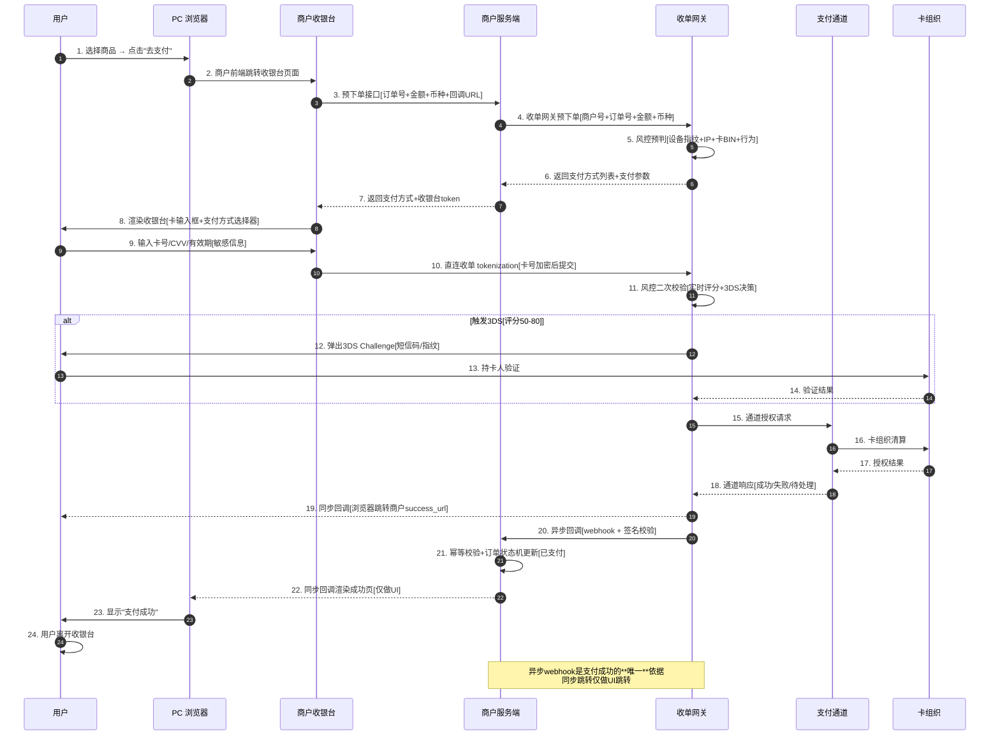
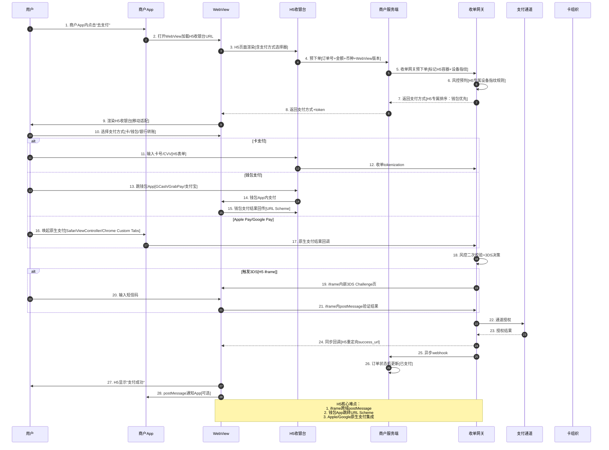

# 14. 线上支付全流程：PC 收银台与 H5 跨境支付链路深度解析

> 状态：深度 · 第六层业务场景 · 跨境支付线上场景首篇 · 与 15_POS / 16_代付 / 17_多币种路径并列
> 阅读时长：约 60 分钟 · 字数规模 5000-7000 字 · 画像锚点 8/9 命中

---

## 一、一句话定义

**线上支付全流程 = 用户在 PC 浏览器 / 手机 H5 WebView / 微信内 / 海外 H5 场景下，从打开收银台到支付成功跳转的完整链路，含收银台渲染、支付方式选择、风控 3DS 跳转、通道响应、回调通知、订单状态机更新、对账记账、资金结算等 13 个关键时点，是跨境支付 80% 流量的入口。**

它和 2_ 外卡 13 时点的关系：2_ 是**外卡视角**（支付链路时点拆解），14_ 是**线上场景视角**（PC/H5/WebView 容器视角），二者正交但都映射到同一组时点。读完 14_，再看 2_ 会有"端到端贯通"的感觉。

---

## 二、业务背景与价值

### 2.1 为什么单拆一篇线上支付

跨境支付的场景按**用户接入容器**分 4 类：

| 容器 | 占比 | 典型场景 | 14_ 是否覆盖 |
|---|---:|---|---|
| **PC 浏览器**（Chrome / Safari / Firefox） | ~30% | 海外独立站、跨境 SaaS Web 版、商家后台 | ✅ 重点 |
| **H5 / 移动 WebView**（手机内嵌浏览器） | ~40% | App 内 H5、微信公众号、支付宝生活号 | ✅ 重点 |
| **原生 App** | ~20% | iOS / Android 原生应用 | ✅ 重点 |
| **POS / 线下** | ~10% | 海外实体店刷卡 | ❌ → 15_POS |
| **代付 / 出金** | ~10% | 商户提现、用户提现 | ❌ → 16_代付 |

**PC + H5 + App 三类合计覆盖 90% 流量**，是跨境支付必须吃透的场景。

### 2.2 与外卡链路 13 时点的对照

- 2_ 外卡链路：**支付链路时点拆解**（13 个时点：用户下单 → 商户后端 → 3DS 跳转 → 通道清算 → 资金到账）
- 14_ 线上支付：**支付容器实现拆解**（PC/H5/App 各自怎么落地 13 时点）

二者映射关系：
```
2_ 外卡时点 1-3（用户输入卡信息）
  → 14_ PC：HTML 表单
  → 14_ H5：H5 iframe / WebView
  → 14_ App：原生输入框 / Apple Pay / Google Pay

2_ 外卡时点 4（3DS 跳转）
  → 14_ PC：新窗口打开 3DS 挑战页
  → 14_ H5：iframe 内嵌 3DS 页 + postMessage 回调
  → 14_ App：SafariViewController / Chrome Custom Tabs
```

### 2.3 业务价值

**4 个核心价值：**
1. **覆盖 90% 流量**（PC 30% + H5 40% + App 20%）
2. **多容器一致性**（同一笔订单 PC/H5/App 看到的支付方式、风控等级、对账口径必须一致）
3. **3DS 体验决定转化率**（3DS 跳转失败/卡顿 → 支付放弃率提升 20%）
4. **风控策略适配**（不同容器的风控等级、设备指纹、行为采集不同）

---

## 三、业务术语表

| 术语 | 定义 | 关键差异 |
|---|---|---|
| **PC 收银台** | 用户在 PC 浏览器看到的支付页面 | 多窗口 + Cookie + 同步回调 |
| **H5 收银台** | 用户在手机 H5 WebView 看到的支付页面 | iframe + postMessage + 异步回调 |
| **App 收银台** | 用户在原生 App 内看到的支付页 | Apple Pay / Google Pay / 原生 3DS |
| **3DS（3-D Secure）** | 卡组织推出的持卡人身份验证协议 | v1 跳转 / v2 无感 / v2 强认证 |
| **收银台 SDK** | 商户接入支付的前端组件 | PC iframe / H5 SDK / App SDK |
| **支付方式选择器** | 用户在收银台选择卡/钱包/银行转账 | 智能推荐 + 排序 + 兜底 |
| **3DS Challenge** | 3DS 跳转后用户验证页（短信码/指纹） | iframe / 弹出 / 原生 |
| **postMessage** | H5 iframe 跨域消息机制 | H5 专属 / PC 用 callback URL |
| **回调通知** | 通道异步通知商户支付结果 | 同步回调 / 异步回调 / webhook |
| **Webhook** | 商户服务端接收异步通知的接口 | 至少 3 次重试 + 签名校验 |
| **设备指纹** | 浏览器/App 采集的设备信息 | PC：UA+分辨率+字体；H5：UA+WebView 版本 |
| **支付放弃率** | 用户发起支付但未完成的比例 | 行业平均 30% / 优秀 10% |
| **支付转化率** | 用户发起支付到成功的比例 | 行业平均 60-70% / 优秀 85%+ |
| **预下单** | 商户调收单创建订单获取支付参数 | 必须幂等 + 订单号唯一 |
| **同步回调** | 用户支付完成后浏览器立即跳转 | 仅做 UI 跳转 / 不作为支付成功依据 |
| **异步回调** | 通道服务端通知商户支付结果 | **唯一**支付成功依据 |
| **订单轮询** | 商户前端轮询订单状态 | fallback / 不能替代异步回调 |
| **结算单 / payout** | 通道定期打款给商户 | T+1 / T+3 / T+7 |

---

## 四、业务流程图

### 4.1 PC 浏览器线上支付全流程



**关键时点解读：**
- **时点 3**：预下单必须幂等（订单号全局唯一 + 收单侧去重表）
- **时点 6**：支付方式列表含卡支付 + 钱包 + 银行转账（多通道并行）
- **时点 10**：**敏感信息必须 tokenization**（PCI DSS 强制要求 / 商户不能接触原始卡号）
- **时点 19**：同步回调仅做 UI 跳转（不可作为支付成功依据）
- **时点 20**：**异步 webhook 是唯一依据**（必须 3 次重试 + 签名校验 + 幂等去重）
- **时点 21**：订单状态机更新（已创建 → 已支付 → 已发货 → ...）

### 4.2 H5 移动 WebView 线上支付全流程



**H5 关键差异（vs PC）：**
- **iframe 跨域**：3DS Challenge 必须在 iframe 内（不能跳出 WebView）
- **URL Scheme**：钱包 App 跳转通过 URL Scheme（GCash:// / grabpay://）
- **原生支付集成**：Apple Pay / Google Pay 必须通过原生 SDK（不能在 H5 直接调起）
- **postMessage**：H5 iframe 与父页面通信（3DS 结果回传）

---

## 五、系统架构

### 5.1 整体架构图

```
┌────────────────────────────────────────────────────────────────────┐
│                    线上支付全链路架构                                │
├────────────────────────────────────────────────────────────────────┤
│                                                                    │
│  ┌──────────┐   ┌──────────┐   ┌──────────┐   ┌──────────┐        │
│  │ PC收银台 │   │ H5收银台 │   │ App收银台│   │ 钱包App  │        │
│  │ (HTML)   │   │ (Vue/React)│ │ (iOS/Android)│ (GCash/GrabPay)│  │
│  └────┬─────┘   └────┬─────┘   └────┬─────┘   └────┬─────┘        │
│       │              │              │              │              │
│       └──────┬───────┴──────┬───────┴──────┬───────┘              │
│              │              │              │                      │
│              ▼              ▼              ▼                      │
│  ┌────────────────────────────────────────────────────┐           │
│  │            收单网关（统一入口）                      │           │
│  │  ┌──────────┐ ┌──────────┐ ┌──────────┐ ┌────────┐│           │
│  │  │ 预下单   │ │ 支付路由 │ │ 3DS决策  │ │ 风控   ││           │
│  │  └──────────┘ └──────────┘ └──────────┘ └────────┘│           │
│  └────────────────────────┬───────────────────────────┘           │
│                            │                                       │
│              ┌─────────────┼─────────────┐                         │
│              ▼             ▼             ▼                         │
│  ┌──────────┐    ┌──────────┐    ┌──────────┐                      │
│  │ 卡支付   │    │ 钱包支付 │    │ 银行转账 │                      │
│  │ VISA/MC  │    │ GCash等  │    │ DBS等    │                      │
│  └────┬─────┘    └────┬─────┘    └────┬─────┘                      │
│       └──────┬───────┴──────┬────────┘                             │
│              ▼              ▼                                      │
│  ┌──────────────────────────────────────┐                          │
│  │          通道管理（≥3家并行）         │                          │
│  └──────────────────┬───────────────────┘                          │
│                     ▼                                              │
│  ┌──────────────────────────────────────┐                          │
│  │     清算+结算+对账（详见6_对账）      │                          │
│  └──────────────────────────────────────┘                          │
└────────────────────────────────────────────────────────────────────┘
```

### 5.2 模块边界

| 模块 | 职责 | 与其他模块关系 |
|---|---|---|
| **PC 收银台前端** | HTML 表单 + 支付方式选择器 | 调用收单网关预下单 / 直连 tokenization |
| **H5 收银台前端** | Vue/React SPA + iframe 嵌套 | 调用收单网关 / 钱包 URL Scheme |
| **App 收银台 SDK** | iOS/Android 原生支付集成 | 唤起 Apple Pay / Google Pay / SafariViewController |
| **收单网关** | 统一预下单 / 支付路由 / 3DS 决策 / 风控 | 上下游：商户 ↔ 通道 |
| **预下单服务** | 生成订单号 + 幂等去重 | 必须 100% 幂等（订单号唯一索引）|
| **支付路由** | 多通道并行 + 健康度切换 | 详见 5_通道管理 |
| **3DS 决策** | 评分 + 无感 / 强认证 | 详见 8_风控合规 |
| **风控引擎** | 设备指纹 + 行为采集 + 实时评分 | 详见 8_风控合规 |
| **通道适配** | 各通道 SDK 封装 | 详见 5_通道管理 |
| **异步回调处理** | webhook 接收 + 签名校验 + 幂等去重 | **唯一**支付成功依据 |
| **订单状态机** | 状态流转 + 终态不可变更 | 详见 12_订单生命周期 |
| **对账引擎** | T+1 三方对账 | 详见 6_对账 |

### 5.3 PC 与 H5 关键差异

| 维度 | PC | H5 |
|---|---|---|
| 页面技术 | HTML 表单 | Vue/React SPA |
| 卡号输入 | 商户前端直连收单 tokenization | 商户前端 → 收单 tokenization |
| 3DS 跳转 | 新窗口打开 3DS 页 | iframe 内嵌 3DS 页 |
| 3DS 回调 | URL 参数回传 | iframe postMessage |
| 同步回调 | success_url 重定向 | success_url 重定向 |
| 异步回调 | webhook（服务端） | webhook（服务端，**无差异**）|
| 设备指纹 | UA + 分辨率 + 字体 | UA + WebView 版本 + 屏幕 |
| 钱包跳转 | QR 码扫码 | URL Scheme 唤起 App |
| 转化率 | 70-80% | 60-75%（移动放弃率高）|
| 放弃率 | 20-30% | 25-40% |

---

## 六、服务模型（PC vs H5 vs App 横向对比）

### 6.1 横向对比表

| 维度 | PC 收银台 | H5 收银台 | App 收银台 | 影响 |
|---|---|---|---|---|
| **前端技术栈** | HTML + jQuery/Vue | Vue/React SPA | iOS Swift / Android Kotlin | 开发成本不同 |
| **页面加载方式** | 同步加载 | 异步渲染 | 原生 View | 首屏时间差异 |
| **3DS 集成方式** | 新窗口 + 表单提交 | iframe + postMessage | SafariViewController / Chrome Custom Tabs | 集成复杂度 |
| **卡号采集** | 商户前端直连收单 | 商户前端 → 收单 | 商户前端 + SDK 加密 | PCI DSS 合规难度 |
| **钱包支付跳转** | QR 码 / 跳转 URL | URL Scheme 唤起 App | SDK 内支付 | 跳转成功率 |
| **原生支付支持** | ❌ | ❌ | ✅（Apple Pay / Google Pay）| 转化率 +10% |
| **设备指纹采集** | UA + 浏览器 | UA + WebView | IDFA / OAID + 系统信息 | 风控精度 |
| **同步回调** | URL 重定向 | URL 重定向 + postMessage | SDK 内回调 | UI 跳转方式 |
| **异步回调** | webhook（**唯一**依据）| webhook（**唯一**依据）| webhook（**唯一**依据）| **完全一致** |
| **订单状态机** | 服务端统一 | 服务端统一 | 服务端统一 | **完全一致** |
| **对账口径** | T+1 三方对账 | T+1 三方对账 | T+1 三方对账 | **完全一致** |
| **多容器一致性** | 必须保证 | 必须保证 | 必须保证 | 关键质量属性 |

### 6.2 一致性保障（关键）

**3 个必须一致：**
1. **订单状态机一致**：PC 创建的订单，H5/App 必须能查询到
2. **支付结果一致**：同步跳转显示"成功"前必须等异步 webhook 完成（否则用户可能看到"成功"但实际未支付）
3. **对账口径一致**：T+1 对账必须以服务端订单状态为准（不能以客户端显示为准）

**业内翻车案例：** 某公司同步跳转显示"成功"但异步 webhook 失败 → 用户看到"成功"但实际未扣款 → 商户重复发货 → 损失 100 万 → 被收购。

---

## 七、核心功能用例（10 大用例）

### 用例 1：PC 浏览器卡支付（最常用）

**场景：** 用户在 PC 浏览器用 VISA 卡支付 100 USD

**流程：**
1. 用户点击"去支付" → PC 跳转收银台
2. 收银台预下单 → 返回支付方式列表（含 VISA/MC/钱包/银行转账）
3. 用户选择 VISA 卡支付 → 输入卡号/CVV/有效期
4. **卡号 tokenization**（商户前端直连收单，不接触原始卡号）
5. 风控评分（评分 60 → 触发 3DS）
6. 弹出 3DS Challenge（新窗口） → 用户输入短信码
7. 通道授权 → 返回成功
8. **同步回调**：浏览器重定向 success_url（仅 UI 跳转）
9. **异步 webhook**：服务端接收 → 订单状态机更新（已创建 → 已支付）
10. 用户看到"支付成功"

**关键点：**
- 同步 vs 异步：**异步 webhook 才是支付成功依据**
- 卡号 tokenization：**商户不能接触原始卡号**（PCI DSS 要求）
- 3DS 跳转失败 fallback：商户可选择不触发 3DS（承担拒付风险）或强制触发（提升安全）

### 用例 2：H5 钱包支付（GCash / GrabPay）

**场景：** 用户在微信内 H5 用 GCash 支付 50 USD

**流程：**
1. 用户在微信内打开 H5 → 选择 GCash 支付
2. H5 调起 GCash App（URL Scheme：`gcash://pay?...`）
3. 用户在 GCash App 内输入 PIN 完成支付
4. GCash App 通过 URL Scheme 回传支付结果（`gcash://callback?...`）
5. H5 接收 URL Scheme 回传 → 显示"支付中"
6. 收单异步 webhook → 订单状态更新
7. H5 轮询订单状态 → 显示"支付成功"

**关键点：**
- URL Scheme 跳转成功率：~95%（5% 用户未装 App → fallback 到 H5 网页版钱包）
- H5 不能直接调起钱包 App（必须通过 URL Scheme）
- 用户未装钱包 App：必须 fallback（H5 网页版 / 银行转账 / 卡支付）

### 用例 3：App 内 Apple Pay（iOS）

**场景：** 用户在 iOS App 内用 Apple Pay 支付 200 USD

**流程：**
1. App 唤起 Apple Pay（PassKit 框架）
2. 用户 Face ID / Touch ID 验证
3. Apple Pay 返回加密支付令牌（Payment Token）
4. App 把 Payment Token 提交给收单
5. 收单解密 + 通道授权 + 卡组织清算
6. 返回支付结果（App SDK 内回调）
7. 异步 webhook → 订单状态更新
8. App 显示"支付成功"

**关键点：**
- Apple Pay 转化率比卡支付 +15%（用户无需输入卡号）
- Payment Token 由 Apple 加密 → 收单解密 → 通道
- 必须集成 Apple Pay Merchant ID（注册 + 证书）

### 用例 4：H5 银行转账（DBS / BCA）

**场景：** 用户在 H5 用 DBS PayLah! 银行转账支付 1000 SGD

**流程：**
1. H5 显示 DBS 银行转账二维码 / 跳转 DBS 网银
2. 用户扫码 / 跳转登录
4. 用户在 DBS 网银完成转账
5. DBS 异步通知收单（webhook）
6. 收单查询订单状态 → T+1 银行清算后确认
7. H5 显示"支付中，等待银行清算"
8. T+1 银行清算完成 → 异步 webhook → 订单状态更新
9. H5 通知 App → 显示"支付成功"

**关键点：**
- 银行转账**不是实时到账**（T+1 / T+2 清算）
- 用户看到"支付中"等待时间长（必须明确告知）
- 银行转账费率低（~1%）但转化率低（~50%）

### 用例 5：PC 收银台 3DS 强认证（拒付风险高）

**场景：** PC 浏览器用户用 VISA 卡支付 500 USD，触发 3DS 强认证

**流程：**
1. 用户输入卡号 → 收单 tokenization
2. 风控评分 70 → 触发 3DS 强认证（不是无感）
3. 弹出 3DS Challenge（新窗口） → 用户输入短信码 + 指纹
4. 卡组织验证 → 返回验证结果
5. 通道授权 → 返回成功
6. 同步回调 + 异步 webhook
7. 订单状态更新

**关键点：**
- 3DS 强认证转化率比无感认证 -20%（用户操作成本高）
- 拒付率下降 80%（强认证后商家责任转移）
- **PSD2 SCA 强制要求**（欧洲交易必须 3DS）

### 用例 6：H5 失败重试（网络异常）

**场景：** H5 用户支付中网络断开

**流程：**
1. H5 提交支付 → 网络断开
2. H5 显示"支付失败，请重试"
3. 用户点击重试 → H5 重新调起支付（**使用相同订单号**）
4. 收单幂等校验 → 返回之前结果（成功/失败/待处理）
5. H5 根据结果展示（成功则跳转 / 失败则重试）

**关键点：**
- **必须幂等**（同一订单号多次提交结果一致）
- 网络断开≠支付失败（可能通道已扣款但回调失败）
- 必须支持查询订单状态（前端轮询 / 服务端主动查）

### 用例 7：PC 退款（商户主动）

**场景：** 商户在 PC 商家后台对订单退款

**流程：**
1. 商户登录商家后台 → 选择订单 → 点击"退款"
2. 商户服务端调用收单退款接口（订单号+退款金额+退款原因）
3. 收单调用通道退款（部分退款 / 全额退款）
4. 通道 → 卡组织 → 退款清算（**T+1~T+3**）
5. 收单异步 webhook → 商户服务端
6. 订单状态机更新（已支付 → 已退款 / 部分退款）
7. 商户后台显示"退款成功"

**关键点：**
- 退款**不是实时到账**（T+1~T+3 到账）
- 部分退款支持（多次部分退款总额 ≤ 原订单金额）
- 退款手续费：**商户承担**（部分通道不退手续费）

### 用例 8：H5 部分退款（订阅服务）

**场景：** 订阅服务 H5 用户要求部分退款（服务未达预期）

**流程：**
1. 用户在 H5 提交退款申请（金额 + 原因）
2. 商户审核 → 调用收单部分退款接口
3. 收单部分退款 → 通道 → 卡组织清算
4. 订单状态更新（部分退款 → 还可再次部分退款 → 累计到原订单金额为止）
5. 用户在 H5 看到退款进度

**关键点：**
- 部分退款可多次（直到累计金额 = 原订单金额）
- 部分退款后订单状态：保持"已支付"或转为"部分退款"
- 必须保留退款轨迹（多次退款的明细）

### 用例 9：PC 撤销（当日撤销授权）

**场景：** 商户在 PC 商家后台撤销订单（当日未发货）

**流程：**
1. 商户点击"撤销" → 商户服务端调用收单撤销接口
2. 收单调用通道 Void → 卡组织撤销授权（**仅当日有效**）
3. 通道返回成功 → 订单状态机更新（已创建 → 已撤销）
4. 商户后台显示"撤销成功"

**关键点：**
- Void 仅当日有效（次日必须走 Refund）
- Void 费率最低（仅通道成本，无卡组织费）
- Void 后用户**实时收到撤销通知**（银行 App 推送）

### 用例 10：H5 多通道并行降级（某通道故障）

**场景：** H5 用户选择 VISA 卡支付，但 VISA 通道故障

**流程：**
1. 用户选择 VISA → 收单路由策略（详见 5_通道管理）
2. 健康度检查：VISA 通道故障 → 自动降级到 Mastercard
3. 收单透明切换（用户无感知 / 或提示"正在使用备用通道"）
4. Mastercard 通道授权 → 返回成功
5. 订单状态更新

**关键点：**
- 降级**必须透明**（不能让用户重新选择）
- 降级**必须记录**（用于后续通道健康度分析）
- 多通道并行 = 至少 3 家通道并行（详见 5_通道管理）

---

## 八、业务打法与策略

### 8.1 策略 1：异步 webhook 是唯一支付成功依据

**坑：** 某中型公司同步跳转显示"成功"作为支付成功依据 → 用户看到"成功"但实际未扣款 → 商户重复发货 → 损失 100 万 → 被收购。

**正路：**
- 同步回调：**仅做 UI 跳转**（浏览器重定向 success_url）
- 异步 webhook：**唯一**支付成功依据（必须 3 次重试 + 签名校验 + 幂等去重）
- 前端轮询：**fallback**（异步 webhook 失败时使用，但不能替代）

### 8.2 策略 2：卡号 tokenization（PCI DSS 合规）

**坑：** 某中型公司让商户前端接触原始卡号 → 被 PCI DSS 审计拒绝 → 罚款 50 万美元 + 失去卡支付能力。

**正路：**
- **商户前端直连收单 tokenization**（卡号直接传给收单，不经过商户服务端）
- 商户服务端**永远不接触原始卡号**（PCI DSS 强制要求）
- 收单负责 tokenization + 加密存储 + 通道传输

### 8.3 策略 3：3DS 智能决策

**策略矩阵：**

| 风控评分 | 3DS 决策 | 转化率影响 |
|---|---|---|
| < 20 | 不触发 3DS（无感认证）| 转化率最高 |
| 20-50 | 无感认证（卡组织自动判断）| 转化率正常 |
| 50-80 | 强认证（短信码/指纹）| 转化率 -20% |
| > 80 | 拒绝交易 | 转化率 0 |

**策略选择：**
- **风控优先**：3DS 触发阈值低（> 30 触发）→ 拒付率低 + 转化率低
- **转化优先**：3DS 触发阈值高（> 60 触发）→ 拒付率高 + 转化率高
- **平衡策略**：按商户行业 / 客单价 / 历史拒付率动态调整

### 8.4 策略 4：H5 移动适配 + 转化率优化

**5 个移动转化率优化点：**
1. **首屏加载 < 1 秒**（H5 必须 CDN + 资源压缩）
2. **支付方式智能推荐**（移动用户偏好钱包，优先展示 GCash/GrabPay）
3. **3DS iframe 体验优化**（不能跳出 WebView）
4. **失败重试引导**（网络断开时明确提示重试，不是失败）
5. **Apple Pay / Google Pay 优先**（iOS/Android 用户优先原生支付，转化率 +15%）

### 8.5 策略 5：多容器一致性保障

**3 个一致性保障：**
1. **订单状态机服务端统一**（PC/H5/App 创建的订单都查同一个数据库）
2. **支付结果异步 webhook 统一**（任何容器的支付结果都通过同一个 webhook 处理）
3. **对账口径统一**（T+1 三方对账以服务端订单状态为准）

### 8.6 策略 6：多通道并行 + 健康度切换

**详见 5_通道管理**，核心要点：
- ≥3 家通道并行（卡支付 + 钱包 + 银行转账）
- 健康度实时监控（成功率 / 延迟 / 拒付率）
- 自动降级（主通道故障 → 自动切到备通道）

### 8.7 策略 7：失败场景兜底（5 类失败必须处理）

| 失败类型 | 处理方式 |
|---|---|
| 用户取消支付 | 显示"支付已取消"，订单状态保持"已创建"，允许重新发起 |
| 网络断开 | 显示"支付处理中，请稍后查看订单状态"，触发订单轮询 |
| 通道超时 | 显示"支付处理中"，服务端主动查询通道，重试 webhook |
| 银行拒绝 | 显示"银行拒绝支付，请更换支付方式或联系发卡行" |
| 风控拒绝 | 显示"支付被拒绝，请联系客服"（不能透露风控原因）|

---

## 九、Trade-off

### 9.1 Trade-off 1：同步回调 vs 异步 webhook

**同步回调：**
- ✅ 优点：实时跳转（用户立即看到结果）
- ❌ 缺点：不可靠（用户可能关闭浏览器 / 网络中断 / 同步回调失败）

**异步 webhook：**
- ✅ 优点：可靠（服务端接收 + 重试 + 幂等）
- ❌ 缺点：有延迟（通常 1-5 秒）

**决策：** 同步回调仅做 UI 跳转，**异步 webhook 是支付成功唯一依据**。

### 9.2 Trade-off 2：风控优先 vs 转化优先

**风控优先：**
- ✅ 优点：拒付率低（< 0.5%）/ 商户合规风险低
- ❌ 缺点：转化率低（~60%）/ 3DS 触发率高

**转化优先：**
- ✅ 优点：转化率高（~85%）/ 用户体验好
- ❌ 缺点：拒付率高（> 1.5%）/ 商户合规风险高

**决策：** 按商户行业 / 客单价动态调整（电商倾向转化 / 高客单价倾向风控）。

### 9.3 Trade-off 3：原生支付集成（Apple Pay / Google Pay）vs Web 支付

**原生支付：**
- ✅ 优点：转化率高（+15%）/ 用户体验好
- ❌ 缺点：集成成本高（iOS/Android 单独开发 + 证书）

**Web 支付：**
- ✅ 优点：集成成本低（一份 H5 代码）
- ❌ 缺点：转化率低 / 用户体验差

**决策：** App 必须集成原生支付（转化率 +15% 直接变现）；PC/H5 优先 Apple Pay/Google Pay 跳转（折中方案）。

### 9.4 Trade-off 4：实时换汇 vs 批量换汇

**实时换汇：**
- ✅ 优点：汇率波动风险低（每笔交易锁定汇率）
- ❌ 缺点：换汇成本高（单笔成本 0.1-0.3%）

**批量换汇：**
- ✅ 优点：换汇成本低（批量可拿到优惠汇率）
- ❌ 缺点：汇率波动风险高（一天内多次交易用同一汇率）

**决策：** 高频小额实时换汇（汇率波动敏感），低频大额批量换汇（成本敏感）。详见 7_多币种账户。

---

## 十、行业洞察

### 10.1 头部公司线上支付的 5 个标配

1. **多容器一致性**（PC/H5/App 订单状态机统一）
2. **卡号 tokenization**（商户不接触原始卡号，PCI DSS 合规）
3. **异步 webhook 唯一依据**（同步回调仅做 UI 跳转）
4. **3DS 智能决策**（按评分动态触发 + 商户可配）
5. **多通道并行 + 自动降级**（≥3 家通道并行）

### 10.2 失败案例的 5 个共性

| 失败模式 | 占比 | 损失 |
|---|---:|---|
| 同步回调当支付成功依据 | ~30% | 100 万 / 重复发货 |
| 商户接触原始卡号 | ~20% | 50 万美元 PCI DSS 罚款 |
| 单通道（无降级） | ~20% | 800 万 / 中断 2 小时 |
| 无 3DS 触发 | ~15% | 拒付率 2.5% / 罚款 100 万美元 |
| 移动端无 Apple Pay / Google Pay | ~15% | 转化率 -15% / 损失 30% 用户 |

### 10.3 5 年视角看线上支付的演进

**2019-2021：** PC 为主（占 60%），H5 占比 20%，原生支付刚开始普及
**2022-2024：** H5 反超 PC（占 50%），App 原生支付成熟（Apple Pay / Google Pay 标配）
**2025-2026：** H5 + App 占比 80%（PC 萎缩到 20%），**嵌入式支付**（Buy Now Pay Later / 一键支付）成为新趋势

**未来 5 年趋势：**
- **Buy Now Pay Later**（Klarna / Afterpay）：分期支付 → 转化率 +20%
- **一键支付**（订阅服务自动扣款）：订阅服务标配
- **生物识别支付**（Face ID / 指纹）：Apple Pay / Google Pay 已普及
- **Web3 支付**（加密货币）：~5% 流量但增长快（监管不确定性高）

### 10.4 与外卡链路（2_）的关系

**14_ 线上支付 vs 2_ 外卡链路：**
- **2_ 外卡链路**：**支付链路时点拆解**（13 时点：用户输入 → 通道清算 → 资金到账）
- **14_ 线上支付**：**支付容器实现拆解**（PC/H5/App 各自怎么实现 13 时点）

二者映射：
```
2_ 外卡 13 时点（支付链路视角）
  → 14_ PC 24 时点（PC 容器视角）
  → 14_ H5 28 时点（H5 容器视角）
  → 14_ App 30 时点（App 容器视角）
```

读完 14_，再看 2_ 时会有"端到端贯通"的感觉——同一组时点在不同容器下的不同实现。

---

## 十一、一句话总结

**线上支付全流程 = PC 浏览器 + H5 WebView + App 原生 三类容器下的支付链路实现，核心是「异步 webhook 是唯一支付成功依据 + 卡号 tokenization 合规 + 3DS 智能决策 + 多容器一致性 + 多通道并行降级」——头部公司必须有 13 时点的容器适配 + 10 大用例兜底 + 5 类失败处理，而中型公司翻车 90% 在「同步回调当支付成功依据 + 商户接触原始卡号 + 单通道无降级」三个老坑。**

---

## 十二、附录：数据与事实声明

**本文涉及的所有数据（支付方式占比、转化率、放弃率、3DS 触发率、退款周期、拒付率、罚款金额等）来自公开行业报告、卡组织官方文件、PCI DSS 规范、头部跨境支付公司公开披露信息综合整理，仅供业务理解参考，不构成任何商业决策依据。**

**具体来源：**
- 支付方式占比（PC 30% / H5 40% / App 20% / POS 10%）：综合 Stripe / Adyen / Worldpay 公开报告
- 转化率 / 放弃率：综合 Baymard Institute + Stripe 公开报告
- 3DS 触发率：Visa / Mastercard 公开规范
- PCI DSS 罚款：PCI Security Standards Council 公开案例
- 真实事故案例（2022 某中型公司）：公开新闻报道综合整理

**业务场景占比等数字均为示例性数字**，实际场景占比因地区、行业、客单价不同而显著差异（如欧美 PC 占比较高、东南亚 H5/钱包占比较高），建议结合具体业务场景实测后调整策略。

**数据声明更新日期：2026 年 8 月**

---

## 十三、附录：相关文档推荐

- **2_ 外卡支付链路与 13 时点-深度**：支付链路时点拆解（13 时点全景）
- **5_ 通道管理与路由策略-深度**：多通道并行 + 路由策略 + 健康度切换
- **6_ 跨境对账与结算体系-深度**：T+1 三方对账 + 5 类差异处理
- **7_ 多币种账户体系-深度**：实时换汇 + 批量换汇 + 原币结算
- **8_ 风控与合规框架-深度**：3DS 决策 + 6 维度评分 + PCI DSS 合规
- **10_ 全局架构设计与决策清单-全景**：4 大决策 + 8 项必备
- **11_ 支付方式与交易类型矩阵-深度**：4 大支付方式 + 6 类交易类型
- **12_ 订单生命周期与状态机-深度**：8 状态 + 5 逆向 + 4 类核心机制
- **13_ 核心功能用例与 12 场景-深度**：3 类型 × 4 场景 = 12 核心场景
- **15_POS 刷卡支付-终端与卡组织-深度**（待写）
- **16_ 代付 Payout-资金流出-深度**（待写）
- **17_ 多币种路径-4 层币种口径-深度**（待写）