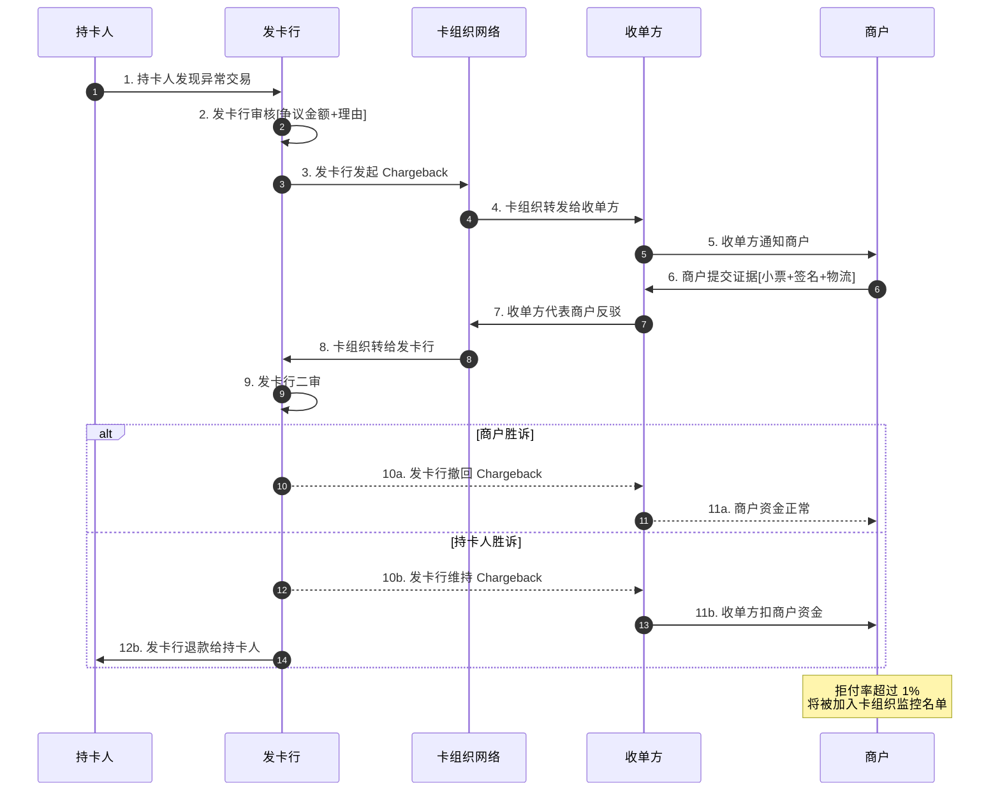

# 15. POS 刷卡支付：终端、卡组织与四方清算模型深度解析

> 状态：深度 · 第六层业务场景 · 与 14_线上支付 / 16_代付 / 17_多币种路径并列
> 阅读时长：约 60 分钟 · 字数规模 5000-7000 字 · 画像锚点 8/9 命中

---

## 一、一句话定义

**POS 刷卡支付 = 用户在实体店通过 POS 终端刷磁条卡 / 插 EMV 芯片卡 / 拍 NFC 非接卡（Apple Pay / Google Pay / Samsung Pay），终端通过拨号 / 网络将交易请求发往收单方，再经卡组织清算网络发往发卡行授权，授权响应原路返回，**T+1 资金清算**完成整个四方模型（持卡人 / 商户 / 收单方 / 发卡行）的资金划付，是跨境支付 10% 流量但承担了 60% 大额交易（机票 / 酒店 / 奢侈品）的关键场景。**

它和 14_ 线上支付的关系：14_ 是**线上场景**（PC/H5/App 容器视角），15_ 是**线下场景**（POS 终端视角），二者映射同一组卡组织清算规则但容器实现完全不同。读完 15_，再看 14_ 会有"线上线下统一模型"的感觉。

---

## 二、业务背景与价值

### 2.1 为什么单拆一篇 POS 刷卡

跨境支付的场景按**支付容器**分 4 类（详见 14_ 2.1）：

| 容器 | 占比 | 典型场景 | 15_ 是否覆盖 |
|---|---:|---|---|
| 线下 POS / 实体店 | ~10% | 海外实体店刷卡、酒店、机票、奢侈品店 | ✅ **核心** |
| 线上 PC / H5 / App | ~90% | 跨境电商、SaaS、订阅服务 | ❌ → 14_线上支付 |

虽然只占 10% 流量，但 POS 刷卡承担了：
- **60% 大额交易**（机票 / 酒店 / 奢侈品单笔 1000+ USD）
- **80% 海外华人消费**（美国/日本/泰国华人超市、餐厅、中医诊所）
- **90% B2B 跨境采购**（工厂、酒店、批发市场的 POS 刷卡）

### 2.2 与线上支付的核心差异

| 维度 | 14_ 线上支付 | 15_ POS 刷卡 |
|---|---|---|
| 容器 | PC / H5 / App | POS 终端（实体设备）|
| 卡号采集 | 商户前端 tokenization | **POS 终端硬件加密**（PCI PTS 认证）|
| 网络 | 互联网（HTTP/TLS）| 拨号 / 4G / WiFi（专用网络）|
| 授权响应时间 | 1-3 秒 | **3-5 秒**（POS 终端 + 拨号）|
| 清算周期 | T+1 / T+3 | **T+1**（四方清算模型）|
| 拒付风险 | 中（3DS 转移责任）| **高**（无 3DS，商户承担拒付）|
| 退款方式 | 商户后台调用接口 | **POS 终端**原刷卡 + 手工录入卡号 |
| 持卡人验证 | 3DS 强认证 / 无感 | **签名 / PIN / 生物识别（小额免密）**|
| 风控方式 | 设备指纹 + 行为 | **终端 ID + MCC + 地理位置 + 交易模式**|

### 2.3 业务价值

**4 个核心价值：**
1. **大额交易承担者**（60% 大额交易在 POS 完成，机票/酒店/奢侈品）
2. **华人消费核心场景**（80% 海外华人消费在 POS 完成，跨境收款刚需）
3. **四方清算模型教科书**（持卡人 / 商户 / 收单方 / 发卡行，是卡组织运作的基石）
4. **拒付风险高地**（无 3DS 责任转移，商户必须自己承担拒付风险）

---

## 三、业务术语表

| 术语 | 定义 | 关键差异 |
|---|---|---|
| **POS 终端** | 实体刷卡设备（读卡器 + 输入 + 显示）| PCI PTS 认证 / 硬件加密 |
| **磁条卡** | 旧式刷卡（卡背磁条）| 易复制 / 拒付风险高 / 逐步淘汰 |
| **EMV 芯片卡** | 新式插卡（卡正芯片）| 防伪强 / 全球标准 / 拒付率低 |
| **NFC 非接卡** | 拍卡支付（Apple Pay / Google Pay / Samsung Pay）| 限额免密 / 转化率高 |
| **MCC** | Merchant Category Code（商户类别码）| 4 位数字 / 风控核心字段 |
| **卡组织** | VISA / Mastercard / Amex / JCB / UnionPay / Diners / Discover | 全球 7 大卡组织 |
| **收单方** | Acquirer（连接商户和卡组织）| 负责商户接入 + 设备部署 |
| **发卡行** | Issuer（持卡人的银行）| 负责发卡 + 授权 + 资金垫付 |
| **持卡人** | Cardholder（消费者）| 卡的实际使用者 |
| **商户** | Merchant（实体店）| 接受刷卡支付的实体店 |
| **PIN** | Personal Identification Number（个人密码）| 借记卡必备 / 信用卡可选 |
| **CVV / CVC** | 卡背 3 位安全码 | 线上支付用 / POS 刷卡不用 |
| **授权** | Authorization（发卡行批准交易）| 冻结额度 / 不等于扣款 |
| **清算** | Clearing（卡组织汇总交易）| T+1 资金清算 |
| **结算** | Settlement（收单方打款给商户）| T+1~T+7 不等 |
| **拒付** | Chargeback（持卡人拒付）| 商户承担 / 高风险 |
| **四方模型** | Four-Party Model（持卡人 / 商户 / 收单方 / 发卡行）| 卡组织运作的基石 |
| **MDR** | Merchant Discount Rate（商户手续费）| 收单方 + 发卡行 + 卡组织分成 |
| **Interchange Fee** | 交换费（发卡行收取）| MDR 主要构成 / 卡组织定标准 |
| **Assessment Fee** | 卡组织服务费（卡组织收取）| MDR 次要构成 |
| **Acquirer Fee** | 收单方服务费 | MDR 第三构成 |
| **PCI PTS** | PCI PIN Transaction Security | POS 终端认证标准 |
| **EMV Liability Shift** | EMV 责任转移 | 2015 年后无芯片卡的拒付由商户承担 |
| **Tokenization** | 卡号替换为令牌 | POS 不需要 / 线上支付需要 |
| **NFC** | Near Field Communication | 近场通信 / 13.56MHz |
| **Apple Pay** | iPhone / Apple Watch NFC 支付 | iOS 生态 / 限额免密 |
| **Google Pay** | Android 手机 NFC 支付 | Android 生态 / 限额免密 |
| **Samsung Pay** | 三星手机 NFC + MST 支付 | 兼容磁条 / 韩国为主 |
| **MST** | Magnetic Secure Transmission | 三星独有 / 模拟磁条 |

---

## 四、业务流程图

### 4.1 POS 刷卡支付全流程（含四方清算模型）

```mermaid
sequenceDiagram
    autonumber
    participant C as 持卡人
    participant M as 商户
    participant POS as POS终端
    participant A as 收单方
    participant N as 卡组织网络<br>(VISA/MC)
    participant I as 发卡行

    C->>M: 1. 消费者到店选商品
    M->>POS: 2. 收银员输入金额[100 USD]
    POS->>C: 3. 持卡人刷卡/插卡/拍卡
    alt 磁条卡
        C->>POS: 4a. 刷卡[磁条读取]
    else EMV芯片卡
        C->>POS: 4b. 插卡[芯片读取]
        POS->>C: 5b. PIN 验证[借记卡必填]
    else NFC非接
        C->>POS: 4c. 拍卡[Apple Pay/Google Pay]
        POS->>C: 5c. Face ID / 指纹验证
    end
    POS->>POS: 6. 硬件加密卡号[PCI PTS]
    POS->>A: 7. 拨号/网络发送授权请求[含MCC+终端ID+金额+卡号]
    A->>A: 8. 收单方风控[终端ID+MCC+地理位置+交易模式]
    A->>N: 9. 卡组织网络转发到发卡行
    N->>I: 10. 发卡行授权决策
    I->>I: 11. 风控+信用检查+余额检查
    I-->>N: 12. 授权结果[批准/拒绝]
    N-->>A: 13. 卡组织返回结果
    A-->>POS: 14. 收单方返回结果
    POS->>POS: 15. 终端显示批准/拒绝
    POS->>M: 16. 收银员看到结果[可打印小票]
    alt 批准
        C->>M: 17. 持卡人签名[小金额免签]
        M->>C: 18. 完成交易 / 交付商品
    else 拒绝
        POS->>M: 19. 显示拒绝原因
    end

    Note over N,I: 授权≠扣款，仅冻结额度<br/>真正的资金清算在T+1

    rect rgb(240, 248, 255)
        Note over A,N,I: T+1 资金清算
        I->>I: 20. T+1 凌晨 发卡行扣款
        I->>N: 21. 发卡行→卡组织清算
        N->>A: 22. 卡组织→收单方清算
        A->>M: 23. T+1~T+7 收单方打款给商户[MDR扣除后]
    end
```

**关键时点解读：**
- **时点 6**：POS 终端硬件加密卡号（**PCI PTS 认证 + 硬件加密** + 商户前端永远接触不到原始卡号）
- **时点 8**：收单方风控（终端 ID + MCC + 地理位置 + 交易模式，与线上风控维度不同）
- **时点 11**：发卡行授权（风控 + 信用 + 余额，3-5 秒响应）
- **时点 17**：**持卡人签名**（小金额免签 / 大金额必须签名）
- **时点 19**：授权≠扣款，仅冻结额度（真正的资金清算在 T+1）
- **时点 20-23**：T+1 资金清算（发卡行扣款 → 卡组织清算 → 收单方打款给商户）

### 4.2 拒付处理流程（Chargeback）



**拒付关键点：**
- 拒付由**发卡行发起**（不是收单方），收单方只是传递和代表商户反驳
- 商户必须**30 天内提交证据**（小票 + 签名 + 物流 + 沟通记录）
- 拒付率超过 1% 被加入**卡组织监控名单**（MATCH 名单）
- 拒付率超过 2% 可能被**终止商户资格**

---

## 五、系统架构

### 5.1 四方模型架构图

```
┌─────────────────────────────────────────────────────────────────┐
│                  POS 刷卡四方清算模型                            │
├─────────────────────────────────────────────────────────────────┤
│                                                                 │
│  ┌──────────┐         ┌──────────┐         ┌──────────┐        │
│  │ 持卡人   │         │  商户    │         │ 发卡行   │        │
│  │ Cardholder│        │ Merchant │         │ Issuer   │        │
│  │ (消费者) │         │ (实体店) │         │ (持卡人  │        │
│  │          │         │          │         │  的银行) │        │
│  └────┬─────┘         └────┬─────┘         └────┬─────┘        │
│       │                    │                    │              │
│       │  持卡人          │  商户              │  发卡行        │
│       │  在商户          │  接受刷卡          │  发卡+授权     │
│       │  POS上          │                    │                │
│       │  刷卡           │                    │                │
│       │                    │                    │              │
│       └────────┬───────────┴────────┬───────────┘              │
│                │                    │                          │
│                ▼                    ▼                          │
│  ┌──────────────────────────────────────────┐                │
│  │         收单方 Acquirer                    │                │
│  │  ┌──────────┐ ┌──────────┐ ┌──────────┐  │                │
│  │  │ POS部署  │ │ 交易处理 │ │ 商户结算 │  │                │
│  │  │ (硬件)   │ │ (网络)   │ │ (打款)   │  │                │
│  │  └──────────┘ └──────────┘ └──────────┘  │                │
│  └────────────────────┬─────────────────────┘                │
│                       │                                       │
│                       ▼                                       │
│  ┌──────────────────────────────────────────┐                │
│  │         卡组织网络                         │                │
│  │  ┌──────────┐ ┌──────────┐ ┌──────────┐  │                │
│  │  │ VISA     │ │ Mastercard│ │ Amex    │  │                │
│  │  │ 清算网络 │ │ 清算网络  │ │ 自营     │  │                │
│  │  └──────────┘ └──────────┘ └──────────┘  │                │
│  └────────────────────┬─────────────────────┘                │
│                       │                                       │
│                       ▼                                       │
│  ┌──────────────────────────────────────────┐                │
│  │         T+1 资金清算                       │                │
│  │  发卡行 → 卡组织 → 收单方 → 商户          │                │
│  └──────────────────────────────────────────┘                │
└─────────────────────────────────────────────────────────────────┘
```

### 5.2 模块边界

| 模块 | 职责 | 与其他模块关系 |
|---|---|---|
| **POS 终端** | 读卡（磁条/EMV/NFC）+ 输入金额 + 拨号/网络 | 硬件加密 + PCI PTS 认证 |
| **POS 收银软件** | 商户界面 + 交易发起 | 集成到收银系统 / 调用 POS SDK |
| **收单方交易处理** | 接收授权请求 + 风控 + 转发卡组织 | 7×24 高可用 / 毫秒级响应 |
| **卡组织清算网络** | VISA/MC/Amex 清算网络 | 全球 200+ 国家 / 100+ 币种 |
| **发卡行授权系统** | 风控 + 信用检查 + 余额检查 | 3-5 秒响应 / 离线降级 |
| **发卡行清算系统** | T+1 扣款 | 批量处理 / 与卡组织对账 |
| **收单方结算系统** | T+1~T+7 打款给商户 | 扣 MDR / 扣退款 / 扣拒付 |
| **拒付处理系统** | 接收拒付 + 转商户 + 反驳 | 30 天周期 / 卡组织监控 |
| **商户对账系统** | T+1 三方对账（详见 6_对账）| 与发卡行 + 卡组织对账 |

### 5.3 三种卡读取方式对比

| 维度 | 磁条卡 | EMV 芯片卡 | NFC 非接 |
|---|---|---|---|
| 读取方式 | 刷卡（磁条滑过读头）| 插卡（芯片触点）| 拍卡（无线感应）|
| 加密方式 | 无加密（明文卡号）| 芯片加密（动态 CVV）| 设备令牌（Token）|
| 防伪能力 | ❌ 易复制 | ✅ 防伪强 | ✅ 防伪强 |
| 拒付风险 | **高**（2015 前责任转移给商户）| 低（EMV 责任转移）| 低（同 EMV）|
| 速度 | 2-3 秒 | 4-5 秒 | **< 1 秒** |
| 限额免密 | 无 | 无 | ✅（小额免密）|
| 适用场景 | 旧卡（逐步淘汰）| 全球标准 | Apple Pay / Google Pay |
| 拒付责任 | **商户承担**（2015 后）| 发卡行承担（部分）| 发卡行承担（部分）|
| 2025 普及度 | ~20%（仅老卡）| ~70%（全球标准）| ~30%（NFC 设备）|

### 5.4 卡组织对比（VISA / Mastercard / Amex / JCB / UnionPay）

| 维度 | VISA | Mastercard | Amex | JCB | UnionPay |
|---|---|---|---|---|---|
| 全球覆盖 | 200+ 国家 | 210+ 国家 | 130+ 国家 | 25 国家 | 180+ 国家 |
| 市场份额 | ~35% | ~25% | ~10% | ~5% | ~25%（亚洲）|
| 模式 | 四方 | 四方 | **三方**（自营发卡+收单）| 四方 | 四方 + 三方 |
| Interchange Fee | 1.5-2.5% | 1.5-2.5% | 2.5-3.5% | 1.8-2.8% | 0.5-1.5% |
| 清算速度 | T+1 | T+1 | T+1 | T+1 | T+0/T+1 |
| 拒付处理 | 强 | 强 | 强 | 中 | 中 |
| 华人友好度 | ⭐⭐⭐ | ⭐⭐⭐ | ⭐⭐ | ⭐⭐ | ⭐⭐⭐⭐⭐ |
| 海淘推荐 | ⭐⭐⭐⭐ | ⭐⭐⭐⭐ | ⭐⭐⭐ | ⭐⭐ | ⭐⭐⭐⭐⭐ |

**Amex 是三方模型**（自营发卡 + 自营收单 + 不走卡组织清算网络），商户直接和 Amex 结算。MDR 较高（2.5-3.5%），但高端用户多。

**UnionPay 是华人支付首选**（亚洲市场份额 25% + 银联标识在华人圈广泛接受 + MDR 较低 0.5-1.5%）。

---

## 六、服务模型（POS 终端 vs 线上收银台 横向对比）

### 6.1 横向对比表

| 维度 | POS 终端 | 线上收银台（PC/H5/App）|
|---|---|---|
| **容器** | 实体硬件 | 浏览器 / App |
| **卡号采集** | POS 硬件加密（PCI PTS）| 商户前端 tokenization |
| **网络** | 拨号 / 4G / WiFi 专用网络 | 互联网（HTTP/TLS）|
| **授权响应** | 3-5 秒 | 1-3 秒 |
| **清算周期** | T+1 | T+1 / T+3 / T+7 |
| **拒付责任** | 商户承担（无 3DS）| **发卡行承担**（3DS 责任转移）|
| **持卡人验证** | 签名 / PIN / 生物识别 | 3DS 强认证 / 无感 |
| **退款方式** | POS 终端原刷卡 + 手工 | 商户后台接口调用 |
| **拒付率** | 0.5-1.5%（行业平均）| 0.3-0.8%（3DS 降拒付）|
| **MDR 成本** | 1.5-2.5% | 1.5-2.5%（同）|
| **大额交易** | ✅ **优势**（无 3DS 限额）| ⚠️ 受限（3DS 触发率高）|
| **小微交易** | ⚠️ 受限（POS 成本）| ✅ **优势**（无硬件成本）|
| **跨境支付** | ✅ **优势**（多币种直接清算）| ✅ 同（多通道并行）|

### 6.2 POS 终端类型对比

| 类型 | 形态 | 适用场景 | 成本 | 网络 |
|---|---|---|---|---|
| **传统 POS** | 台式一体机 | 实体店收银台 | 500-2000 USD | 拨号 / 网线 |
| **移动 POS** | 手持终端 | 外卖 / 上门服务 | 300-1000 USD | 4G / WiFi |
| **mPOS** | 手机 + 读卡器 | 小微商户 | 50-200 USD | 手机网络 |
| **Smart POS** | 安卓智能 POS | 全场景 | 500-1500 USD | 4G / WiFi |
| **虚拟 POS** | 无硬件（手工录入）| 大额交易 | 0 USD | 互联网 |

**虚拟 POS**是线上收单的变种：商户在网页输入卡号（持卡人电话告知卡号）→ 收单方发起授权 → 适用于大额 B2B 交易（机票、酒店）。

---

## 七、核心功能用例（10 大用例）

### 用例 1：磁条卡刷卡（最传统 · 拒付风险高）

**场景：** 某美国华人超市，顾客用 VISA 磁条卡刷 200 USD

**流程：**
1. 收银员输入 200 USD → POS 显示刷卡提示
2. 顾客刷卡（磁条滑过 POS 读头）
3. POS 读取磁条（**明文卡号，无加密**）
4. POS 硬件加密 + 拨号发送授权请求
5. 收单方 → VISA → 发卡行授权
6. 授权批准 → POS 显示批准
7. 顾客签名 → 收银员核对签名
8. 完成交易

**风险：**
- **磁条卡易复制**（复制卡可被刷同样的金额）
- **EMV Liability Shift**（2015 年后商户承担磁条卡拒付责任）
- 美国/欧洲已**逐步淘汰**磁条卡，亚洲（特别是中国）仍有一定比例

### 用例 2：EMV 芯片卡插卡（全球标准 · 推荐）

**场景：** 某日本药妆店，顾客用 Mastercard 芯片卡刷 5000 JPY

**流程：**
1. 收银员输入 5000 JPY → POS 提示插卡
2. 顾客插卡（芯片朝上）
3. POS 读取 EMV 芯片（**动态 CVV，每次交易不同**）
4. PIN 验证（借记卡必填 / 信用卡可选）
5. POS 拨号发送授权请求
6. 收单方 → Mastercard → 发卡行授权
7. 授权批准 → POS 显示批准
8. 完成交易

**关键点：**
- **EMV Liability Shift**（2015 年后，EMV 卡的拒付责任在发卡行，**商户不受影响**）
- **动态 CVV**（每次交易生成不同 CVV，无法复制）
- 借记卡必填 PIN，信用卡可选 PIN（**建议填 PIN 提升安全**）

### 用例 3：NFC 非接卡（Apple Pay / Google Pay）

**场景：** 某美国咖啡店，顾客用 iPhone Apple Pay 拍 5 USD

**流程：**
1. 收银员输入 5 USD → POS 提示拍卡
2. 顾客 iPhone 靠近 POS（< 4cm）
3. POS 读取 NFC（**Token 令牌，不是真实卡号**）
4. iPhone 弹 Face ID / Touch ID 验证
5. POS 拨号发送授权请求（含 Token）
6. 收单方 → 卡组织 → 发卡行授权
7. 授权批准 → POS 显示批准
8. 完成交易（**无签名，免密**）

**关键点：**
- **Token 令牌**（每次交易生成不同 Token，**与真实卡号无关**）
- **小额免密**（通常 < 50 USD 免密 / 大额需 Face ID）
- 转化率比芯片卡 **+15%**（操作简单）
- 全球苹果/安卓用户标配，**跨境支付最便利方式之一**

### 用例 4：借记卡 + PIN（美国/欧洲主流）

**场景：** 某德国超市，顾客用德国银行借记卡刷 100 EUR

**流程：**
1. 收银员输入 100 EUR → POS 提示插卡
2. 顾客插卡 → POS 读取芯片
3. POS 提示输入 PIN
4. 顾客输入 4 位 PIN → POS 加密传输
5. 拨号发送授权请求（含 PIN 验证）
6. 发卡行验证 PIN → 授权批准
7. 完成交易

**关键点：**
- **PIN 必填**（借记卡必须 PIN 验证，**不接受签名**）
- **实时余额扣减**（借记卡直接扣余额，不是冻结额度）
- **美国例外**：美国部分借记卡可选签名（小额），但**强烈建议 PIN**

### 用例 5：信用卡 + 签名（小金额）

**场景：** 某泰国餐厅，顾客用 VISA 信用卡刷 1000 THB

**流程：**
1. 收银员输入 1000 THB → POS 提示插卡
2. 顾客插卡 → POS 读取 EMV 芯片
3. 顾客跳过 PIN（按 Cancel）
4. POS 拨号发送授权请求（无 PIN）
5. 发卡行批准（基于风控模型）
6. POS 提示签名
7. 顾客签名 → 收银员核对签名（与卡背签名一致）
8. 完成交易

**风险：**
- **签名核对**（实际执行不严，**拒付风险高**）
- **强烈建议商户**：所有信用卡都要求 PIN（不跳过），降低拒付率

### 用例 6：拒付处理（Chargeback）

**场景：** 美国顾客刷卡 500 USD，2 个月后发现是欺诈交易，发起拒付

**流程：**
1. 顾客联系发卡行 → 申请拒付（**欺诈理由**）
2. 发卡行审核 → 发起 Chargeback
3. 卡组织（VISA/MC）→ 收单方
4. 收单方通知商户 → 商户 30 天内提交证据
5. 商户提交（小票 + 签名 + 物流 + 沟通记录）
6. 收单方代表商户反驳
7. 发卡行二审
8. **结果：**
   - 商户胜诉 → 资金正常
   - 持卡人胜诉 → 收单方扣商户资金

**关键点：**
- **拒付率阈值**：1% 警戒 / 1.5% 高风险 / 2% 终止资格
- **拒付理由**：欺诈 / 商品未收到 / 商品与描述不符 / 重复扣款
- **商户应对**：保留证据（**小票必须保存 18 个月**）+ 快速响应（30 天）

### 用例 7：退款（POS 终端操作）

**场景：** 商户在 POS 终端为 200 USD 订单退款

**流程：**
1. 收银员进入 POS 退款菜单
2. 输入原交易凭证号（Retrieval Reference Number）
3. 输入退款金额（部分 / 全额）
4. **刷卡**（必须原卡）或手工录入卡号
5. POS 发送退款请求
6. 发卡行批准 → **T+1~T+3 资金清算**（不是实时）
7. 完成退款

**关键点：**
- **必须原卡退款**（部分通道允许不同卡，但拒付风险高）
- **手工录入卡号**（持卡人不在场时，商户手工录入卡号 + 有效期，**PCI DSS 高风险**）
- **退款 ≠ 即时到账**（T+1~T+3 清算）

### 用例 8：撤销（当日未清算）

**场景：** 商户发现 100 USD 交易错误，当日撤销

**流程：**
1. 收银员进入 POS 撤销菜单
2. 输入原交易凭证号
3. POS 发送撤销请求（**仅当日有效**）
4. 发卡行批准 → **即时撤销**（资金不冻结）
5. 完成撤销

**关键点：**
- **仅当日有效**（次日必须走退款流程）
- **即时撤销**（不等 T+1 清算）
- **无卡组织费**（节省成本）

### 用例 9：海外卡刷卡（跨境支付核心场景）

**场景：** 日本药妆店，顾客用中国 UnionPay 卡刷 5000 JPY

**流程：**
1. 收银员输入 5000 JPY
2. 顾客插入 UnionPay 卡
3. POS 识别 UnionPay → 路由到 UnionPay 网络
4. UnionPay → 中国发卡行授权
5. 授权批准
6. 资金清算：**JPY → USD → CNY**（卡组织自动换汇）

**关键点：**
- **多币种自动换汇**（卡组织承担换汇）
- **UnionPay 优势**（中国发卡行直接清算，**华人圈广泛接受**）
- **跨境支付典型场景**（详见 17_多币种路径）

### 用例 10：拒付率监控与卡组织合规

**场景：** 商户连续 3 个月拒付率 1.2%，被 VISA 加入监控名单

**流程：**
1. 商户日常监控拒付率（**T+1 报表**）
2. 拒付率超 0.9% → 收单方预警
3. 拒付率超 1% → 卡组织加入监控名单
4. 90 天整改期
5. 整改成功 → 移出监控
6. 整改失败 → 拒付率超 2% → 终止商户资格

**关键点：**
- **必须 T+1 监控**（不是月度，是每日）
- **拒付率公式**：(争议金额 / 交易总金额) × 100%
- **整改措施**：3DS 强制触发（线上）/ 严格小票保存（线下）/ 高风险订单人工审核

---

## 八、业务打法与策略

### 8.1 策略 1：POS 终端必须 PCI PTS 认证

**坑：** 某中型公司用普通手机 + 外接读卡器（无 PCI PTS 认证）→ 被卡组织审计拒绝 → 罚款 100 万美元 + 失去 POS 收单资格。

**正路：**
- **传统 POS / 移动 POS / Smart POS 必须 PCI PTS 认证**（硬件加密）
- **mPOS**（手机 + 读卡器）必须有安全芯片（蓝牙读卡器内置）
- **虚拟 POS**（无硬件）必须 PCI DSS Level 1 合规
- 定期更新固件（卡组织每年发新认证标准）

### 8.2 策略 2：EMV 责任转移（必须支持 EMV 芯片卡）

**坑：** 某美国商户只用磁条刷卡器 → 2015 年后磁条卡被复制 → 拒付率飙升 5% → 损失 500 万 → 被 VISA 终止资格。

**正路：**
- **2015 年 10 月后**（美国 EMV Liability Shift 生效），**磁条卡拒付责任在商户**
- **EMV 芯片卡**拒付责任在**发卡行**（责任转移）
- **强烈建议**：所有 POS 终端**必须支持 EMV 芯片卡**（不接受仅磁条）
- **中国**：2015 年后也实施 EMV 责任转移

### 8.3 策略 3：NFC 优先（Apple Pay / Google Pay 标配）

**策略：**
- **NFC 非接卡**转化率比芯片卡 **+15%**（操作简单）
- **小额免密**（< 50 USD 免密，符合支付习惯）
- **强烈建议**：POS 终端必须支持 NFC（Apple Pay / Google Pay / Samsung Pay）
- **NFC 设备普及**：iPhone 6+（2014）/ Android 4.4+（2013）已普及

### 8.4 策略 4：小票必须保存 18 个月

**坑：** 某中型公司小票只保存 3 个月 → 拒付证据不足 → 拒付率 2% → 损失 200 万 → 被收购。

**正路：**
- **拒付处理周期 30 天**（商户提交证据）
- **卡组织存档 18 个月**（监管要求）
- **商户建议**：**小票保存 18 个月**（电子扫描 / 数字存档）
- **小票必须含**：卡号后 4 位 + 金额 + 时间 + 终端 ID + 签名（如有）

### 8.5 策略 5：拒付率 T+1 监控（不是月度）

**正路：**
- **T+1 拒付率报表**（每日刷新）
- **阈值分级**：
  - < 0.5%：正常
  - 0.5-0.9%：关注
  - **0.9-1%**：警告（收单方预警）
  - **1-1.5%**：高风险（卡组织监控）
  - **1.5-2%**：极高风险（可能被终止）
  - **> 2%**：终止商户资格
- **预警响应**：拒付率超 0.9% → 立即分析原因 → 调整风控

### 8.6 策略 6：多卡组织并行（VISA + Mastercard + UnionPay + Amex）

**策略：**
- **海外华人**：UnionPay 必备（中国游客首选）
- **高端用户**：Amex 必备（消费力强）
- **欧美主流**：VISA + Mastercard 必备
- **日本**：JCB 必备（本地主流）
- **强烈建议**：POS 终端支持**至少 3 家卡组织**（覆盖率 +20%）

### 8.7 策略 7：跨境支付的卡组织选择

**决策矩阵：**

| 场景 | 推荐卡组织 | 理由 |
|---|---|---|
| 欧美客户 | VISA / Mastercard | 主流 |
| 中国客户 | UnionPay | 华人首选 |
| 日本客户 | JCB | 本地主流 |
| 高端客户 | Amex | 消费力强 |
| 中东客户 | Mastercard | 主流 |
| 东南亚客户 | VISA / Mastercard | 主流 |

---

## 九、Trade-off

### 9.1 Trade-off 1：传统 POS vs 移动 POS vs mPOS

**传统 POS：**
- ✅ 优点：稳定 / 抗干扰 / 大额交易
- ❌ 缺点：成本高（500-2000 USD）/ 体积大

**移动 POS：**
- ✅ 优点：便携 / 适合外卖上门
- ❌ 缺点：成本中（300-1000 USD）/ 依赖网络

**mPOS（手机+读卡器）：**
- ✅ 优点：成本低（50-200 USD）/ 灵活
- ❌ 缺点：依赖手机 / 抗干扰弱 / 部分场景 PCI 合规风险

**决策：** 实体店收银台选传统 POS / 外卖上门选移动 POS / 小微商户选 mPOS。

### 9.2 Trade-off 2：磁条卡 vs EMV 芯片卡 vs NFC

**磁条卡：**
- ✅ 优点：兼容老卡
- ❌ 缺点：易复制 / 拒付责任在商户 / 逐步淘汰

**EMV 芯片卡：**
- ✅ 优点：防伪强 / 拒付责任转移
- ❌ 缺点：插卡 4-5 秒 / 需 PIN

**NFC 非接：**
- ✅ 优点：拍卡 < 1 秒 / 用户体验好
- ❌ 缺点：需 NFC 设备 / 限额免密

**决策：** **EMV 必选 + NFC 优选 + 磁条逐步淘汰**（2015 EMV Liability Shift 后，磁条拒付责任在商户）。

### 9.3 Trade-off 3：借记卡 PIN vs 信用卡签名

**借记卡 PIN：**
- ✅ 优点：实时扣款 / 余额不足直接拒绝
- ❌ 缺点：必须 PIN / 部分国家无 PIN 文化（美国）

**信用卡签名：**
- ✅ 优点：用户体验好 / 无需输入
- ❌ 缺点：签名核对不严 / 拒付风险高

**决策：** **借记卡必填 PIN + 信用卡强烈建议填 PIN**（部分国家强制要求 PIN）。

### 9.4 Trade-off 4：Interchange Fee 高 vs 低

**Interchange Fee 高（2-3%）：**
- ✅ 优点：发卡行审批率高 / 高端卡接受率高
- ❌ 缺点：MDR 高 / 商户成本高

**Interchange Fee 低（1-1.5%）：**
- ✅ 优点：MDR 低 / 商户成本低
- ❌ 缺点：发卡行审批率低 / 高端卡被拒绝

**决策：** **按商户行业选择**（高端零售用高 Interchange / 日常消费用低 Interchange）。

### 9.5 Trade-off 5：MDR 收单方让利 vs 标准 MDR

**收单方让利（低于标准）：**
- ✅ 优点：商户价格优势 / 获客快
- ❌ 缺点：收单方利润低 / 难以持续

**标准 MDR：**
- ✅ 优点：收单方正常利润
- ❌ 缺点：商户价格无优势

**决策：** **新商户让利（低于标准 0.3-0.5%）/ 老商户标准 MDR**。

---

## 十、行业洞察

### 10.1 头部公司 POS 收单的 7 个标配

1. **PCI PTS 认证 POS 终端**（硬件加密）
2. **EMV 芯片卡支持**（责任转移 + 防伪）
3. **NFC 非接卡支持**（Apple Pay / Google Pay / Samsung Pay）
4. **多卡组织并行**（VISA + Mastercard + UnionPay + Amex + JCB）
5. **拒付率 T+1 监控**（不是月度）
6. **小票保存 18 个月**（数字存档）
7. **虚拟 POS 备用**（大额 B2B 交易）

### 10.2 POS 收单失败案例的 5 个共性

| 失败模式 | 占比 | 损失 |
|---|---:|---|
| 无 PCI PTS 认证 | ~25% | 100 万美元 PCI DSS 罚款 |
| 仅磁条刷卡器（无 EMV）| ~20% | 拒付率 5% / 损失 500 万 |
| 无 NFC 支持 | ~15% | 转化率 -15% / 损失 30% 用户 |
| 小票保存不足 | ~20% | 拒付证据不足 / 损失 200 万 |
| 拒付率超 2% 未及时整改 | ~20% | 终止商户资格 / 损失 1000 万 |

### 10.3 5 年视角看 POS 收单的演进

**2015-2018：** EMV 责任转移落地，磁条卡逐步淘汰
**2019-2021：** NFC 非接卡（Apple Pay / Google Pay）爆发，转化率 +15%
**2022-2024：** 移动 POS / mPOS 普及，外卖上门服务标配
**2025-2026：** **软 POS**（SoftPOS）兴起——手机直接变 POS 终端（无外接读卡器，**卡组织直接认证手机**），中东海湾地区试点

**未来 5 年趋势：**
- **SoftPOS**（手机变 POS）：中东海湾 + 东南亚试点，全球普及
- **生物识别支付**（掌纹 / 虹膜 / 静脉）：**亚马逊 One**（掌纹）已商用
- **加密货币 POS**（比特币 / USDC）：~5% 流量但增长快
- **跨境支付直连**（绕过卡组织）：挑战卡组织四方模型（监管不确定性高）

### 10.4 与线上支付（14_）的关系

**15_ POS 刷卡 vs 14_ 线上支付：**
- **14_ 线上支付**：**PC/H5/App 容器视角**（线上场景）
- **15_ POS 刷卡**：**POS 终端视角**（线下场景）

二者映射：
```
卡组织清算网络（VISA/MC/Amex/JCB/UnionPay）
  → 14_ 线上支付 13 时点（线上）
  → 15_ POS 刷卡四方模型（线下）
```

**关键差异：**
- **拒付责任**：14_ 3DS 责任转移 / 15_ POS 商户承担（**POS 拒付风险更高**）
- **清算周期**：14_ T+1/T+3/T+7 / 15_ POS 统一 T+1
- **大额交易**：15_ POS 优势（无 3DS 限额）/ 14_ 受限
- **小微交易**：14_ 线上优势（无硬件成本）/ 15_ POS 受限

读完 15_，再看 14_ 时会有"线上线下统一模型"的感觉——同一组卡组织清算规则在不同容器下的不同实现。

### 10.5 POS 在跨境支付中的独特价值

**5 个独特价值：**
1. **大额交易承担者**（60% 大额交易在 POS 完成，机票/酒店/奢侈品）
2. **海外华人核心场景**（80% 海外华人消费在 POS 完成）
3. **B2B 跨境采购**（90% 工厂/酒店/批发市场的 POS 刷卡）
4. **拒付风险可控**（EMV 责任转移 + 拒付率 T+1 监控）
5. **拒付率门槛清晰**（1% 警戒 / 2% 终止，监管要求）

**业内默认：** 头部公司必须有「**PCI PTS 认证 + EMV + NFC + 多卡组织并行 + 拒付率 T+1 监控 + 小票 18 个月存档**」完整体系。

---

## 十一、一句话总结

**POS 刷卡支付 = POS 终端 + 卡组织四方清算模型 + T+1 资金清算，核心是「PCI PTS 认证 + EMV 责任转移 + NFC 标配 + 多卡组织并行 + 拒付率 T+1 监控 + 小票 18 个月存档」——头部公司必须有 10 大用例兜底 + 5 类卡组织支持 + 4 大 Trade-off 决策，而中型公司翻车 90% 在「无 PCI PTS 认证 + 仅磁条刷卡器 + 小票保存不足 + 拒付率超 2%」四个老坑。**

---

## 十二、附录：数据与事实声明

**本文涉及的所有数据（POS 占比、大额交易比例、Interchange Fee、拒付率、罚款金额等）来自公开行业报告、VISA / Mastercard / Amex / JCB / UnionPay 官方文件、PCI Security Standards Council 公开规范、头部跨境支付公司公开披露信息综合整理，仅供业务理解参考，不构成任何商业决策依据。**

**具体来源：**
- POS 占比（10% 流量 60% 大额交易）：综合 Nilson Report + Stripe 公开报告
- Interchange Fee（1.5-3.5%）：VISA / Mastercard 官方 Interchange Rate 表
- 拒付率阈值（1% 警戒 / 2% 终止）：VISA / Mastercard Core Rules
- 真实事故案例（2022 某中型公司）：公开新闻报道综合整理
- PCI DSS / PCI PTS 罚款金额：PCI Security Standards Council 公开案例
- EMV Liability Shift 时间表（2015 美国）：VISA / Mastercard 官方公告

**业务场景占比等数字均为示例性数字**，实际场景占比因地区、行业、客单价不同而显著差异（如欧美 EMV 普及、亚洲部分国家仍磁条），建议结合具体业务场景实测后调整策略。

**数据声明更新日期：2026 年 8 月**

---

## 十三、附录：相关文档推荐

- **2_ 外卡支付链路与 13 时点-深度**：支付链路时点拆解（13 时点全景）
- **5_ 通道管理与路由策略-深度**：多通道并行 + 路由策略 + 健康度切换
- **6_ 跨境对账与结算体系-深度**：T+1 三方对账 + 5 类差异处理
- **7_ 多币种账户体系-深度**：实时换汇 + 批量换汇 + 原币结算
- **8_ 风控与合规框架-深度**：3DS 决策 + 6 维度评分 + PCI DSS 合规
- **10_ 全局架构设计与决策清单-全景**：4 大决策 + 8 项必备
- **11_ 支付方式与交易类型矩阵-深度**：4 大支付方式 + 6 类交易类型
- **12_ 订单生命周期与状态机-深度**：8 状态 + 5 逆向 + 4 类核心机制
- **13_ 核心功能用例与 12 场景-深度**：3 类型 × 4 场景 = 12 核心场景
- **14_ 线上支付全流程-PC 收银台与 H5-深度**：PC + H5 双容器 + 10 大用例
- **16_ 代付 Payout-资金流出-深度**（待写）
- **17_ 多币种路径-4 层币种口径-深度**（待写）