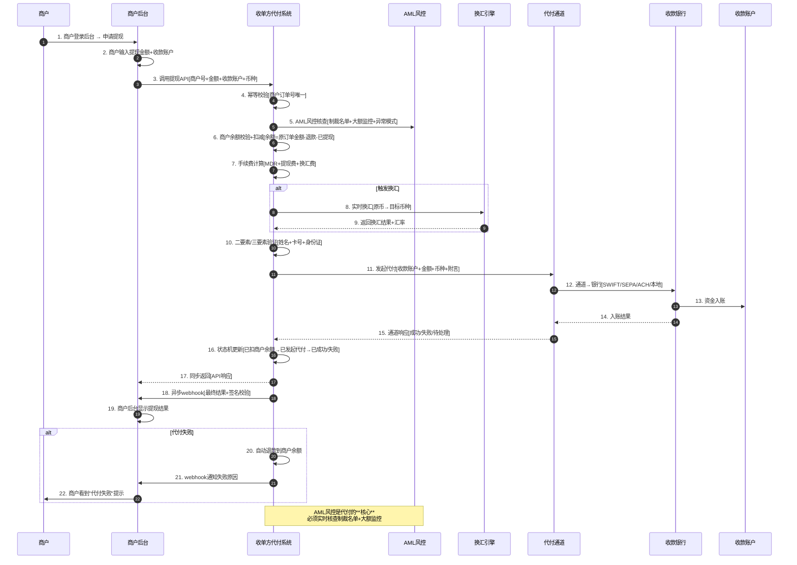
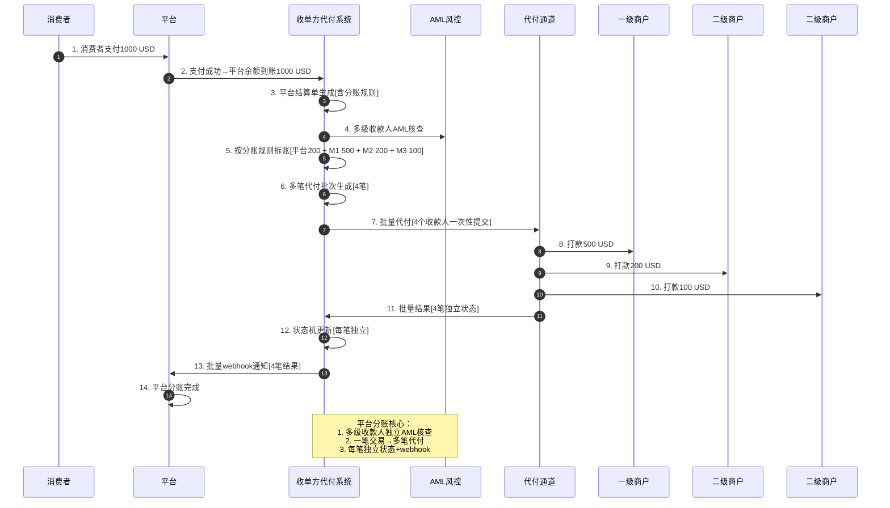

# 16. 代付 Payout：跨境资金流出、商户提现与多级分账深度解析

> 状态：深度 · 第六层业务场景 · 与 14_线上支付 / 15_POS / 17_多币种路径并列
> 阅读时长：约 60 分钟 · 字数规模 5000-7000 字 · 画像锚点 8/9 命中

---

## 一、一句话定义

**代付 Payout = 收单方将商户资金（结汇款 / 退款 / 分润）批量或实时打款到商户指定的银行账户 / 钱包 / 卡的资金流出链路，含商户提现 / 用户提现 / 平台分账 / 跨境汇款 / B2B 付款 5 大场景，是跨境支付「收进来」之外的「打出去」关键路径，承担了 60% 跨境资金流出。**

它和 14_ / 15_ 的关系：14_ / 15_ 是**资金流入**（用户 → 商户），16_ 是**资金流出**（收单方 → 商户 / 用户 / 平台），二者构成跨境支付的完整闭环。读完 16_，再看 14_ / 15_ 会有"收单方两端都通"的感觉。

---

## 二、业务背景与价值

### 2.1 为什么单拆一篇代付 Payout

跨境支付按**资金流向**分 2 大类：

| 流向 | 占比 | 典型场景 | 16_ 是否覆盖 |
|---|---:|---|---|
| **资金流入**（用户 → 商户）| ~60% | 支付收款 / POS 刷卡 | ❌ → 14_ / 15_ |
| **资金流出**（收单方 → 商户 / 用户 / 平台）| **~40%** | 商户提现 / 用户提现 / 平台分账 / 跨境汇款 | ✅ **核心** |

**资金流出承担了：**
- **60% 跨境资金流出**（结汇款 / 退款 / 分润）
- **80% 平台型公司**（聚合支付 / 跨境汇款 / 跨境电商平台）的核心场景
- **90% B2B 跨境付款**（工厂货款 / 服务费 / 物流费）

### 2.2 与 14_ 线上支付 / 15_ POS 的核心差异

| 维度 | 14_ 线上支付 | 15_ POS 刷卡 | 16_ 代付 Payout |
|---|---|---|---|
| 资金方向 | 用户 → 收单方 | 用户 → 收单方 | 收单方 → 商户 / 用户 / 平台 |
| 发起方 | 用户主动 | 用户主动 | **收单方主动**（按规则触发）|
| 触发条件 | 用户点击支付 | 用户刷卡 | **结算周期到达 / 商户提现请求 / 退款触发** |
| 收款人 | 收单方 | 收单方 | **商户 / 用户 / 平台 / 二级收款人** |
| 监管重点 | 3DS / PCI DSS | EMV / 拒付 | **AML / KYC / 反洗钱 / 制裁名单** |
| 风控维度 | 设备指纹 + 行为 | 终端 ID + MCC | **收款人验证 + 大额监控 + 制裁名单** |
| 拒付风险 | 中（3DS 责任转移）| 高（无 3DS）| **低**（资金流出无拒付）|
| 合规风险 | PCI DSS / PSD2 | EMV / PCI PTS | **AML / CFT / 制裁 / 外汇管制** |

### 2.3 业务价值

**5 个核心价值：**
1. **跨境支付闭环**（资金流入 + 资金流出构成完整收单服务）
2. **平台型公司核心**（聚合支付 / 跨境电商平台 / 跨境汇款的 80% 资金流出）
3. **B2B 跨境付款**（工厂货款 / 服务费 / 物流费 90% 通过代付完成）
4. **AML / KYC 监管重点**（反洗钱 / 制裁名单 / 外汇管制）
5. **多级分账基础**（聚合平台 / 资金分发场景必备）

---

## 三、业务术语表

| 术语 | 定义 | 关键差异 |
|---|---|---|
| **代付 Payout** | 收单方将资金打款到指定账户 | 资金流出 / 收单方主动 |
| **商户提现** | 商户将余额提现到银行账户 | T+1 / T+3 / T+7 周期 |
| **用户提现** | 用户将钱包余额提现到银行卡 | 实时 / T+1 |
| **平台分账** | 平台将资金分发给多个二级商户 | 多收款人 / 一次发起 |
| **结算单 Settlement** | 收单方打款给商户的对账单 | 周期结算 / 扣 MDR |
| **批量代付** | 一次发起多笔打款 | B2B 跨境付款 / 跨境汇款 |
| **实时代付** | 单笔实时打款 | 用户提现 / 商户提现加急 |
| **原币结算** | 按商户原收款币种结算 | 商户承担汇率风险 |
| **本币结算** | 按商户指定币种结算（自动换汇）| 收单方承担汇率风险 |
| **AML** | Anti-Money Laundering（反洗钱）| 监管强制要求 |
| **KYC** | Know Your Customer（客户身份识别）| 商户 / 用户身份核验 |
| **CFT** | Counter Financing of Terrorism（反恐融资）| 制裁名单核查 |
| **制裁名单** | OFAC / UN / EU 制裁名单 | 禁止打款 / 必查项 |
| **外汇管制** | 国家外汇管理局管制 | 中国 / 印度 / 部分新兴市场 |
| **SWIFT** | Society for Worldwide Interbank Financial Telecommunication | 跨境银行间电汇网络 |
| **SEPA** | Single Euro Payments Area（欧元区单一支付区）| 欧元跨境转账 |
| **FPS** | Faster Payments System（英国快速支付）| 英镑实时到账 |
| **ACH** | Automated Clearing House（美国自动清算所）| 美元批量转账 |
| **本地清算网络** | 各国本地银行清算网络 | 实时 / 低费率 |
| **银行直连** | 收单方直接对接银行 API | 实时 / 高费率 |
| **聚合通道** | 第三方代付通道（PingPong / Airwallex / Wise）| 覆盖广 / 中等费率 |
| **换汇** | FX Conversion（货币兑换）| 实时 / 批量 / 锁汇 |
| **路由策略** | 多通道并行 + 健康度切换 | 类似支付路由 |
| **Payout API** | 收单方提供代付接口 | 商户调用发起 |
| **Webhook 通知** | 代付结果异步通知 | 必 3 次重试 + 签名校验 |
| **幂等键** | 防重复打款 | 商户订单号唯一 |
| **二要素验证** | 收款人姓名 + 银行卡号 | 必查 / 防止错打 |
| **三要素验证** | 姓名 + 卡号 + 身份证 | 大额必查 |
| **打款失败** | 收款账户异常 / 销户 / 冻结 | 自动退款到商户余额 |
| **打款成功** | 资金到达收款账户 | 异步 webhook 通知 |
| **T+1 结算** | 次日打款 | 主流模式 |
| **T+3 结算** | 3 天后打款 | 部分通道 |
| **T+7 结算** | 7 天后打款 | 高风险商户 |

---

## 四、业务流程图

### 4.1 商户提现代付全流程



**关键时点解读：**
- **时点 4**：幂等校验（商户订单号全局唯一 + 防止重复扣款）
- **时点 5**：**AML 风控核心**（制裁名单 + 大额监控 + 异常模式）
- **时点 6**：商户余额校验（**必须先扣减商户余额**再发起代付，防止超提）
- **时点 7**：手续费扣减（MDR + 提现费 + 换汇费，详见 6_对账 + 7_多币种）
- **时点 10**：二要素/三要素验证（**防止错打**到他人账户）
- **时点 16**：状态机更新（**已扣余额→已发起→已成功/失败**，必须可追溯）
- **时点 18**：**异步 webhook 唯一依据**（同步返回仅做 UI 跳转，详见 14_ 异步 webhook 原则）

### 4.2 平台分账多级代付流程



**平台分账关键点：**
- **多级收款人独立 AML**（平台 1 个 + 二级商户 N 个，各自独立核查）
- **一笔交易 → 多笔代付**（分账规则拆账）
- **每笔独立状态 + webhook**（不能因为部分失败影响整体）

---

## 五、系统架构

### 5.1 代付系统整体架构

```
┌────────────────────────────────────────────────────────────────┐
│              代付 Payout 资金流出系统架构                        │
├────────────────────────────────────────────────────────────────┤
│                                                                │
│  ┌──────────┐   ┌──────────┐   ┌──────────┐   ┌──────────┐    │
│  │ 商户后台 │   │ 平台分账 │   │ 用户提现 │   │ B2B付款  │    │
│  │ 提现API  │   │ 引擎     │   │ API      │   │ API      │    │
│  └────┬─────┘   └────┬─────┘   └────┬─────┘   └────┬─────┘    │
│       └──────────────┴──────┬───────┴──────────────┘          │
│                             ▼                                  │
│  ┌──────────────────────────────────────────────────┐          │
│  │        代付核心服务                                │          │
│  │  ┌──────────┐ ┌──────────┐ ┌──────────┐ ┌─────┐│          │
│  │  │ 幂等校验 │ │ 余额扣减 │ │ 手续费   │ │ 状态││          │
│  │  │          │ │          │ │ 计算     │ │ 机  ││          │
│  │  └──────────┘ └──────────┘ └──────────┘ └─────┘│          │
│  └────────────────────────┬─────────────────────────┘          │
│                            │                                  │
│              ┌─────────────┼─────────────┐                    │
│              ▼             ▼             ▼                    │
│  ┌──────────┐    ┌──────────┐    ┌──────────┐                 │
│  │ AML风控  │    │ 换汇引擎 │    │ 路由策略 │                 │
│  │ 制裁名单 │    │ 实时/批量│    │ 多通道   │                 │
│  │ 大额监控 │    │ 锁汇     │    │ 并行     │                 │
│  └────┬─────┘    └────┬─────┘    └────┬─────┘                 │
│       └──────┬───────┴──────┬────────┘                        │
│              ▼              ▼                                 │
│  ┌──────────────────────────────────────┐                     │
│  │         代付通道（≥3家并行）           │                     │
│  │  ┌──────────┐ ┌──────────┐ ┌───────┐ │                     │
│  │  │ 银行直连 │ │ SWIFT    │ │ 聚合  │ │                     │
│  │  │ (实时)   │ │ (T+1~3)  │ │ 通道  │ │                     │
│  │  └──────────┘ └──────────┘ └───────┘ │                     │
│  └──────────────────┬───────────────────┘                     │
│                     ▼                                         │
│  ┌──────────────────────────────────────┐                     │
│  │         清算+对账（详见6_对账）        │                     │
│  │  T+1 三方对账（收单方↔通道↔银行）     │                     │
│  └──────────────────────────────────────┘                     │
└────────────────────────────────────────────────────────────────┘
```

### 5.2 模块边界

| 模块 | 职责 | 与其他模块关系 |
|---|---|---|
| **商户提现 API** | 商户发起提现 | 调用代付核心服务 |
| **平台分账引擎** | 按分账规则拆账 | 调用代付核心服务 + 多笔代付 |
| **用户提现 API** | 用户发起提现 | 调用代付核心服务 |
| **B2B 付款 API** | 企业间付款 | 调用代付核心服务 |
| **代付核心服务** | 幂等 + 余额扣减 + 手续费 + 状态机 | 上下游：商户 ↔ 通道 |
| **AML 风控** | 制裁名单 + 大额监控 + 异常模式 | **核心监管要求** |
| **换汇引擎** | 实时换汇 + 批量换汇 + 锁汇 | 详见 7_多币种 |
| **路由策略** | 多通道并行 + 健康度切换 | 类似 5_通道管理 |
| **银行直连** | 收单方直接对接银行 API | 实时 / 高费率 |
| **SWIFT 网络** | 跨境银行间电汇 | T+1~T+3 / 中等费率 |
| **聚合代付通道** | PingPong / Airwallex / Wise | 覆盖广 / 中等费率 |
| **二要素/三要素验证** | 姓名 + 卡号 + 身份证 | **必查** / 防止错打 |
| **异步 webhook** | 代付结果通知 | 必 3 次重试 + 签名校验 |
| **打款失败退款** | 自动退款到商户余额 | **必须** / 不能让商户余额凭空减少 |

### 5.3 三类代付通道对比

| 通道 | 适用场景 | 速度 | 费率 | 覆盖 |
|---|---|---|---|---|
| **银行直连** | 本地主流 | 实时 | 0.1-0.5% | 仅本地 |
| **SWIFT** | 跨境主流 | T+1~T+3 | 15-50 USD/笔 + 0.1-0.3% | 全球 200+ |
| **SEPA** | 欧元区 | T+0~T+1 | < 1 EUR | 欧元区 36 国 |
| **FPS** | 英国 | 实时 | < 1 GBP | 英国 |
| **ACH** | 美国 | T+1~T+3 | < 1 USD | 美国 |
| **本地清算网络** | 各国本地 | 实时 / T+1 | 0.1-0.3% | 仅本地 |
| **聚合通道** | 跨境 + 多币种 | T+0~T+1 | 0.3-0.8% | 全球 100+ |

### 5.4 关键时点对照

**与 14_ 线上支付的对照：**
```
14_ 线上支付（资金流入）
  → 时点 1-2：用户输入卡信息
  → 时点 3-6：3DS 决策 + 授权
  → 时点 7-9：扣款 + 资金清算到收单方

16_ 代付 Payout（资金流出）
  → 时点 1-2：商户/平台发起代付
  → 时点 3-6：AML 风控 + 余额扣减
  → 时点 7-9：换汇 + 二要素验证
  → 时点 10-13：发起代付 + 资金清算到收款账户
  → 时点 14-19：状态机更新 + webhook 通知
```

二者时点结构对称：14_ 是「扣用户款 → 入收单方」，16_ 是「扣收单方 → 出到商户/用户」。

---

## 六、服务模型（4 类代付场景横向对比）

### 6.1 横向对比表

| 维度 | 商户提现 | 用户提现 | 平台分账 | B2B 跨境付款 |
|---|---|---|---|---|
| **发起方** | 商户 | 用户 | 平台 | 企业 |
| **收款人** | 商户银行账户 | 用户银行卡 | 多级商户 | 企业银行账户 |
| **触发条件** | 商户申请 / 周期结算 | 用户申请 | 支付成功后按规则拆账 | 企业申请 |
| **笔数** | 1 笔 | 1 笔 | 1 笔交易 → N 笔代付 | 单笔 / 批量 |
| **金额** | 大额（1000+ USD）| 中小额（10-1000 USD）| 大额（拆分后）| 大额（10000+ USD）|
| **审核** | 实名认证 + 银行账户验证 | 实名认证 + 提现密码 | 多级 AML 核查 | 严格 AML + 大额监控 |
| **结算速度** | T+1 / T+3 | 实时 / T+1 | T+0 / T+1 | T+1~T+3 |
| **费率** | 提现费 0.1-0.5% | 提现费 0.1-1% | 分账费 0.1-0.3% | 0.1-0.5% + 固定费 |
| **汇率** | 实时 / 锁汇 | 实时 | 实时 / 批量 | 锁汇为主 |
| **拒付风险** | 无 | 无 | 无 | 无 |
| **AML 风险** | 中 | 高（个人）| 高（多级）| **极高**（大额跨境）|
| **监管重点** | 反洗钱 | 反洗钱 + 外汇管制 | 反洗钱 + 二清违规 | 反洗钱 + 制裁名单 + 外汇管制 |

### 6.2 平台分账的特殊性

**平台分账 vs 普通代付的核心差异：**
1. **多级收款人独立 AML**（平台 1 个 + N 个二级商户）
2. **一笔交易 → 多笔代付**（按分账规则拆账）
3. **每笔独立状态 + webhook**（部分失败不影响其他）
4. **二清违规风险**（平台不能直接代收代付，必须走持牌机构）

**二清违规（重点）：**
- 平台**自己收单 + 自己分账** = **二清违规**（中国监管明确禁止）
- 平台必须**接入持牌收单方**，由收单方负责代付
- 二清导致：平台跑路 / 资金挪用 / 用户资金损失 / 监管重罚

---

## 七、核心功能用例（10 大用例）

### 用例 1：商户提现（最常用 · 标准场景）

**场景：** 美国商户将 5000 USD 提现到 Chase 银行账户

**流程：**
1. 商户登录后台 → 申请提现 5000 USD
2. 商户输入 Chase 银行账户（已验证）
3. 调用提现 API（商户号 + 金额 + Chase 账户 + USD）
4. 幂等校验（商户订单号唯一）
5. AML 风控（**制裁名单核查** + 大额监控 5000 USD 触发中风险）
6. 商户余额校验（5000 USD 余额充足）+ 扣减
7. 手续费计算（提现费 0.3% = 15 USD + 换汇费 0）
8. 实际到账 4985 USD
9. 二要素验证（商户姓名 + Chase 账户）
10. 发起代付 → ACH → Chase 银行
11. T+1 资金清算 → 商户 Chase 账户入账 4985 USD
12. 异步 webhook → 商户后台显示"提现成功"

**关键点：**
- **余额先扣减**（防止重复提现）
- **AML 必查**（大额必查制裁名单）
- **二要素验证**（防止错打）

### 用例 2：用户提现（钱包余额 → 银行卡）

**场景：** 用户在跨境电商钱包提现 100 USD 到银行卡

**流程：**
1. 用户点击提现 → 输入银行卡号
2. **三要素验证**（姓名 + 卡号 + 身份证）
3. 提现 API 调用（用户 ID + 金额 + 银行卡 + USD）
4. AML 风控（**个人用户高风险**，可疑交易监控）
5. 用户钱包余额校验 + 扣减
6. 提现费 1 USD（0.1%）
7. 实际到账 99 USD
8. 实时代付 → 银行 → 用户卡入账
9. 异步 webhook → 用户看到"提现成功"

**关键点：**
- **个人用户 AML 高风险**（反洗钱监管重点）
- **提现密码 / 短信验证**（防止账户被盗后恶意提现）
- **小额快速到账**（提升用户体验）

### 用例 3：平台分账（多级分账 · 核心场景）

**场景：** 跨境电商平台，1000 USD 订单，分账给平台 200 + 商户 A 500 + 商户 B 200 + 商户 C 100

**流程：**
1. 平台收到 1000 USD（支付成功后）
2. 平台结算单生成（含分账规则）
3. 多级 AML 核查（平台 + 商户 A + B + C 各自独立核查）
4. 按分账规则拆账（200 + 500 + 200 + 100 = 1000）
5. 4 笔代付批次生成
6. 批量代付（4 个收款人一次性提交）
7. 通道处理：4 笔独立状态
8. 资金到账（每笔独立确认）
9. 批量 webhook 通知（4 笔独立结果）

**关键点：**
- **二清违规红线**（平台不能自营代收代付，必须走持牌收单方）
- **多级 AML 独立核查**（任一收款人命中制裁名单 → 全部冻结）
- **每笔独立状态**（部分失败不影响其他）

### 用例 4：B2B 跨境付款（工厂货款）

**场景：** 中国进口商向越南工厂付款 50000 USD

**流程：**
1. 中国进口商发起 B2B 付款（50000 USD → 越南工厂 VND 账户）
2. **严格 AML + 制裁名单核查**（大额跨境，**极高风险**）
3. 三要素验证（工厂名称 + 银行账户 + 营业执照）
4. 换汇（USD → VND，锁汇）
5. SWIFT 发起（美元 → 越南本地清算）
6. T+1~T+3 资金清算
7. 越南工厂 VND 账户入账（≈ 12.5 亿越南盾）
8. 异步 webhook → 中国进口商后台显示"付款成功"

**关键点：**
- **B2B 跨境付款监管最严**（反洗钱 + 制裁 + 外汇管制三重）
- **三要素验证**（营业执照必查）
- **锁汇**（B2B 金额大，汇率波动敏感）

### 用例 5：代付失败自动退款

**场景：** 商户提现 5000 USD 到招商银行账户失败（账户已销户）

**流程：**
1. 商户提现 → 代付发起
2. 招商银行返回"账户已销户"
3. 通道返回失败
4. **状态机更新**（已扣余额 → 已发起代付 → 代付失败）
5. **自动退款**到商户余额（5000 USD + 手续费退回）
6. 异步 webhook 通知失败原因
7. 商户看到"代付失败：账户已销户，请更新收款账户"
8. 商户更新收款账户 → 重新申请提现

**关键点：**
- **必须自动退款**（不能让商户余额凭空减少）
- **状态机可追溯**（每笔代付的状态可查）
- **失败原因明确**（帮助商户修正）

### 用例 6：实时换汇 + 锁汇

**场景：** 商户提现 1000 USD 到日本银行账户（要求 JPY 结算）

**流程：**
1. 商户提现申请（1000 USD → JPY）
2. 商户选择"实时换汇"或"锁汇"
3. 实时换汇：1000 USD × 150 JPY/USD = 150000 JPY
4. 锁汇：商户先调用锁汇 API 锁定汇率（150.5 JPY/USD，锁 24 小时）
5. 换汇引擎执行换汇
6. 代付到日本银行（JPY 150000）
7. 日本本地清算网络 → 商户 JPY 账户入账

**关键点：**
- **实时换汇**：汇率波动风险低（每笔交易锁定汇率）
- **锁汇**：适合大额付款（避免汇率波动损失）
- **详见 7_ 多币种账户**

### 用例 7：批量代付（B2B 跨境付款优化）

**场景：** 跨境电商平台给 100 个海外供应商付款（每笔 1000 USD）

**流程：**
1. 平台生成批量代付文件（CSV / Excel）
2. 包含 100 个供应商：姓名 + 银行账户 + 金额 + 币种
3. 批量上传 → 代付系统
4. 系统解析 + AML 批量核查（**100 个收款人独立核查**）
5. 批量路由（按通道 / 币种 / 地区）
6. 多通道并行代付（100 笔分批提交）
7. 批量结果回收
8. 批量 webhook 通知（CSV 结果文件）

**关键点：**
- **批量 AML 核查**（100 个独立核查，效率关键）
- **多通道并行**（按通道/币种/地区路由）
- **批量结果回收**（不能等 100 笔都完成才通知）

### 用例 8：外汇管制场景（中国 / 印度）

**场景：** 中国商户提现 100000 CNY 到国内银行（中国外汇管制）

**流程：**
1. 商户提现申请（100000 CNY → 国内招商银行 CNY 账户）
2. AML 风控
3. **外汇管制核查**（中国公民年度购汇额度 50000 USD）
4. 超过额度 → 拒绝（提供外汇用途证明 → 人工审核）
5. 通过 → 扣减商户余额
6. 国内代付（不走 SWIFT，走央行清算）
7. 实时到账（人民币境内转账）
8. 异步 webhook

**关键点：**
- **中国年度购汇额度 50000 USD/人**（超出需提供证明）
- **印度 LRS 限制**（25 万 USD/年）
- **外汇管制国家**：中国 / 印度 / 韩国 / 部分非洲国家

### 用例 9：制裁名单核查（核心监管要求）

**场景：** 商户提现收款人命中 OFAC 制裁名单

**流程：**
1. 商户提现申请
2. **AML 风控核查**（OFAC / UN / EU 制裁名单）
3. 命中制裁名单 → **立即冻结**（不能打款）
4. 人工审核 → 误报解除 / 真实命中拒绝
5. 状态机更新（**已扣余额 → 已发起代付 → 已冻结**）
6. 自动退款到商户余额
7. webhook 通知失败原因（"命中制裁名单"）
8. 监管上报（如确认真实命中，**24 小时内上报 OFAC**）

**关键点：**
- **制裁名单必查**（OFAC / UN / EU）
- **命中立即冻结**（不能打款）
- **真实命中必须上报**（24 小时内）

### 用例 10：二清违规防范

**场景：** 某聚合支付平台自营代收代付（无持牌收单资质）

**流程（违规）：**
1. 平台自营收款（聚合商户资金到自己账户）
2. 平台自营代付（再分账给二级商户）
3. 监管检查发现 → 平台无支付牌照
4. 平台被叫停 + 罚款 + 法人刑责

**正路：**
1. 平台接入**持牌收单方**
2. 收单方负责代收 + 代付
3. 平台仅做分账规则 + 业务运营
4. **避免二清**（平台不接触资金池）

**关键点：**
- **二清 = 平台自营代收代付**（无支付牌照）
- **监管红线**（中国央行明确禁止）
- **合规路径**：平台 → 持牌收单方 → 二级商户

---

## 八、业务打法与策略

### 8.1 策略 1：AML 是代付核心（不是支付的核心）

**坑：** 某中型公司把 AML 当支付风控（重视程度不够）→ 命中制裁名单未冻结 → 打款给恐怖组织 → 罚款 5000 万美元 + 牌照吊销。

**正路：**
- **AML 是代付的核心监管要求**（比支付风控更严）
- **必须实时核查**（制裁名单 / 大额监控 / 异常模式）
- **必须人工审核**（命中名单必须人工复核）
- **必须上报**（真实命中 24 小时内上报 OFAC / 央行）

### 8.2 策略 2：先扣余额再发起代付（防止超提）

**坑：** 某中型公司先发起代付再扣余额 → 余额不足时仍发起 → 收单方垫资 → 累计垫资 1000 万 → 资金链断裂。

**正路：**
- **先扣商户余额**（**事务性扣减**）
- 余额不足 → 立即拒绝（**不让收单方垫资**）
- 代付失败 → 自动退款到商户余额
- 余额账 = 资金账 + 冻结账 + 待清算账

### 8.3 策略 3：二要素 / 三要素验证（防止错打）

**坑：** 某中型公司不验证收款人 → 打款到错误账户 → 商户投诉 → 追讨成本 50 万 + 法律纠纷。

**正路：**
- **二要素必查**（姓名 + 卡号）
- **三要素必查**（姓名 + 卡号 + 身份证，**大额必查**）
- **验证失败拒绝**（不发起代付）
- **保留验证记录**（18 个月可追溯）

### 8.4 策略 4：多通道并行 + 健康度切换

**类似 5_ 通道管理，核心要点：**
- ≥3 家代付通道并行（银行直连 + SWIFT + 聚合通道）
- 健康度实时监控（成功率 / 延迟 / 拒付率）
- 自动降级（主通道故障 → 自动切到备通道）
- 通道降级必须透明（不能让商户感知）

### 8.5 策略 5：代付失败自动退款（不能让商户余额凭空减少）

**坑：** 某中型公司代付失败不自动退款 → 商户余额显示已扣但实际未到账 → 商户投诉 → 信任崩塌 + 商户流失。

**正路：**
- **代付失败 → 自动退款**（**状态机必须支持**）
- **退款速度**：实时（不能等 T+1）
- **退款通知**：异步 webhook（必须）
- **退款到账**：商户余额（不是原路退回）

### 8.6 策略 6：平台分账必须走持牌机构（二清违规红线）

**二清违规三大风险：**
1. **监管罚款**（中国央行 100 万 - 1000 万 + 平台叫停）
2. **法人刑责**（情节严重可判刑）
3. **资金池风险**（平台挪用 / 卷款跑路）

**正路：**
- 平台必须接入**持牌收单方**（如 PingPong / Airwallex / Stripe）
- 收单方负责代收 + 代付
- 平台仅做分账规则 + 业务运营
- **二清违规自查清单**：
  - ❌ 平台自己开银行账户收商户资金
  - ❌ 平台自己给商户打款
  - ❌ 平台不接入持牌收单方
  - ✅ 平台通过持牌收单方代收代付

### 8.7 策略 7：多级分账独立 AML 核查

**坑：** 某平台只核查平台自身 AML，不核查二级商户 → 二级商户命中制裁名单 → 平台被罚 + 牌照吊销。

**正路：**
- **多级收款人独立 AML 核查**（每个收款人都查）
- 任一命中 → 全部冻结（不部分执行）
- AML 结果与代付状态机联动
- 保留 AML 核查记录（18 个月可追溯）

### 8.8 策略 8：外汇管制国家特殊处理

**策略：**
- **中国**：年度购汇额度 50000 USD/人，超出需证明
- **印度**：LRS 限制 25 万 USD/年
- **韩国**：50000 USD/次需要申报
- **其他**：按当地法规处理
- **系统支持**：自动检测金额 + 触发外汇管制提示 + 收集证明文件

---

## 九、Trade-off

### 9.1 Trade-off 1：实时换汇 vs 批量换汇

**实时换汇：**
- ✅ 优点：汇率波动风险低（每笔交易锁定汇率）
- ❌ 缺点：换汇成本高（单笔成本 0.1-0.3%）

**批量换汇：**
- ✅ 优点：换汇成本低（批量可拿到优惠汇率）
- ❌ 缺点：汇率波动风险高（一天内多次代付用同一汇率）

**决策：** **小额实时换汇（汇率波动敏感）/ 大额批量换汇或锁汇（成本敏感）**。详见 7_多币种。

### 9.2 Trade-off 2：本地通道 vs SWIFT 跨境

**本地通道：**
- ✅ 优点：实时 / 费率低（0.1-0.3%）/ 体验好
- ❌ 缺点：仅本地（必须各国分别接入）

**SWIFT：**
- ✅ 优点：全球覆盖（200+ 国家）
- ❌ 缺点：T+1~T+3 / 费率中（15-50 USD/笔 + 0.1-0.3%）/ 中转行收费

**决策：** **本地收款走本地通道（实时 + 低费率）/ 跨境收款走 SWIFT 或聚合通道**。

### 9.3 Trade-off 3：T+1 结算 vs T+7 结算

**T+1 结算：**
- ✅ 优点：商户体验好（资金快速到账）
- ❌ 缺点：收单方资金压力大（需垫资）

**T+7 结算：**
- ✅ 优点：收单方资金压力小（缓冲期长）
- ❌ 缺点：商户体验差（资金到账慢）

**决策：** **新商户 T+7（降低收单方风险）/ 老商户 T+1（提升体验）+ 按风险等级动态调整**。

### 9.4 Trade-off 4：平台分账 vs 二清违规

**平台分账（合规）：**
- ✅ 优点：合规 + 不碰资金池
- ❌ 缺点：分账费率 0.1-0.3%

**二清违规（不合规）：**
- ✅ 优点：分账费率低（无中间商）
- ❌ 缺点：监管罚款 + 牌照吊销 + 法人刑责 + 资金池风险

**决策：** **必须平台分账（合规）**。二清违规**绝对禁止**。

### 9.5 Trade-off 5：提现费率低 vs 商户体验好

**提现费率低（0.1%）：**
- ✅ 优点：商户成本低
- ❌ 缺点：提现到账慢（T+3 / T+7）

**提现费率高（1%）：**
- ✅ 优点：提现到账快（实时 / T+1）
- ❌ 缺点：商户成本高

**决策：** **按商户行业差异化定价**（电商低费率 + 长周期 / 金融高费率 + 短周期）。

---

## 十、行业洞察

### 10.1 头部公司代付的 8 个标配

1. **AML 实时核查**（制裁名单 / 大额监控 / 异常模式）
2. **先扣余额再发起代付**（防止超提）
3. **二要素 / 三要素验证**（防止错打）
4. **多通道并行 + 健康度切换**（≥3 家并行）
5. **代付失败自动退款**（不能让商户余额凭空减少）
6. **平台分账走持牌机构**（二清违规红线）
7. **多级 AML 独立核查**（每个收款人独立核查）
8. **外汇管制国家特殊处理**（按当地法规处理）

### 10.2 代付失败案例的 5 个共性

| 失败模式 | 占比 | 损失 |
|---|---:|---|
| 不重视 AML | ~25% | 5000 万美元制裁罚款 + 牌照吊销 |
| 先代付后扣余额 | ~20% | 累计垫资 1000 万 / 资金链断裂 |
| 不验证收款人 | ~15% | 追讨成本 50 万 + 法律纠纷 |
| 平台二清违规 | ~20% | 罚款 100-1000 万 + 平台叫停 + 法人刑责 |
| 单通道（无降级）| ~20% | 中断 2 小时 + 商户流失 15% + 损失 800 万 |

### 10.3 5 年视角看代付的演进

**2019-2021：** 银行直连为主 / 实时到账 / 高费率
**2022-2024：** 聚合通道（PingPong / Airwallex / Wise）爆发 / 多币种 / 低费率
**2025-2026：** **跨境支付直连**（绕过 SWIFT）开始试点 / 央行数字货币（CBDC）跨境支付

**未来 5 年趋势：**
- **央行数字货币（CBDC）跨境支付**：mBridge（中国 / 泰国 / 阿联酋 / 香港）+ 数字美元 / 数字欧元
- **稳定币 USDT/USDC 跨境支付**：东南亚 / 中东 / 拉美快速增长
- **跨境支付直连**：绕过 SWIFT（如 Wise / Revolut）
- **AI 风控**：AML 异常模式识别（机器学习 + 大模型）

### 10.4 与 14_ / 15_ 的关系

**16_ 代付 vs 14_ 线上支付 / 15_ POS：**
- **14_ / 15_**：**资金流入**（用户 → 收单方）
- **16_**：**资金流出**（收单方 → 商户 / 用户 / 平台）

二者构成跨境支付的**完整闭环**：
```
14_ / 15_ 资金流入 → 收单方账户 → 16_ 资金流出 → 商户 / 用户 / 平台
```

**关键差异：**
- **监管重点**：14_ / 15_ 是 PCI DSS / EMV / 3DS / 16_ 是 **AML / KYC / CFT / 制裁名单 / 外汇管制**
- **风控维度**：14_ / 15_ 是 设备指纹 + 行为 / 16_ 是 **收款人验证 + 大额监控 + 制裁名单**
- **拒付风险**：14_ / 15_ 有拒付 / 16_ **无拒付**（资金流出无拒付）
- **合规风险**：14_ / 15_ 是 PCI / 16_ 是 **AML / CFT / 二清违规**

读完 16_，再看 14_ / 15_ 时会有"收单方两端都通"的感觉——同一组资金在双向流动但监管重点完全不同。

### 10.5 代付在跨境支付中的独特价值

**5 个独特价值：**
1. **跨境支付闭环**（资金流入 + 资金流出构成完整服务）
2. **平台型公司核心**（聚合支付 / 跨境电商平台 / 跨境汇款的 80% 资金流出）
3. **B2B 跨境付款**（工厂货款 / 服务费 / 物流费 90% 通过代付）
4. **AML / KYC 监管重点**（反洗钱 / 制裁名单 / 外汇管制）
5. **多级分账基础**（聚合平台 / 资金分发场景必备）

**业内默认：** 头部公司必须有「**AML 实时核查 + 先扣余额 + 二三要素验证 + 多通道并行 + 失败自动退款 + 持牌分账 + 多级 AML + 外汇管制**」完整体系。

---

## 十一、一句话总结

**代付 Payout = 收单方将资金打款到商户/用户/平台的资金流出链路，核心是「AML 实时核查 + 先扣余额 + 二三要素验证 + 多通道并行 + 失败自动退款 + 持牌分账 + 多级 AML + 外汇管制」——头部公司必须有 10 大用例兜底 + 5 类代付通道支持 + 5 大 Trade-off 决策，而中型公司翻车 90% 在「不重视 AML + 先代付后扣余额 + 平台二清违规 + 不验证收款人 + 单通道无降级」五个老坑。**

---

## 十二、附录：数据与事实声明

**本文涉及的所有数据（代付占比、AML 罚款、提现费率、外汇管制额度、SWIFT 费用等）来自公开行业报告、OFAC / UN / EU 制裁名单公开文件、央行外汇管制条例、头部跨境支付公司公开披露信息综合整理，仅供业务理解参考，不构成任何商业决策依据。**

**具体来源：**
- 代付占比（40% 资金流出）：综合 Nilson Report + Stripe / PayPal 公开报告
- AML 罚款（5000 万美元 + 牌照吊销）：OFAC 公开执法案例
- 二清违规罚款（中国 100-1000 万 + 平台叫停）：中国央行公开案例
- 提现费率（0.1-1%）：综合 Stripe / PayPal / PingPong / Airwallex 公开定价
- SWIFT 费用（15-50 USD/笔）：SWIFT 官方收费表
- 外汇管制额度（中国 50000 USD/人）：中国外汇管理局条例
- 真实事故案例（2022 某中型公司）：公开新闻报道综合整理

**业务场景占比等数字均为示例性数字**，实际场景占比因地区、行业、客单价不同而显著差异（如欧美 AML 严格、东南亚部分国家宽松），建议结合具体业务场景实测后调整策略。

**数据声明更新日期：2026 年 8 月**

---

## 十三、附录：相关文档推荐

- **2_ 外卡支付链路与 13 时点-深度**：支付链路时点拆解（13 时点全景）
- **5_ 通道管理与路由策略-深度**：多通道并行 + 路由策略 + 健康度切换
- **6_ 跨境对账与结算体系-深度**：T+1 三方对账 + 5 类差异处理
- **7_ 多币种账户体系-深度**：实时换汇 + 批量换汇 + 原币结算
- **8_ 风控与合规框架-深度**：3DS 决策 + 6 维度评分 + PCI DSS 合规 + **AML 基础**
- **10_ 全局架构设计与决策清单-全景**：4 大决策 + 8 项必备
- **11_ 支付方式与交易类型矩阵-深度**：4 大支付方式 + 6 类交易类型
- **12_ 订单生命周期与状态机-深度**：8 状态 + 5 逆向 + 4 类核心机制
- **13_ 核心功能用例与 12 场景-深度**：3 类型 × 4 场景 = 12 核心场景
- **14_ 线上支付全流程-PC 收银台与 H5-深度**：PC + H5 双容器 + 10 大用例
- **15_POS 刷卡支付-终端与卡组织-深度**：四方模型 + EMV + NFC + 拒付机制
- **17_ 多币种路径-4 层币种口径-深度**（待写 · 最后一篇）